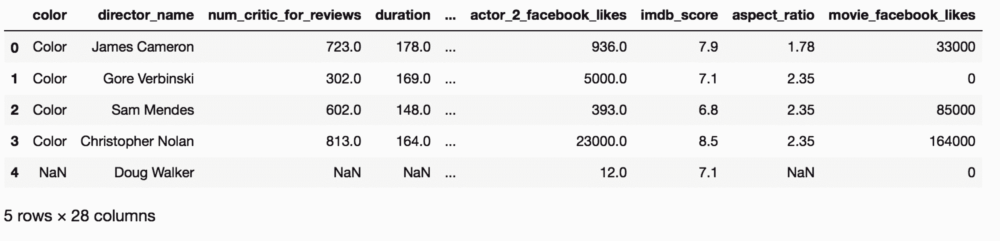
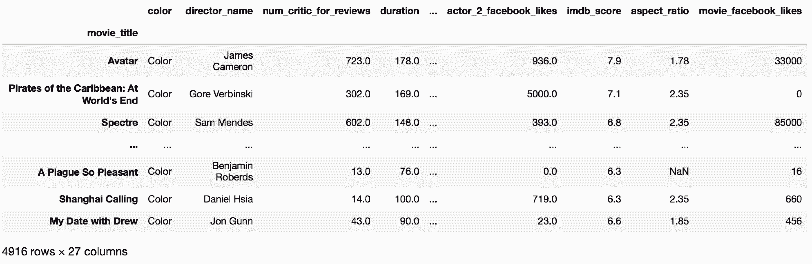
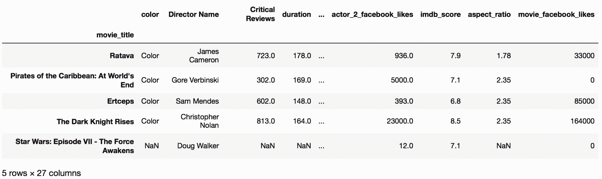
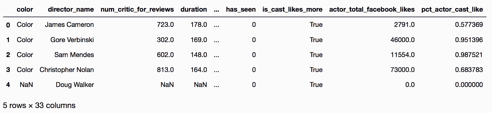

# 第01章 Pandas基础

> 相较于[《利用Python进行数据分析》](https://www.jianshu.com/p/04d180d90a3f)，本书最大的特点是所有操作都变成了分解动作，而且每步都有详细讲解。但是，书写的有点啰嗦，而Jupyter Notebook又有些错。我对两者做了整合和总结。

> 第一遍整理完，还有许多地方不足，还要再弄。


* * *

作者Theodore Petrou，Dunder Data创始人

公司网址，[http://www.dunderdata.com](http://www.dunderdata.com)（dunder是蒸馏朗姆酒的残留液体，取这个名字是类比数据分析过程）
GitHub地址：[https://github.com/tdpetrou](https://github.com/tdpetrou)
领英个人页面：[https://www.linkedin.com/in/tedpetrou](https://www.linkedin.com/in/tedpetrou)
推特：[https://twitter.com/tedpetrou?lang=en](https://twitter.com/tedpetrou?lang=en)
Medium博客：[https://medium.com/@petrou.theodore](https://medium.com/@petrou.theodore)

* * *

```py
# 引入pandas和numpy的约定
in[1]: import pandas as pd
       import numpy as np 
```

## 1\. DataFrame的结构

```py
# 设定最大列数和最大行数
 in[2]: pd.set_option('max_columns', 8, 'max_rows', 10) 
```

```py
# 用read_csv()方法读取csv文件
# head()方法可以查看前五行，head(n)可以查看前n行
 in[3]: movie = pd.read_csv('data/movie.csv')
       movie.head()
out[3]: 
```



## 2\. 访问DataFrame的组件

```py
in[4]: # 提取列索引
       columns = movie.columns
       # 提取行索引
       index = movie.index
       # 提取数据
       data = movie.values 
```

```py
 in[5]: columns
out[5]: Index(['color', 'director_name', 'num_critic_for_reviews', 'duration',
       'director_facebook_likes', 'actor_3_facebook_likes', 'actor_2_name',
       'actor_1_facebook_likes', 'gross', 'genres', 'actor_1_name',
       'movie_title', 'num_voted_users', 'cast_total_facebook_likes',
       'actor_3_name', 'facenumber_in_poster', 'plot_keywords',
       'movie_imdb_link', 'num_user_for_reviews', 'language', 'country',
       'content_rating', 'budget', 'title_year', 'actor_2_facebook_likes',
       'imdb_score', 'aspect_ratio', 'movie_facebook_likes'],
      dtype='object') 
```

```py
 in[6]: index
out[6]: RangeIndex(start=0, stop=4916, step=1) 
```

```py
 in[7]: data
out[7]: array([['Color', 'James Cameron', 723.0, ..., 7.9, 1.78, 33000],
       ['Color', 'Gore Verbinski', 302.0, ..., 7.1, 2.35, 0],
       ['Color', 'Sam Mendes', 602.0, ..., 6.8, 2.35, 85000],
       ..., 
       ['Color', 'Benjamin Roberds', 13.0, ..., 6.3, nan, 16],
       ['Color', 'Daniel Hsia', 14.0, ..., 6.3, 2.35, 660],
       ['Color', 'Jon Gunn', 43.0, ..., 6.6, 1.85, 456]], dtype=object) 
```

```py
 in[8]: # index的类型
        type(index) # pandas.core.indexes.range.RangeIndex
out[8]: pandas.core.indexes.range.RangeIndex 
```

```py
 in[9]: # columns的类型
        type(columns) # pandas.core.indexes.base.Index
out[9]: pandas.core.indexes.base.Index 
```

```py
 in[10]: # data的类型
         type(data) # numpy.ndarray
out[10]: numpy.ndarray 
```

```py
 in[11]: # 判断是不是子类型
         issubclass(pd.RangeIndex, pd.Index) # True
out[11]: True 
```

### 更多

```py
 in[12]: # 访问index的值
         index.values
         # index的值是个列表，所以可以索引或切片
         index.values[0]
out[12]: array([   0,    1,    2, ..., 4913, 4914, 4915]) 
```

```py
 in[13]: # 访问columns的值
         columns.values
out[13]: array(['color', 'director_name', 'num_critic_for_reviews', 'duration',
       'director_facebook_likes', 'actor_3_facebook_likes', 'actor_2_name',
       'actor_1_facebook_likes', 'gross', 'genres', 'actor_1_name',
       'movie_title', 'num_voted_users', 'cast_total_facebook_likes',
       'actor_3_name', 'facenumber_in_poster', 'plot_keywords',
       'movie_imdb_link', 'num_user_for_reviews', 'language', 'country',
       'content_rating', 'budget', 'title_year', 'actor_2_facebook_likes',
       'imdb_score', 'aspect_ratio', 'movie_facebook_likes'], dtype=object) 
```

## 3\. 理解数据类型

```py
 in[14]: movie = pd.read_csv('data/movie.csv')
         # 各列的类型
 in[15]: movie.dtypes
out[15]: color                       object
         director_name               object
         num_critic_for_reviews     float64
         duration                   float64
         director_facebook_likes    float64
                                     ...   
         title_year                 float64
         actor_2_facebook_likes     float64
         imdb_score                 float64
         aspect_ratio               float64
         movie_facebook_likes         int64
         Length: 28, dtype: object 
```

```py
 in[16]: # 显示各类型的数量
         movie.get_dtype_counts()
out[16]: float64    13
         int64       3
         object     12
         dtype: int64 
```

## 4\. 选择一列数据，作为Series

```py
 in[17]: movie = pd.read_csv('data/movie.csv')
 in[18]: # 选择director_name这列
         movie['director_name']
out[18]: 0           James Cameron
         1          Gore Verbinski
         2              Sam Mendes
         3       Christopher Nolan
         4             Doug Walker
                    ...        
         4911          Scott Smith
         4912                  NaN
         4913     Benjamin Roberds
         4914          Daniel Hsia
         4915             Jon Gunn
         Name: director_name, Length: 4916, dtype: object
 in[19]: # 也可以通过属性的方式选取
         movie.director_name
out[19]: 0           James Cameron
         1          Gore Verbinski
         2              Sam Mendes
         3       Christopher Nolan
         4             Doug Walker
                    ...        
         4911          Scott Smith
         4912                  NaN
         4913     Benjamin Roberds
         4914          Daniel Hsia
         4915             Jon Gunn
         Name: director_name, Length: 4916, dtype: object
# 查看类型
 in[20]: type(movie['director_name'])
out[20]: pandas.core.series.Series 
```

### 更多

```py
 in[21]: director = movie['director_name']
         # 查看选取的列的名字
         director.name
out[21]: 'director_name' 
```

```py
 in[22]: # 单列Series转换为DataFrame
         director.to_frame().head()
out[22]: 
    director_name
0   James Cameron
1   Gore Verbinski
2   Sam Mendes
3   Christopher Nolan
4   Doug Walker 
```

## 5\. 调用Series方法

### 准备

```py
 in[23]: # 查看Series所有不重复的指令
         s_attr_methods = set(dir(pd.Series))
         # 该集合的大小
         len(s_attr_methods)
out[23]: 442 
```

```py
 in[24]: # 查看DataFrame所有不重复的指令
         df_attr_methods = set(dir(pd.DataFrame))
         len(df_attr_methods)
out[24]: 445 
```

```py
 in[25]: # 这两个集合中有多少共有的指令
         len(s_attr_methods & df_attr_methods)
out[25]: 376 
```

### 原理

```py
 in[26]: # 选取director和actor_1_fb_likes两列
         movie = pd.read_csv('data/movie.csv')
         director = movie['director_name']
         actor_1_fb_likes = movie['actor_1_facebook_likes'] 
```

```py
# 查看头部
 in[27]: director.head()
out[27]: 0        James Cameron
         1       Gore Verbinski
         2           Sam Mendes
         3    Christopher Nolan
         4          Doug Walker
         Name: director_name, dtype: object
 in[28]: actor_1_fb_likes.head()
out[28]: 0     1000.0
         1    40000.0
         2    11000.0
         3    27000.0
         4      131.0
        Name: actor_1_facebook_likes, dtype: float64 
```

```py
 in[29]: # 分别计数
         pd.set_option('max_rows', 8)
         director.value_counts()
out[29]: Steven Spielberg    26
         Woody Allen         22
         Clint Eastwood      20
         Martin Scorsese     20
                              ..
         James Nunn           1
         Gerard Johnstone     1
         Ethan Maniquis       1
         Antony Hoffman       1
         Name: director_name, Length: 2397, dtype: int64
 in[30]: actor_1_fb_likes.value_counts()
out[30]: 1000.0     436
         11000.0    206
         2000.0     189
         3000.0     150
                  ... 
         216.0        1
         859.0        1
         225.0        1
         334.0        1
         Name: actor_1_facebook_likes, Length: 877, dtype: int64 
```

```py
 in[31]: director.size  
out[31]: 4916
 in[32]: director.shape 
out[33]: (4916,)
 in[33]: len(director)  
out[33]: 4916 
```

```py
 in[34]: # director有多少非空值
         director.count() 
out[34]: 4814 # 说明有102个缺失值 
```

```py
 in[35]: # actor_1_fb_likes有多少非空值
         actor_1_fb_likes.count()
out[35]: 4909 
```

```py
 in[36]: # actor_1_fb_likes的中位分位数
         actor_1_fb_likes.quantile()
out[36]: 982.0 
```

```py
 in[37]: # 求最小值、最大值、平均值、中位数、标准差、总和
         actor_1_fb_likes.min(), actor_1_fb_likes.max(), \
         actor_1_fb_likes.mean(), actor_1_fb_likes.median(), \
         actor_1_fb_likes.std(), actor_1_fb_likes.sum()
out[37]: (0.0, 640000.0, 6494.488490527602, 982.0, 15106.986883848309, 31881444.0) 
```

```py
 in[38]: # 打印描述信息
         actor_1_fb_likes.describe()
out[38]: count      4909.000000
         mean       6494.488491
         std       15106.986884
         min           0.000000
         25%         607.000000
         50%         982.000000
         75%       11000.000000
         max      640000.000000
         Name: actor_1_facebook_likes, dtype: float64
 in[39]: director.describe()
out[39]: count                 4814
         unique                2397
         top       Steven Spielberg
         freq                    26
         Name: director_name, dtype: object 
```

```py
 in[40]: actor_1_fb_likes.quantile(.2)
out[41]: 510.0 
```

```py
 in[41]: # 各个十分之一分位数
         actor_1_fb_likes.quantile([.1, .2, .3, .4, .5, .6, .7, .8, .9])
out[41]: 0.1      240.0
         0.2      510.0
         0.3      694.0
         0.4      854.0
               ...   
         0.6     1000.0
         0.7     8000.0
         0.8    13000.0
         0.9    18000.0
         Name: actor_1_facebook_likes, Length: 9, dtype: float64 
```

```py
# 非空值
 In[42]: director.isnull()
Out[42]: 0       False
         1       False
         2       False
         3       False
                 ...  
         4912     True
         4913    False
         4914    False
         4915    False
         Name: director_name, Length: 4916, dtype: bool 
```

```py
# 填充缺失值
 In[43]: actor_1_fb_likes_filled = actor_1_fb_likes.fillna(0)
         actor_1_fb_likes_filled.count()
Out[43]: 4916 
```

```py
# 删除缺失值
 In[44]: actor_1_fb_likes_dropped = actor_1_fb_likes.dropna()
         actor_1_fb_likes_dropped.size
Out[44]: 4909 
```

### 更多

```py
# value_counts(normalize=True) 可以返回频率
 In[45]: director.value_counts(normalize=True)
Out[45]: Steven Spielberg    0.005401
         Woody Allen         0.004570
         Clint Eastwood      0.004155
         Martin Scorsese     0.004155
                         ...   
         James Nunn          0.000208
         Gerard Johnstone    0.000208
         Ethan Maniquis      0.000208
         Antony Hoffman      0.000208
         Name: director_name, Length: 2397, dtype: float64 
```

```py
# 判断是否有缺失值
 In[46]: director.hasnans
Out[46]: True 
```

```py
# 判断是否是非缺失值
 In[47]: director.notnull()
Out[47]: 0        True
         1        True
         2        True
         3        True
                 ...  
         4912    False
         4913     True
         4914     True
         4915     True
         Name: director_name, Length: 4916, dtype: bool 
```

## 6\. 在Series上使用运算符

```py
 In[48]: pd.options.display.max_rows = 6
 In[49]: 5 + 9    # 加法
Out[49]: 14 
```

```py
 In[50]: 4 ** 2   # 幂运算
Out[50]: 16 
```

```py
 In[51]: a = 10   # 赋值 
```

```py
 In[52]: 5 <= 9 # 小于等于
Out[52]: True 
```

```py
 In[53]: 'abcde' + 'fg' # 字符串拼接
Out[53]: 'abcdefg' 
```

```py
 In[54]: not (5 <= 9)  # 非运算符
Out[54]: False 
```

```py
 In[55]: 7 in [1, 2, 6]  # in运算符
Out[55]: False 
```

```py
 In[56]: set([1,2,3]) & set([2,3,4])  # 求交集
Out[56]: {2, 3} 
```

```py
# 不支持列表和整数间的运算
 In[57]: [1, 2, 3] - 3 
---------------------------------------------------------------------------
TypeError                                 Traceback (most recent call last)
<ipython-input-57-7ca967348b32> in <module>()
----> 1 [1, 2, 3] - 3

TypeError: unsupported operand type(s) for -: 'list' and 'int' 
```

```py
 In[58]: a = set([1,2,3])     
         a[0]                 # 集合不支持索引 
```

### 准备

```py
# 选取imdb_score这列
 In[59]: movie = pd.read_csv('data/movie.csv')
         imdb_score = movie['imdb_score']
         imdb_score
Out[59]: 0       7.9
         1       7.1
         2       6.8
             ... 
         4913    6.3
         4914    6.3
         4915    6.6
         Name: imdb_score, Length: 4916, dtype: float64 
```

```py
# 每列值加1
 In[60]: imdb_score + 1
Out[60]: 0       8.9
         1       8.1
         2       7.8
             ... 
         4913    7.3
         4914    7.3
         4915    7.6
         Name: imdb_score, Length: 4916, dtype: float64 
```

```py
# 每列值乘以2.5
 In[61]: imdb_score * 2.5
Out[61]: 0       19.75
         1       17.75
         2       17.00
             ...  
         4913    15.75
         4914    15.75
         4915    16.50
         Name: imdb_score, Length: 4916, dtype: float64 
```

```py
# 每列值除以7的余数
 In[62]: imdb_score // 7
Out[62]: 0       1.0
         1       1.0
         2       0.0
              ... 
         4913    0.0
         4914    0.0
         4915    0.0
         Name: imdb_score, Length: 4916, dtype: float64 
```

```py
# 判断是否大于7
 In[63]: imdb_score > 7
Out[63]: 0        True
         1        True
         2       False
               ...  
         4913    False
         4914    False
         4915    False
         Name: imdb_score, Length: 4916, dtype: bool 
```

```py
# 判断是否等于字符串
 In[64]: director = movie['director_name']
 In[65]: director == 'James Cameron'
Out[65]: 0        True
         1       False
         2       False
               ...  
         4913    False
         4914    False
         4915    False
         Name: director_name, Length: 4916, dtype: bool 
```

### 更多

```py
# 利用通用函数实现加法
 In[66]: imdb_score.add(1)              # imdb_score + 1
Out[66]: 0       8.9
         1       8.1
         2       7.8
              ... 
         4913    7.3
         4914    7.3
         4915    7.6
Name: imdb_score, Length: 4916, dtype: float64 
```

```py
# 利用通用函数实现乘法
 In[67]: imdb_score.mul(2.5)            # imdb_score * 2.5
Out[67]: 0       19.75
         1       17.75
         2       17.00
               ...  
         4913    15.75
         4914    15.75
         4915    16.50
         Name: imdb_score, Length: 4916, dtype: float64 
```

```py
# 利用通用函数实现底除
 In[68]: imdb_score.floordiv(7)         # imdb_score // 7
Out[68]: 0       1.0
         1       1.0
         2       0.0
              ... 
         4913    0.0
         4914    0.0
         4915    0.0
         Name: imdb_score, Length: 4916, dtype: float64 
```

```py
# 利用通用函数实现大于
 In[69]: imdb_score.gt(7)               # imdb_score > 7
Out[69]: 0        True
         1        True
         2       False
               ...  
        4913    False
        4914    False
        4915    False
        Name: imdb_score, Length: 4916, dtype: bool 
```

```py
# 利用通用函数实现等于
 In[70]: director.eq('James Cameron')   # director == 'James Cameron'
Out[70]: 0        True
         1       False
         2       False
               ...  
         4913    False
         4914    False
         4915    False
         Name: director_name, Length: 4916, dtype: bool 
```

```py
# 利用通用函数实现取模
 In[71]: imdb_score.astype(int).mod(5)
Out[71]: 0       2
         1       2
         2       1
              ..
         4913    1
         4914    1
         4915    1
         Name: imdb_score, Length: 4916, dtype: int64 
```

```py
# a是int对象
 In[72]: a = type(1)
 In[73]: type(a)
Out[73]: type 
```

```py
# a是pandas.core.series.Series对象
 In[74]: a = type(imdb_score)
 In[75]: a([1,2,3])
Out[75]: 0    1
         1    2
         2    3
         dtype: int64 
```

## 7\. 串联Series方法

```py
# value_counts().head(3)，计数，查看前三
 In[76]: movie = pd.read_csv('data/movie.csv')
         actor_1_fb_likes = movie['actor_1_facebook_likes']
         director = movie['director_name']
 In[77]: director.value_counts().head(3)
Out[77]: Steven Spielberg    26
         Woody Allen         22
         Clint Eastwood      20
         Name: director_name, dtype: int64 
```

```py
# 统计缺失值的数量
 In[78]: actor_1_fb_likes.isnull().sum()
Out[78]: 7 
```

```py
# actor_1_fb_likes的数据类型
 In[79]: actor_1_fb_likes.dtype
Out[79]: dtype('float64') 
```

```py
# 缺失值填充为0、转换为整型、查看前五
 In[80]: actor_1_fb_likes.fillna(0)\
                .astype(int)\
                .head()
Out[80]: 0     1000
         1    40000
         2    11000
         3    27000
         4      131
         Name: actor_1_facebook_likes, dtype: int64 
```

### 更多

```py
# 缺失值的比例
 In[81]: actor_1_fb_likes.isnull().mean()
Out[81]: 0.0014239218877135883 
```

```py
# 使用括号串联
 In[82]: (actor_1_fb_likes.fillna(0)
                 .astype(int)
                 .head())
Out[82]: 0     1000
         1    40000
         2    11000
         3    27000
         4      131
         Name: actor_1_facebook_likes, dtype: int64 
```

## 8\. 使索引有意义

```py
# set_index()给行索引命名
 In[83]: movie = pd.read_csv('data/movie.csv')
 In[84]: movie.shape
Out[84]: (4916, 28)
 In[85]: movie2 = movie.set_index('movie_title')
         movie2
Out[85]: 
```



```py
# 通过index_col参数命名
 In[86]: pd.read_csv('data/movie.csv', index_col='movie_title')
Out[86]: 
```


### 更多

```py
# 复原索引
 In[87]: movie2.reset_index() 
```

## 9\. 重命名行名和列名

```py
# 通过rename()重命名
 In[88]: movie = pd.read_csv('data/movie.csv', index_col='movie_title')
 In[89]: idx_rename = {'Avatar':'Ratava', 'Spectre': 'Ertceps'} 
         col_rename = {'director_name':'Director Name', 
                       'num_critic_for_reviews': 'Critical Reviews'} 
 In[90]: movie.rename(index=idx_rename, 
                      columns=col_rename).head()
Out[90]: 
```



### 更多

```py
 In[91]: movie = pd.read_csv('data/movie.csv', index_col='movie_title')
         index = movie.index
         columns = movie.columns

         index_list = index.tolist()
         column_list = columns.tolist()

         index_list[0] = 'Ratava'
         index_list[2] = 'Ertceps'
         column_list[1] = 'Director Name'
         column_list[2] = 'Critical Reviews'

 In[92]: print(index_list[:5])
         ['Ratava', "Pirates of the Caribbean: At World's End", 'Ertceps', 'The Dark Knight Rises', 'Star Wars: Episode VII - The Force Awakens']

 In[93]: print(column_list)
         ['color', 'Director Name', 'Critical Reviews', 'duration', 'director_facebook_likes', 'actor_3_facebook_likes', 'actor_2_name', 'actor_1_facebook_likes', 'gross', 'genres', 'actor_1_name', 'num_voted_users', 'cast_total_facebook_likes', 'actor_3_name', 'facenumber_in_poster', 'plot_keywords', 'movie_imdb_link', 'num_user_for_reviews', 'language', 'country', 'content_rating', 'budget', 'title_year', 'actor_2_facebook_likes', 'imdb_score', 'aspect_ratio', 'movie_facebook_likes']

 In[94]: movie.index = index_list
         movie.columns = column_list

 In[95]: movie.head()
Out[95]: 
```


## 10\. 创建、删除列

```py
# 通过[列名]添加新列
 In[96]: movie = pd.read_csv('data/movie.csv')
 In[97]: movie['has_seen'] = 0
 In[98]: movie.columns
Out[98]: Index(['color', 'director_name', 'num_critic_for_reviews', 'duration',
                'director_facebook_likes', 'actor_3_facebook_likes', 'actor_2_name',
                'actor_1_facebook_likes', 'gross', 'genres', 'actor_1_name',
                'movie_title', 'num_voted_users', 'cast_total_facebook_likes',
                'actor_3_name', 'facenumber_in_poster', 'plot_keywords',
                'movie_imdb_link', 'num_user_for_reviews', 'language', 'country',
                'content_rating', 'budget', 'title_year', 'actor_2_facebook_likes',
                'imdb_score', 'aspect_ratio', 'movie_facebook_likes', 'has_seen'],
               dtype='object') 
```

```py
# 给新列赋值
 In[99]: movie['actor_director_facebook_likes'] = (movie['actor_1_facebook_likes'] + 
                                              movie['actor_2_facebook_likes'] + 
                                              movie['actor_3_facebook_likes'] + 
                                              movie['director_facebook_likes'])
 In[100]: movie['actor_director_facebook_likes'].isnull().sum()
Out[100]: 122 
```

```py
# 用all()检查是否所有的布尔值都为True
 In[101]: movie['actor_director_facebook_likes'] = movie['actor_director_facebook_likes'].fillna(0)
 In[102]: movie['is_cast_likes_more'] = (movie['cast_total_facebook_likes'] >= 
                                  movie['actor_director_facebook_likes'])
 In[103]: movie['is_cast_likes_more'].all()
Out[103]: False

 In[104]: movie = movie.drop('actor_director_facebook_likes', axis='columns')
 In[105]: movie['actor_total_facebook_likes'] = (movie['actor_1_facebook_likes'] + 
                                       movie['actor_2_facebook_likes'] + 
                                       movie['actor_3_facebook_likes'])

          movie['actor_total_facebook_likes'] = movie['actor_total_facebook_likes'].fillna(0)
 In[106]: movie['is_cast_likes_more'] = movie['cast_total_facebook_likes'] >= \
                                  movie['actor_total_facebook_likes']

          movie['is_cast_likes_more'].all()
Out[106]: True 
```

```py
 In[107]: movie['pct_actor_cast_like'] = (movie['actor_total_facebook_likes'] / 
                                movie['cast_total_facebook_likes'])
 In[108]: movie['pct_actor_cast_like'].min(), movie['pct_actor_cast_like'].max() 
Out[108]: (0.0, 1.0)

 In[109]: movie.set_index('movie_title')['pct_actor_cast_like'].head()
Out[109]: movie_title
          Avatar                                        0.577369
          Pirates of the Caribbean: At World's End      0.951396
          Spectre                                       0.987521
          The Dark Knight Rises                         0.683783
          Star Wars: Episode VII - The Force Awakens    0.000000
          Name: pct_actor_cast_like, dtype: float64 
```

### 更多

```py
# 用insert()方法原地插入列
 In[110]: profit_index = movie.columns.get_loc('gross') + 1
          profit_index
 In[111]: movie.insert(loc=profit_index,
                 column='profit',
                 value=movie['gross'] - movie['budget'])
 In[112]: movie.head()
Out[112]: 
```



