# 第10章 时间序列分析


```py
 In[1]: import pandas as pd
        import numpy as np        

        %matplotlib inline 
```

## 1\. Python和Pandas日期工具的区别

```py
# 引入datetime模块，创建date、time和datetime对象
 In[2]: import datetime

        date = datetime.date(year=2013, month=6, day=7)
        time = datetime.time(hour=12, minute=30, second=19, microsecond=463198)
        dt = datetime.datetime(year=2013, month=6, day=7, 
                               hour=12, minute=30, second=19, microsecond=463198)

        print("date is ", date)
        print("time is", time)
        print("datetime is", dt)

date is  2013-06-07
time is 12:30:19.463198
datetime is 2013-06-07 12:30:19.463198 
```

```py
# 创建并打印一个timedelta对象
 In[3]: td = datetime.timedelta(weeks=2, days=5, hours=10, minutes=20, 
                                seconds=6.73, milliseconds=99, microseconds=8)
        print(td)

19 days, 10:20:06.829008 
```

```py
# 将date和datetime，与timedelta做加减
 In[4]: print('new date is', date + td)
        print('new datetime is', dt + td)

new date is 2013-06-26
new datetime is 2013-06-26 22:50:26.292206 
```

```py
# time和timedelta不能做加法
 In[5]: time + td
---------------------------------------------------------------------------
TypeError                                 Traceback (most recent call last)
<ipython-input-5-bd4e11db43bd> in <module>()
----> 1 time + td

TypeError: unsupported operand type(s) for +: 'datetime.time' and 'datetime.timedelta' 
```

```py
# 再来看一下pandas的Timestamp对象。Timestamp构造器比较灵活，可以处理多种输入
 In[6]: pd.Timestamp(year=2012, month=12, day=21, hour=5, minute=10, second=8, microsecond=99)
Out[6]: Timestamp('2012-12-21 05:10:08.000099')

 In[7]: pd.Timestamp('2016/1/10')
Out[7]: Timestamp('2016-01-10 00:00:00')

 In[8]: pd.Timestamp('2014-5/10')
Out[8]: Timestamp('2014-05-10 00:00:00')

 In[9]: pd.Timestamp('Jan 3, 2019 20:45.56')
Out[9]: Timestamp('2019-01-03 20:45:33')

 In[10]: pd.Timestamp('2016-01-05T05:34:43.123456789')
Out[10]: Timestamp('2016-01-05 05:34:43.123456789') 
```

```py
# 也可以传入一个整数或浮点数，表示距离1970年1月1日的时间
 In[11]: pd.Timestamp(500)
Out[11]: Timestamp('1970-01-01 00:00:00.000000500')

 In[12]: pd.Timestamp(5000, unit='D')
Out[12]: Timestamp('1983-09-10 00:00:00') 
```

```py
# pandas的to_datetime函数与Timestamp类似，但有些参数不同
 In[13]: pd.to_datetime('2015-5-13')
Out[13]: Timestamp('2015-05-13 00:00:00')

 In[14]: pd.to_datetime('2015-13-5', dayfirst=True)
Out[14]: Timestamp('2015-05-13 00:00:00')

 In[15]: pd.Timestamp('Saturday September 30th, 2017')
Out[15]: Timestamp('2017-09-30 00:00:00')

 In[16]: pd.to_datetime('Start Date: Sep 30, 2017 Start Time: 1:30 pm', format='Start Date: %b %d, %Y Start Time: %I:%M %p')
Out[16]: Timestamp('2017-09-30 13:30:00')

 In[17]: pd.to_datetime(100, unit='D', origin='2013-1-1')
Out[17]: Timestamp('2013-04-11 00:00:00') 
```

```py
# to_datetime可以将一个字符串或整数列表或Series转换为时间戳
 In[18]: s = pd.Series([10, 100, 1000, 10000])
         pd.to_datetime(s, unit='D')
Out[18]: 0   1970-01-11
         1   1970-04-11
         2   1972-09-27
         3   1997-05-19
         dtype: datetime64[ns]

 In[19]: s = pd.Series(['12-5-2015', '14-1-2013', '20/12/2017', '40/23/2017'])
         pd.to_datetime(s, dayfirst=True, errors='coerce')
Out[19]: 0   2015-05-12
         1   2013-01-14
         2   2017-12-20
         3          NaT
         dtype: datetime64[ns]

 In[20]: pd.to_datetime(['Aug 3 1999 3:45:56', '10/31/2017'])
Out[20]: DatetimeIndex(['1999-08-03 03:45:56', '2017-10-31 00:00:00'], dtype='datetime64[ns]', freq=None) 
```

```py
# Pandas的Timedelta和to_timedelta也可以用来表示一定的时间量。
# to_timedelta函数可以产生一个Timedelta对象。
# 与to_datetime类似，to_timedelta也可以转换列表或Series变成Timedelta对象。
 In[21]: pd.Timedelta('12 days 5 hours 3 minutes 123456789 nanoseconds')
Out[21]: Timedelta('12 days 05:03:00.123456')

 In[22]: pd.Timedelta(days=5, minutes=7.34)
Out[22]: Timedelta('5 days 00:07:20.400000')

 In[23]: pd.Timedelta(100, unit='W')
Out[23]: Timedelta('700 days 00:00:00')

 In[24]: pd.to_timedelta('5 dayz', errors='ignore')
Out[24]: '5 dayz'

 In[25]: pd.to_timedelta('67:15:45.454')
Out[25]: Timedelta('2 days 19:15:45.454000')

 In[26]: s = pd.Series([10, 100])
         pd.to_timedelta(s, unit='s')
Out[26]: 0   00:00:10
         1   00:01:40
         dtype: timedelta64[ns]

 In[27]: time_strings = ['2 days 24 minutes 89.67 seconds', '00:45:23.6']
         pd.to_timedelta(time_strings)
Out[27]: TimedeltaIndex(['2 days 00:25:29.670000', '0 days 00:45:23.600000'], dtype='timedelta64[ns]', freq=None) 
```

```py
# Timedeltas对象可以和Timestamps互相加减，甚至可以相除返回一个浮点数
 In[28]: pd.Timedelta('12 days 5 hours 3 minutes') * 2
Out[28]: Timedelta('24 days 10:06:00')

 In[29]: pd.Timestamp('1/1/2017') + pd.Timedelta('12 days 5 hours 3 minutes') * 2
Out[29]: Timestamp('2017-01-25 10:06:00')

 In[30]: td1 = pd.to_timedelta([10, 100], unit='s')
         td2 = pd.to_timedelta(['3 hours', '4 hours'])
         td1 + td2
Out[30]: TimedeltaIndex(['03:00:10', '04:01:40'], dtype='timedelta64[ns]', freq=None)

 In[31]: pd.Timedelta('12 days') / pd.Timedelta('3 days')
Out[31]: 4.0 
```

```py
# Timestamps 和 Timedeltas有许多可用的属性和方法，下面列举了一些：
 In[32]: ts = pd.Timestamp('2016-10-1 4:23:23.9')
 In[33]: ts.ceil('h')
Out[33]: Timestamp('2016-10-01 05:00:00')

 In[34]: ts.year, ts.month, ts.day, ts.hour, ts.minute, ts.second
Out[34]: (2016, 10, 1, 4, 23, 23)

 In[35]: ts.dayofweek, ts.dayofyear, ts.daysinmonth
Out[35]: (5, 275, 31)

 In[36]: ts.to_pydatetime()
Out[36]: datetime.datetime(2016, 10, 1, 4, 23, 23, 900000)

 In[37]: td = pd.Timedelta(125.8723, unit='h')
         td
Out[37]: Timedelta('5 days 05:52:20.280000')

 In[38]: td.round('min')
Out[38]: Timedelta('5 days 05:52:00')

 In[39]: td.components
Out[39]: Components(days=5, hours=5, minutes=52, seconds=20, milliseconds=280, microseconds=0, nanoseconds=0)

 In[40]: td.total_seconds()
Out[40]: 453140.28 
```

### 更多

```py
# 对比一下，在使用和没使用格式指令的条件下，将字符串转换为Timestamps对象的速度
 In[41]: date_string_list = ['Sep 30 1984'] * 10000

 In[42]: %timeit pd.to_datetime(date_string_list, format='%b %d %Y')
37.8 ms ± 556 µs per loop (mean ± std. dev. of 7 runs, 10 loops each)

 In[43]: %timeit pd.to_datetime(date_string_list)
1.33 s ± 57.9 ms per loop (mean ± std. dev. of 7 runs, 1 loop each) 
```

## 2\. 智能切分时间序列

```py
# 从hdf5文件crime.h5读取丹佛市的crimes数据集，输出列数据的数据类型和数据的前几行
 In[44]: crime = pd.read_hdf('data/crime.h5', 'crime')
         crime.dtypes
Out[44]: OFFENSE_TYPE_ID              category
         OFFENSE_CATEGORY_ID          category
         REPORTED_DATE          datetime64[ns]
         GEO_LON                       float64
         GEO_LAT                       float64
         NEIGHBORHOOD_ID              category
         IS_CRIME                        int64
         IS_TRAFFIC                      int64
         dtype: object

 In[45]: crime = crime.set_index('REPORTED_DATE')
         crime.head()
Out[45]: 
```

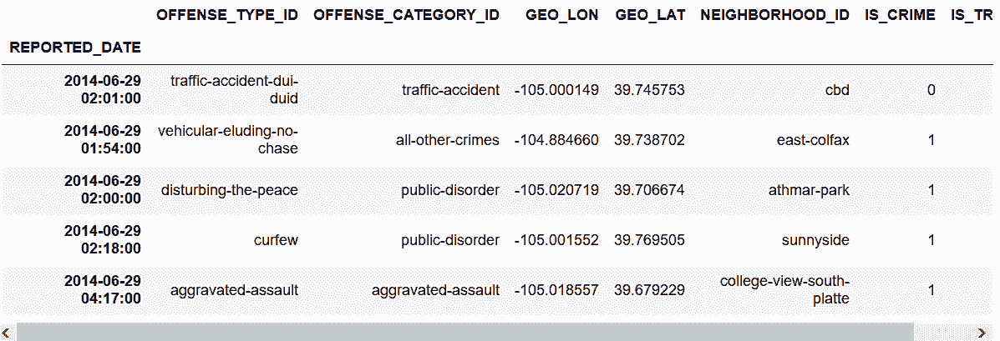

```py
# 注意到有三个类型列和一个Timestamp对象列，这些数据的数据类型在创建时就建立了对应的数据类型。
# 这和csv文件非常不同，csv文件保存的只是字符串。
# 由于前面已经将REPORTED_DATE设为了行索引，所以就可以进行智能Timestamp对象切分。
 In[46]: pd.options.display.max_rows = 4
 In[47]: crime.loc['2016-05-12 16:45:00']
Out[47]: 
```

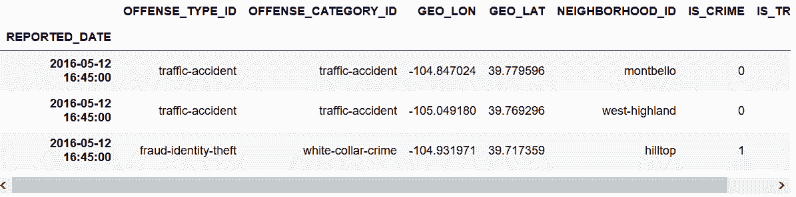

```py
# 可以进行时间部分匹配
 In[48]: crime.loc['2016-05-12']
Out[48]: 
```

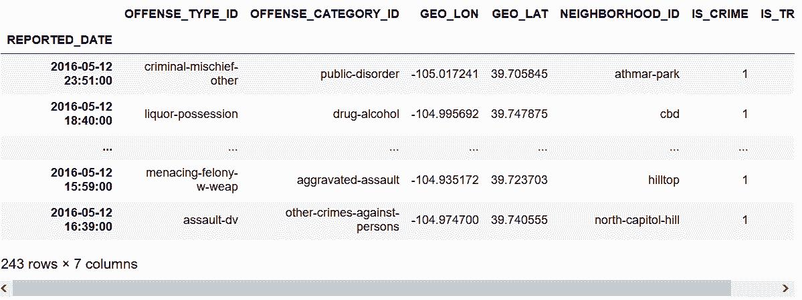

```py
# 也可以选取一整月、一整年或某天的某小时
 In[49]: crime.loc['2016-05'].shape
Out[49]: (8012, 7)

 In[50]: crime.loc['2016'].shape
Out[50]: (91076, 7)

 In[51]: crime.loc['2016-05-12 03'].shape
Out[51]: (4, 7) 
```

```py
# 也可以包含月的名字
 In[52]: crime.loc['Dec 2015'].sort_index()
Out[52]: 
```

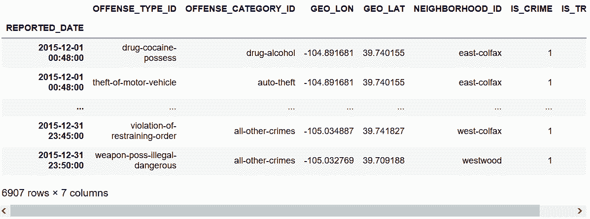

```py
# 其它一些字符串的格式也可行
 In[53]: crime.loc['2016 Sep, 15'].shape
Out[53]: (252, 7)

 In[54]: crime.loc['21st October 2014 05'].shape
Out[54]: (4, 7) 
```

```py
# 可以进行切片
 In[55]: crime.loc['2015-3-4':'2016-1-1'].sort_index()
Out[55]: 
```

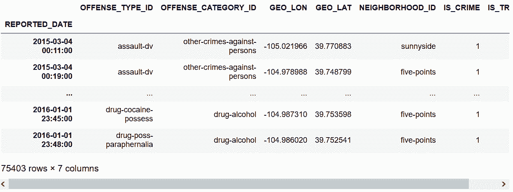

```py
# 提供更为精确的时间
 In[56]: crime.loc['2015-3-4 22':'2016-1-1 23:45:00'].sort_index()
Out[56]: 
```

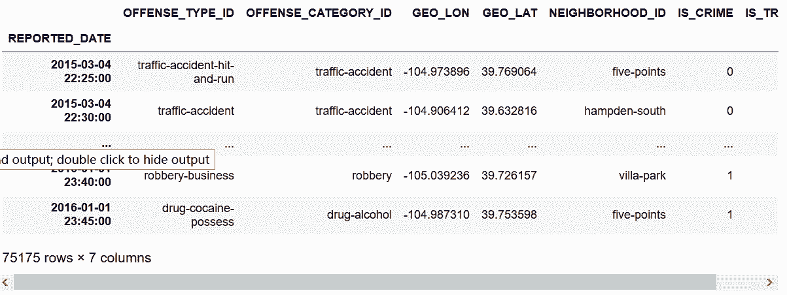

### 原理

```py
# hdf5文件可以保存每一列的数据类型，可以极大减少内存的使用。
# 在上面的例子中，三个列被存成了类型，而不是对象。存成对象的话，消耗的内存会变为之前的四倍。
 In[57]: mem_cat = crime.memory_usage().sum()
         mem_obj = crime.astype({'OFFENSE_TYPE_ID':'object', 
                                 'OFFENSE_CATEGORY_ID':'object', 
                                 'NEIGHBORHOOD_ID':'object'}).memory_usage(deep=True)\
                                                    .sum()
         mb = 2 ** 20
         round(mem_cat / mb, 1), round(mem_obj / mb, 1)
Out[57]: (29.4, 122.7) 
```

```py
# 为了用日期智能选取和切分，行索引必须包含日期。
# 在前面的例子中，REPORTED_DATE被设成了行索引，行索引从而成了DatetimeIndex对象。
 In[58]: crime.index[:2]
Out[58]: DatetimeIndex(['2014-06-29 02:01:00', '2014-06-29 01:54:00'], dtype='datetime64[ns]', name='REPORTED_DATE', freq=None) 
```

### 更多

```py
# 对行索引进行排序，可以极大地提高速度
 In[59]: %timeit crime.loc['2015-3-4':'2016-1-1']
         42.4 ms ± 865 µs per loop (mean ± std. dev. of 7 runs, 10 loops each)

 In[60]: crime_sort = crime.sort_index()

 In[61]: %timeit crime_sort.loc['2015-3-4':'2016-1-1']
         840 µs ± 32.3 µs per loop (mean ± std. dev. of 7 runs, 1000 loops each)

 In[62]: pd.options.display.max_rows = 60 
```

## 3\. 只使用适用于DatetimeIndex的方法

```py
# 读取crime hdf5数据集，行索引设为REPORTED_DATE，检查其数据类型
 In[63]: crime = pd.read_hdf('data/crime.h5', 'crime').set_index('REPORTED_DATE')
         print(type(crime.index))
<class 'pandas.core.indexes.datetimes.DatetimeIndex'> 
```

```py
# 用between_time方法选取发生在凌晨2点到5点的案件
 In[64]: crime.between_time('2:00', '5:00', include_end=False).head()
Out[64]: 
```

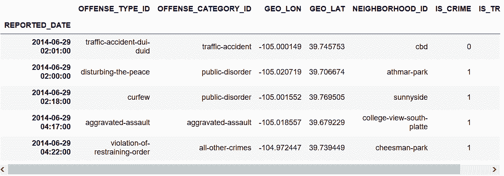

```py
# 用at_time方法选取特定时间
 In[65]: crime.at_time('5:47').head()
Out[65]: 
```

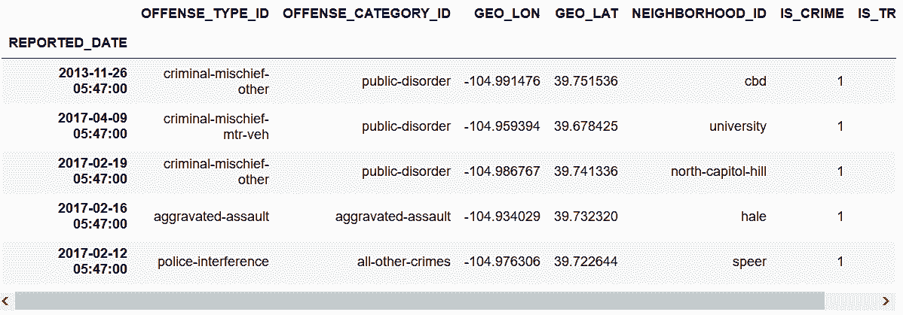

```py
# first方法可以选取排在前面的n个时间
# 首先将时间索引排序，然后使用pd.offsets模块
 In[66]: crime_sort = crime.sort_index()
 In[67]: pd.options.display.max_rows = 6
 In[68]: crime_sort.first(pd.offsets.MonthBegin(6))
Out[68]: 
```

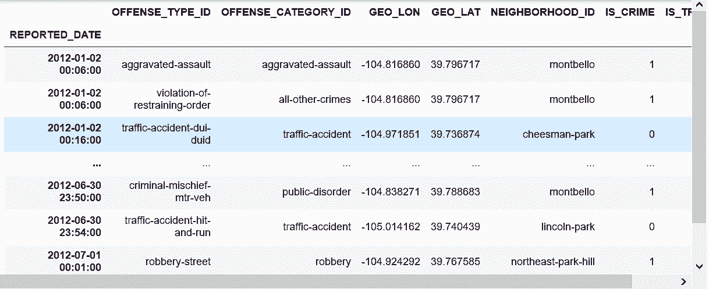

```py
# 前面的结果最后一条是7月的数据，这是因为pandas使用的是行索引中的第一个值，也就是2012-01-02 00:06:00
# 下面使用MonthEnd
 In[69]: crime_sort.first(pd.offsets.MonthEnd(6))
Out[69]: 
```

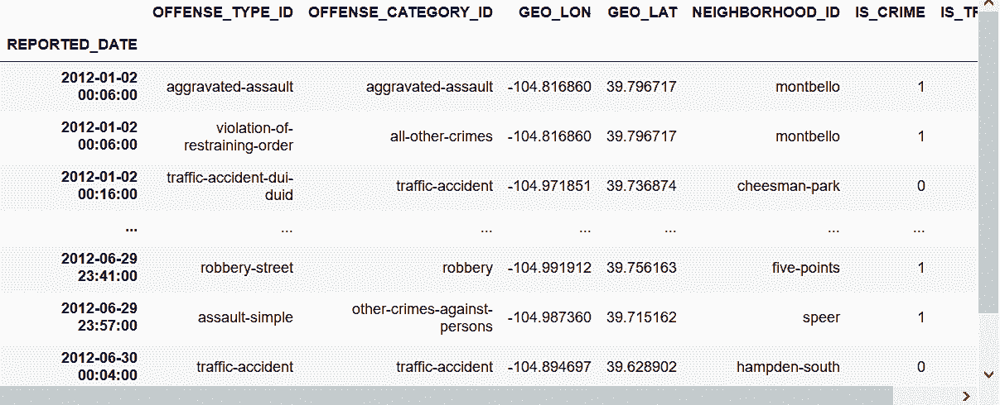

```py
# 上面的结果中，6月30日的数据只有一条，这也是因为第一个时间值的原因。
# 所有的DateOffsets对象都有一个normalize参数，当其设为True时，会将所有时间归零。
# 下面就是我们想获得的结果
 In[70]: crime_sort.first(pd.offsets.MonthBegin(6, normalize=True))
Out[70]: 
```

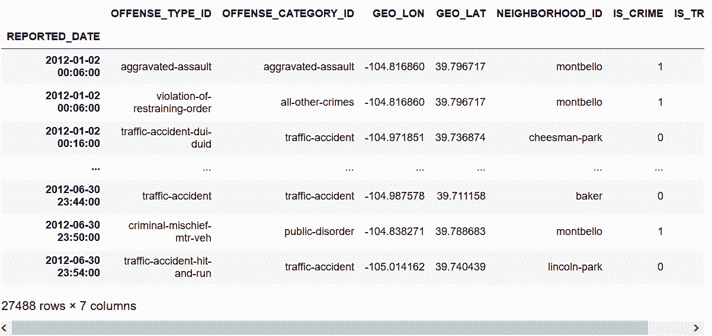

```py
# 选取2012-06的数据
 In[71]: crime_sort.loc[:'2012-06']
Out[71]: 
```

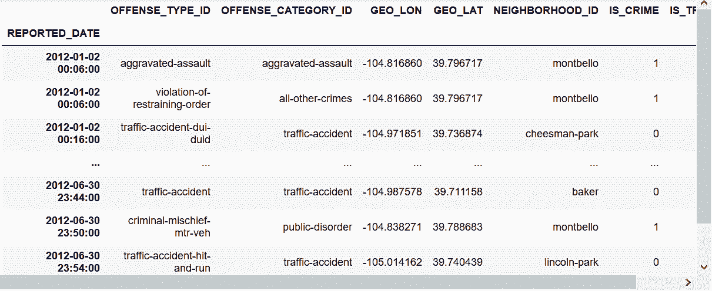

一些时间差的别名
[http://pandas.pydata.org/pandas-docs/stable/timeseries.html#offset-aliases](http://pandas.pydata.org/pandas-docs/stable/timeseries.html#offset-aliases)

```py
## 5天
 In[72]: crime_sort.first('5D')
Out[72]: 
```

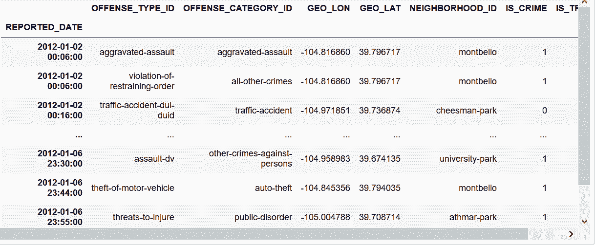

```py
## 5个工作日
 In[73]: crime_sort.first('5B')
Out[73]: 
```

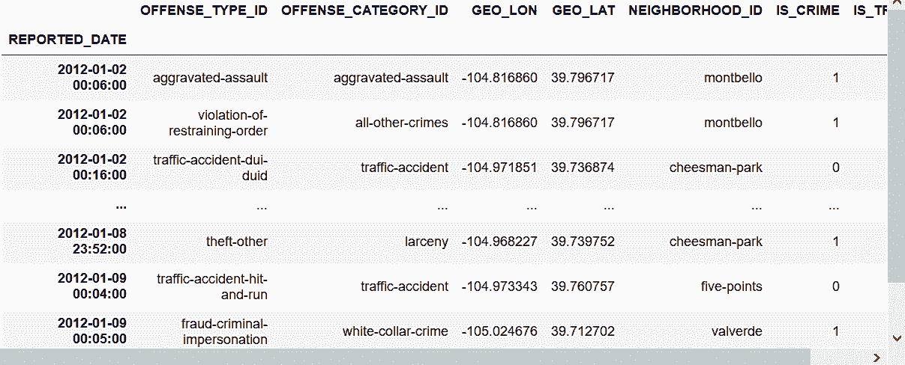

```py
## 7周
 In[74]: crime_sort.first('7W')
Out[74]: 
```

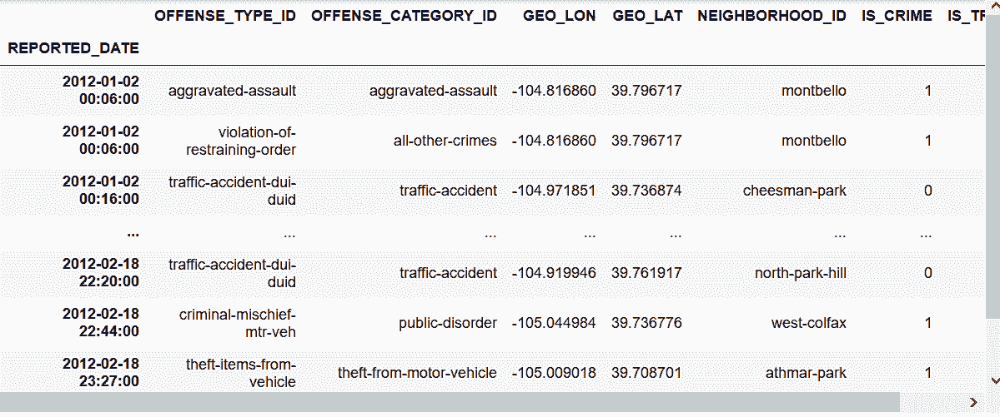

```py
# 第3季度开始
 In[75]: crime_sort.first('3QS')
Out[75]: 
```

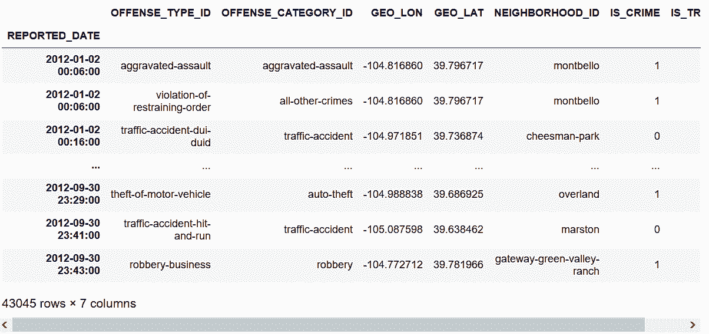

### 原理

```py
# 使用datetime模块的time对象
 In[76]: import datetime
         crime.between_time(datetime.time(2,0), datetime.time(5,0), include_end=False)
Out[76]: 
```

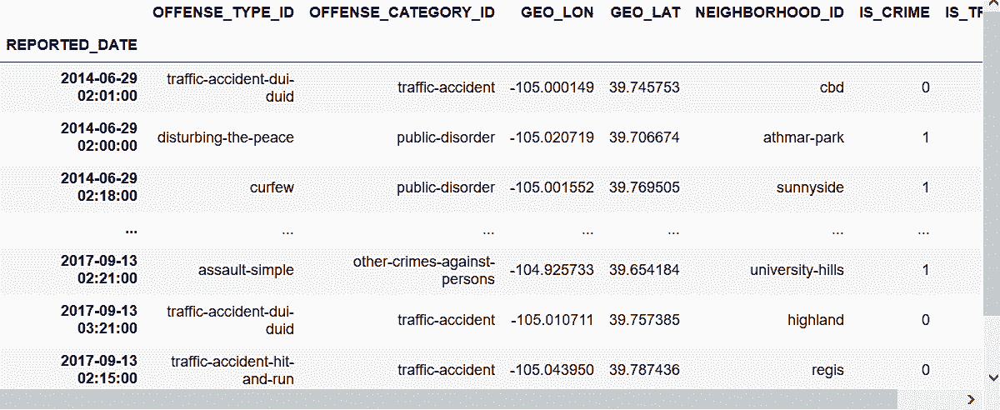

```py
# 选取第一个时间
# 用两种方法加六个月
 In[77]: first_date = crime_sort.index[0]
         first_date
Out[77]: Timestamp('2012-01-02 00:06:00')

 In[78]: first_date + pd.offsets.MonthBegin(6)
Out[78]: Timestamp('2012-07-01 00:06:00')

 In[79]: first_date + pd.offsets.MonthEnd(6)
Out[79]: Timestamp('2012-06-30 00:06:00') 
```

### 更多

```py
# 使用自定义的DateOffset对象
 In[80]: dt = pd.Timestamp('2012-1-16 13:40')
         dt + pd.DateOffset(months=1)
Out[80]: Timestamp('2012-02-16 13:40:00') 
```

```py
# 一个使用更多日期和时间的例子
 In[81]: do = pd.DateOffset(years=2, months=5, days=3, hours=8, seconds=10)
         pd.Timestamp('2012-1-22 03:22') + do
Out[81]: Timestamp('2014-06-25 11:22:10') 
```

```py
 In[82]: pd.options.display.max_rows=60 
```

## 4\. 计算每周的犯罪数

```py
# 读取crime数据集，行索引设定为REPORTED_DATE，然后对行索引排序，以提高后续运算的速度
 In[83]: crime_sort = pd.read_hdf('data/crime.h5', 'crime') \
                        .set_index('REPORTED_DATE') \
                        .sort_index() 
```

```py
# 为了统计每周的犯罪数，需要按周分组
# resample方法可以用DateOffset对象或别名，即可以在所有返回的对象分组上操作
 In[84]: crime_sort.resample('W')
Out[84]: DatetimeIndexResampler [freq=<Week: weekday=6>, axis=0, closed=right, label=right, convention=start, base=0] 
```

```py
# size()可以查看每个分组的大小
 In[85]: weekly_crimes = crime_sort.resample('W').size()
         weekly_crimes.head()
Out[85]: REPORTED_DATE
         2012-01-08     877
         2012-01-15    1071
         2012-01-22     991
         2012-01-29     988
         2012-02-05     888
         Freq: W-SUN, dtype: int64 
```

```py
# len()也可以查看大小
 In[86]: len(crime_sort.loc[:'2012-1-8'])
Out[86]: 877

 In[87]: len(crime_sort.loc['2012-1-9':'2012-1-15'])
Out[87]: 1071 
```

```py
# 用周四作为每周的结束
 In[88]: crime_sort.resample('W-THU').size().head()
Out[88]: REPORTED_DATE
         2012-01-05     462
         2012-01-12    1116
         2012-01-19     924
         2012-01-26    1061
         2012-02-02     926
         Freq: W-THU, dtype: int64 
```

```py
# groupby方法可以重现上面的resample，唯一的不同是要在pd.Grouper对象中传入抵消值
 In[89]: weekly_crimes_gby = crime_sort.groupby(pd.Grouper(freq='W')).size()
         weekly_crimes_gby.head()
Out[89]: REPORTED_DATE
         2012-01-08     877
         2012-01-15    1071
         2012-01-22     991
         2012-01-29     988
         2012-02-05     888
         Freq: W-SUN, dtype: int64 
```

```py
# 判断两个方法是否相同
 In[90]: weekly_crimes.equals(weekly_crimes_gby)
Out[90]: True 
```

### 原理

```py
# 输出resample对象的所有方法
 In[91]: r = crime_sort.resample('W')
         resample_methods = [attr for attr in dir(r) if attr[0].islower()]
         print(resample_methods)
['agg', 'aggregate', 'apply', 'asfreq', 'ax', 'backfill', 'bfill', 'count', 'ffill', 'fillna', 'first', 'get_group', 'groups', 'indices', 'interpolate', 'last', 'max', 'mean', 'median', 'min', 'ndim', 'ngroups', 'nunique', 'obj', 'ohlc', 'pad', 'plot', 'prod', 'sem', 'size', 'std', 'sum', 'transform', 'var'] 
```

### 更多

```py
# 可以通过resample方法的on参数，来进行分组
 In[92]: crime = pd.read_hdf('data/crime.h5', 'crime')
         weekly_crimes2 = crime.resample('W', on='REPORTED_DATE').size()
         weekly_crimes2.equals(weekly_crimes)
Out[92]: True 
```

```py
# 也可以通过pd.Grouper的参数key设为Timestamp，来进行分组
 In[93]: weekly_crimes_gby2 = crime.groupby(pd.Grouper(key='REPORTED_DATE', freq='W')).size()
         weekly_crimes_gby2.equals(weekly_crimes_gby)
Out[93]: True 
```

```py
# 可以很方便地利用这个数据画出线图
 In[94]: weekly_crimes.plot(figsize=(16,4), title='All Denver Crimes')
Out[94]: <matplotlib.axes._subplots.AxesSubplot at 0x10b8d3240> 
```

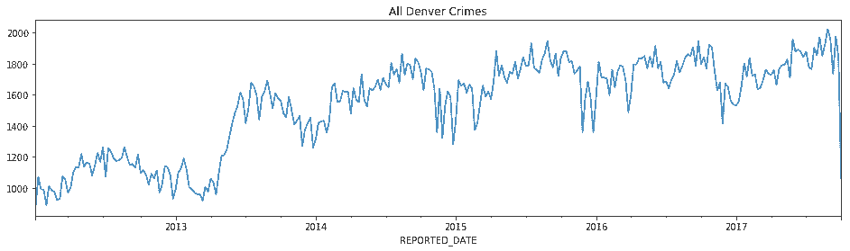

## 5\. 分别聚合每周犯罪和交通事故数据

```py
# 读取crime数据集，行索引设为REPORTED_DATE，对行索引排序
 In[95]: crime_sort = pd.read_hdf('data/crime.h5', 'crime') \
                        .set_index('REPORTED_DATE') \
                        .sort_index() 
```

```py
# 按季度分组，分别统计'IS_CRIME'和'IS_TRAFFIC'的和
 In[96]: crime_quarterly = crime_sort.resample('Q')['IS_CRIME', 'IS_TRAFFIC'].sum()
         crime_quarterly.head()
Out[96]: 
```

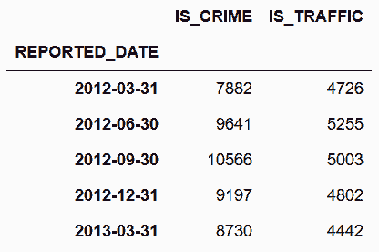

```py
# 所有日期都是该季度的最后一天，使用QS来生成每季度的第一天
 In[97]: crime_sort.resample('QS')['IS_CRIME', 'IS_TRAFFIC'].sum().head()
Out[97]: 
```

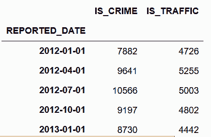

```py
# 通过检查第二季度的数据，验证结果是否正确
 In[98]: crime_sort.loc['2012-4-1':'2012-6-30', ['IS_CRIME', 'IS_TRAFFIC']].sum()
Out[98]: IS_CRIME      9641
         IS_TRAFFIC    5255
         dtype: int64 
```

```py
# 用groupby重现上述方法
 In[99]: crime_quarterly2 = crime_sort.groupby(pd.Grouper(freq='Q'))['IS_CRIME', 'IS_TRAFFIC'].sum()
         crime_quarterly2.equals(crime_quarterly)
Out[99]: True 
```

```py
# 作图来分析犯罪和交通事故的趋势
 In[100]: plot_kwargs = dict(figsize=(16,4), 
                             color=['black', 'lightgrey'], 
                             title='Denver Crimes and Traffic Accidents')
          crime_quarterly.plot(**plot_kwargs)
Out[100]: <matplotlib.axes._subplots.AxesSubplot at 0x10b8d12e8> 
```

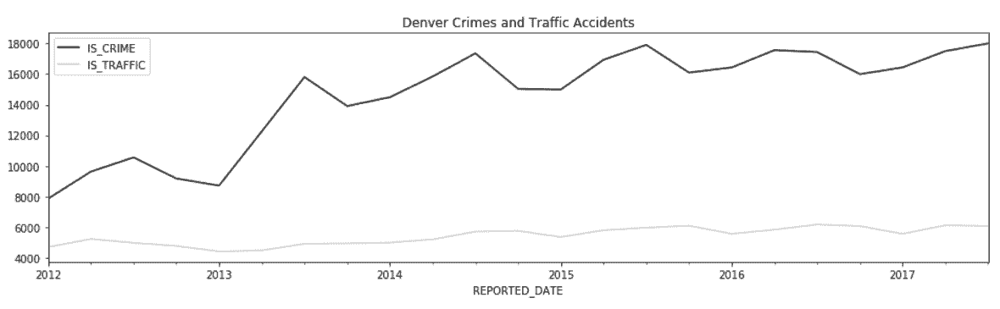

### 原理

```py
# 如果不选择IS_CRIME和IS_TRAFFIC两列，则所有的数值列都会求和
 In[101]: crime_sort.resample('Q').sum().head()
Out[101]: 
```

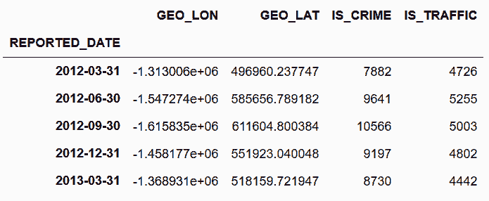

```py
# 如果想用5月1日作为季度开始，可以使用别名QS-MAR
 In[102]: crime_sort.resample('QS-MAR')['IS_CRIME', 'IS_TRAFFIC'].sum().head()
Out[102]: 
```

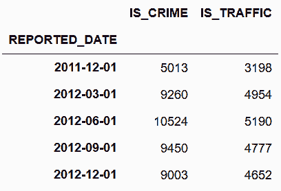

### 更多

```py
# 画出犯罪和交通事故的增长率，通过除以第一行数据
 In[103]: crime_begin = crime_quarterly.iloc[0]
          crime_begin
Out[103]: IS_CRIME      7882
          IS_TRAFFIC    4726
          Name: 2012-03-31 00:00:00, dtype: int64

 In[104]: crime_quarterly.div(crime_begin) \
                         .sub(1) \
                         .round(2) \
                         .plot(**plot_kwargs)
Out[104]: <matplotlib.axes._subplots.AxesSubplot at 0x1158850b8> 
```

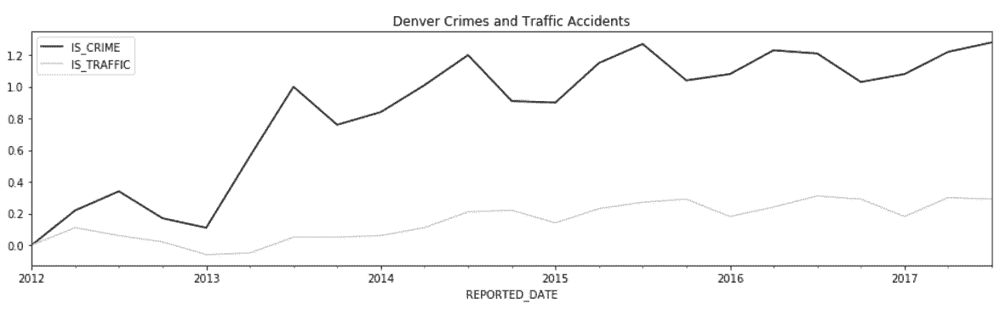

## 6\. 按工作日和年测量犯罪

```py
# 读取crime数据集，将REPORTED_DATE作为一列
 In[105]: crime = pd.read_hdf('data/crime.h5', 'crime')
          crime.head()
Out[105]: 
```

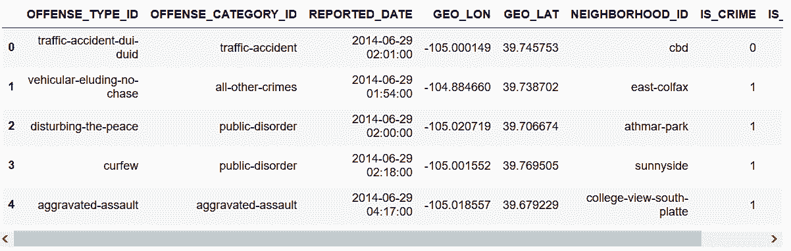

```py
# 可以通过Timestamp的dt属性得到周几，然后统计
 In[106]: wd_counts = crime['REPORTED_DATE'].dt.weekday_name.value_counts()
          wd_counts
Out[106]: Monday       70024
          Friday       69621
          Wednesday    69538
          Thursday     69287
          Tuesday      68394
          Saturday     58834
          Sunday       55213
          Name: REPORTED_DATE, dtype: int64 
```

```py
# 画一张水平柱状图
 In[107]: days = ['Monday', 'Tuesday', 'Wednesday', 'Thursday', 
                  'Friday', 'Saturday', 'Sunday']
          title = 'Denver Crimes and Traffic Accidents per Weekday'
          wd_counts.reindex(days).plot(kind='barh', title=title)
Out[107]: <matplotlib.axes._subplots.AxesSubplot at 0x117e39e48> 
```

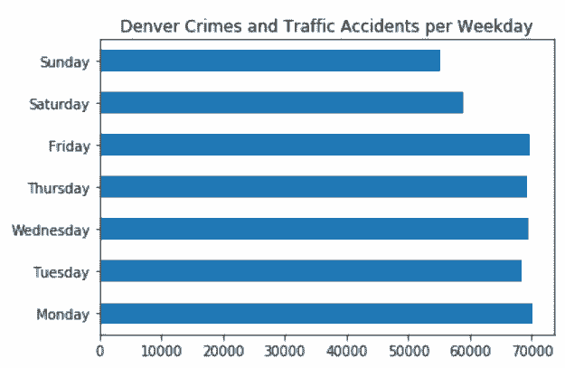

```py
# 相似的，也可以画出每年的水平柱状图
 In[108]: title = 'Denver Crimes and Traffic Accidents per Year' 
          crime['REPORTED_DATE'].dt.year.value_counts() \
                                        .sort_index() \
                                        .plot(kind='barh', title=title)
Out[108]: <matplotlib.axes._subplots.AxesSubplot at 0x11b1c6d68> 
```

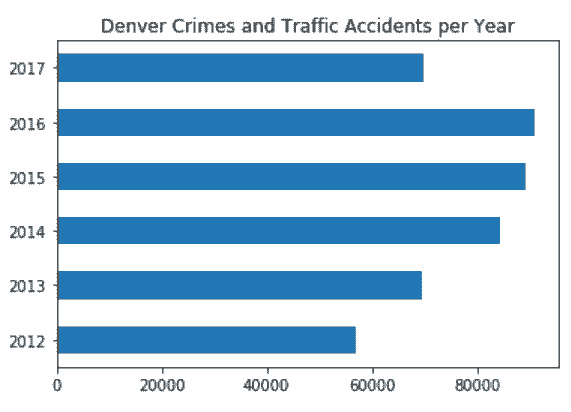

```py
# 将年和星期按两列分组聚合
 In[109]: weekday = crime['REPORTED_DATE'].dt.weekday_name
          year = crime['REPORTED_DATE'].dt.year

          crime_wd_y = crime.groupby([year, weekday]).size()
          crime_wd_y.head(10)
Out[109]: REPORTED_DATE  REPORTED_DATE
          2012           Friday            8549
                         Monday            8786
                         Saturday          7442
                         Sunday            7189
                         Thursday          8440
                         Tuesday           8191
                         Wednesday         8440
          2013           Friday           10380
                         Monday           10627
                         Saturday          8875
          dtype: int64 
```

```py
# 重命名索引名，然后对Weekday做unstack
 In[110]: crime_table = crime_wd_y.rename_axis(['Year', 'Weekday']).unstack('Weekday')
          crime_table
Out[110]: 
```

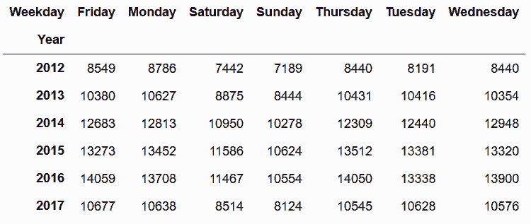

```py
# 找到数据中2017年的最后一天
 In[111]: criteria = crime['REPORTED_DATE'].dt.year == 2017
          crime.loc[criteria, 'REPORTED_DATE'].dt.dayofyear.max()
Out[111]: 272 
```

```py
# 计算这272天的平均犯罪率
 In[112]: round(272 / 365, 3)
Out[112]: 0.745

 In[113]: crime_pct = crime['REPORTED_DATE'].dt.dayofyear.le(272) \
                                            .groupby(year) \
                                            .mean() \
                                            .round(3)
          crime_pct
Out[113]: REPORTED_DATE
          2012    0.748
          2013    0.725
          2014    0.751
          2015    0.748
          2016    0.752
          2017    1.000
          Name: REPORTED_DATE, dtype: float64

 In[114]: crime_pct.loc[2012:2016].median()
Out[114]: 0.748 
```

```py
# 更新2017年的数据，并将星期排序
 In[115]: crime_table.loc[2017] = crime_table.loc[2017].div(.748).astype('int')
          crime_table = crime_table.reindex(columns=days)
          crime_table
Out[115]: 
```

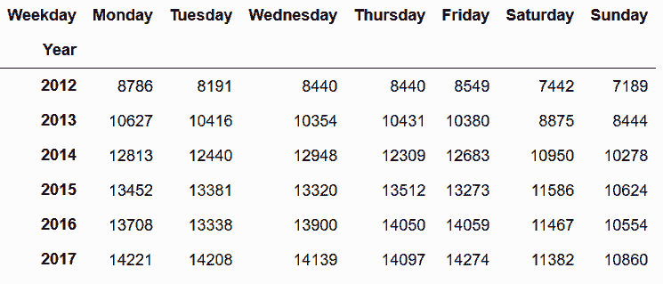

```py
# 用seaborn画热力图
 In[116]: import seaborn as sns
          sns.heatmap(crime_table, cmap='Greys')
Out[116]: <matplotlib.axes._subplots.AxesSubplot at 0x117a37ba8> 
```

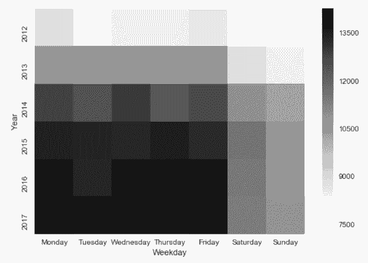

```py
# 犯罪貌似每年都在增加，但这个数据没有考虑每年的新增人口。
# 读取丹佛市人口denver_pop数据集
 In[117]: denver_pop = pd.read_csv('data/denver_pop.csv', index_col='Year')
          denver_pop
Out[117]: 
```

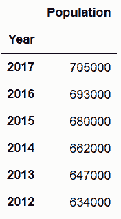

```py
# 计算每10万人的犯罪率
 In[118]: den_100k = denver_pop.div(100000).squeeze()
          crime_table2 = crime_table.div(den_100k, axis='index').astype('int')
          crime_table2
Out[118]: 
```

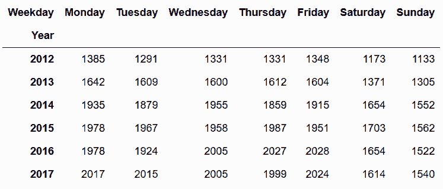

```py
# 再画一张热力图
 In[119]: sns.heatmap(crime_table2, cmap='Greys')
Out[119]: <matplotlib.axes._subplots.AxesSubplot at 0x1203024e0> 
```

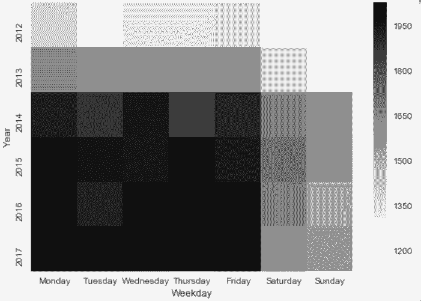

### 原理

```py
# loc接收一个排好序的列表，也可以实现reindex同样的功能
 In[120]: wd_counts.loc[days]
Out[120]: Monday       70024
          Tuesday      68394
          Wednesday    69538
          Thursday     69287
          Friday       69621
          Saturday     58834
          Sunday       55213
          Name: REPORTED_DATE, dtype: int64 
```

```py
# DataFrame和Series相除，会使用DataFrame的列和Series的行索引对齐
 In[121]: crime_table / den_100k
/Users/Ted/anaconda/lib/python3.6/site-packages/pandas/core/indexes/base.py:3033: RuntimeWarning: '<' not supported between instances of 'str' and 'int', sort order is undefined for incomparable objects
  return this.join(other, how=how, return_indexers=return_indexers)
Out[121]: 
```

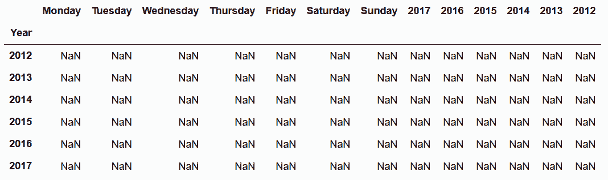

### 更多

```py
# 将之前的操作打包成一个函数，并且可以根据犯罪类型筛选数据
 In[122]: ADJ_2017 = .748

          def count_crime(df, offense_cat): 
              df = df[df['OFFENSE_CATEGORY_ID'] == offense_cat]
              weekday = df['REPORTED_DATE'].dt.weekday_name
              year = df['REPORTED_DATE'].dt.year

              ct = df.groupby([year, weekday]).size().unstack()
              ct.loc[2017] = ct.loc[2017].div(ADJ_2017).astype('int')

              pop = pd.read_csv('data/denver_pop.csv', index_col='Year')
              pop = pop.squeeze().div(100000)

              ct = ct.div(pop, axis=0).astype('int')
              ct = ct.reindex(columns=days)
              sns.heatmap(ct, cmap='Greys')
              return ct
 In[123]: count_crime(crime, 'auto-theft')
Out[123]: 
```

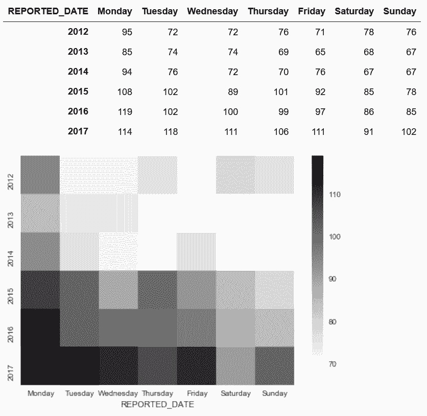

## 7\. 用带有DatetimeIndex的匿名函数做分组

```py
# 读取crime数据集，行索引设为REPORTED_DATE，并排序
 In[124]: crime_sort = pd.read_hdf('data/crime.h5', 'crime') \
                         .set_index('REPORTED_DATE') \
                         .sort_index()

# 输出DatetimeIndex的可用属性和方法
 In[125]: common_attrs = set(dir(crime_sort.index)) & set(dir(pd.Timestamp))
          print([attr for attr in common_attrs if attr[0] != '_'])
['nanosecond', 'month', 'daysinmonth', 'year', 'is_quarter_start', 'offset', 'tz_localize', 'second', 'is_leap_year', 'resolution', 'freqstr', 'week', 'weekday', 'is_month_start', 'normalize', 'to_julian_date', 'to_period', 'freq', 'tzinfo', 'weekday_name', 'microsecond', 'days_in_month', 'date', 'is_quarter_end', 'tz', 'to_datetime', 'tz_convert', 'weekofyear', 'time', 'hour', 'min', 'max', 'floor', 'is_year_start', 'ceil', 'dayofweek', 'day', 'quarter', 'dayofyear', 'round', 'strftime', 'is_month_end', 'minute', 'is_year_end', 'to_pydatetime']

# 用index找到星期名
 In[126]: crime_sort.index.weekday_name.value_counts()
Out[126]: Monday       70024
          Friday       69621
          Wednesday    69538
          Thursday     69287
          Tuesday      68394
          Saturday     58834
          Sunday       55213
          Name: REPORTED_DATE, dtype: int64 
```

```py
# groupby可以接收函数作为参数。
# 用函数将行索引变为周几，然后按照犯罪和交通事故统计
 In[127]: crime_sort.groupby(lambda x: x.weekday_name)['IS_CRIME', 'IS_TRAFFIC'].sum()
Out[127]: 
```

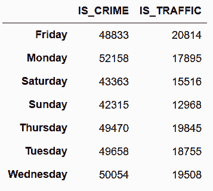

```py
# 可以用函数列表，用天的小时时间和年做分组，然后对表做重构型
 In[128]: funcs = [lambda x: x.round('2h').hour, lambda x: x.year]
          cr_group = crime_sort.groupby(funcs)['IS_CRIME', 'IS_TRAFFIC'].sum()
          cr_final = cr_group.unstack()
          cr_final.style.highlight_max(color='lightgrey')
Out[128]: 
```

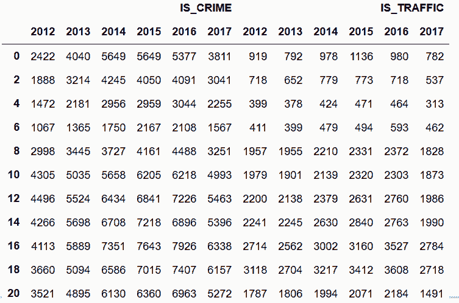

### 更多

```py
# xs方法可以从任意索引层选出一个唯一值
 In[129]: cr_final.xs('IS_TRAFFIC', axis='columns', level=0).head()
Out[129]: 
```

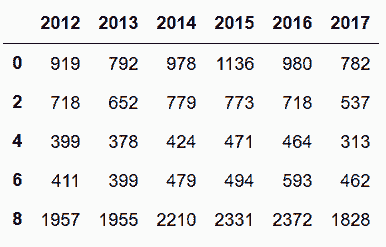

```py
# 用xs只从2016年选择数据，层级是1
 In[130]: cr_final.xs(2016, axis='columns', level=1).head()
Out[130]: 
```

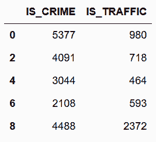

## 8\. 用时间戳和另一列分组

```py
# 读取employee数据集，用HIRE_DATE列创造一个DatetimeIndex
 In[131]: employee = pd.read_csv('data/employee.csv', 
                                 parse_dates=['JOB_DATE', 'HIRE_DATE'], 
                                 index_col='HIRE_DATE')
          employee.head()
Out[131]: 
```


```py
# 对性别做分组，查看二者的工资
 In[132]: employee.groupby('GENDER')['BASE_SALARY'].mean().round(-2)
Out[132]: GENDER
          Female    52200.0
          Male      57400.0
          Name: BASE_SALARY, dtype: float64 
```

```py
# 根据聘用日期，每10年分一组，查看工资情况
 In[133]: employee.resample('10AS')['BASE_SALARY'].mean().round(-2)
Out[133]: HIRE_DATE
          1958-01-01     81200.0
          1968-01-01    106500.0
          1978-01-01     69600.0
          1988-01-01     62300.0
          1998-01-01     58200.0
          2008-01-01     47200.0
          Freq: 10AS-JAN, Name: BASE_SALARY, dtype: float64 
```

```py
# 如果要按性别和五年分组，可以在groupby后面调用resample
 In[134]: sal_avg = employee.groupby('GENDER').resample('10AS')['BASE_SALARY'].mean().round(-2)
          sal_avg
Out[134]: GENDER  HIRE_DATE 
          Female  1975-01-01     51600.0
                  1985-01-01     57600.0
                  1995-01-01     55500.0
                  2005-01-01     51700.0
                  2015-01-01     38600.0
          Male    1958-01-01     81200.0
                  1968-01-01    106500.0
                  1978-01-01     72300.0
                  1988-01-01     64600.0
                  1998-01-01     59700.0
                  2008-01-01     47200.0
          Name: BASE_SALARY, dtype: float64 
```

```py
# 对性别unstack
 In[135]: sal_avg.unstack('GENDER')
Out[135]: 
```

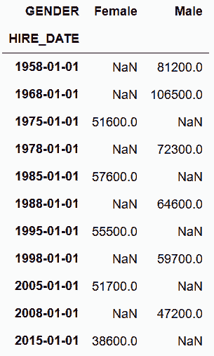

```py
# 上面数据的问题，是分组不恰当造成的。
# 第一名男性受聘于1958年
 In[136]: employee[employee['GENDER'] == 'Male'].index.min()
Out[136]: Timestamp('1958-12-29 00:00:00')

# 第一名女性受聘于1975年
 In[137]: employee[employee['GENDER'] == 'Female'].index.min()
Out[137]: Timestamp('1975-06-09 00:00:00') 
```

```py
# 为了解决前面的分组问题，必须将日期和性别同时分组
 In[138]: sal_avg2 = employee.groupby(['GENDER', pd.Grouper(freq='10AS')])['BASE_SALARY'].mean().round(-2)
          sal_avg2
Out[138]: GENDER  HIRE_DATE 
          Female  1968-01-01         NaN
                  1978-01-01     57100.0
                  1988-01-01     57100.0
                  1998-01-01     54700.0
                  2008-01-01     47300.0
          Male    1958-01-01     81200.0
                  1968-01-01    106500.0
                  1978-01-01     72300.0
                  1988-01-01     64600.0
                  1998-01-01     59700.0
                  2008-01-01     47200.0
          Name: BASE_SALARY, dtype: float64 
```

```py
# 再对性别做unstack
 In[139]: sal_final = sal_avg2.unstack('GENDER')
          sal_final
Out[139]: 
```

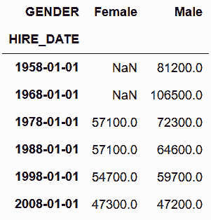

### 原理

```py
# groupby返回对象包含resample方法，但相反却不成立
 In[140]: 'resample' in dir(employee.groupby('GENDER'))
Out[140]: True

 In[141]: 'groupby' in dir(employee.resample('10AS'))
Out[141]: False 
```

### 更多

```py
# 通过加9，手工创造时间区间
 In[142]: years = sal_final.index.year
          years_right = years + 9
          sal_final.index = years.astype(str) + '-' + years_right.astype(str)
          sal_final
Out[142]: 
```

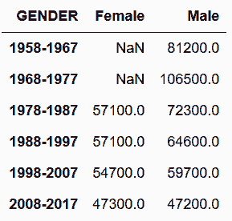

```py
# 也可以使用cut函数创造基于每名员工受聘年份的等宽间隔
 In[143]: cuts = pd.cut(employee.index.year, bins=5, precision=0)
          cuts.categories.values
Out[143]: array([Interval(1958.0, 1970.0, closed='right'),
                 Interval(1970.0, 1981.0, closed='right'),
                 Interval(1981.0, 1993.0, closed='right'),
                 Interval(1993.0, 2004.0, closed='right'),
                 Interval(2004.0, 2016.0, closed='right')], dtype=object)

 In[144]: employee.groupby([cuts, 'GENDER'])['BASE_SALARY'].mean().unstack('GENDER').round(-2)
Out[144]: 
```

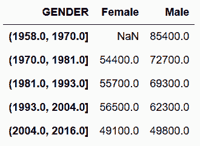

## 9\. 用merge_asof找到上次低20%犯罪率

```py
# 读取crime数据集，行索引设为REPORTED_DATE，并排序
 In[145]: crime_sort = pd.read_hdf('data/crime.h5', 'crime') \
                         .set_index('REPORTED_DATE') \
                         .sort_index() 
```

```py
# 找到最后一个完整月
 In[146]: crime_sort.index.max()
Out[146]: Timestamp('2017-09-29 06:16:00') 
```

```py
# 因为9月份的数据不完整，所以只取到8月份的
 In[147]: crime_sort = crime_sort[:'2017-8']
          crime_sort.index.max()
Out[147]: Timestamp('2017-08-31 23:52:00') 
```

```py
# 统计每月的犯罪和交通事故数量
 In[148]: all_data = crime_sort.groupby([pd.Grouper(freq='M'), 'OFFENSE_CATEGORY_ID']).size()
          all_data.head()
Out[148]: REPORTED_DATE  OFFENSE_CATEGORY_ID
          2012-01-31     aggravated-assault     113
                         all-other-crimes       124
                         arson                    5
                         auto-theft             275
                         burglary               343
          dtype: int64 
```

```py
#  重新设置索引
 In[149]: all_data = all_data.sort_values().reset_index(name='Total')
          all_data.head()
Out[149]: 
```

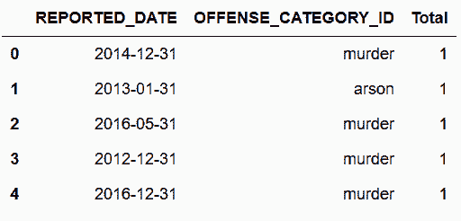

```py
# 用当前月的统计数乘以0.8，生成一个新的目标列
 In[150]: goal = all_data[all_data['REPORTED_DATE'] == '2017-8-31'].reset_index(drop=True)
          goal['Total_Goal'] = goal['Total'].mul(.8).astype(int)
          goal.head()
Out[150]: 
```

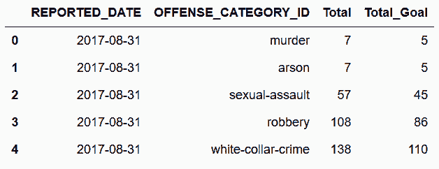

```py
# 用merge_asof函数，找到上次每个犯罪类别低于目标值的月份
 In[151]: pd.merge_asof(goal, all_data, left_on='Total_Goal', right_on='Total', 
                        by='OFFENSE_CATEGORY_ID', suffixes=('_Current', '_Last'))
Out[151]: 
```

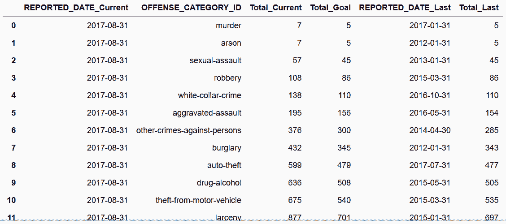

### 更多

```py
# 手动创建一个Periods
 In[152]: pd.Period(year=2012, month=5, day=17, hour=14, minute=20, freq='T')
Out[152]: Period('2012-05-17 14:20', 'T') 
```

```py
# 具有DatetimeIndex的DataFrame有to_period方法，可以将Timestamps转换为Periods
 In[153]: crime_sort.index.to_period('M')
Out[153]: PeriodIndex(['2012-01', '2012-01', '2012-01', '2012-01', '2012-01', '2012-01',
                       '2012-01', '2012-01', '2012-01', '2012-01',
                       ...
                       '2017-08', '2017-08', '2017-08', '2017-08', '2017-08', '2017-08',
                       '2017-08', '2017-08', '2017-08', '2017-08'],
                       dtype='period[M]', name='REPORTED_DATE', length=453568, freq='M')

 In[154]: ad_period = crime_sort.groupby([lambda x: x.to_period('M'), 
                                          'OFFENSE_CATEGORY_ID']).size()
          ad_period = ad_period.sort_values() \
                               .reset_index(name='Total') \
                               .rename(columns={'level_0':'REPORTED_DATE'})
          ad_period.head()
Out[154]: 
```

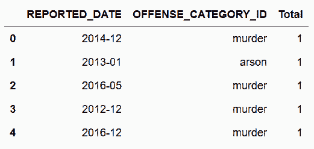

```py
# 判断ad_period的最后两列和之前的all_data是否相同
 In[155]: cols = ['OFFENSE_CATEGORY_ID', 'Total']
          all_data[cols].equals(ad_period[cols])
Out[155]: True 
```

```py
# 用同样的方法，也可以重构正文中的最后两步
 In[156]: aug_2018 = pd.Period('2017-8', freq='M')
          goal_period = ad_period[ad_period['REPORTED_DATE'] == aug_2018].reset_index(drop=True)
          goal_period['Total_Goal'] = goal_period['Total'].mul(.8).astype(int)

          pd.merge_asof(goal_period, ad_period, left_on='Total_Goal', right_on='Total', 
                        by='OFFENSE_CATEGORY_ID', suffixes=('_Current', '_Last')).head()
Out[156]: 
```

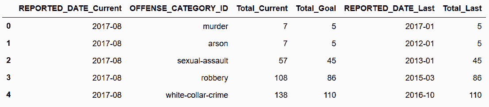

