# 第11章 用Matplotlib、Pandas、Seaborn进行可视化


> 一章内容介绍三块内容，感觉哪个都没说清。

```py
 In[1]: import pandas as pd
        import numpy as np
        import matplotlib.pyplot as plt

        %matplotlib inline 
```

## 1\. matplotlib入门

Matplotlib提供了两种方法来作图：状态接口和面向对象。

```py
# 状态接口是通过pyplot模块来实现的，matplotlib会追踪绘图环境的当前状态
# 这种方法适合快速画一些简单的图，但是对于多图和多轴会不方便
 In[2]: x = [-3, 5, 7]
        y = [10, 2, 5]

        plt.figure(figsize=(15,3))
        plt.plot(x, y)
        plt.xlim(0, 10)
        plt.ylim(-3, 8)
        plt.xlabel('X Axis')
        plt.ylabel('Y axis')
        plt.title('Line Plot')
        plt.suptitle('Figure Title', size=20, y=1.03)
Out[2]: Text(0.5,1.03,'Figure Title') 
```

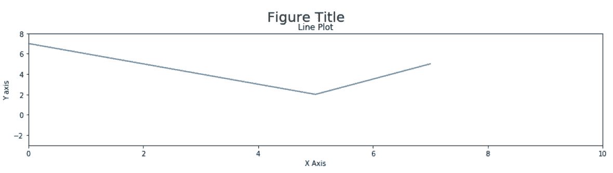

```py
# 面向对象的方法更易懂，修改的是哪个对象非常清晰
# 而且代码更加pythonic，与pandas的交互方式更相似
 In[3]: fig, ax = plt.subplots(figsize=(15,3))
        ax.plot(x, y)
        ax.set_xlim(0, 10)
        ax.set_ylim(-3, 8)
        ax.set_xlabel('X axis')
        ax.set_ylabel('Y axis')
        ax.set_title('Line Plot')
        fig.suptitle('Figure Title', size=20, y=1.03)
Out[3]: Text(0.5,1.03,'Figure Title') 
```

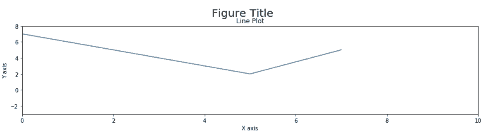

```py
# 用subplots函数创建一个带有一个Axes的Figure
 In[4]: fig, ax = plt.subplots(nrows=1, ncols=1) 
```

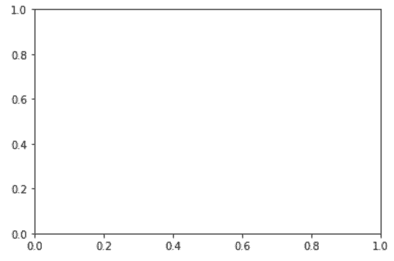

```py
# 查看fig和ax的数据类型
 In[5]: type(fig)
Out[5]: matplotlib.figure.Figure

 In[6]: type(ax)
Out[6]: matplotlib.axes._subplots.AxesSubplot 
```

```py
# 查询Figure的大小，并放大
 In[7]: fig.get_size_inches()
Out[7]: array([ 6.,  4.])

 In[8]: fig.set_size_inches(14, 4)
        fig
Out[8]: 
```


```py
# axes属性可以获取Figure的所有Axes
 In[9]: fig.axes
Out[9]: [<matplotlib.axes._subplots.AxesSubplot at 0x1134202b0>] 
```

```py
# 判断Axes列表中的第一个元素和之前定义的ax是否相同
 In[10]: fig.axes[0] is ax
Out[10]: True 
```

```py
# 用浮点数显示不同的灰度
 In[11]: fig.set_facecolor('.9')
         ax.set_facecolor('.7')
         fig
Out[11]: 
```

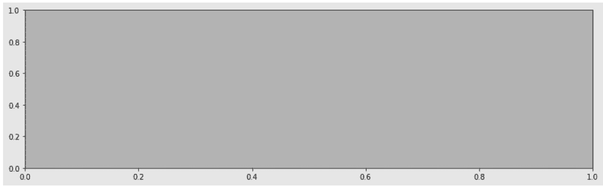

```py
# 检查Axes的子元素，每个基本的图都有四个spine和两个axis
# spine是数据边界，即四条边
# x和y轴对象包含了更多的绘图对象，比如刻度、标签
 In[12]: ax_children = ax.get_children()
         ax_children         
Out[12]: [<matplotlib.spines.Spine at 0x11145b358>,
          <matplotlib.spines.Spine at 0x11145b0f0>,
          <matplotlib.spines.Spine at 0x11145ae80>,
          <matplotlib.spines.Spine at 0x11145ac50>,
          <matplotlib.axis.XAxis at 0x11145aa90>,
          <matplotlib.axis.YAxis at 0x110fa8d30>,
          ...] 
```

```py
# 通过spines属性直接访问spines
>>> spines = ax.spines
>>> spines
OrderedDict([('left', <matplotlib.spines.Spine at 0x11279e320>),
             ('right', <matplotlib.spines.Spine at 0x11279e0b8>),
             ('bottom', <matplotlib.spines.Spine at 0x11279e048>),
             ('top', <matplotlib.spines.Spine at 0x1127eb5c0>)]) 
```

```py
# 选中左边，改变它的位置和宽度，使底边不可见
 In[13]: spine_left = spines['left']
         spine_left.set_position(('outward', -100))
         spine_left.set_linewidth(5)

         spine_bottom = spines['bottom']
         spine_bottom.set_visible(False)
         fig
Out[13]: 
```

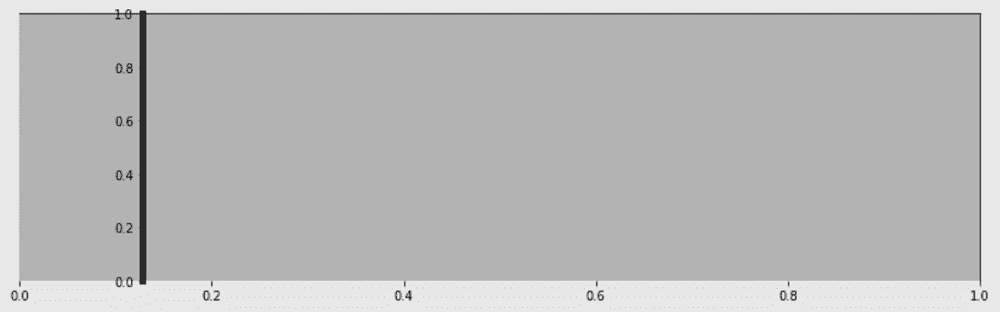

```py
# 通过属性xaxis和yaxis可以修改属性，有些属性也可以通过Axes对象直接修改
 In[14]: ax.xaxis.grid(True, which='major', linewidth=2, color='black', linestyle='--')
         ax.xaxis.set_ticks([.2, .4, .55, .93])
         ax.xaxis.set_label_text('X Axis', family='Verdana', fontsize=15)

         ax.set_ylabel('Y Axis', family='Calibri', fontsize=20)
         ax.set_yticks([.1, .9])
         ax.set_yticklabels(['point 1', 'point 9'], rotation=45)
         fig
Out[14]: 
```

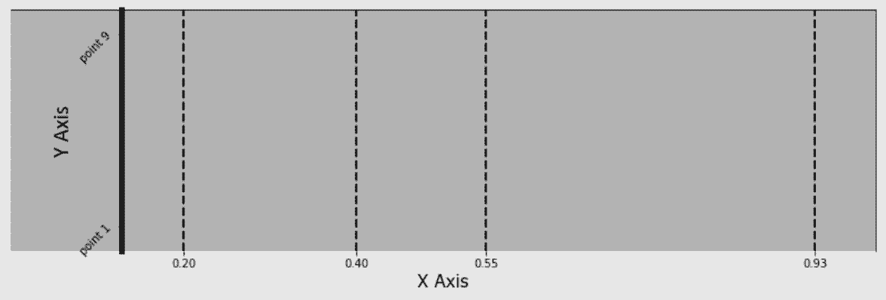

### 原理

```py
# plt.subplots函数返回的是一个元组
 In[22]: plot_objects = plt.subplots()

 In[23]: type(plot_objects)
Out[23]: tuple

 In[24]: fig = plot_objects[0]
         ax = plot_objects[1] 
```

```py
# 如果创建了多个轴，则元组的第二个元素是一个包含所有轴的NumPy数组
 In[25]: plot_objects = plt.subplots(2, 4, figsize=(14, 4)) 
```

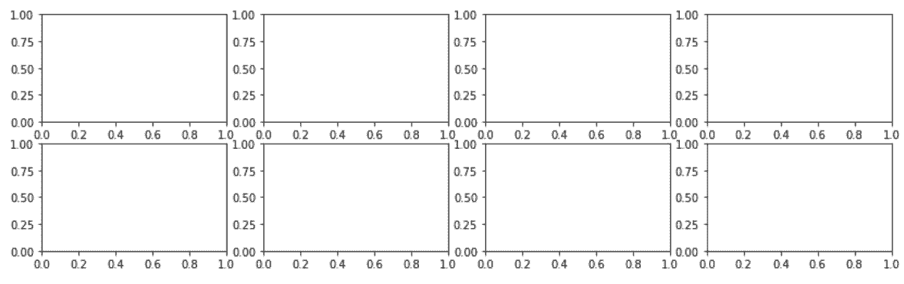

```py
 In[26]: plot_objects[1]
Out[26]: array([[<matplotlib.axes._subplots.AxesSubplot object at 0x113eefa20>,
                 <matplotlib.axes._subplots.AxesSubplot object at 0x113f7ccc0>,
                 <matplotlib.axes._subplots.AxesSubplot object at 0x11413ed68>,
                 <matplotlib.axes._subplots.AxesSubplot object at 0x114213e48>],
                [<matplotlib.axes._subplots.AxesSubplot object at 0x11424ce80>,
                 <matplotlib.axes._subplots.AxesSubplot object at 0x1142807b8>,
                 <matplotlib.axes._subplots.AxesSubplot object at 0x1142b8898>,
                 <matplotlib.axes._subplots.AxesSubplot object at 0x1142f2898>]], dtype=object) 
```

```py
# 一些属性和与其等价的get方法
 In[27]: fig.get_axes() == fig.axes
Out[27]: True

 In[29]: fig.axes == fig.get_axes()
Out[29]: True

 In[30]: ax.xaxis == ax.get_xaxis()
Out[30]: True

 In[31]: ax.yaxis == ax.get_yaxis()
Out[31]: True 
```

### 更多

```py
# 查询xaxis的所有属性
 In[15]: ax.xaxis.properties()
Out[15]: 
{'agg_filter': None,
 'alpha': None,
 'animated': False,
 'children': [Text(0.5,22.2,'X Axis'),
  Text(1,23.2,''),
  <matplotlib.axis.XTick at 0x113371fd0>,
  <matplotlib.axis.XTick at 0x113514240>,
  <matplotlib.axis.XTick at 0x1136387b8>,
  <matplotlib.axis.XTick at 0x113638f60>],
 'clip_box': TransformedBbox(Bbox([[0.0, 0.0], [1.0, 1.0]]), CompositeGenericTransform(CompositeGenericTransform(BboxTransformTo(Bbox([[0.0, 0.0], [1.0, 1.0]])), Affine2D(array([[ 1.,  0.,  0.],
        [ 0.,  1.,  0.],
        [ 0.,  0.,  1.]]))), BboxTransformTo(TransformedBbox(Bbox([[0.125, 0.125], [0.9, 0.88]]), BboxTransformTo(TransformedBbox(Bbox([[0.0, 0.0], [14.0, 4.0]]), Affine2D(array([[ 72.,   0.,   0.],
        [  0.,  72.,   0.],
        [  0.,   0.,   1.]])))))))),
 'clip_on': True,
 'clip_path': None,
 'contains': None,
 'data_interval': array([ inf, -inf]),
 'figure': <matplotlib.figure.Figure at 0x11332abe0>,
 'gid': None,
 'gridlines': <a list of 4 Line2D gridline objects>,
 'label': Text(0.5,22.2,'X Axis'),
 'label_position': 'bottom',
 'label_text': 'X Axis',
 'major_formatter': <matplotlib.ticker.ScalarFormatter at 0x113543780>,
 'major_locator': <matplotlib.ticker.FixedLocator at 0x113648ba8>,
 'major_ticks': [<matplotlib.axis.XTick at 0x113371fd0>,
  <matplotlib.axis.XTick at 0x113514240>,
  <matplotlib.axis.XTick at 0x1136387b8>,
  <matplotlib.axis.XTick at 0x113638f60>],
 'majorticklabels': <a list of 4 Text major ticklabel objects>,
 'majorticklines': <a list of 8 Line2D ticklines objects>,
 'majorticklocs': array([ 0.2 ,  0.4 ,  0.55,  0.93]),
 'minor_formatter': <matplotlib.ticker.NullFormatter at 0x11341a518>,
 'minor_locator': <matplotlib.ticker.NullLocator at 0x113624198>,
 'minor_ticks': [],
 'minorticklabels': <a list of 0 Text minor ticklabel objects>,
 'minorticklines': <a list of 0 Line2D ticklines objects>,
 'minorticklocs': [],
 'minpos': inf,
 'offset_text': Text(1,23.2,''),
 'path_effects': [],
 'picker': None,
 'pickradius': 15,
 'rasterized': None,
 'scale': 'linear',
 'sketch_params': None,
 'smart_bounds': False,
 'snap': None,
 'tick_padding': 3.5,
 'tick_space': 26,
 'ticklabels': <a list of 4 Text major ticklabel objects>,
 'ticklines': <a list of 8 Line2D ticklines objects>,
 'ticklocs': array([ 0.2 ,  0.4 ,  0.55,  0.93]),
 'ticks_direction': array(['out', 'out', 'out', 'out'],
       dtype='<U3'),
 'ticks_position': 'bottom',
 'transform': IdentityTransform(),
 'transformed_clip_path_and_affine': (None, None),
 'units': None,
 'url': None,
 'view_interval': array([ 0.,  1.]),
 'visible': True,
 'zorder': 1.5} 
```

## 2\. 用matplotlib做数据可视化

```py
# 读取movie数据集，计算每年的预算中位数，再计算五年滚动均值以平滑数据
 In[32]: movie = pd.read_csv('data/movie.csv')
         med_budget = movie.groupby('title_year')['budget'].median() / 1e6
         med_budget_roll = med_budget.rolling(5, min_periods=1).mean()
         med_budget_roll.tail()
Out[32]: title_year
         2012.0    20.893
         2013.0    19.893
         2014.0    19.100
         2015.0    17.980
         2016.0    17.780
         Name: budget, dtype: float64 
```

```py
# 将数据变为NumPy数组
 In[33]: years = med_budget_roll.index.values
         years[-5:]
Out[33]: array([ 2012.,  2013.,  2014.,  2015.,  2016.])

 In[34]: budget = med_budget_roll.values
         budget[-5:]
Out[34]: array([ 20.893,  19.893,  19.1  ,  17.98 ,  17.78 ]) 
```

```py
# plot方法可以用来画线图
 In[35]: fig, ax = plt.subplots(figsize=(14,4), linewidth=5, edgecolor='.5')
         ax.plot(years, budget, linestyle='--', linewidth=3, color='.2', label='All Movies')
         text_kwargs=dict(fontsize=20, family='cursive')
         ax.set_title('Median Movie Budget', **text_kwargs)
         ax.set_ylabel('Millions of Dollars', **text_kwargs)
Out[35]: Text(0,0.5,'Millions of Dollars') 
```

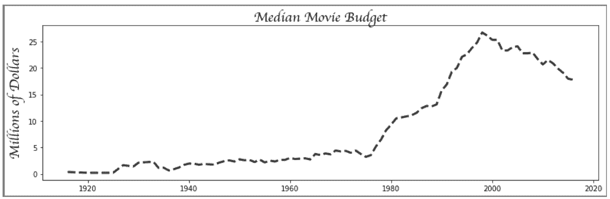

```py
# 每年的电影产量
 In[36]: movie_count = movie.groupby('title_year')['budget'].count()
         movie_count.tail()
Out[36]: title_year
         2012.0    191
         2013.0    208
         2014.0    221
         2015.0    192
         2016.0     86
         Name: budget, dtype: int64 
```

```py
# 在前图的基础上，将每年的电影产量画成一个柱状图，因为大部分电影都近年的，所以将起始的年设为1970
 In[37]: ct = movie_count.values
         ct_norm = ct / ct.max() * budget.max()

         fifth_year = (years % 5 == 0) & (years >= 1970)
         years_5 = years[fifth_year]
         ct_5 = ct[fifth_year]
         ct_norm_5 = ct_norm[fifth_year]

         ax.bar(years_5, ct_norm_5, 3, facecolor='.5', alpha=.3, label='Movies per Year')
         ax.set_xlim(1968, 2017)
         for x, y, v in zip(years_5, ct_norm_5, ct_5):
             ax.text(x, y + .5, str(v), ha='center')
         ax.legend()
         fig
Out[37]: 
```

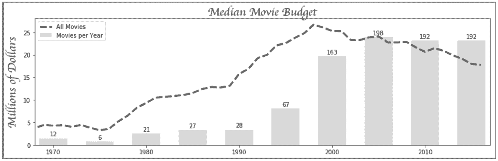

```py
# 找到每年的前10部电影的五年滚动中位数
 In[38]: top10 = movie.sort_values('budget', ascending=False) \
                      .groupby('title_year')['budget'] \
                      .apply(lambda x: x.iloc[:10].median() / 1e6)

         top10_roll = top10.rolling(5, min_periods=1).mean()
         top10_roll.tail()
Out[38]: title_year
         2012.0    192.9
         2013.0    195.9
         2014.0    191.7
         2015.0    186.8
         2016.0    189.1
         Name: budget, dtype: float64 
```

```py
# 将上面的数据画到另一张子图中
 In[39]: fig2, ax_array = plt.subplots(2, 1, figsize=(14,6), sharex=True)
         ax1 = ax_array[0]
         ax2 = ax_array[1]

         ax1.plot(years, budget, linestyle='--', linewidth=3, color='.2', label='All Movies')
         ax1.bar(years_5, ct_norm_5, 3, facecolor='.5', alpha=.3, label='Movies per Year')
         ax1.legend(loc='upper left')
         ax1.set_xlim(1968, 2017)
         plt.setp(ax1.get_xticklines(), visible=False)

         for x, y, v in zip(years_5, ct_norm_5, ct_5):
             ax1.text(x, y + .5, str(v), ha='center')

         ax2.plot(years, top10_roll.values, color='.2', label='Top 10 Movies')
         ax2.legend(loc='upper left')

         fig2.tight_layout()
         fig2.suptitle('Median Movie Budget', y=1.02, **text_kwargs)
         fig2.text(0, .6, 'Millions of Dollars', rotation='vertical', ha='center', **text_kwargs)

         import os
         path = os.path.expanduser('~/Desktop/movie_budget.png')
         fig2.savefig(path, bbox_inches='tight')
Out[39]: 
```

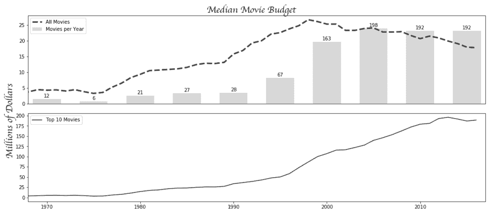

### 原理

```py
 In[40]: med_budget_roll.tail()
Out[40]: title_year
         2012.0    20.893
         2013.0    19.893
         2014.0    19.100
         2015.0    17.980
         2016.0    17.780
         Name: budget, dtype: float64 
```

```py
# 手动确认一下rolling方法
 In[41]: med_budget.loc[2012:2016].mean()
Out[41]: 17.78

 In[42]: med_budget.loc[2011:2015].mean()
Out[42]: 17.98

 In[43]: med_budget.loc[2010:2014].mean()
Out[43]: 19.1 
```

```py
# 必须使用expanduser创建完整路径
 In[44]: os.path.expanduser('~/Desktop/movie_budget.png')
Out[44]: '/Users/Ted/Desktop/movie_budget.png' 
```

### 更多

```py
 In[45]: cols = ['budget', 'title_year', 'imdb_score', 'movie_title']
         m = movie[cols].dropna()

         # m = movie[['budget', 'title_year', 'imdb_score', 'movie_title']].dropna()
         m['budget2'] = m['budget'] / 1e6
         np.random.seed(0)
         movie_samp = m.query('title_year >= 2000').sample(100)

         fig, ax = plt.subplots(figsize=(14,6))
         ax.scatter(x='title_year', y='imdb_score', s='budget2', data=movie_samp)

         idx_min = movie_samp['imdb_score'].idxmin()
         idx_max = movie_samp['imdb_score'].idxmax()
         for idx, offset in zip([idx_min, idx_max], [.5, -.5]):
             year = movie_samp.loc[idx, 'title_year']
             score = movie_samp.loc[idx, 'imdb_score']
             title = movie_samp.loc[idx, 'movie_title']
             ax.annotate(xy=(year, score), 
                         xytext=(year + 1, score + offset), 
                         s=title + ' ({})'.format(score),
                         ha='center',
                         size=16,
                         arrowprops=dict(arrowstyle="fancy"))
         ax.set_title('IMDB Score by Year', size=25)
         ax.grid(True)
Out[45]: 
```

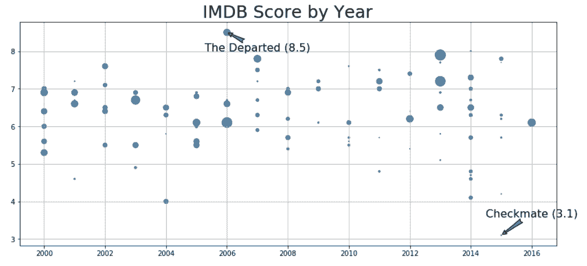

### 3\. Pandas绘图基础

```py
# 创建一个小DataFrame
 In[46]: df = pd.DataFrame(index=['Atiya', 'Abbas', 'Cornelia', 'Stephanie', 'Monte'], 
                           data={'Apples':[20, 10, 40, 20, 50],
                                 'Oranges':[35, 40, 25, 19, 33]})
         df
Out[46]: 
```

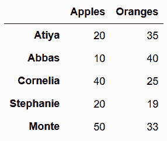

```py
# 画柱状图，使用行索引做x轴，列的值做高度，使用plot方法，参数kind设为bar
 In[47]: color = ['.2', '.7']
         df.plot(kind='bar', color=color, figsize=(16,4))
Out[47]: <matplotlib.axes._subplots.AxesSubplot at 0x1143cae10> 
```

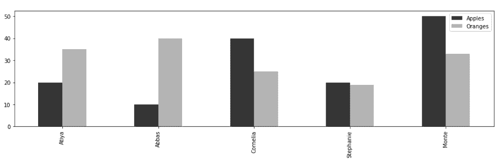

```py
# KDE图忽略行索引，使用每列的值作为x轴，并计算y值得概率密度
 In[48]: df.plot(kind='kde', color=color, figsize=(16,4))
Out[48]: <matplotlib.axes._subplots.AxesSubplot at 0x11503ec50> 
```

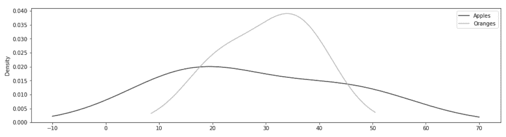

```py
# 画三张双变量子图。散点图是唯一需要指定x和y轴的列，如果想在散点图中使用行索引，可以使用方法reset_index。
 In[49]: fig, (ax1, ax2, ax3) = plt.subplots(1, 3, figsize=(16,4))
         fig.suptitle('Two Variable Plots', size=20, y=1.02)
         df.plot(kind='line', color=color, ax=ax1, title='Line plot')
         df.plot(x='Apples', y='Oranges', kind='scatter', color=color, 
                 ax=ax2, title='Scatterplot')
         df.plot(kind='bar', color=color, ax=ax3, title='Bar plot')
Out[49]: <matplotlib.axes._subplots.AxesSubplot at 0x119ccb5f8> 
```

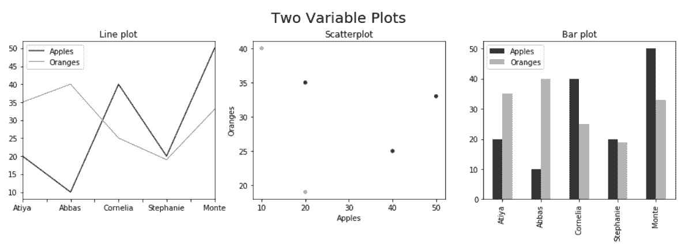

```py
# 将单变量图也画在同一张图中
 In[50]: fig, (ax1, ax2, ax3) = plt.subplots(1, 3, figsize=(16,4))
         fig.suptitle('One Variable Plots', size=20, y=1.02)
         df.plot(kind='kde', color=color, ax=ax1, title='KDE plot')
         df.plot(kind='box', ax=ax2, title='Boxplot')
         df.plot(kind='hist', color=color, ax=ax3, title='Histogram')
Out[50]: <matplotlib.axes._subplots.AxesSubplot at 0x119f475f8> 
```

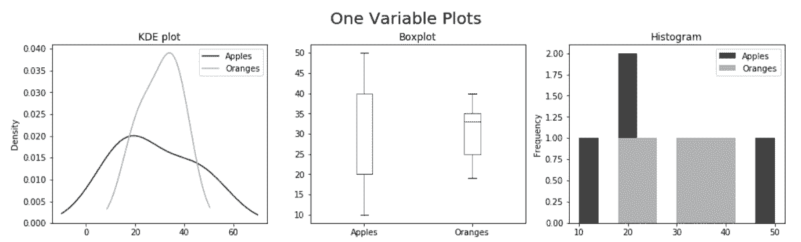

### 更多

```py
# matplotlib允许手动指定x和y的值
 In[51]: fig, (ax1, ax2, ax3) = plt.subplots(1, 3, figsize=(16,4))
         df.sort_values('Apples').plot(x='Apples', y='Oranges', kind='line', ax=ax1)
         df.plot(x='Apples', y='Oranges', kind='bar', ax=ax2)
         df.plot(x='Apples', kind='kde', ax=ax3)
Out[51]: <matplotlib.axes._subplots.AxesSubplot at 0x11a1bc438> 
```

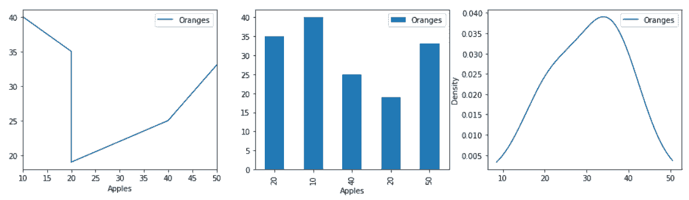

## 4\. 可视化flights数据集

```py
# 读取flights数据集
 In[52]: flights = pd.read_csv('data/flights.csv')
         flights.head()
Out[52]: 
```

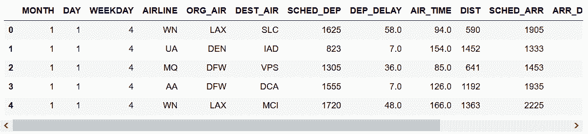

```py
# 创建两列，表示延迟和准时
 In[53]: flights['DELAYED'] = flights['ARR_DELAY'].ge(15).astype(int)
         cols = ['DIVERTED', 'CANCELLED', 'DELAYED']
         flights['ON_TIME'] = 1 - flights[cols].any(axis=1)

         cols.append('ON_TIME')
         status = flights[cols].sum()
         status
Out[53]: DIVERTED       137
         CANCELLED      881
         DELAYED      11685
         ON_TIME      45789
         dtype: int64 
```

```py
# 对类型值和连续值列作图
 In[54]: fig, ax_array = plt.subplots(2, 3, figsize=(18,8))
         (ax1, ax2, ax3), (ax4, ax5, ax6) = ax_array
         fig.suptitle('2015 US Flights - Univariate Summary', size=20)

         ac = flights['AIRLINE'].value_counts()
         ac.plot(kind='barh', ax=ax1, title ='Airline')

         oc = flights['ORG_AIR'].value_counts()
         oc.plot(kind='bar', ax=ax2, rot=0, title='Origin City')

         dc = flights['DEST_AIR'].value_counts().head(10)
         dc.plot(kind='bar', ax=ax3, rot=0, title='Destination City')

         status.plot(kind='bar', ax=ax4, rot=0, log=True, title='Flight Status')
         flights['DIST'].plot(kind='kde', ax=ax5, xlim=(0, 3000),
                              title='Distance KDE')
         flights['ARR_DELAY'].plot(kind='hist', ax=ax6, 
                                   title='Arrival Delay', range=(0,200))
Out[54]: <matplotlib.axes._subplots.AxesSubplot at 0x11a67e3c8> 
```

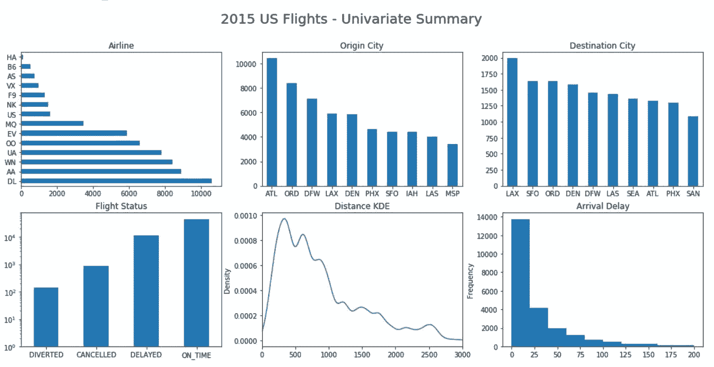

```py
# 添加关于年的列，用起飞时间得到小时和分钟
 In[55]: hour = flights['SCHED_DEP'] // 100
         minute = flights['SCHED_DEP'] % 100
         df_date = flights[['MONTH', 'DAY']].assign(YEAR=2015, HOUR=hour, MINUTE=minute)
         df_date.head()
Out[55]: 
```

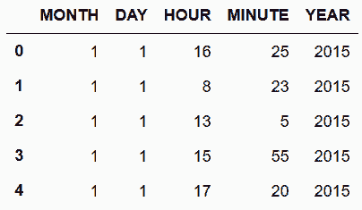

```py
# 用to_datetime函数，将df_date变为Timestamps对象
 In[56]: flight_dep = pd.to_datetime(df_date)
         flight_dep.head()
Out[56]: 0   2015-01-01 16:25:00
         1   2015-01-01 08:23:00
         2   2015-01-01 13:05:00
         3   2015-01-01 15:55:00
         4   2015-01-01 17:20:00
         dtype: datetime64[ns] 
```

```py
# 用flight_dep作为新的行索引，并根据它统计每周的航班数
 In[57]: flights.index = flight_dep
         fc = flights.resample('W').size()
         fc.plot(figsize=(12,3), title='Flights per Week', grid=True)
Out[57]: <matplotlib.axes._subplots.AxesSubplot at 0x109d116d8> 
```

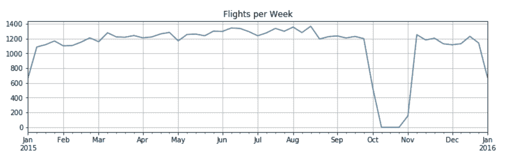

```py
# 如果航班数小于1000，则将其当做缺失值。然后用interpolate方法填补缺失值
 In[58]: fc_miss = fc.where(fc >  1000)
         fc_intp = fc_miss.interpolate(limit_direction='both')

         ax = fc_intp.plot(color='black', figsize=(16,4))
         fc_intp[fc < 500].plot(linewidth=10, grid=True, 
                                color='.8', ax=ax)

         ax.annotate(xy=(.8, .55), xytext=(.8, .77), 
                     xycoords='axes fraction', s='missing data', 
                     ha='center',  size=20, arrowprops=dict())
         ax.set_title('Flights per Week (Interpolated Missing Data)')
Out[58]: Text(0.5,1,'Flights per Week (Interpolated Missing Data)') 
```

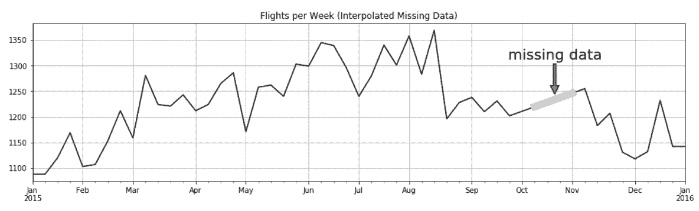

```py
# 找到10个有最长平均入境航班航程、最少100航次的机场
 In[59]: flights.groupby('DEST_AIR')['DIST'] \
                .agg(['mean', 'count']) \
                .query('count > 100') \
                .sort_values('mean') \
                .tail(10) \
                .plot(kind='bar', y='mean', legend=False, 
                      rot=0, figsize=(14,4),
                      title='Average Distance per Destination')
Out[59]: <matplotlib.axes._subplots.AxesSubplot at 0x11a480dd8> 
```

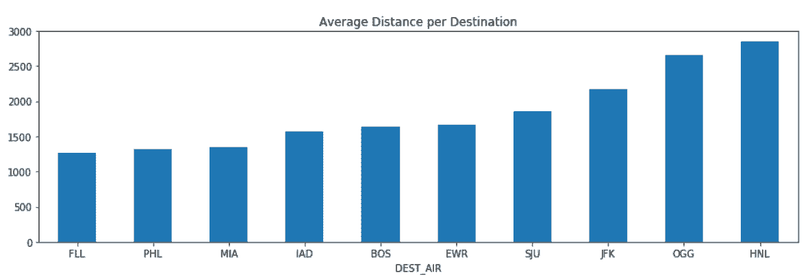

```py
# 画出航班时间和航程的散点图
 In[60]: fs = flights.reset_index(drop=True)[['DIST', 'AIR_TIME']].query('DIST <= 2000').dropna()
         fs.plot(x='DIST', y='AIR_TIME', kind='scatter', s=1, figsize=(16,4))
Out[60]: <matplotlib.axes._subplots.AxesSubplot at 0x11a49b860> 
```

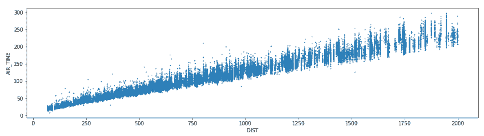

```py
# 用cut函数，将航班距离分成八组
 In[61]: fs['DIST_GROUP'] = pd.cut(fs['DIST'], bins=range(0, 2001, 250))
         fs['DIST_GROUP'].value_counts().sort_index()
Out[61]: (0, 250]         6529
         (250, 500]      12631
         (500, 750]      11506
         (750, 1000]      8832
         (1000, 1250]     5071
         (1250, 1500]     3198
         (1500, 1750]     3885
         (1750, 2000]     1815
         Name: DIST_GROUP, dtype: int64 
```

```py
# 计算每组的标准差
 In[62]: normalize = lambda x: (x - x.mean()) / x.std()
         fs['TIME_SCORE'] = fs.groupby('DIST_GROUP')['AIR_TIME'] \
                              .transform(normalize)

         fs.head()
Out[62]: 
```

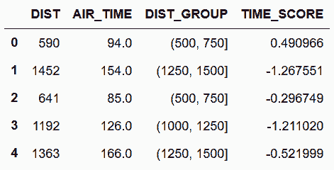

```py
# 用boxplot方法画出异常值
 In[63]: ax = fs.boxplot(by='DIST_GROUP', column='TIME_SCORE', figsize=(16,4))
         ax.set_title('Z-Scores for Distance Groups')
         ax.figure.suptitle('')
/Users/Ted/anaconda/lib/python3.6/site-packages/numpy/core/fromnumeric.py:57: FutureWarning: reshape is deprecated and will raise in a subsequent release. Please use .values.reshape(...) instead
  return getattr(obj, method)(*args, **kwds)
Out[63]: Text(0.5,0.98,'') 
```

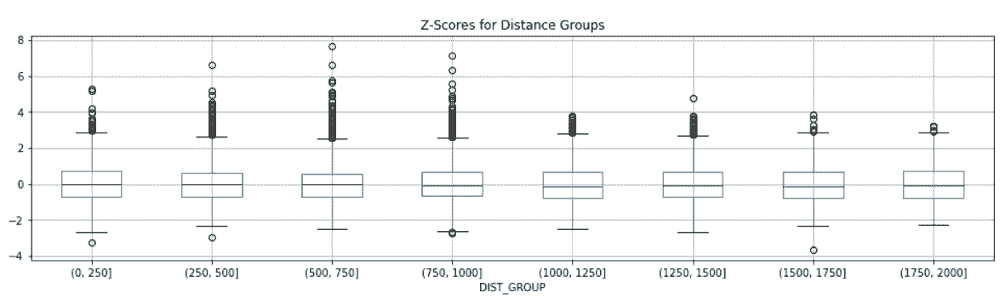

```py
# 检查超出6个标准偏差的点。用一个DataFrame记录异常点。
 In[64]: outliers = flights.iloc[fs[fs['TIME_SCORE'] > 6].index]
         outliers = outliers[['AIRLINE','ORG_AIR', 'DEST_AIR', 'AIR_TIME', 
                              'DIST', 'ARR_DELAY', 'DIVERTED']]
         outliers['PLOT_NUM'] = range(1, len(outliers) + 1)
         outliers
Out[64]: 
```

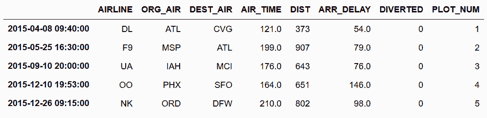

```py
# 可以这张表的数据确定异常值。pandas提供了将表格附加于图片底部的方法。
 In[65]: ax = fs.plot(x='DIST', y='AIR_TIME', 
                      kind='scatter', s=1, 
                      figsize=(16,4), table=outliers)
         outliers.plot(x='DIST', y='AIR_TIME',
                       kind='scatter', s=25, ax=ax, grid=True)

         outs = outliers[['AIR_TIME', 'DIST', 'PLOT_NUM']]
         for t, d, n  in outs.itertuples(index=False):
             ax.text(d + 5, t + 5, str(n))

         plt.setp(ax.get_xticklabels(), y=.1)
         plt.setp(ax.get_xticklines(), visible=False)
         ax.set_xlabel('')
         ax.set_title('Flight Time vs Distance with Outliers')
Out[65]: Text(0.5,1,'Flight Time vs Distance with Outliers') 
```

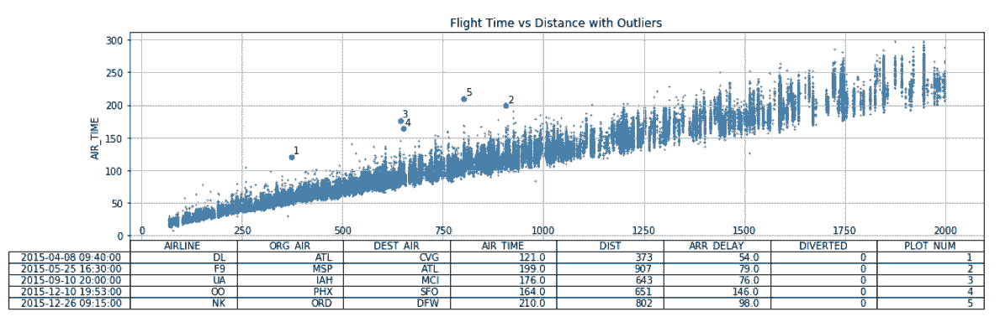

## 5\. 堆叠面积图，以发现趋势

```py
# 读取meetup_groups数据集
 In[66]: meetup = pd.read_csv('data/meetup_groups.csv', 
                              parse_dates=['join_date'], 
                              index_col='join_date')
         meetup.head()
Out[66]: 
```

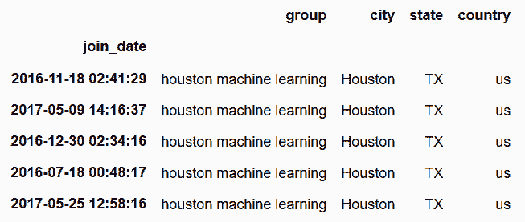

```py
# 算出每周加入每个组的人
 In[67]: group_count = meetup.groupby([pd.Grouper(freq='W'), 'group']).size()
         group_count.head()
Out[67]: join_date   group   
         2010-11-07  houstonr     5
         2010-11-14  houstonr    11
         2010-11-21  houstonr     2
         2010-12-05  houstonr     1
         2011-01-16  houstonr     2
         dtype: int64 
```

```py
# 将数据表unstack
 In[68]: gc2 = group_count.unstack('group', fill_value=0)
         gc2.tail()
Out[68]: 
```

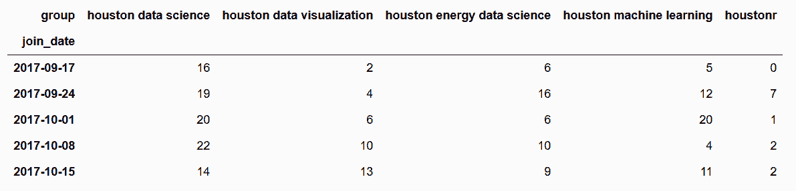

```py
# 做累积求和
 In[69]: group_total = gc2.cumsum()
         group_total.tail()
Out[69]: 
```

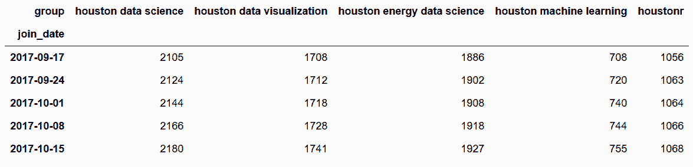

```py
# 将每行分开，已找到其在总数中的百分比
 In[70]: row_total = group_total.sum(axis='columns')
         group_cum_pct = group_total.div(row_total, axis='index')
         group_cum_pct.tail()
Out[70]: 
```

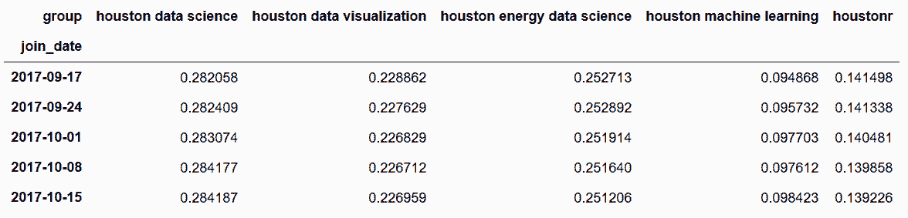

```py
# 话堆叠面积图
 In[71]: ax = group_cum_pct.plot(kind='area', figsize=(18,4),
                                 cmap='Greys', xlim=('2013-6', None), 
                                 ylim=(0, 1), legend=False)
         ax.figure.suptitle('Houston Meetup Groups', size=25)
         ax.set_xlabel('')
         ax.yaxis.tick_right()

         plot_kwargs = dict(xycoords='axes fraction', size=15)
         ax.annotate(xy=(.1, .7), s='R Users', color='w', **plot_kwargs)
         ax.annotate(xy=(.25, .16), s='Data Visualization', color='k', **plot_kwargs)
         ax.annotate(xy=(.5, .55), s='Energy Data Science', color='k', **plot_kwargs)
         ax.annotate(xy=(.83, .07), s='Data Science', color='k', **plot_kwargs)
         ax.annotate(xy=(.86, .78), s='Machine Learning', color='w', **plot_kwargs)
Out[71]: Text(0.86,0.78,'Machine Learning') 
```

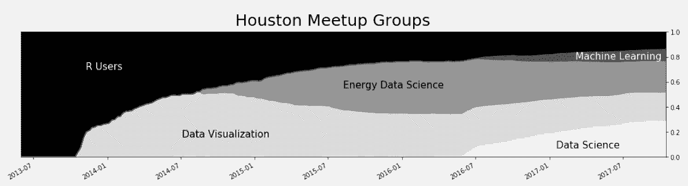

### 更多

```py
# 用饼图查看每组随时间的分布情况
 In[72]: pie_data = group_cum_pct.asfreq('3MS', method='bfill') \
                                 .tail(6).to_period('M').T
         pie_data
Out[72]: 
```

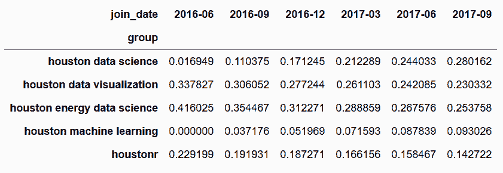

```py
 In[73]: from matplotlib.cm import Greys
         greys = Greys(np.arange(50,250,40))

         ax_array = pie_data.plot(kind='pie', subplots=True, 
                                  layout=(2,3), labels=None,
                                  autopct='%1.0f%%', pctdistance=1.22,
                                  colors=greys)
         ax1 = ax_array[0, 0]
         ax1.figure.legend(ax1.patches, pie_data.index, ncol=3)
         for ax in ax_array.flatten():
             ax.xaxis.label.set_visible(True)
             ax.set_xlabel(ax.get_ylabel())
             ax.set_ylabel('')
         ax1.figure.subplots_adjust(hspace=.3)
Out[73]: 
```

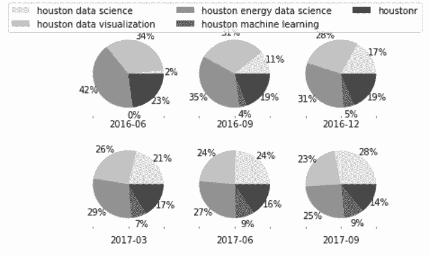

## 6\. Seaborn和Pandas的不同点

```py
# 读取employee数据集
 In[74]: employee = pd.read_csv('data/employee.csv', 
                                parse_dates=['HIRE_DATE', 'JOB_DATE'])
         employee.head()
Out[74]: 
```

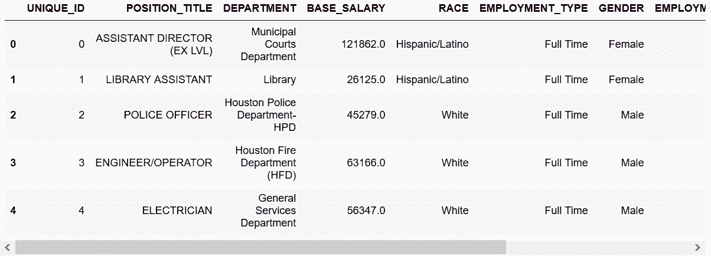

```py
# 用seaborn画出每个部门的柱状图
 In[75]: import seaborn as sns
 In[76]: sns.countplot(y='DEPARTMENT', data=employee)
Out[76]: <matplotlib.axes._subplots.AxesSubplot at 0x11e287128> 
```

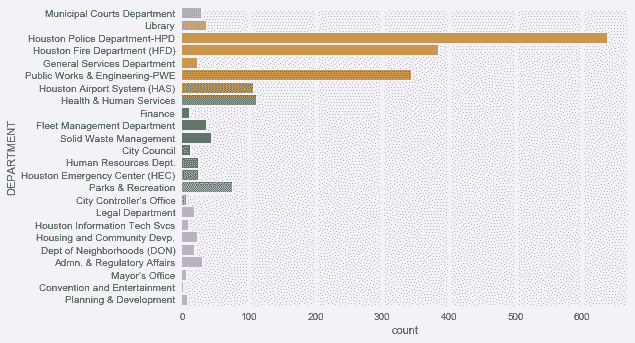

```py
# 要是用pandas来做，需要先聚合数据
 In[77]: employee['DEPARTMENT'].value_counts().plot('barh')
Out[77]: <matplotlib.axes._subplots.AxesSubplot at 0x11e30a240> 
```

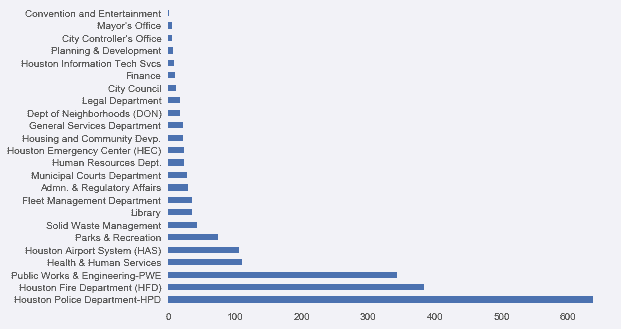

```py
# 用seaborn找到每个种族的平均工资
 In[78]: ax = sns.barplot(x='RACE', y='BASE_SALARY', data=employee)
         ax.figure.set_size_inches(16, 4)
Out[78]: 
```

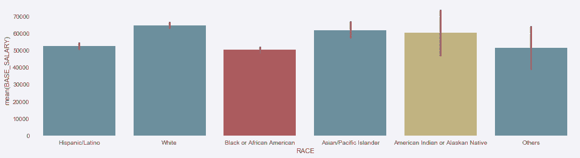

```py
# 用pandas来做，需要先按照race分组
 In[79]: avg_sal = employee.groupby('RACE', sort=False)['BASE_SALARY'].mean()
         ax = avg_sal.plot(kind='bar', rot=0, figsize=(16,4), width=.8)
         ax.set_xlim(-.5, 5.5)
         ax.set_ylabel('Mean Salary')
Out[79]: Text(0,0.5,'Mean Salary') 
```

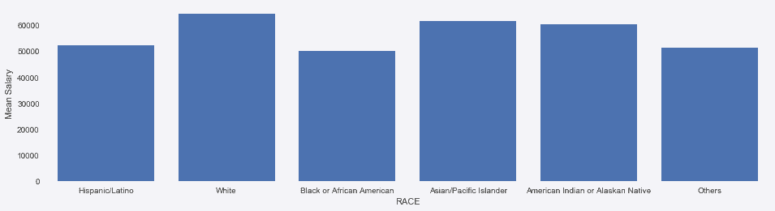

```py
# seaborn还支持在分组内使用第三个参数
 In[80]: ax = sns.barplot(x='RACE', y='BASE_SALARY', hue='GENDER', 
                          data=employee, palette='Greys')
         ax.figure.set_size_inches(16,4)
Out[80]: 
```

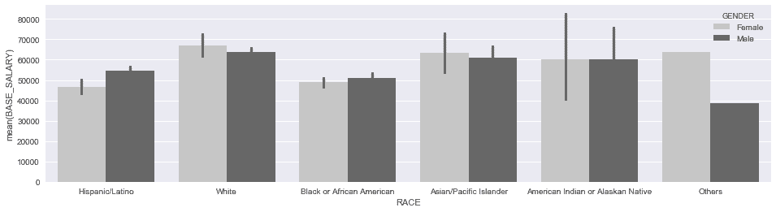

```py
# pandas则要对race和gender同时分组，并对gender做unstack
 In[81]: employee.groupby(['RACE', 'GENDER'], sort=False)['BASE_SALARY'] \
                 .mean().unstack('GENDER') \
                 .plot(kind='bar', figsize=(16,4), rot=0,
                       width=.8, cmap='Greys')
Out[81]: <matplotlib.axes._subplots.AxesSubplot at 0x11ecf45c0> 
```

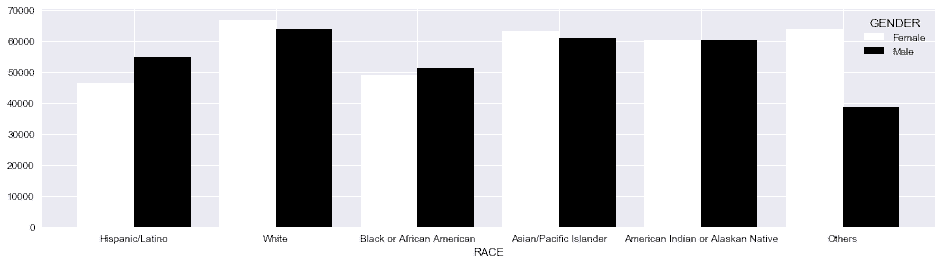

```py
# 用seaborn话race和gender的盒图
 In[82]: ax = sns.boxplot(x='GENDER', y='BASE_SALARY', data=employee, hue='RACE', palette='Greys')
         ax.figure.set_size_inches(14,4)
Out[82]: 
```

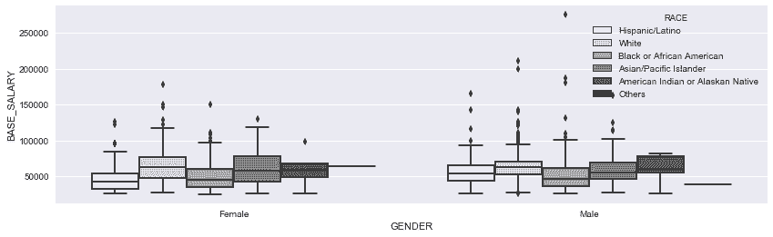

```py
# pandas则要为gender创建两个独立的Axes，然后根据race画盒图
 In[83]: fig, ax_array = plt.subplots(1, 2, figsize=(14,4), sharey=True)
         for g, ax in zip(['Female', 'Male'], ax_array):
             employee.query('GENDER== @g') \
                     .boxplot(by='RACE', column='BASE_SALARY', ax=ax, rot=20)
             ax.set_title(g + ' Salary')
             ax.set_xlabel('')
         fig.suptitle('')
/Users/Ted/anaconda/lib/python3.6/site-packages/numpy/core/fromnumeric.py:57: FutureWarning: reshape is deprecated and will raise in a subsequent release. Please use .values.reshape(...) instead
  return getattr(obj, method)(*args, **kwds)
Out[83]: Text(0.5,0.98,'') 
```

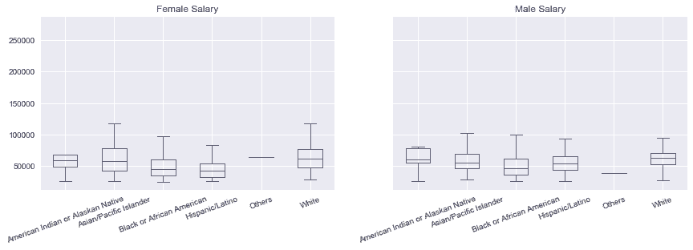

```py
# pandas也可以列表分离多个变量，但是画的图不优雅
 In[84]: ax = employee.boxplot(by=['GENDER', 'RACE'], 
                               column='BASE_SALARY', 
                               figsize=(16,4), rot=15)
         ax.figure.suptitle('')
/Users/Ted/anaconda/lib/python3.6/site-packages/numpy/core/fromnumeric.py:57: FutureWarning: reshape is deprecated and will raise in a subsequent release. Please use .values.reshape(...) instead
  return getattr(obj, method)(*args, **kwds)
Out[84]: Text(0.5,0.98,'') 
```

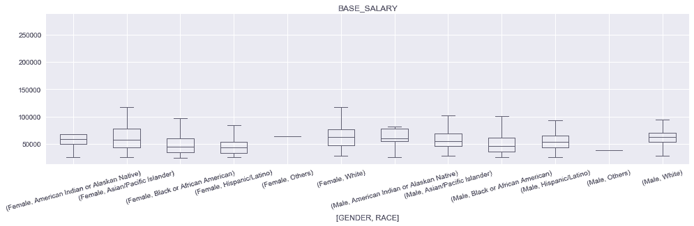

## 7\. 使用Seaborn网格做多变量分析

```py
# 读取employee数据集，创建工龄的列
 In[85]: employee = pd.read_csv('data/employee.csv', 
                                parse_dates=['HIRE_DATE', 'JOB_DATE'])
         days_hired = (pd.to_datetime('12-1-2016') - employee['HIRE_DATE'])

         one_year = pd.Timedelta(1, unit='Y')
         employee['YEARS_EXPERIENCE'] =  days_hired / one_year
         employee[['HIRE_DATE', 'YEARS_EXPERIENCE']].head()
Out[85]: 
```

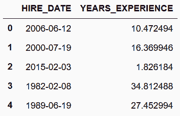

```py
# 画一个基本的带有回归线的散点图
 In[86]: import seaborn as sns
 In[87]: ax = sns.regplot(x='YEARS_EXPERIENCE', y='BASE_SALARY',
                          data=employee)
         ax.figure.set_size_inches(14,4)
Out[87]: 
```


```py
# 用regplot的上层函数lmplot，画出不同性别的回归线
 In[88]: grid = sns.lmplot(x='YEARS_EXPERIENCE', y='BASE_SALARY',
                           hue='GENDER', palette='Greys',
                           scatter_kws={'s':10}, data=employee)
         grid.fig.set_size_inches(14, 4)
         type(grid)
Out[88]: seaborn.axisgrid.FacetGrid 
```

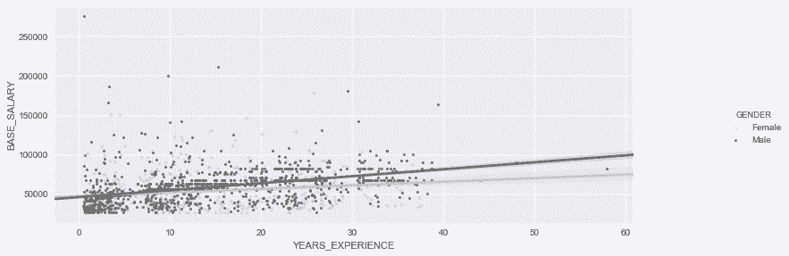

```py
# 为每个种族创建子图，同时保留回归线
 In[89]: grid = sns.lmplot(x='YEARS_EXPERIENCE', y='BASE_SALARY',
                           hue='GENDER', col='RACE', col_wrap=3,
                           palette='Greys', sharex=False,
                           line_kws = {'linewidth':5},
                           data=employee)
         grid.set(ylim=(20000, 120000))
Out[89]: <seaborn.axisgrid.FacetGrid at 0x11e7ce470> 
```

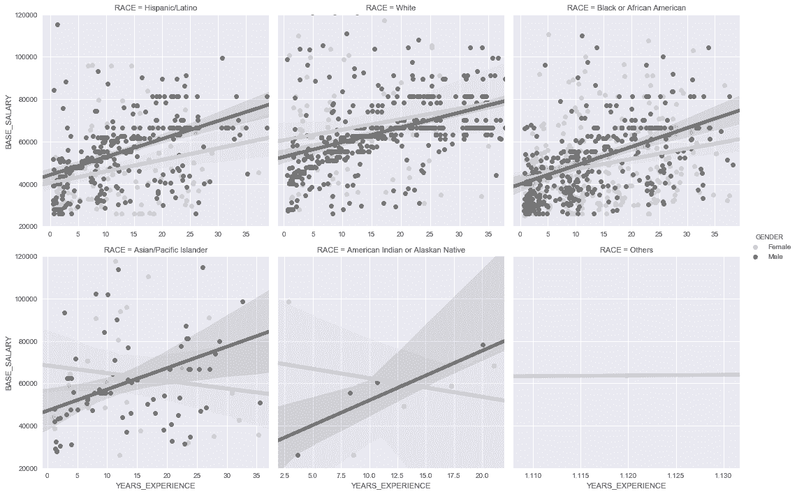

```py
# 将类型值的层级减小到二，将部门的层级减小到三
 In[90]: deps = employee['DEPARTMENT'].value_counts().index[:2]
         races = employee['RACE'].value_counts().index[:3]
         is_dep = employee['DEPARTMENT'].isin(deps)
         is_race = employee['RACE'].isin(races)
         emp2 = employee[is_dep & is_race].copy()
         emp2['DEPARTMENT'] = emp2.DEPARTMENT.str.extract('(HPD|HFD)', expand=True)
         emp2.shape
Out[90]: (968, 11)

 In[91]: emp2['DEPARTMENT'].value_counts()
Out[91]: HPD    591
         HFD    377
         Name: DEPARTMENT, dtype: int64

 In[92]: emp2['RACE'].value_counts()
Out[92]: White                        478
         Hispanic/Latino              250
         Black or African American    240
         Name: RACE, dtype: int64 
```

```py
# 用Axe层函数，比如violinplot来画出工龄和性别的分布
 In[93]: ax = sns.violinplot(x = 'YEARS_EXPERIENCE', y='GENDER', data=emp2)
         ax.figure.set_size_inches(10,4)
Out[93]: 
```

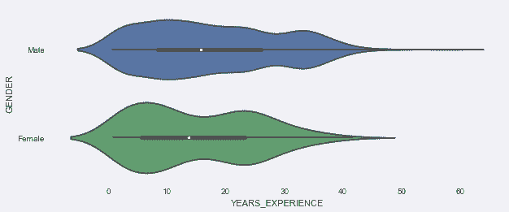

```py
# 用factorplot函数，为每个部门和种族的组合画图
 In[94]: sns.factorplot(x ='YEARS_EXPERIENCE', y='GENDER',
                        col='RACE', row='DEPARTMENT', 
                        size=3, aspect=2,
                        data=emp2, kind='violin')
Out[94]: <seaborn.axisgrid.FacetGrid at 0x11e40ec50> 
```

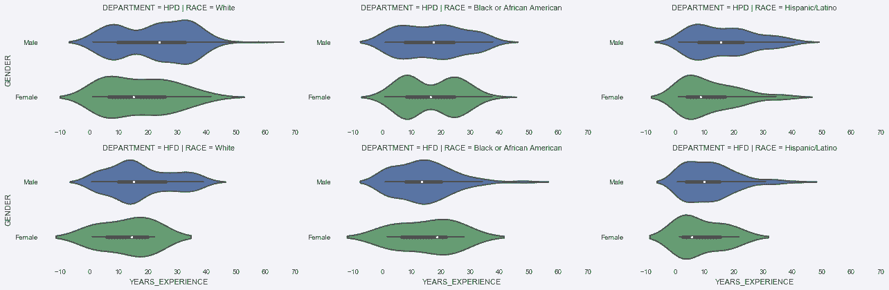

## 8\. 用Seaborn破解diamonds数据集的辛普森悖论

```py
 In[95]: pd.DataFrame(index=['Student A', 'Student B'], 
                      data={'Raw Score': ['50/100', '80/100'], 
                            'Percent Correct':[50,80]}, columns=['Raw Score', 'Percent Correct'])
Out[95]: 
```

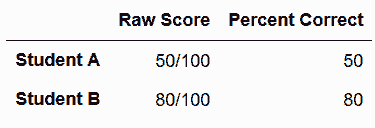

```py
 In[96]: pd.DataFrame(index=['Student A', 'Student B'], 
                      data={'Difficult': ['45/95', '2/5'], 
                            'Easy': ['5/5', '78/95'],
                            'Difficult Percent': [47, 40],
                            'Easy Percent' : [100, 82],
                            'Total Percent':[50, 80]}, 
                      columns=['Difficult', 'Easy', 'Difficult Percent', 'Easy Percent', 'Total Percent'])
Out[96]: 
```

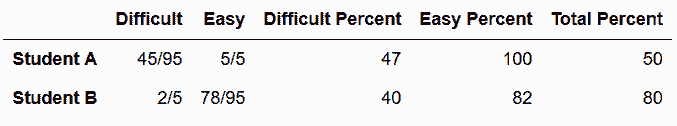

```py
# 读取diamonds数据集
 In[97]: diamonds = pd.read_csv('data/diamonds.csv')
         diamonds.head()
Out[97]: 
```

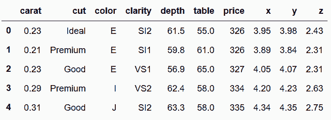

```py
# 将cut、color、clarity列变为有序类型
 In[98]: cut_cats = ['Fair', 'Good', 'Very Good', 'Premium', 'Ideal']
         color_cats = ['J', 'I', 'H', 'G', 'F', 'E', 'D']
         clarity_cats = ['I1', 'SI2', 'SI1', 'VS2', 'VS1', 'VVS2', 'VVS1', 'IF']
         diamonds['cut'] = pd.Categorical(diamonds['cut'],
                                          categories=cut_cats, 
                                          ordered=True)

         diamonds['color'] = pd.Categorical(diamonds['color'],
                                            categories=color_cats, 
                                            ordered=True)

         diamonds['clarity'] = pd.Categorical(diamonds['clarity'],
                                              categories=clarity_cats, 
                                              ordered=True)
 In[99]: fig, (ax1, ax2, ax3) = plt.subplots(1, 3, figsize=(14,4))
         sns.barplot(x='color', y='price', data=diamonds, ax=ax1)
         sns.barplot(x='cut', y='price', data=diamonds, ax=ax2)
         sns.barplot(x='clarity', y='price', data=diamonds, ax=ax3)
         fig.suptitle('Price Decreasing with Increasing Quality?')
Out[98]: Text(0.5,0.98,'Price Decreasing with Increasing Quality?') 
```

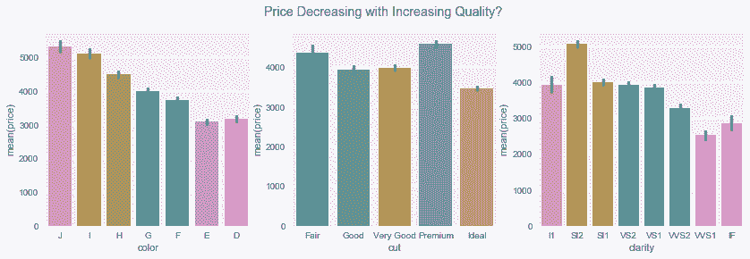

```py
# 画出每种钻石颜色和价格的关系
 In[100]: sns.factorplot(x='color', y='price', col='clarity',
                         col_wrap=4, data=diamonds, kind='bar')
Out[100]: <seaborn.axisgrid.FacetGrid at 0x11b61d5f8> 
```

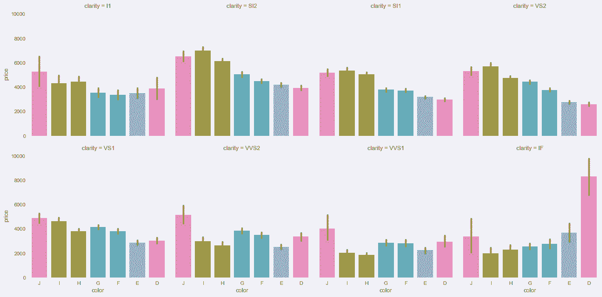

```py
# 用克拉值取代价格
 In[101]: sns.factorplot(x='color', y='carat', col='clarity',
                         col_wrap=4, data=diamonds, kind='bar')
Out[101]: <seaborn.axisgrid.FacetGrid at 0x11e42eef0> 
```

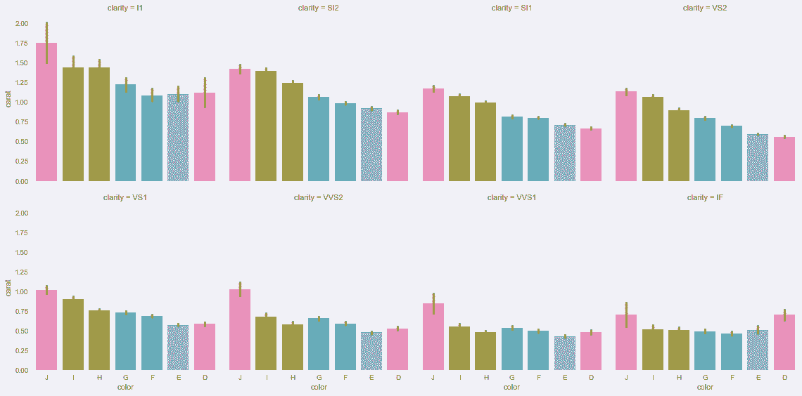

```py
 In[102]: fig, (ax1, ax2, ax3) = plt.subplots(1, 3, figsize=(14,4))
          sns.barplot(x='color', y='carat', data=diamonds, ax=ax1)
          sns.barplot(x='cut', y='carat', data=diamonds, ax=ax2)
          sns.barplot(x='clarity', y='carat', data=diamonds, ax=ax3)
          fig.suptitle('Diamond size decreases with quality')
Out[102]: Text(0.5,0.98,'Diamond size decreases with quality') 
```

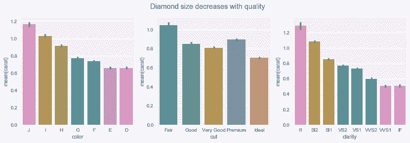

```py
# 下图显示钻石越大，价格越高
 In[103]: diamonds['carat_category'] = pd.qcut(diamonds.carat, 5)

          from matplotlib.cm import Greys
          greys = Greys(np.arange(50,250,40))

          g = sns.factorplot(x='clarity', y='price', data=diamonds,
                             hue='carat_category', col='color', 
                             col_wrap=4, kind='point') #, palette=greys)
          g.fig.suptitle('Diamond price by size, color and clarity',
                         y=1.02, size=20)
Out[103]: Text(0.5,1.02,'Diamond price by size, color and clarity') 
```

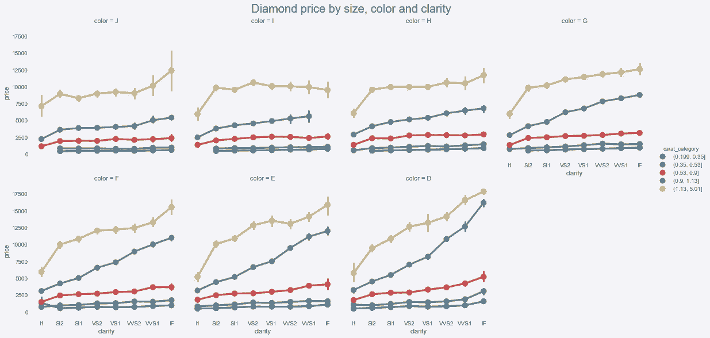

### 更多

```py
# 用seaborn更高级的PairGrid构造器，对二元变量作图
 In[104]: g = sns.PairGrid(diamonds,size=5,
                           x_vars=["color", "cut", "clarity"],
                           y_vars=["price"])
          g.map(sns.barplot)
          g.fig.suptitle('Replication of Step 3 with PairGrid', y=1.02)
Out[104]: Text(0.5,1.02,'Replication of Step 3 with PairGrid') 
```

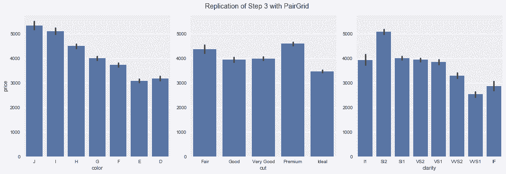

