# 第02章 DataFrame基本操作


```py
In[1]: import pandas as pd
       import numpy as np
       pd.options.display.max_columns = 40 
```

## 1\. 选取多个DataFrame列

```py
# 用列表选取多个列
 In[2]: movie = pd.read_csv('data/movie.csv')
        movie_actor_director = movie[['actor_1_name', 'actor_2_name', 'actor_3_name', 'director_name']]
        movie_actor_director.head()
Out[2]: 
```

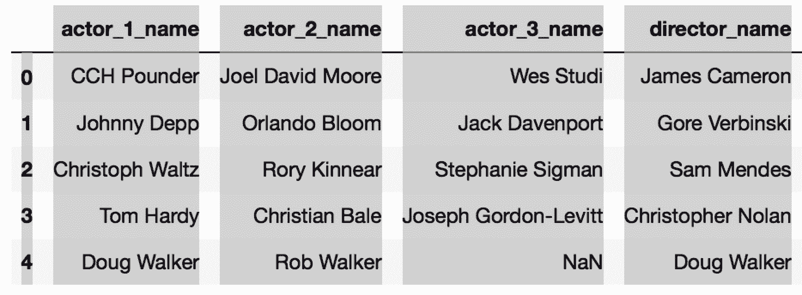

```py
# 选取单列
 In[3]: movie[['director_name']].head()
Out[3]: 
```


```py
# 错误的选取多列的方式
 In[4]: movie['actor_1_name', 'actor_2_name', 'actor_3_name', 'director_name']
---------------------------------------------------------------------------
KeyError                                  Traceback (most recent call last)
/Users/Ted/anaconda/lib/python3.6/site-packages/pandas/core/indexes/base.py in get_loc(self, key, method, tolerance)
   2441             try:
-> 2442                 return self._engine.get_loc(key)
   2443             except KeyError:

pandas/_libs/index.pyx in pandas._libs.index.IndexEngine.get_loc (pandas/_libs/index.c:5280)()

pandas/_libs/index.pyx in pandas._libs.index.IndexEngine.get_loc (pandas/_libs/index.c:5126)()

pandas/_libs/hashtable_class_helper.pxi in pandas._libs.hashtable.PyObjectHashTable.get_item (pandas/_libs/hashtable.c:20523)()

pandas/_libs/hashtable_class_helper.pxi in pandas._libs.hashtable.PyObjectHashTable.get_item (pandas/_libs/hashtable.c:20477)()

KeyError: ('actor_1_name', 'actor_2_name', 'actor_3_name', 'director_name')

During handling of the above exception, another exception occurred:

KeyError                                  Traceback (most recent call last)
<ipython-input-4-954222273e42> in <module>()
----> 1 movie['actor_1_name', 'actor_2_name', 'actor_3_name', 'director_name']

/Users/Ted/anaconda/lib/python3.6/site-packages/pandas/core/frame.py in __getitem__(self, key)
   1962             return self._getitem_multilevel(key)
   1963         else:
-> 1964             return self._getitem_column(key)
   1965 
   1966     def _getitem_column(self, key):

/Users/Ted/anaconda/lib/python3.6/site-packages/pandas/core/frame.py in _getitem_column(self, key)
   1969         # get column
   1970         if self.columns.is_unique:
-> 1971             return self._get_item_cache(key)
   1972 
   1973         # duplicate columns & possible reduce dimensionality

/Users/Ted/anaconda/lib/python3.6/site-packages/pandas/core/generic.py in _get_item_cache(self, item)
   1643         res = cache.get(item)
   1644         if res is None:
-> 1645             values = self._data.get(item)
   1646             res = self._box_item_values(item, values)
   1647             cache[item] = res

/Users/Ted/anaconda/lib/python3.6/site-packages/pandas/core/internals.py in get(self, item, fastpath)
   3588 
   3589             if not isnull(item):
-> 3590                 loc = self.items.get_loc(item)
   3591             else:
   3592                 indexer = np.arange(len(self.items))[isnull(self.items)]

/Users/Ted/anaconda/lib/python3.6/site-packages/pandas/core/indexes/base.py in get_loc(self, key, method, tolerance)
   2442                 return self._engine.get_loc(key)
   2443             except KeyError:
-> 2444                 return self._engine.get_loc(self._maybe_cast_indexer(key))
   2445 
   2446         indexer = self.get_indexer([key], method=method, tolerance=tolerance)

pandas/_libs/index.pyx in pandas._libs.index.IndexEngine.get_loc (pandas/_libs/index.c:5280)()

pandas/_libs/index.pyx in pandas._libs.index.IndexEngine.get_loc (pandas/_libs/index.c:5126)()

pandas/_libs/hashtable_class_helper.pxi in pandas._libs.hashtable.PyObjectHashTable.get_item (pandas/_libs/hashtable.c:20523)()

pandas/_libs/hashtable_class_helper.pxi in pandas._libs.hashtable.PyObjectHashTable.get_item (pandas/_libs/hashtable.c:20477)()

KeyError: ('actor_1_name', 'actor_2_name', 'actor_3_name', 'director_name') 
```

### 更多

```py
# 将列表赋值给一个变量，便于多选
 In[6]: cols =['actor_1_name', 'actor_2_name', 'actor_3_name', 'director_name']
        movie_actor_director = movie[cols]
Out[6]: float64    13
        int64       3
        object     11
        dtype: int64 
```

```py
# 使用select_dtypes()，选取整数列
 In[7]: movie.select_dtypes(include=['int']).head()
Out[7]: 
```

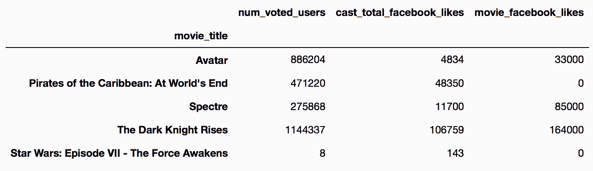

```py
# 选取所有的数值列
 In[8]: movie.select_dtypes(include=['number']).head()
Out[8]: 
```

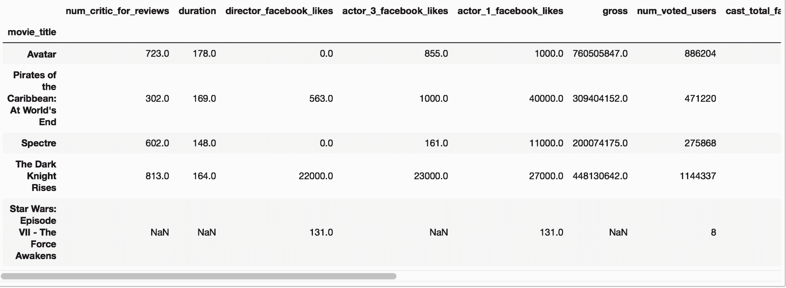

```py
# 通过filter()函数过滤选取多列
 In[9]: movie.filter(like='facebook').head()
Out[9]: 
```


```py
# 通过正则表达式选取多列
 In[10]: movie.filter(regex='\d').head()
Out[10]: 
```

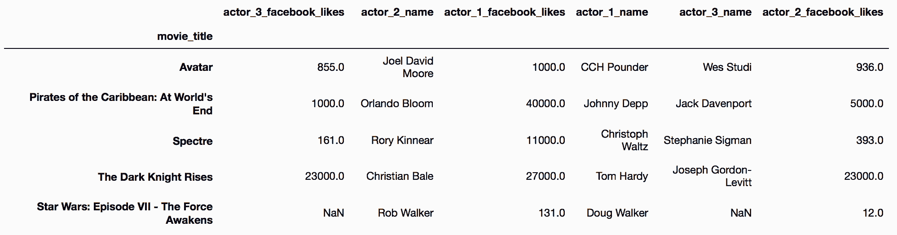

```py
# filter()函数，传递列表到参数items，选取多列
 In[11]: movie.filter(items=['actor_1_name', 'asdf']).head()
Out[11]: 
```


## 2\. 对列名进行排序

```py
# 读取movie数据集
 In[12]: movie = pd.read_csv('data/movie.csv')
 In[13]: movie.head()
Out[13]: 
```

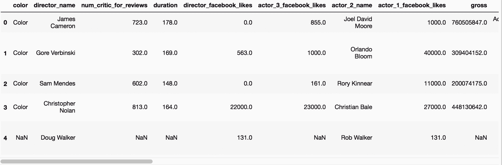

```py
# 打印列索引
 In[14]: movie.columns
Out[14]: Index(['color', 'director_name', 'num_critic_for_reviews', 'duration',
       'director_facebook_likes', 'actor_3_facebook_likes', 'actor_2_name',
       'actor_1_facebook_likes', 'gross', 'genres', 'actor_1_name',
       'movie_title', 'num_voted_users', 'cast_total_facebook_likes',
       'actor_3_name', 'facenumber_in_poster', 'plot_keywords',
       'movie_imdb_link', 'num_user_for_reviews', 'language', 'country',
       'content_rating', 'budget', 'title_year', 'actor_2_facebook_likes',
       'imdb_score', 'aspect_ratio', 'movie_facebook_likes'],
      dtype='object') 
```

```py
# 将列索引按照指定的顺序排列
 In[15]: disc_core = ['movie_title','title_year', 'content_rating','genres']
         disc_people = ['director_name','actor_1_name', 'actor_2_name','actor_3_name']
         disc_other = ['color','country','language','plot_keywords','movie_imdb_link']
         cont_fb = ['director_facebook_likes','actor_1_facebook_likes','actor_2_facebook_likes',
                    'actor_3_facebook_likes', 'cast_total_facebook_likes', 'movie_facebook_likes']
         cont_finance = ['budget','gross']
         cont_num_reviews = ['num_voted_users','num_user_for_reviews', 'num_critic_for_reviews']
         cont_other = ['imdb_score','duration', 'aspect_ratio', 'facenumber_in_poster']

 In[16]: new_col_order = disc_core + disc_people + disc_other + \
                    cont_fb + cont_finance + cont_num_reviews + cont_other
         set(movie.columns) == set(new_col_order)
Out[16]: True

 In[17]: movie2 = movie[new_col_order]
         movie2.head()
Out[17]: 
```

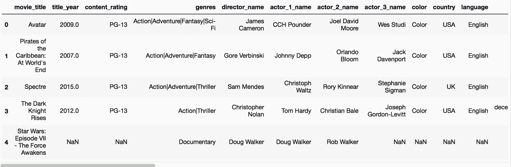

## 3\. 在整个DataFrame上操作

```py
 In[18]: pd.options.display.max_rows = 8
         movie = pd.read_csv('data/movie.csv')
         # 打印行数和列数
         movie.shape 
Out[18]: (4916, 28) 
```

```py
# 打印数据的个数
 In[19]: movie.size
Out[19]: 137648 
```

```py
# 该数据集的维度
 In[20]: movie.ndim
Out[20]: 2 
```

```py
# 该数据集的长度
 In[21]: len(movie)
Out[21]: 4916 
```

```py
# 各个列的值的个数
 In[22]: movie.count()
Out[22]: color                     4897
         director_name             4814
         num_critic_for_reviews    4867
         duration                  4901
                                   ... 
         actor_2_facebook_likes    4903
         imdb_score                4916
         aspect_ratio              4590
         movie_facebook_likes      4916
         Length: 28, dtype: int64 
```

```py
# 各列的最小值
 In[23]: movie.min()
Out[23]: num_critic_for_reviews     1.00
         duration                   7.00
         director_facebook_likes    0.00
         actor_3_facebook_likes     0.00
                                    ... 
         actor_2_facebook_likes     0.00
         imdb_score                 1.60
         aspect_ratio               1.18
         movie_facebook_likes       0.00
         Length: 16, dtype: float64 
```

```py
# 打印描述信息
 In[24]: movie.describe()
Out[24]: 
```

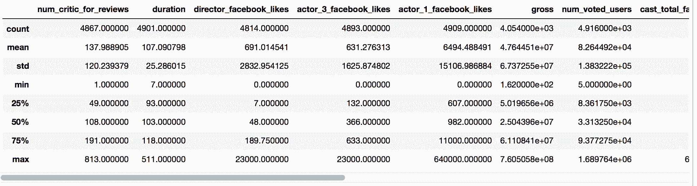

```py
# 使用percentiles参数指定分位数
 In[25]: pd.options.display.max_rows = 10
 In[26]: movie.describe(percentiles=[.01, .3, .99])
Out[26]: 
```

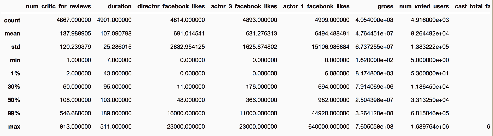

```py
# 打印各列空值的个数
 In[27]: pd.options.display.max_rows = 8
 In[28]: movie.isnull().sum()
Out[28]: color                      19
         director_name             102
         num_critic_for_reviews     49
         duration                   15
                                   ... 
         actor_2_facebook_likes     13
         imdb_score                  0
         aspect_ratio              326
         movie_facebook_likes        0
         Length: 28, dtype: int64 
```

### 更多

```py
# 设定skipna=False，没有缺失值的数值列才会计算结果
 In[29]: movie.min(skipna=False)
Out[29]: num_critic_for_reviews     NaN
         duration                   NaN
         director_facebook_likes    NaN
         actor_3_facebook_likes     NaN
                                    ... 
         actor_2_facebook_likes     NaN
         imdb_score                 1.6
         aspect_ratio               NaN
         movie_facebook_likes       0.0
         Length: 16, dtype: float64 
```

## 4\. 串联DataFrame方法

```py
# 使用isnull方法将每个值转变为布尔值
 In[30]: movie = pd.read_csv('data/movie.csv')
         movie.isnull().head()
Out[30]: 
```

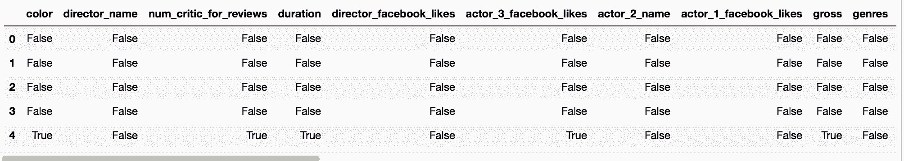

```py
# 使用sum统计布尔值，返回的是Series
 In[31]: movie.isnull().sum().head()
Out[31]: color                       19
         director_name              102
         num_critic_for_reviews      49
         duration                    15
         director_facebook_likes    102
         dtype: int64 
```

```py
# 对这个Series再使用sum，返回整个DataFrame的缺失值的个数，返回值是个标量
 In[32]: movie.isnull().sum().sum()
Out[32]: 2654 
```

```py
# 判断整个DataFrame有没有缺失值，方法是连着使用两个any
 In[33]: movie.isnull().any().any()
Out[33]: True 
```

### 原理

```py
# isnull返回同样大小的DataFrame，但所有的值变为布尔值
 In[34]: movie.isnull().get_dtype_counts()
Out[34]: bool    28
         dtype: int64 
```

### 更多

```py
# movie数据集的对象数据包含缺失值。默认条件下，聚合方法min、max、sum，不会返回任何值。
 In[35]: movie[['color', 'movie_title', 'color']].max()
Out[35]: Series([], dtype: float64) 
```

```py
# 要让pandas强行返回每列的值，必须填入缺失值。下面填入的是空字符串：
 In[36]: movie.select_dtypes(['object']).fillna('').max()
Out[36]: color                                                          Color
         director_name                                          Étienne Faure
         actor_2_name                                           Zubaida Sahar
         genres                                                       Western
                                                                           ...                        
         movie_imdb_link    [http://www.imdb.com/title/tt5574490/?ref_=fn_t...](http://www.imdb.com/title/tt5574490/?ref_=fn_t...)
         language                                                        Zulu
         country                                                 West Germany
         content_rating                                                     X
         Length: 12, dtype: object</pre> 
```

## 5\. 在DataFrame上使用运算符

```py
# college数据集的值既有数值也有对象，整数5不能与字符串相加
 In[37]: college = pd.read_csv('data/college.csv')
         college + 5
---------------------------------------------------------------------------
TypeError                                 Traceback (most recent call last)
/Users/Ted/anaconda/lib/python3.6/site-packages/pandas/core/ops.py in na_op(x, y)
   1175             result = expressions.evaluate(op, str_rep, x, y,
-> 1176                                           raise_on_error=True, **eval_kwargs)
   1177         except TypeError:

/Users/Ted/anaconda/lib/python3.6/site-packages/pandas/core/computation/expressions.py in evaluate(op, op_str, a, b, raise_on_error, use_numexpr, **eval_kwargs)
    210         return _evaluate(op, op_str, a, b, raise_on_error=raise_on_error,
--> 211                          **eval_kwargs)
    212     return _evaluate_standard(op, op_str, a, b, raise_on_error=raise_on_error)

/Users/Ted/anaconda/lib/python3.6/site-packages/pandas/core/computation/expressions.py in _evaluate_numexpr(op, op_str, a, b, raise_on_error, truediv, reversed, **eval_kwargs)
    121     if result is None:
--> 122         result = _evaluate_standard(op, op_str, a, b, raise_on_error)
    123 

/Users/Ted/anaconda/lib/python3.6/site-packages/pandas/core/computation/expressions.py in _evaluate_standard(op, op_str, a, b, raise_on_error, **eval_kwargs)
     63     with np.errstate(all='ignore'):
---> 64         return op(a, b)
     65 

TypeError: must be str, not int

During handling of the above exception, another exception occurred:

TypeError                                 Traceback (most recent call last)
/Users/Ted/anaconda/lib/python3.6/site-packages/pandas/core/internals.py in eval(self, func, other, raise_on_error, try_cast, mgr)
   1183             with np.errstate(all='ignore'):
-> 1184                 result = get_result(other)
   1185 

/Users/Ted/anaconda/lib/python3.6/site-packages/pandas/core/internals.py in get_result(other)
   1152             else:
-> 1153                 result = func(values, other)
   1154 

/Users/Ted/anaconda/lib/python3.6/site-packages/pandas/core/ops.py in na_op(x, y)
   1201                     with np.errstate(all='ignore'):
-> 1202                         result[mask] = op(xrav, y)
   1203             else:

TypeError: must be str, not int

During handling of the above exception, another exception occurred:

TypeError                                 Traceback (most recent call last)
<ipython-input-37-4749f68a2501> in <module>()
      1 college = pd.read_csv('data/college.csv')
----> 2 college + 5

/Users/Ted/anaconda/lib/python3.6/site-packages/pandas/core/ops.py in f(self, other, axis, level, fill_value)
   1239                 self = self.fillna(fill_value)
   1240 
-> 1241             return self._combine_const(other, na_op)
   1242 
   1243     f.__name__ = name

/Users/Ted/anaconda/lib/python3.6/site-packages/pandas/core/frame.py in _combine_const(self, other, func, raise_on_error)
   3541     def _combine_const(self, other, func, raise_on_error=True):
   3542         new_data = self._data.eval(func=func, other=other,
-> 3543                                    raise_on_error=raise_on_error)
   3544         return self._constructor(new_data)
   3545 

/Users/Ted/anaconda/lib/python3.6/site-packages/pandas/core/internals.py in eval(self, **kwargs)
   3195 
   3196     def eval(self, **kwargs):
-> 3197         return self.apply('eval', **kwargs)
   3198 
   3199     def quantile(self, **kwargs):

/Users/Ted/anaconda/lib/python3.6/site-packages/pandas/core/internals.py in apply(self, f, axes, filter, do_integrity_check, consolidate, **kwargs)
   3089 
   3090             kwargs['mgr'] = self
-> 3091             applied = getattr(b, f)(**kwargs)
   3092             result_blocks = _extend_blocks(applied, result_blocks)
   3093 

/Users/Ted/anaconda/lib/python3.6/site-packages/pandas/core/internals.py in eval(self, func, other, raise_on_error, try_cast, mgr)
   1189             raise
   1190         except Exception as detail:
-> 1191             result = handle_error()
   1192 
   1193         # technically a broadcast error in numpy can 'work' by returning a

/Users/Ted/anaconda/lib/python3.6/site-packages/pandas/core/internals.py in handle_error()
   1172                 # The 'detail' variable is defined in outer scope.
   1173                 raise TypeError('Could not operate %s with block values %s' %
-> 1174                                 (repr(other), str(detail)))  # noqa
   1175             else:
   1176                 # return the values

TypeError: Could not operate 5 with block values must be str, not int 
```

```py
# 行索引名设为INSTNM，用UGDS_过滤出本科生的种族比例
In[38]: college = pd.read_csv('data/college.csv', index_col='INSTNM')
        college_ugds_ = college.filter(like='UGDS_')
In[39]: college == 'asdf' # 这是jn上的，想要比较college和‘asdf’，没有意义，忽略
---------------------------------------------------------------------------
TypeError                                 Traceback (most recent call last)
<ipython-input-39-697c8af60bcf> in <module>()
----> 1 college == 'asdf'

/Users/Ted/anaconda/lib/python3.6/site-packages/pandas/core/ops.py in f(self, other)
   1302             # straight boolean comparisions we want to allow all columns
   1303             # (regardless of dtype to pass thru) See #4537 for discussion.
-> 1304             res = self._combine_const(other, func, raise_on_error=False)
   1305             return res.fillna(True).astype(bool)
   1306 

/Users/Ted/anaconda/lib/python3.6/site-packages/pandas/core/frame.py in _combine_const(self, other, func, raise_on_error)
   3541     def _combine_const(self, other, func, raise_on_error=True):
   3542         new_data = self._data.eval(func=func, other=other,
-> 3543                                    raise_on_error=raise_on_error)
   3544         return self._constructor(new_data)
   3545 

/Users/Ted/anaconda/lib/python3.6/site-packages/pandas/core/internals.py in eval(self, **kwargs)
   3195 
   3196     def eval(self, **kwargs):
-> 3197         return self.apply('eval', **kwargs)
   3198 
   3199     def quantile(self, **kwargs):

/Users/Ted/anaconda/lib/python3.6/site-packages/pandas/core/internals.py in apply(self, f, axes, filter, do_integrity_check, consolidate, **kwargs)
   3089 
   3090             kwargs['mgr'] = self
-> 3091             applied = getattr(b, f)(**kwargs)
   3092             result_blocks = _extend_blocks(applied, result_blocks)
   3093 

/Users/Ted/anaconda/lib/python3.6/site-packages/pandas/core/internals.py in eval(self, func, other, raise_on_error, try_cast, mgr)
   1203 
   1204                 raise TypeError('Could not compare [%s] with block values' %
-> 1205                                 repr(other))
   1206 
   1207         # transpose if needed

TypeError: Could not compare ['asdf'] with block values 
```

```py
# 查看前5行
 In[40]: college_ugds_.head()
Out[40]: 
```

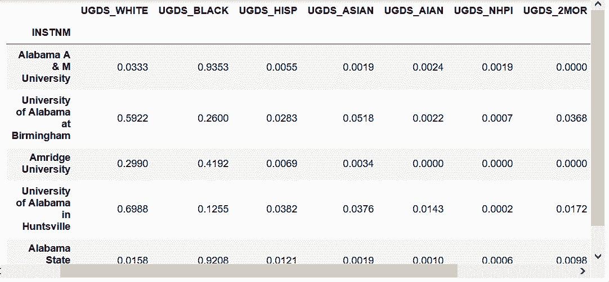

```py
# 现在都是均质数据了，可以进行数值运算
 In[41]: college_ugds_.head() + .00501
Out[41]: 
```

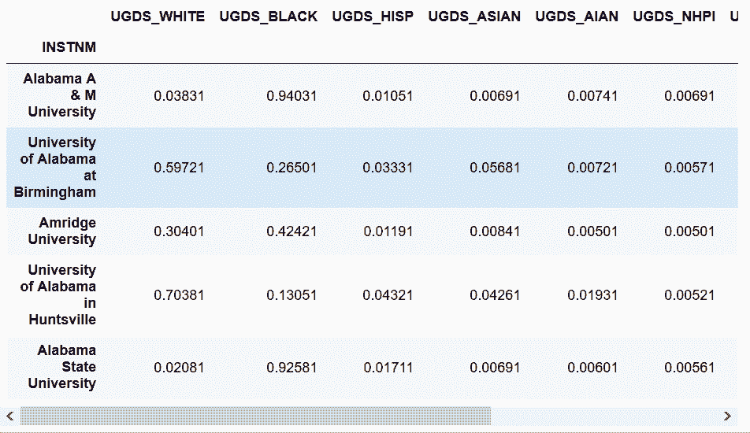

```py
# 用底除计算百分比分数
 In[42]: (college_ugds_.head() + .00501) // .01
Out[42]: 
```

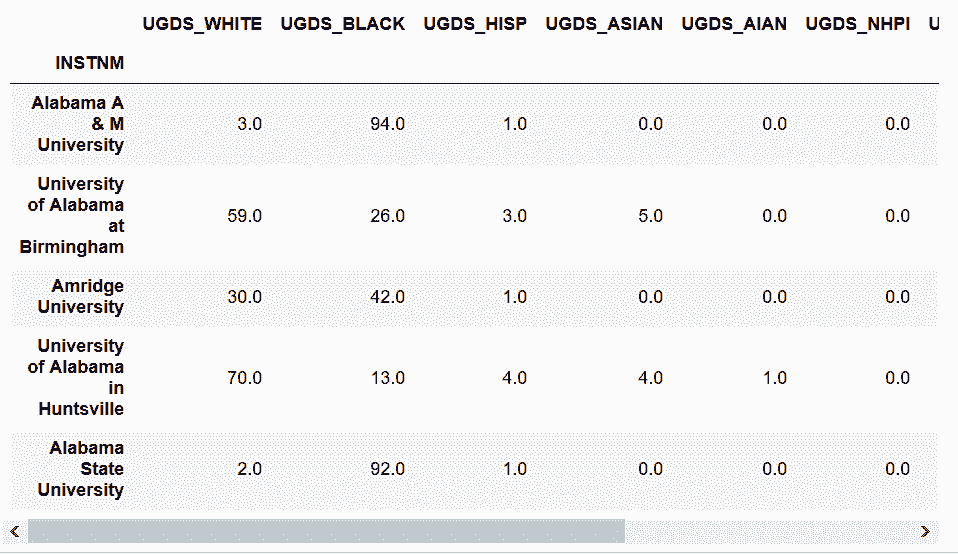

```py
# 再除以100
 In[43]: college_ugds_op_round = (college_ugds_ + .00501) // .01 / 100
         college_ugds_op_round.head()
Out[43]: 
```

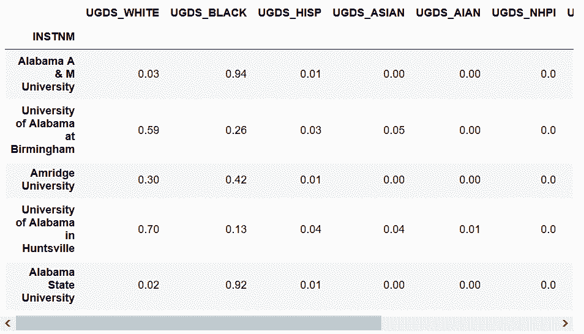

```py
# 保留两位小数
 In[44]: college_ugds_round = (college_ugds_ + .00001).round(2)
         college_ugds_round.head()
Out[44]: 
```

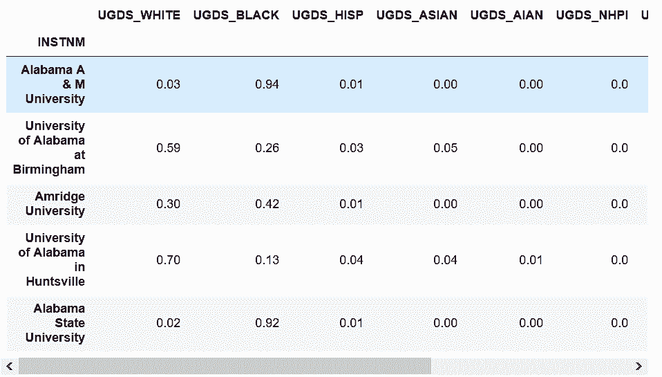

```py
 In[45]: .045 + .005
Out[45]: 0.049999999999999996 
```

```py
 In[46]: college_ugds_op_round.equals(college_ugds_round)
Out[46]: True 
```

### 更多

```py
# DataFrame的通用函数也可以实现上述方法
 In[47]: college_ugds_op_round_methods = college_ugds_.add(.00501).floordiv(.01).div(100) 
```

## 6\. 比较缺失值

```py
# Pandas使用NumPy NaN（np.nan）对象表示缺失值。这是一个不等于自身的特殊对象：
 In[48]: np.nan == np.nan
Out[48]: False 
```

```py
# Python的None对象是等于自身的
 In[49]: None == None
Out[49]: True 
```

```py
# 所有和np.nan的比较都返回False，除了不等于：
 In[50]: 5 > np.nan
Out[50]: False

 In[51]: np.nan > 5
Out[51]: False

 In[52]: 5 != np.nan
Out[52]: True 
```

```py
# college_ugds_所有值和.0019比较，返回布尔值DataFrame
 In[53]: college = pd.read_csv('data/college.csv', index_col='INSTNM')
         college_ugds_ = college.filter(like='UGDS_')
 In[54]: college_ugds_.head() == .0019
Out[54]: 
```

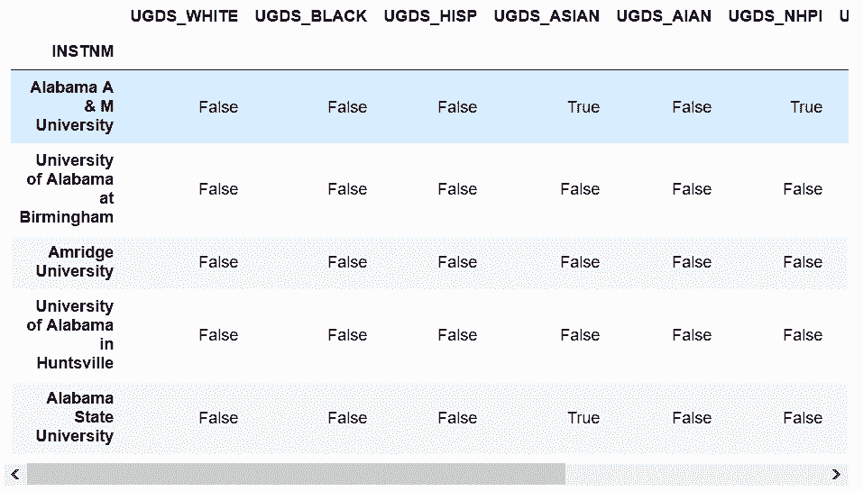

```py
# 用DataFrame和DataFrame进行比较
 In[55]: college_self_compare = college_ugds_ == college_ugds_
         college_self_compare.head()
Out[55]: 
```

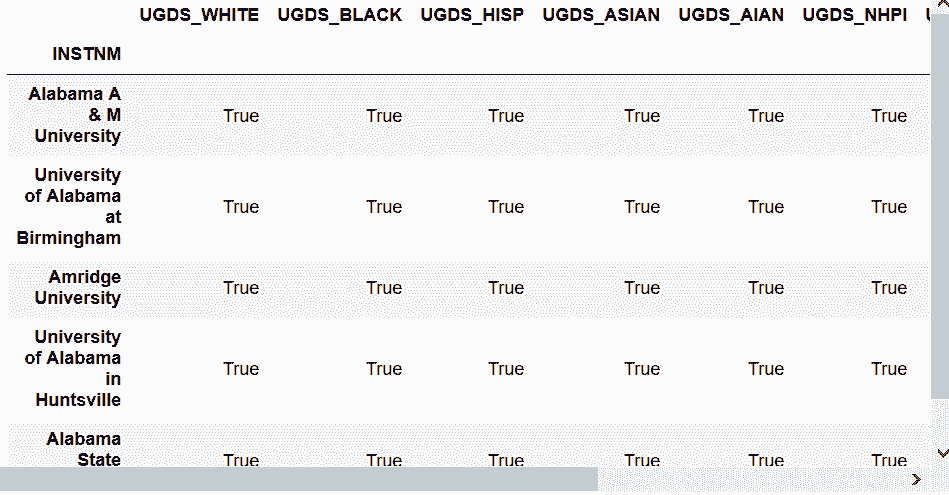

```py
# 用all()检查是否所有的值都是True；这是因为缺失值不互相等于。
 In[56]: college_self_compare.all()
Out[56]: UGDS_WHITE    False
         UGDS_BLACK    False
         UGDS_HISP     False
         UGDS_ASIAN    False
                        ...  
         UGDS_NHPI     False
         UGDS_2MOR     False
         UGDS_NRA      False
         UGDS_UNKN     False
         Length: 9, dtype: bool 
```

```py
# 可以用==号判断，然后求和
 In[57]: (college_ugds_ == np.nan).sum()
Out[57]: UGDS_WHITE    0
         UGDS_BLACK    0
         UGDS_HISP     0
         UGDS_ASIAN    0
                      ..
         UGDS_NHPI     0
         UGDS_2MOR     0
         UGDS_NRA      0
         UGDS_UNKN     0
         Length: 9, dtype: int64 
```

```py
# 统计缺失值最主要方法是使用isnull方法：
 In[58]: college_ugds_.isnull().sum()
Out[58]: UGDS_WHITE    661
         UGDS_BLACK    661
         UGDS_HISP     661
         UGDS_ASIAN    661
                       ... 
         UGDS_NHPI     661
         UGDS_2MOR     661
         UGDS_NRA      661
         UGDS_UNKN     661
         Length: 9, dtype: int64 
```

```py
# 比较两个DataFrame最直接的方法是使用equals()方法
 In[59]: from pandas.testing import assert_frame_equal
 In[60]: assert_frame_equal(college_ugds_, college_ugds_)
Out[60]: True 
```

### 更多

```py
# eq()方法类似于==，和前面的equals有所不同
 In[61]: college_ugds_.eq(.0019).head()
Out[61]: 
```


## 7\. 矩阵转置

```py
 In[62]: college = pd.read_csv('data/college.csv', index_col='INSTNM')
         college_ugds_ = college.filter(like='UGDS_')
         college_ugds_.head()
Out[62]: 
```

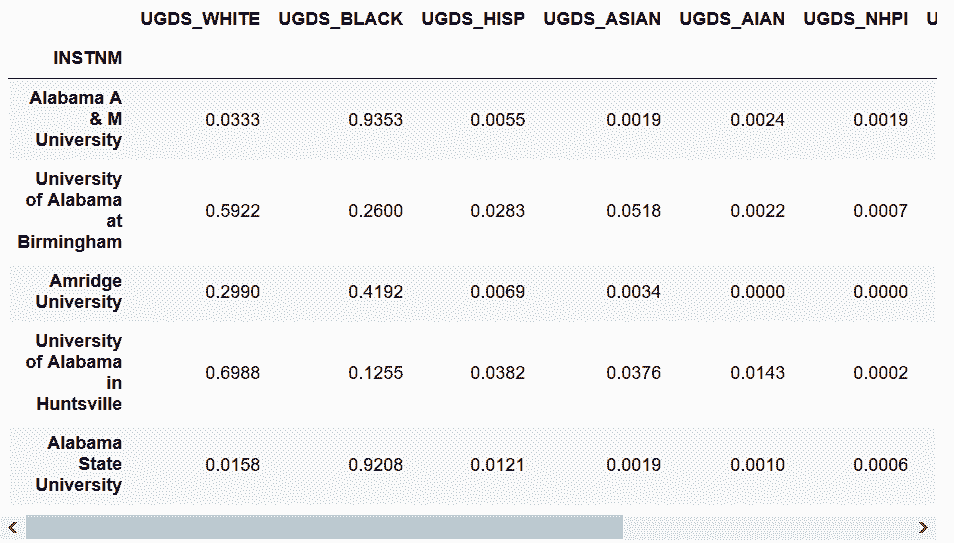

```py
# count()返回非缺失值的个数
 In[63]: college_ugds_.count()
Out[63]: UGDS_WHITE    6874
         UGDS_BLACK    6874
         UGDS_HISP     6874
         UGDS_ASIAN    6874
                       ... 
         UGDS_NHPI     6874
         UGDS_2MOR     6874
         UGDS_NRA      6874
         UGDS_UNKN     6874
         Length: 9, dtype: int64 
```

```py
# axis默认设为0
 In[64]: college_ugds_.count(axis=0)
Out[64]: UGDS_WHITE    6874
         UGDS_BLACK    6874
         UGDS_HISP     6874
         UGDS_ASIAN    6874
                       ... 
         UGDS_NHPI     6874
         UGDS_2MOR     6874
         UGDS_NRA      6874
         UGDS_UNKN     6874
         Length: 9, dtype: int64 
```

```py
# 等价于axis='index'
 In[65]: college_ugds_.count(axis='index')
Out[65]: UGDS_WHITE    6874
         UGDS_BLACK    6874
         UGDS_HISP     6874
         UGDS_ASIAN    6874
                       ... 
         UGDS_NHPI     6874
         UGDS_2MOR     6874
         UGDS_NRA      6874
         UGDS_UNKN     6874
         Length: 9, dtype: int64 
```

```py
# 统计每行的非缺失值个数
 In[66]: college_ugds_.count(axis='columns').head()
Out[66]: INSTNM
         Alabama A & M University               9
         University of Alabama at Birmingham    9
         Amridge University                     9
         University of Alabama in Huntsville    9
         Alabama State University               9
         dtype: int64 
```

```py
# 除了统计每行的非缺失值个数，也可以求和加以确认
 In[67]: college_ugds_.sum(axis='columns').head()
Out[67]: INSTNM
         Alabama A & M University               1.0000
         University of Alabama at Birmingham    0.9999
         Amridge University                     1.0000
         University of Alabama in Huntsville    1.0000
         Alabama State University               1.0000
         dtype: float64 
```

```py
# 用中位数了解每列的分布
 In[68]: college_ugds_.median(axis='index')
Out[68]: UGDS_WHITE    0.55570
         UGDS_BLACK    0.10005
         UGDS_HISP     0.07140
         UGDS_ASIAN    0.01290
                        ...   
         UGDS_NHPI     0.00000
         UGDS_2MOR     0.01750
         UGDS_NRA      0.00000
         UGDS_UNKN     0.01430
         Length: 9, dtype: float64 
```

### 更多

```py
# 使用累积求和cumsum()可以很容易看到白人、黑人、西班牙裔的比例
 In[69]: college_ugds_cumsum = college_ugds_.cumsum(axis=1)
         college_ugds_cumsum.head()
Out[69]: 
```

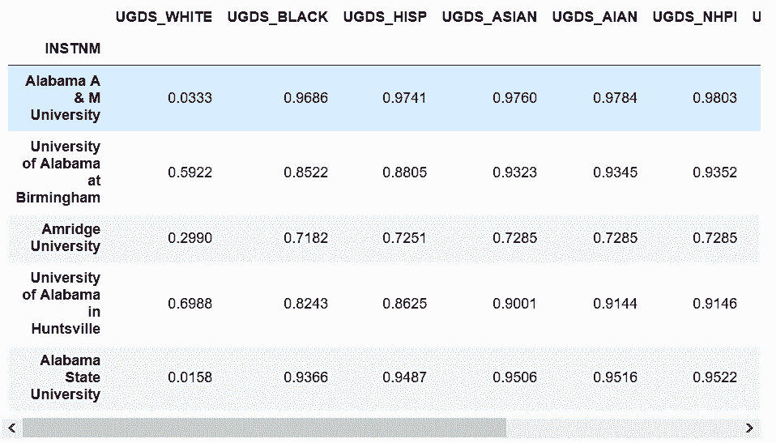

```py
# UGDS_HISP一列降序排列
 In[70]: college_ugds_cumsum.sort_values('UGDS_HISP', ascending=False)
Out[70]: 
```

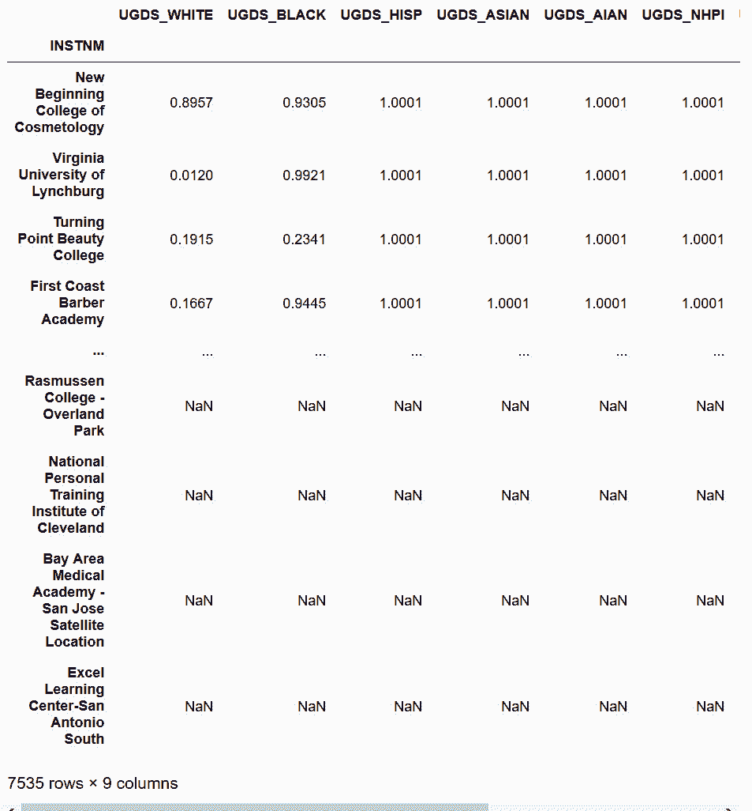

## 8\. 确定大学校园多样性

```py
# US News给出的美国10所最具多样性的大学
 In[71]: pd.read_csv('data/college_diversity.csv', index_col='School')
Out[71]: 
```

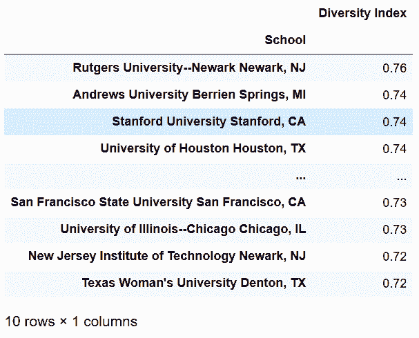

```py
 In[72]: college = pd.read_csv('data/college.csv', index_col='INSTNM')
         college_ugds_ = college.filter(like='UGDS_')
         college_ugds_.head()
Out[72]: 
```

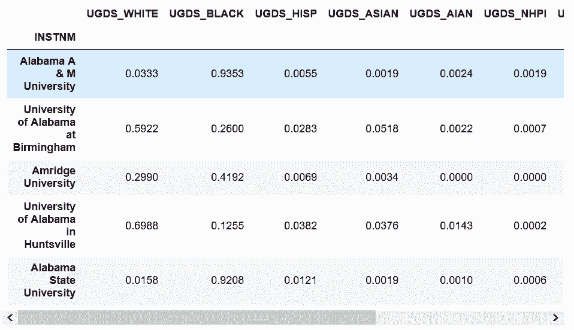

```py
 In[73]: college_ugds_.isnull().sum(axis=1).sort_values(ascending=False).head()
Out[73]: INSTNM
         Excel Learning Center-San Antonio South         9
         Philadelphia College of Osteopathic Medicine    9
         Assemblies of God Theological Seminary          9
         Episcopal Divinity School                       9
         Phillips Graduate Institute                     9
         dtype: int64 
```

```py
# 如果所有列都是缺失值，则将其去除
 In[74]: college_ugds_ = college_ugds_.dropna(how='all')
 In[75]: college_ugds_.isnull().sum()
Out[75]: UGDS_WHITE    0
         UGDS_BLACK    0
         UGDS_HISP     0
         UGDS_ASIAN    0
                       ..
         UGDS_NHPI     0
         UGDS_2MOR     0
         UGDS_NRA      0
         UGDS_UNKN     0
         Length: 9, dtype: int64 
```

```py
# 用大于或等于方法ge()，将DataFrame变为布尔值矩阵
 In[76]: college_ugds_.ge(.15).head()
Out[76]: 
```

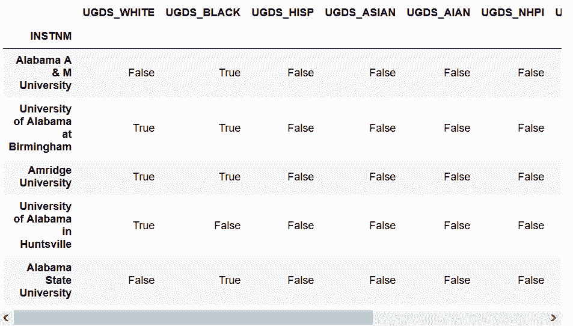

```py
# 对所有True值求和
 In[77]: diversity_metric = college_ugds_.ge(.15).sum(axis='columns')
         diversity_metric.head()
Out[77]: INSTNM
         Alabama A & M University               1
         University of Alabama at Birmingham    2
         Amridge University                     3
         University of Alabama in Huntsville    1
         Alabama State University               1
         dtype: int64 
```

```py
# 使用value_counts()，查看分布情况
 In[78]: diversity_metric.value_counts()
Out[78]: 1    3042
         2    2884
         3     876
         4      63
         0       7
         5       2
         dtype: int64 
```

```py
# 查看哪些学校种群比例超过15%的数量多
 In[79]: diversity_metric.sort_values(ascending=False).head()
Out[79]: INSTNM
         Regency Beauty Institute-Austin          5
         Central Texas Beauty College-Temple      5
         Sullivan and Cogliano Training Center    4
         Ambria College of Nursing                4
         Berkeley College-New York                4
         dtype: int64 
```

```py
# 用loc()方法查看对应行索引的行
 In[80]: college_ugds_.loc[['Regency Beauty Institute-Austin', 
                          'Central Texas Beauty College-Temple']]
Out[80]: 
```

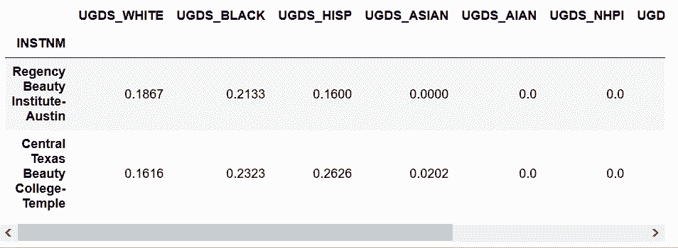

```py
# 查看US News前五所最具多样性的大学在diversity_metric中的情况
 In[81]: us_news_top = ['Rutgers University-Newark', 
               'Andrews University', 
               'Stanford University', 
               'University of Houston',
               'University of Nevada-Las Vegas']
 In[82]: diversity_metric.loc[us_news_top]
Out[82]: INSTNM
         Rutgers University-Newark         4
         Andrews University                3
         Stanford University               3
         University of Houston             3
         University of Nevada-Las Vegas    3
         dtype: int64 
```

### 更多

```py
# 可以用最大种群比例查看哪些学校最不具有多样性
 In[83]: college_ugds_.max(axis=1).sort_values(ascending=False).head(10)
Out[83]: INSTNM
         Dewey University-Manati                               1.0
         Yeshiva and Kollel Harbotzas Torah                    1.0
         Mr Leon's School of Hair Design-Lewiston              1.0
         Dewey University-Bayamon                              1.0
                                                               ... 
         Monteclaro Escuela de Hoteleria y Artes Culinarias    1.0
         Yeshiva Shaar Hatorah                                 1.0
         Bais Medrash Elyon                                    1.0
         Yeshiva of Nitra Rabbinical College                   1.0
         Length: 10, dtype: float64 
```

```py
# 查看Talmudical Seminary Oholei Torah哲学学校
 In[84]: college_ugds_.loc['Talmudical Seminary Oholei Torah']
Out[84]: UGDS_WHITE    1.0
         UGDS_BLACK    0.0
         UGDS_HISP     0.0
         UGDS_ASIAN    0.0
                       ... 
         UGDS_NHPI     0.0
         UGDS_2MOR     0.0
         UGDS_NRA      0.0
         UGDS_UNKN     0.0
         Name: Talmudical Seminary Oholei Torah, Length: 9, dtype: float64 
```

```py
# 查看是否有学校九个种族的比例都超过了1%
 In[85]: (college_ugds_ > .01).all(axis=1).any()
Out[85]: True 
```

