# 第03章 数据分析入门


```py
In[1]: import pandas as pd
       import numpy as np
       from IPython.display import display
       pd.options.display.max_columns = 50 
```

## 1\. 规划数据分析路线

```py
# 读取查看数据
 In[2]: college = pd.read_csv('data/college.csv')
 In[3]: college.head()
Out[3]: 
```

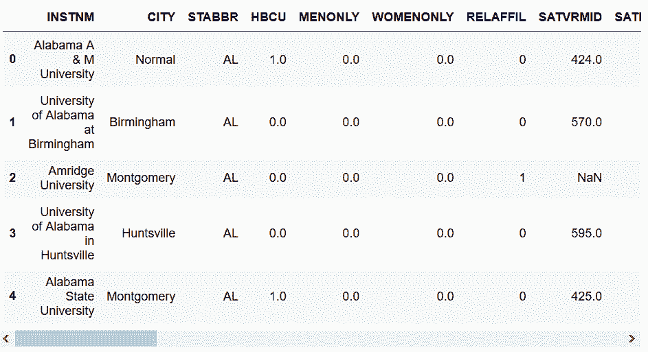

```py
# 数据的行数与列数
 In[4]: college.shape
Out[4]: (7535, 27) 
```

```py
# 统计数值列，并进行转置
 In[5]: with pd.option_context('display.max_rows', 8):
    display(college.describe(include=[np.number]).T)
Out[5]: 
```

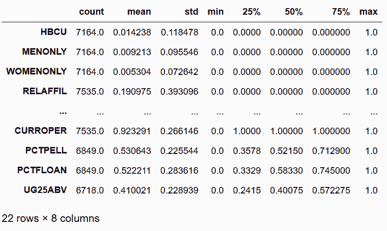

```py
# 统计对象和类型列
 In[6]: college.describe(include=[np.object, pd.Categorical]).T
Out[6]: 
```

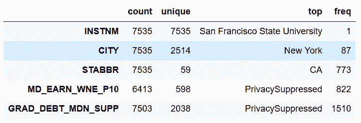

```py
# 列出每列的数据类型，非缺失值的数量，以及内存的使用
 In[7]: college.info()
<class 'pandas.core.frame.DataFrame'>
RangeIndex: 7535 entries, 0 to 7534
Data columns (total 27 columns):
INSTNM                7535 non-null object
CITY                  7535 non-null object
STABBR                7535 non-null object
HBCU                  7164 non-null float64
MENONLY               7164 non-null float64
WOMENONLY             7164 non-null float64
RELAFFIL              7535 non-null int64
SATVRMID              1185 non-null float64
SATMTMID              1196 non-null float64
DISTANCEONLY          7164 non-null float64
UGDS                  6874 non-null float64
UGDS_WHITE            6874 non-null float64
UGDS_BLACK            6874 non-null float64
UGDS_HISP             6874 non-null float64
UGDS_ASIAN            6874 non-null float64
UGDS_AIAN             6874 non-null float64
UGDS_NHPI             6874 non-null float64
UGDS_2MOR             6874 non-null float64
UGDS_NRA              6874 non-null float64
UGDS_UNKN             6874 non-null float64
PPTUG_EF              6853 non-null float64
CURROPER              7535 non-null int64
PCTPELL               6849 non-null float64
PCTFLOAN              6849 non-null float64
UG25ABV               6718 non-null float64
MD_EARN_WNE_P10       6413 non-null object
GRAD_DEBT_MDN_SUPP    7503 non-null object
dtypes: float64(20), int64(2), object(5)
memory usage: 1.6+ MB 
```

```py
# 重复了，但没设置最大行数
 In[8]: college.describe(include=[np.number]).T
Out[8]: 
```

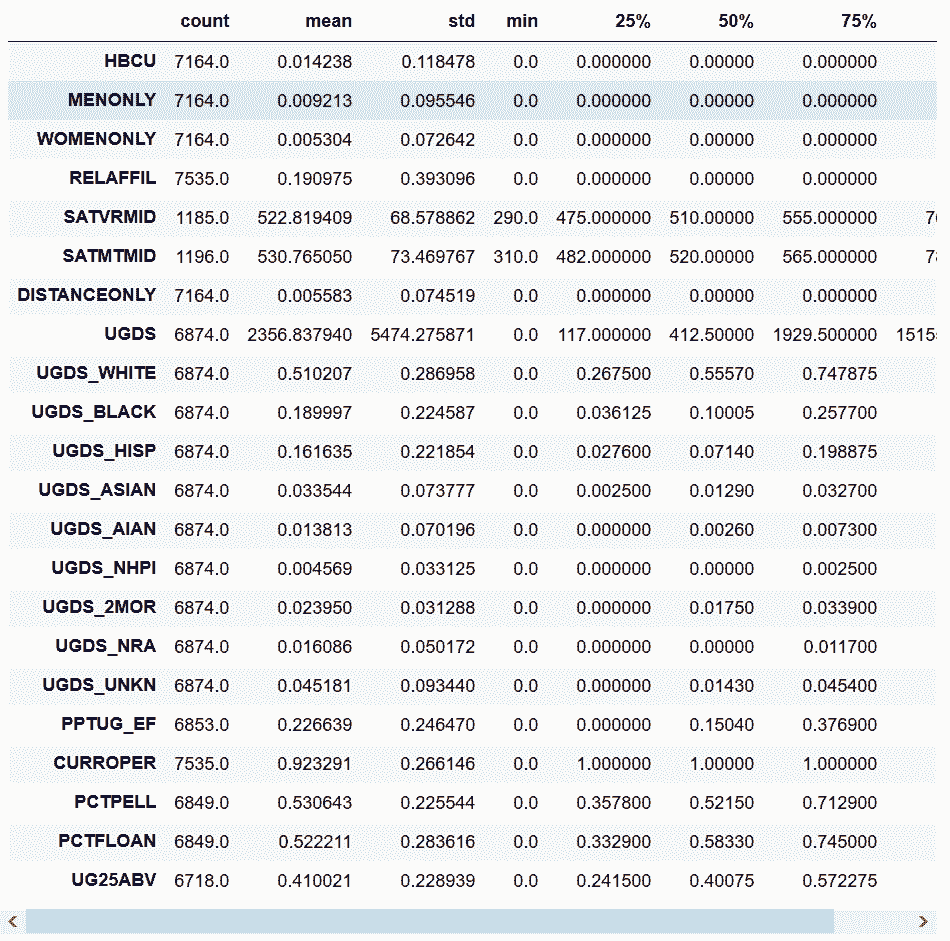

```py
# 和前面重复了
 In[9]: college.describe(include=[np.object, pd.Categorical]).T
Out[9]: 
```

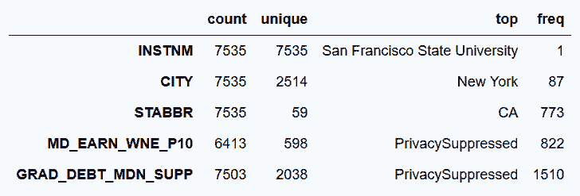

### 更多

```py
# 在describe方法中，打印分位数
 In[10]: with pd.option_context('display.max_rows', 5):
    display(college.describe(include=[np.number], 
                 percentiles=[.01, .05, .10, .25, .5, .75, .9, .95, .99]).T) 
```

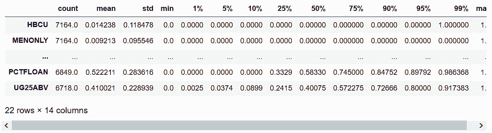

```py
# 展示一个数据字典：数据字典的主要作用是解释列名的意义
 In[11]: college_dd = pd.read_csv('data/college_data_dictionary.csv')
 In[12]: with pd.option_context('display.max_rows', 8):
             display(college_dd) 
```

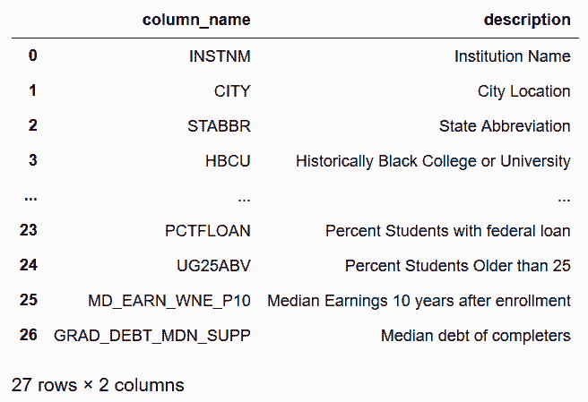

## 2\. 改变数据类型，降低内存消耗

```py
# 选取五列
 In[13]: college = pd.read_csv('data/college.csv')
         different_cols = ['RELAFFIL', 'SATMTMID', 'CURROPER', 'INSTNM', 'STABBR']
         col2 = college.loc[:, different_cols]
         col2.head()
Out[13]: 
```

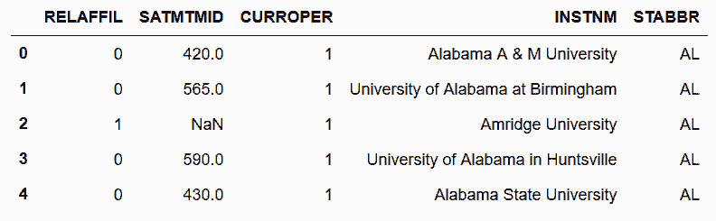

```py
# 查看数据类型
 In[14]: col2.dtypes
Out[14]: RELAFFIL      int64
         SATMTMID    float64
         CURROPER      int64
         INSTNM       object
         STABBR       object
         dtype: object 
```

```py
# 用memory_usage方法查看每列的内存消耗
 In[15]: original_mem = col2.memory_usage(deep=True)
         original_mem
Out[15]: Index           80
         RELAFFIL     60280
         SATMTMID     60280
         CURROPER     60280
         INSTNM      660240
         STABBR      444565
         dtype: int64 
```

```py
# RELAFFIL这列只包含0或1，因此没必要用64位，使用astype方法将其变为8位（1字节）整数
 In[16]: col2['RELAFFIL'] = col2['RELAFFIL'].astype(np.int8)
# 再次查看数据类型
 In[17]: col2.dtypes
Out[17]: RELAFFIL       int8
         SATMTMID    float64
         CURROPER      int64
         INSTNM       object
         STABBR       object
         dtype: object 
```

```py
# 检查两个对象列的独立值的个数
 In[18]: col2.select_dtypes(include=['object']).nunique()
Out[18]: INSTNM    7535
         STABBR      59
         dtype: int64 
```

```py
# STABBR列可以转变为“类型”（Categorical），独立值的个数小于总数的1%
 In[19]: col2['STABBR'] = col2['STABBR'].astype('category')
         col2.dtypes
Out[19]: RELAFFIL        int8
         SATMTMID     float64
         CURROPER       int64
         INSTNM        object
         STABBR      category
         dtype: object 
```

```py
# 再次检查内存的使用
 In[20]: new_mem = col2.memory_usage(deep=True)
         new_mem
Out[20]: Index           80
         RELAFFIL      7535
         SATMTMID     60280
         CURROPER     60280
         INSTNM      660699
         STABBR       13576
         dtype: int64 
```

```py
# 通过和原始数据比较，RELAFFIL列变为了原来的八分之一，STABBR列只有原始大小的3%
 In[21]: new_mem / original_mem
Out[21]: Index       1.000000
         RELAFFIL    0.125000
         SATMTMID    1.000000
         CURROPER    1.000000
         INSTNM      1.000695
         STABBR      0.030538
         dtype: float64 
```

### 更多

```py
# CURROPER和INSTNM分别是int64和对象类型
 In[22]: college = pd.read_csv('data/college.csv')
 In[23]: college[['CURROPER', 'INSTNM']].memory_usage(deep=True)
Out[23]: Index           80
         CURROPER     60280
         INSTNM      660240
         dtype: int64 
```

```py
# CURROPER列加上了10000000，但是内存使用没有变化；但是INSTNM列加上了一个a，内存消耗增加了105字节
 In[24]: college.loc[0, 'CURROPER'] = 10000000
         college.loc[0, 'INSTNM'] = college.loc[0, 'INSTNM'] + 'a'
         # college.loc[1, 'INSTNM'] = college.loc[1, 'INSTNM'] + 'a'
         college[['CURROPER', 'INSTNM']].memory_usage(deep=True)
Out[24]: Index           80
         CURROPER     60280
         INSTNM      660345
         dtype: int64 
```

```py
# 数据字典中的信息显示MENONLY这列只包含0和1，但是由于含有缺失值，它的类型是浮点型
 In[25]: college['MENONLY'].dtype
Out[25]: dtype('float64') 
```

```py
# 任何数值类型的列，只要有一个缺失值，就会成为浮点型；这列中的任何整数都会强制成为浮点型
 In[26]: college['MENONLY'].astype('int8') # ValueError: Cannot convert non-finite values (NA or inf) to integer
---------------------------------------------------------------------------
ValueError                                Traceback (most recent call last)
<ipython-input-26-98afc27c1701> in <module>()
----> 1 college['MENONLY'].astype('int8') # ValueError: Cannot convert non-finite values (NA or inf) to integer

~/anaconda3/lib/python3.6/site-packages/pandas/util/_decorators.py in wrapper(*args, **kwargs)
    116                 else:
    117                     kwargs[new_arg_name] = new_arg_value
--> 118             return func(*args, **kwargs)
    119         return wrapper
    120     return _deprecate_kwarg

~/anaconda3/lib/python3.6/site-packages/pandas/core/generic.py in astype(self, dtype, copy, errors, **kwargs)
   4002         # else, only a single dtype is given
   4003         new_data = self._data.astype(dtype=dtype, copy=copy, errors=errors,
-> 4004                                      **kwargs)
   4005         return self._constructor(new_data).__finalize__(self)
   4006 

~/anaconda3/lib/python3.6/site-packages/pandas/core/internals.py in astype(self, dtype, **kwargs)
   3455 
   3456     def astype(self, dtype, **kwargs):
-> 3457         return self.apply('astype', dtype=dtype, **kwargs)
   3458 
   3459     def convert(self, **kwargs):

~/anaconda3/lib/python3.6/site-packages/pandas/core/internals.py in apply(self, f, axes, filter, do_integrity_check, consolidate, **kwargs)
   3322 
   3323             kwargs['mgr'] = self
-> 3324             applied = getattr(b, f)(**kwargs)
   3325             result_blocks = _extend_blocks(applied, result_blocks)
   3326 

~/anaconda3/lib/python3.6/site-packages/pandas/core/internals.py in astype(self, dtype, copy, errors, values, **kwargs)
    542     def astype(self, dtype, copy=False, errors='raise', values=None, **kwargs):
    543         return self._astype(dtype, copy=copy, errors=errors, values=values,
--> 544                             **kwargs)
    545 
    546     def _astype(self, dtype, copy=False, errors='raise', values=None,

~/anaconda3/lib/python3.6/site-packages/pandas/core/internals.py in _astype(self, dtype, copy, errors, values, klass, mgr, **kwargs)
    623 
    624                 # _astype_nansafe works fine with 1-d only
--> 625                 values = astype_nansafe(values.ravel(), dtype, copy=True)
    626                 values = values.reshape(self.shape)
    627 

~/anaconda3/lib/python3.6/site-packages/pandas/core/dtypes/cast.py in astype_nansafe(arr, dtype, copy)
    685 
    686         if not np.isfinite(arr).all():
--> 687             raise ValueError('Cannot convert non-finite values (NA or inf) to '
    688                              'integer')
    689 

ValueError: Cannot convert non-finite values (NA or inf) to integer 
```

```py
# 对于数据类型，可以替换字符串名：27、28、30、31是等价的
 In[27]: college.describe(include=['int64', 'float64']).T
Out[27]: 
```

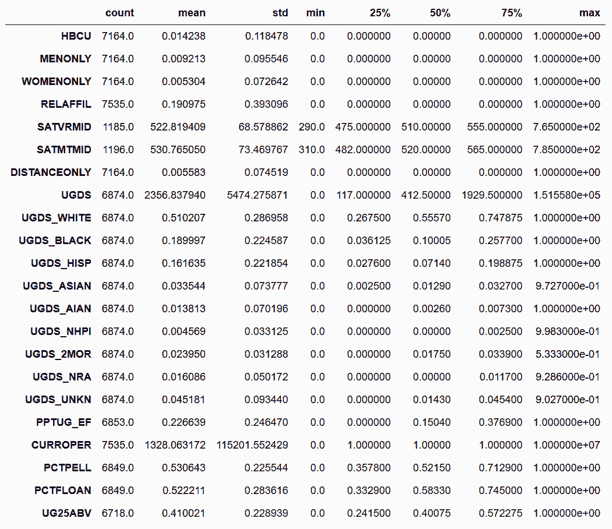

```py
 In[28]: college.describe(include=[np.int64, np.float64]).T
Out[28]: 
```

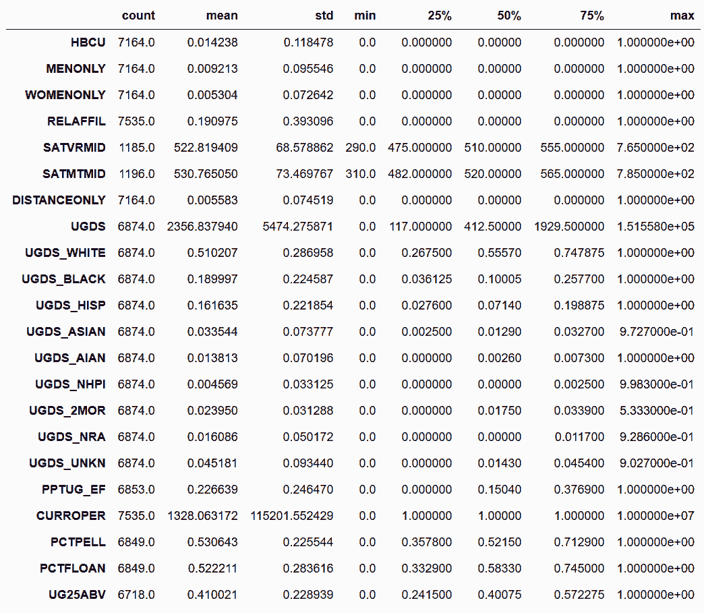

```py
 In[29]: college['RELAFFIL'] = college['RELAFFIL'].astype(np.int8)
 In[30]: college.describe(include=['int', 'float']).T  # defaults to 64 bit int/floats
Out[30]: 
```

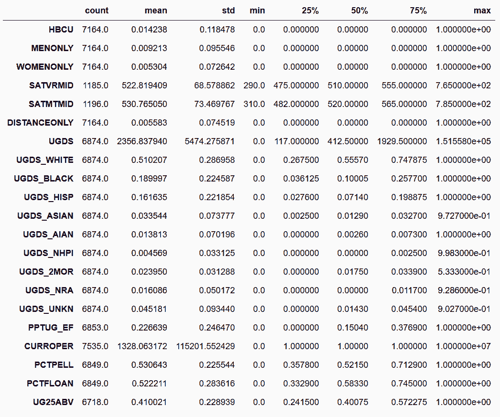

```py
 In[31]: college.describe(include=['number']).T  # also works as the default int/float are 64 bits
Out[31]: 
```

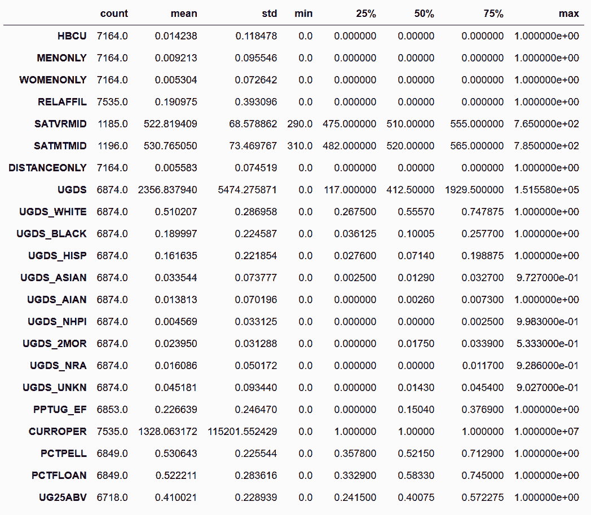

```py
# 转变数据类型时也可以如法炮制
 In[32]: college['MENONLY'] = college['MENONLY'].astype('float16')
         college['RELAFFIL'] = college['RELAFFIL'].astype('int8')
 In[33]: college.index = pd.Int64Index(college.index)
         college.index.memory_usage()
Out[33]: 60280 
```

## 3\. 从最大中选择最小

```py
# 读取movie.csv，选取'movie_title', 'imdb_score', 'budget'三列
 In[34]: movie = pd.read_csv('data/movie.csv')
         movie2 = movie[['movie_title', 'imdb_score', 'budget']]
         movie2.head()
Out[34]: 
```

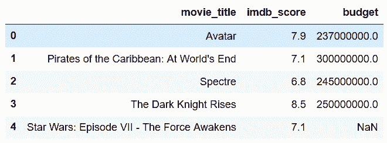

```py
# 用nlargest方法，选出imdb_score分数最高的100个
 In[35]: movie2.nlargest(100, 'imdb_score').head()
Out[35]: 
```

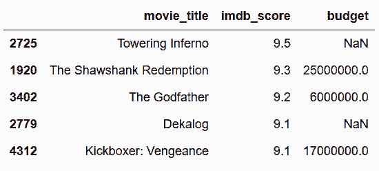

```py
# 用链式操作，nsmallest方法再从中挑出预算最小的五部
 In[36]: movie2.nlargest(100, 'imdb_score').nsmallest(5, 'budget')
Out[36]: 
```

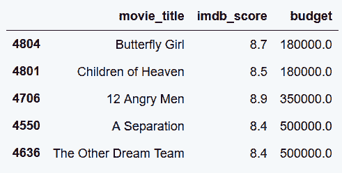

## 4\. 通过排序选取每组的最大值

```py
# 同上，选取出三列。按照title_year降序排列
 In[37]: movie = pd.read_csv('data/movie.csv')
         movie2 = movie[['movie_title', 'title_year', 'imdb_score']]
 In[38]: movie2.sort_values('title_year', ascending=False).head()
Out[38]: 
```

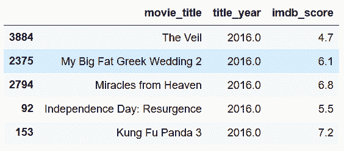

```py
# 用列表同时对两列进行排序
 In[39]: movie3 = movie2.sort_values(['title_year','imdb_score'], ascending=False)
         movie3.head()
Out[39]: 
```

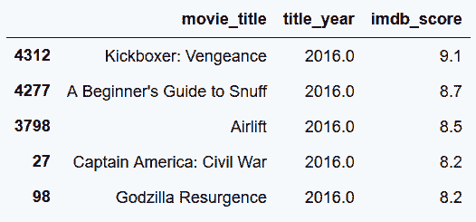

```py
# 用drop_duplicates去重，只保留每年的第一条数据
 In[40]: movie_top_year = movie3.drop_duplicates(subset='title_year')
         movie_top_year.head()
Out[40]: 
```

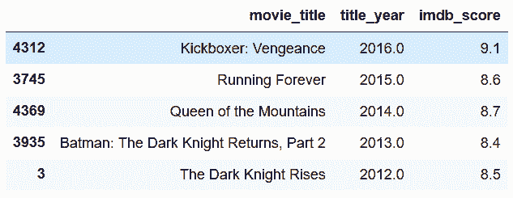

```py
# 通过给ascending设置列表，可以同时对一列降序排列，一列升序排列
 In[41]: movie4 = movie[['movie_title', 'title_year', 'content_rating', 'budget']]
         movie4_sorted = movie4.sort_values(['title_year', 'content_rating', 'budget'], 
                                   ascending=[False, False, True])
         movie4_sorted.drop_duplicates(subset=['title_year', 'content_rating']).head(10)
Out[41]: 
```

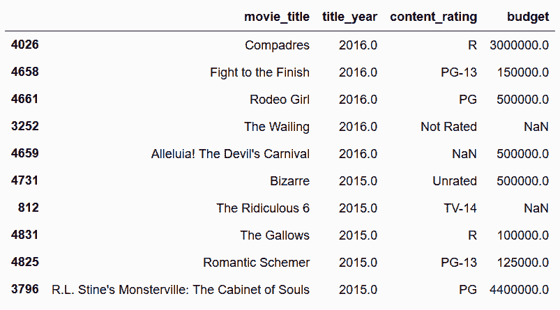

## 5\. 用sort_values复现nlargest方法

```py
# 和前面一样nlargest和nsmallest链式操作进行选取
 In[42]: movie = pd.read_csv('data/movie.csv')
         movie2 = movie[['movie_title', 'imdb_score', 'budget']]
         movie_smallest_largest = movie2.nlargest(100, 'imdb_score').nsmallest(5, 'budget')
         movie_smallest_largest
Out[42]: 
```

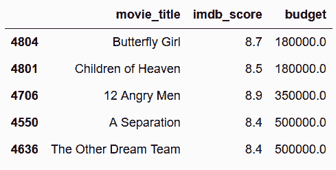

```py
# 用sort_values方法，选取imdb_score最高的100个
 In[43]: movie2.sort_values('imdb_score', ascending=False).head(100).head()
Out[43]: 
# 然后可以再.sort_values('budget').head()，选出预算最低的5个，结果如下 
```


这两种方法得到的最小的5部电影不同，用tail进行调查：

```py
# tail可以查看尾部
 In[45]: movie2.nlargest(100, 'imdb_score').tail()
Out[45]: 
```

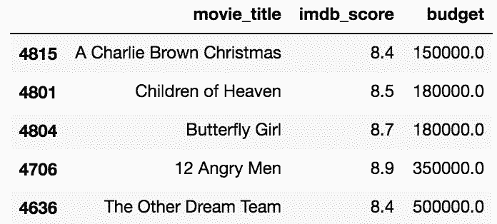

```py
 In[46]: movie2.sort_values('imdb_score', ascending=False).head(100).tail()
Out[46]: 
```

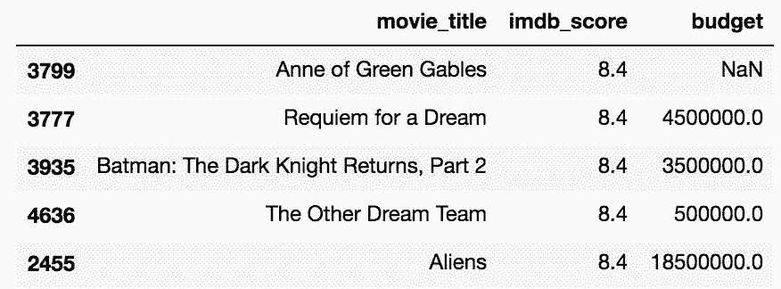

这是因为评分在8.4以上的电影超过了100部。

## 6\. 计算跟踪止损单价格

```py
# pip install pandas_datareader 或 conda install pandas_datareader，来安装pandas_datareader
 In[47]: import pandas_datareader as pdr 
```

> 笔记：pandas_datareader的问题
> pandas_datareader在读取“google”源时会有问题。如果碰到问题，切换到“Yahoo”。

```py
# 查询特斯拉在2017年第一天的股价
 In[49]: tsla = pdr.DataReader('tsla', data_source='yahoo',start='2017-1-1')
         tsla.head(8)
Out[49]: 
```

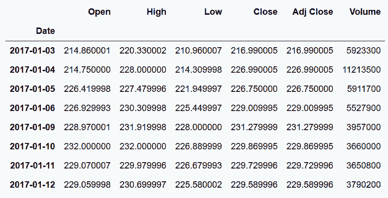

```py
# 只关注每天的收盘价，使用cummax得到迄今为止的收盘价最大值
 In[50]: tsla_close = tsla['Close']
 In[51]: tsla_cummax = tsla_close.cummax()
         tsla_cummax.head(8)
Out[51]: 
```

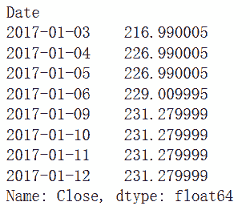

```py
# 将下行区间限制到10%，将tsla_cummax乘以0.9
>>> tsla_trailing_stop = tsla_cummax * .9
>>> tsla_trailing_stop.head(8)
Date
2017-01-03    195.291
2017-01-04    204.291
2017-01-05    204.291
2017-01-06    206.109
2017-01-09    208.152
2017-01-10    208.152
2017-01-11    208.152
2017-01-12    208.152
Name: Close, dtype: float64 
```

### 更多

```py
# 将上述功能包装成一个函数
 In[52]: def set_trailing_loss(symbol, purchase_date, perc):
             close = pdr.DataReader(symbol, 'yahoo', start=purchase_date)['Close']
             return close.cummax() * perc
 In[53]: tsla_cummax = tsla_close.cummax()
         tsla_cummax.head(8)
Out[53]: 
```

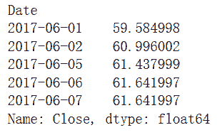

