# 第04章 选取数据子集


```py
In[1]: import pandas as pd
       import numpy as np 
```

## 1\. 选取Series数据

```py
# 读取college数据集，查看CITY的前5行
 In[2]: college = pd.read_csv('data/college.csv', index_col='INSTNM')
        city = college['CITY']
        city.head()
Out[2]: INSTNM
        Alabama A & M University                   Normal
        University of Alabama at Birmingham    Birmingham
        Amridge University                     Montgomery
        University of Alabama in Huntsville    Huntsville
        Alabama State University               Montgomery
        Name: CITY, dtype: object 
```

```py
# iloc可以通过整数选取
 In[3]: city.iloc[3]
Out[3]: 'Huntsville' 
```

```py
# iloc通过整数列表选取多行，返回结果是Series
 In[4]: city.iloc[[10,20,30]]
Out[4]: INSTNM
        Birmingham Southern College                            Birmingham
        George C Wallace State Community College-Hanceville    Hanceville
        Judson College                                             Marion
        Name: CITY, dtype: object 
```

```py
# 选择等分的数据，可以使用切片语法
 In[5]: city.iloc[4:50:10]
Out[5]: INSTNM
        Alabama State University              Montgomery
        Enterprise State Community College    Enterprise
        Heritage Christian University           Florence
        Marion Military Institute                 Marion
        Reid State Technical College           Evergreen
        Name: CITY, dtype: object 
```

```py
# loc只接收行索引标签
 In[6]: city.loc['Heritage Christian University']
Out[6]: 'Florence' 
```

```py
# 随机选择4个标签
 In[7]: np.random.seed(1)
        labels = list(np.random.choice(city.index, 4))
        labels
Out[7]: ['Northwest HVAC/R Training Center',
         'California State University-Dominguez Hills',
         'Lower Columbia College',
         'Southwest Acupuncture College-Boulder'] 
```

```py
# 通过标签列表选择多行
 In[8]: city.loc[labels]
Out[8]: INSTNM
        Northwest HVAC/R Training Center                Spokane
        California State University-Dominguez Hills      Carson
        Lower Columbia College                         Longview
        Southwest Acupuncture College-Boulder           Boulder
        Name: CITY, dtype: object 
```

```py
# 也可以通过切片语法均匀选择多个
 In[9]: city.loc['Alabama State University':'Reid State Technical College':10]
Out[9]: INSTNM
        Alabama State University              Montgomery
        Enterprise State Community College    Enterprise
        Heritage Christian University           Florence
        Marion Military Institute                 Marion
        Reid State Technical College           Evergreen
        Name: CITY, dtype: object 
```

```py
# 也可以不使用loc，直接使用类似Python的语法
 In[10]: city['Alabama State University':'Reid State Technical College':10]
Out[10]: INSTNM
         Alabama State University              Montgomery
         Enterprise State Community College    Enterprise
         Heritage Christian University           Florence
         Marion Military Institute                 Marion
         Reid State Technical College           Evergreen
         Name: CITY, dtype: object 
```

### 更多

```py
# 要想只选取一项，并保留其Series类型，则传入一个只包含一项的列表
 In[11]: city.iloc[[3]]
Out[11]: INSTNM
         University of Alabama in Huntsville    Huntsville
         Name: CITY, dtype: object 
```

```py
# 使用loc切片时要注意，如果start索引再stop索引之后，则会返回空，并且不会报警
 In[12]: city.loc['Reid State Technical College':'Alabama State University':10]
Out[12]: Series([], Name: CITY, dtype: object) 
```

```py
# 也可以切片逆序选取
 In[13]: city.loc['Reid State Technical College':'Alabama State University':-10]
Out[13]: INSTNM
         Reid State Technical College           Evergreen
         Marion Military Institute                 Marion
         Heritage Christian University           Florence
         Enterprise State Community College    Enterprise
         Alabama State University              Montgomery
         Name: CITY, dtype: object 
```

## 2\. 选取DataFrame的行

```py
# 还是读取college数据集
 In[14]: college = pd.read_csv('data/college.csv', index_col='INSTNM')
         college.head()
Out[14]: 
```

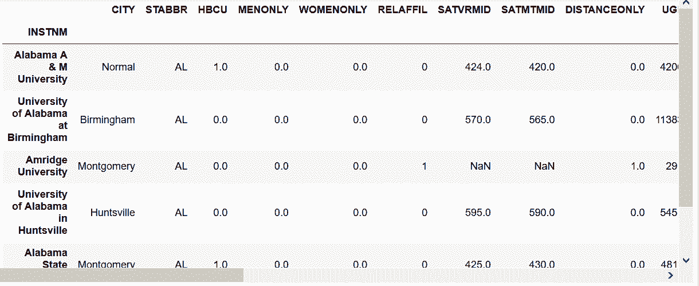

```py
# 选取第61行
 In[15]: pd.options.display.max_rows = 6
 In[16]: college.iloc[60]
Out[16]: 
```

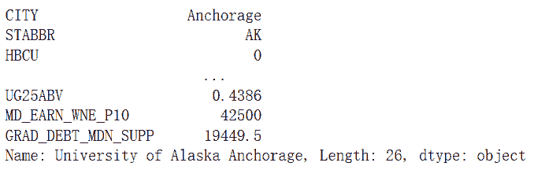

```py
# 也可以通过行标签选取
 In[17]: college.loc['University of Alaska Anchorage']
Out[17]: CITY                  Anchorage
         STABBR                       AK
         HBCU                          0
                                     ...    
         UG25ABV                  0.4386
         MD_EARN_WNE_P10           42500
         GRAD_DEBT_MDN_SUPP      19449.5
         Name: University of Alaska Anchorage, Length: 26, dtype: object 
```

```py
# 选取多个不连续的行
 In[18]: college.iloc[[60, 99, 3]]
Out[18]: 
```

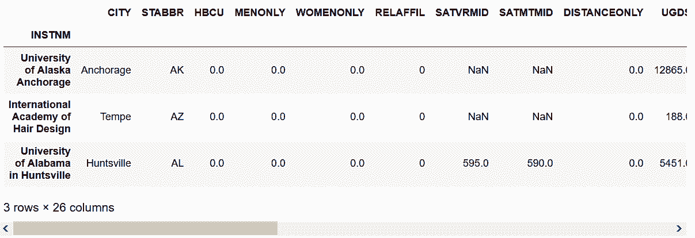

```py
# 也可以用loc加列表来选取
 In[19]: labels = ['University of Alaska Anchorage',
                   'International Academy of Hair Design',
                   'University of Alabama in Huntsville']
         college.loc[labels]
Out[19]: 
```

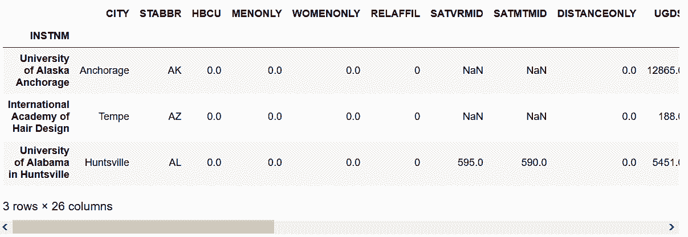

```py
# iloc可以用切片连续选取
 In[20]: college.iloc[99:102]
Out[20]: 
```

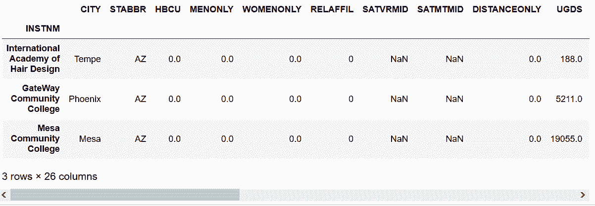

```py
# loc可以用标签连续选取
 In[21]: start = 'International Academy of Hair Design'
         stop = 'Mesa Community College'
         college.loc[start:stop]
Out[21]: 
```

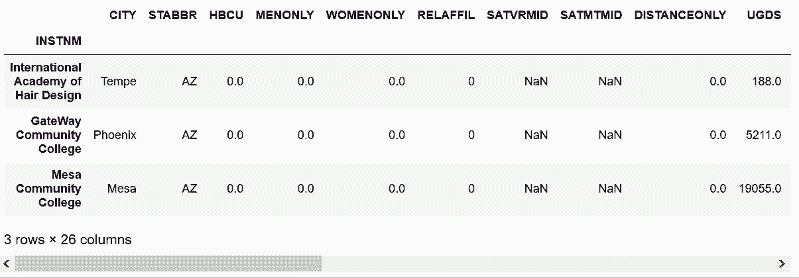

### 更多

```py
# .index.tolist()可以直接提取索引标签，生成一个列表
 In[22]: college.iloc[[60, 99, 3]].index.tolist()
Out[22]: ['University of Alaska Anchorage',
          'International Academy of Hair Design',
          'University of Alabama in Huntsville'] 
```

## 3\. 同时选取DataFrame的行和列

```py
# 读取college数据集，给行索引命名为INSTNM；选取前3行和前4列
 In[23]: college = pd.read_csv('data/college.csv', index_col='INSTNM')
         college.iloc[:3, :4]
Out[23]: 
```

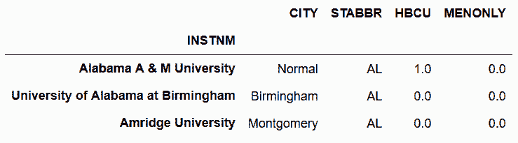

```py
# 用loc实现同上功能
 In[24]: college.loc[:'Amridge University', :'MENONLY']
Out[24]: 
```

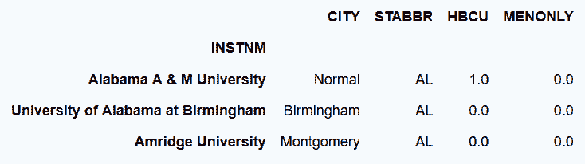

```py
# 选取两列的所有的行
 In[25]: college.iloc[:, [4,6]].head()
Out[25]: 
```

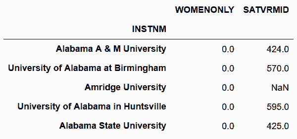

```py
# loc实现同上功能
 In[26]: college.loc[:, ['WOMENONLY', 'SATVRMID']]
Out[26]: 
```

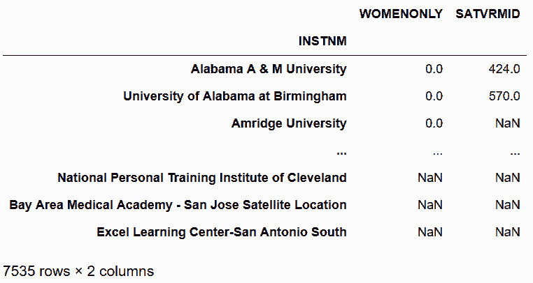

```py
# 选取不连续的行和列
 In[27]: college.iloc[[100, 200], [7, 15]]
Out[27]: 
```

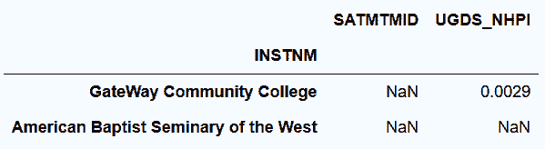

```py
# 用loc和列表，选取不连续的行和列
 In[28]: rows = ['GateWay Community College', 'American Baptist Seminary of the West']
         columns = ['SATMTMID', 'UGDS_NHPI']
         college.loc[rows, columns]
Out[28]: 
```

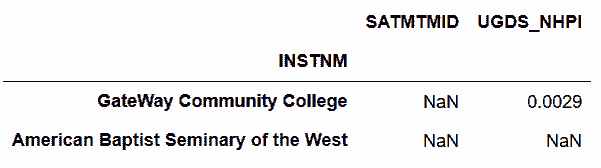

```py
# iloc选取一个标量值
 In[29]: college.iloc[5, -4]
Out[29]: 0.40100000000000002 
```

```py
# loc选取一个标量值
 In[30]: college.loc['The University of Alabama', 'PCTFLOAN']
Out[30]: 0.40100000000000002 
```

```py
# iloc对行切片，并只选取一列
 In[31]: college.iloc[90:80:-2, 5]
Out[31]: INSTNM
         Empire Beauty School-Flagstaff     0
         Charles of Italy Beauty College    0
         Central Arizona College            0
         University of Arizona              0
         Arizona State University-Tempe     0
         Name: RELAFFIL, dtype: int64 
```

```py
# loc对行切片，并只选取一列
 In[32]: start = 'Empire Beauty School-Flagstaff'
         stop = 'Arizona State University-Tempe'
         college.loc[start:stop:-2, 'RELAFFIL']
Out[32]: INSTNM
         Empire Beauty School-Flagstaff     0
         Charles of Italy Beauty College    0
         Central Arizona College            0
         University of Arizona              0
         Arizona State University-Tempe     0
         Name: RELAFFIL, dtype: int64 
```

## 4\. 用整数和标签选取数据

```py
# 读取college数据集，行索引命名为INSTNM
 In[33]: college = pd.read_csv('data/college.csv', index_col='INSTNM')
# 用索引方法get_loc，找到指定列的整数位置
 In[34]: col_start = college.columns.get_loc('UGDS_WHITE')
         col_end = college.columns.get_loc('UGDS_UNKN') + 1
         col_start, col_end
Out[34]: (10, 19)
# 用切片选取连续的列
 In[35]: college.iloc[:5, col_start:col_end]
Out[35]: 
```

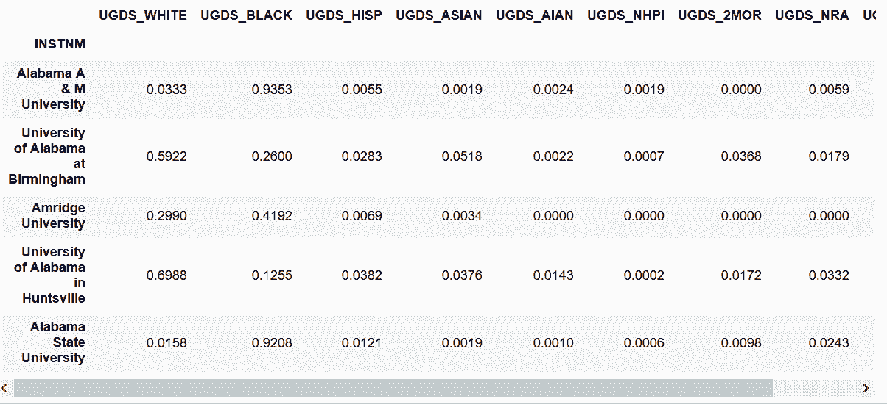

### 更多

```py
# index()方法可以获得整数行对应的标签名
 In[36]: row_start = college.index[10]
         row_end = college.index[15]
         college.loc[row_start:row_end, 'UGDS_WHITE':'UGDS_UNKN']
Out[36]: 
```

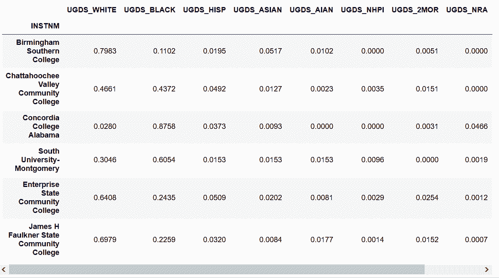

## 5\. 快速选取标量

```py
# 通过将行标签赋值给一个变量，用loc选取
 In[37]: college = pd.read_csv('data/college.csv', index_col='INSTNM')
         cn = 'Texas A & M University-College Station'
         college.loc[cn, 'UGDS_WHITE']
Out[37]: 0.66099999999999992 
```

```py
# at可以实现同样的功能
 In[38]: college.at[cn, 'UGDS_WHITE']
Out[38]: 0.66099999999999992 
```

```py
# 用魔术方法%timeit，对速度进行比较
 In[39]: %timeit college.loc[cn, 'UGDS_WHITE']
Out[39]: 9.93 µs ± 274 ns per loop (mean ± std. dev. of 7 runs, 100000 loops each)
 In[40]: %timeit college.at[cn, 'UGDS_WHITE']
Out[40]: 6.69 µs ± 223 ns per loop (mean ± std. dev. of 7 runs, 100000 loops each) 
```

`.iat`和`.at`只接收标量值，是专门用来取代`.iloc`和`.loc`选取标量的，可以节省大概2.5微秒。

```py
# 用get_loc找到整数位置，再进行速度比较
 In[41]: row_num = college.index.get_loc(cn)
         col_num = college.columns.get_loc('UGDS_WHITE')
 In[42]: row_num, col_num
Out[42]: (3765, 10)

 In[43]: %timeit college.iloc[row_num, col_num]
Out[43]: 11.1 µs ± 426 ns per loop (mean ± std. dev. of 7 runs, 100000 loops each)

 In[44]: %timeit college.iat[row_num, col_num]
Out[44]: 7.47 µs ± 109 ns per loop (mean ± std. dev. of 7 runs, 100000 loops each)

 In[45]: %timeit college.iloc[5, col_num]
Out[45]: 10.8 µs ± 467 ns per loop (mean ± std. dev. of 7 runs, 100000 loops each)

 In[46]: %timeit college.iat[5, col_num]
Out[46]: 7.12 µs ± 297 ns per loop (mean ± std. dev. of 7 runs, 100000 loops each) 
```

### 更多

```py
# Series对象也可以使用.iat和.at选取标量
 In[47]: state = college['STABBR']
 In[48]: state.iat[1000]
Out[48]: 'IL'

 In[49]: state.at['Stanford University']
Out[49]: 'CA' 
```

## 6\. 惰性行切片

```py
# 读取college数据集；从行索引10到20，每隔一个取一行
 In[50]: college = pd.read_csv('data/college.csv', index_col='INSTNM')
         college[10:20:2]
Out[50]: 
```

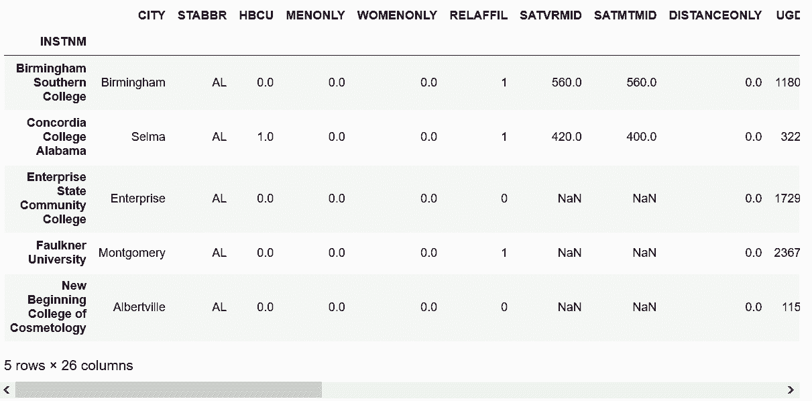

```py
# Series也可以进行同样的切片
 In[51]: city = college['CITY']
         city[10:20:2]
Out[51]: INSTNM
         Birmingham Southern College              Birmingham
         Concordia College Alabama                     Selma
         Enterprise State Community College       Enterprise
         Faulkner University                      Montgomery
         New Beginning College of Cosmetology    Albertville
         Name: CITY, dtype: object 
```

```py
# 查看第4002个行索引标签
 In[52]: college.index[4001]
Out[52]: 'Spokane Community College' 
```

```py
# Series和DataFrame都可以用标签进行切片。下面是对DataFrame用标签切片
 In[53]: start = 'Mesa Community College'
         stop = 'Spokane Community College'
         college[start:stop:1500]
Out[53]: 
```

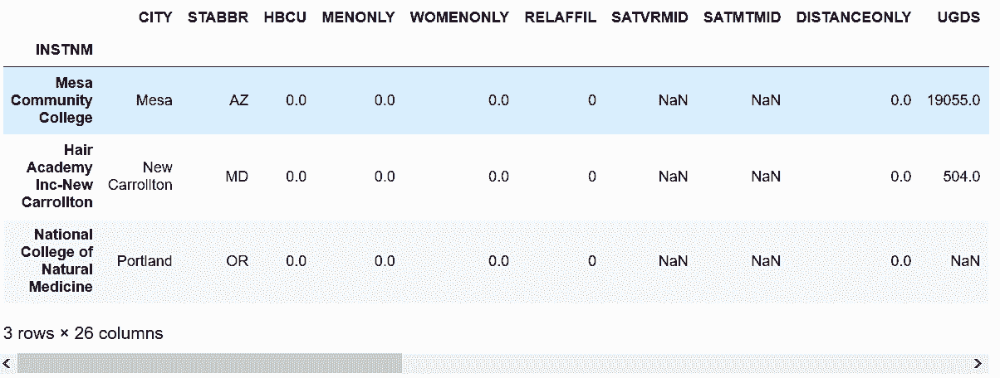

```py
# 下面是对Series用标签切片
 In[54]: city[start:stop:1500]
Out[54]: INSTNM
         Mesa Community College                            Mesa
         Hair Academy Inc-New Carrollton         New Carrollton
         National College of Natural Medicine          Portland
         Name: CITY, dtype: object 
```

### 更多

惰性切片不能用于列，只能用于DataFrame的行和Series，也不能同时选取行和列。

```py
# 下面尝试选取两列，导致错误
 In[55]: college[:10, ['CITY', 'STABBR']]
---------------------------------------------------------------------------
TypeError                                 Traceback (most recent call last)
<ipython-input-55-92538c61bdfa> in <module>()
----> 1 college[:10, ['CITY', 'STABBR']]

/Users/Ted/anaconda/lib/python3.6/site-packages/pandas/core/frame.py in __getitem__(self, key)
   1962             return self._getitem_multilevel(key)
   1963         else:
-> 1964             return self._getitem_column(key)
   1965 
   1966     def _getitem_column(self, key):

/Users/Ted/anaconda/lib/python3.6/site-packages/pandas/core/frame.py in _getitem_column(self, key)
   1969         # get column
   1970         if self.columns.is_unique:
-> 1971             return self._get_item_cache(key)
   1972 
   1973         # duplicate columns & possible reduce dimensionality

/Users/Ted/anaconda/lib/python3.6/site-packages/pandas/core/generic.py in _get_item_cache(self, item)
   1641         """Return the cached item, item represents a label indexer."""
   1642         cache = self._item_cache
-> 1643         res = cache.get(item)
   1644         if res is None:
   1645             values = self._data.get(item)

TypeError: unhashable type: 'slice' 
```

```py
# 只能用.loc和.iloc选取
 In[56]: first_ten_instnm = college.index[:10]
         college.loc[first_ten_instnm, ['CITY', 'STABBR']]
Out[56]: 
```

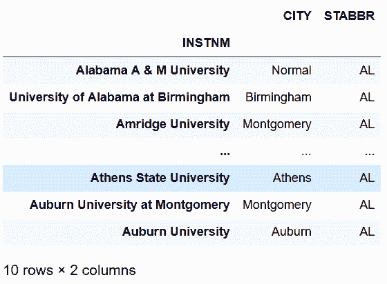

## 7\. 按照字母切片

```py
# 读取college数据集；尝试选取字母顺序在‘Sp’和‘Su’之间的学校
 In[57]: college = pd.read_csv('data/college.csv', index_col='INSTNM')
         college.loc['Sp':'Su']
---------------------------------------------------------------------------
ValueError                                Traceback (most recent call last)
/Users/Ted/anaconda/lib/python3.6/site-packages/pandas/core/indexes/base.py in get_slice_bound(self, label, side, kind)
   3483             try:
-> 3484                 return self._searchsorted_monotonic(label, side)
   3485             except ValueError:

/Users/Ted/anaconda/lib/python3.6/site-packages/pandas/core/indexes/base.py in _searchsorted_monotonic(self, label, side)
   3442 
-> 3443         raise ValueError('index must be monotonic increasing or decreasing')
   3444 

ValueError: index must be monotonic increasing or decreasing

During handling of the above exception, another exception occurred:

KeyError                                  Traceback (most recent call last)
<ipython-input-57-c9f1c69a918b> in <module>()
      1 college = pd.read_csv('data/college.csv', index_col='INSTNM')
----> 2 college.loc['Sp':'Su']

/Users/Ted/anaconda/lib/python3.6/site-packages/pandas/core/indexing.py in __getitem__(self, key)
   1326         else:
   1327             key = com._apply_if_callable(key, self.obj)
-> 1328             return self._getitem_axis(key, axis=0)
   1329 
   1330     def _is_scalar_access(self, key):

/Users/Ted/anaconda/lib/python3.6/site-packages/pandas/core/indexing.py in _getitem_axis(self, key, axis)
   1504         if isinstance(key, slice):
   1505             self._has_valid_type(key, axis)
-> 1506             return self._get_slice_axis(key, axis=axis)
   1507         elif is_bool_indexer(key):
   1508             return self._getbool_axis(key, axis=axis)

/Users/Ted/anaconda/lib/python3.6/site-packages/pandas/core/indexing.py in _get_slice_axis(self, slice_obj, axis)
   1354         labels = obj._get_axis(axis)
   1355         indexer = labels.slice_indexer(slice_obj.start, slice_obj.stop,
-> 1356                                        slice_obj.step, kind=self.name)
   1357 
   1358         if isinstance(indexer, slice):

/Users/Ted/anaconda/lib/python3.6/site-packages/pandas/core/indexes/base.py in slice_indexer(self, start, end, step, kind)
   3348         """
   3349         start_slice, end_slice = self.slice_locs(start, end, step=step,
-> 3350                                                  kind=kind)
   3351 
   3352         # return a slice

/Users/Ted/anaconda/lib/python3.6/site-packages/pandas/core/indexes/base.py in slice_locs(self, start, end, step, kind)
   3536         start_slice = None
   3537         if start is not None:
-> 3538             start_slice = self.get_slice_bound(start, 'left', kind)
   3539         if start_slice is None:
   3540             start_slice = 0

/Users/Ted/anaconda/lib/python3.6/site-packages/pandas/core/indexes/base.py in get_slice_bound(self, label, side, kind)
   3485             except ValueError:
   3486                 # raise the original KeyError
-> 3487                 raise err
   3488 
   3489         if isinstance(slc, np.ndarray):

/Users/Ted/anaconda/lib/python3.6/site-packages/pandas/core/indexes/base.py in get_slice_bound(self, label, side, kind)
   3479         # we need to look up the label
   3480         try:
-> 3481             slc = self._get_loc_only_exact_matches(label)
   3482         except KeyError as err:
   3483             try:

/Users/Ted/anaconda/lib/python3.6/site-packages/pandas/core/indexes/base.py in _get_loc_only_exact_matches(self, key)
   3448         get_slice_bound.
   3449         """
-> 3450         return self.get_loc(key)
   3451 
   3452     def get_slice_bound(self, label, side, kind):

/Users/Ted/anaconda/lib/python3.6/site-packages/pandas/core/indexes/base.py in get_loc(self, key, method, tolerance)
   2442                 return self._engine.get_loc(key)
   2443             except KeyError:
-> 2444                 return self._engine.get_loc(self._maybe_cast_indexer(key))
   2445 
   2446         indexer = self.get_indexer([key], method=method, tolerance=tolerance)

pandas/_libs/index.pyx in pandas._libs.index.IndexEngine.get_loc (pandas/_libs/index.c:5280)()

pandas/_libs/index.pyx in pandas._libs.index.IndexEngine.get_loc (pandas/_libs/index.c:5126)()

pandas/_libs/hashtable_class_helper.pxi in pandas._libs.hashtable.PyObjectHashTable.get_item (pandas/_libs/hashtable.c:20523)()

pandas/_libs/hashtable_class_helper.pxi in pandas._libs.hashtable.PyObjectHashTable.get_item (pandas/_libs/hashtable.c:20477)()

KeyError: 'Sp' 
```

```py
# 对college进行排序
 In[58]: college = college.sort_index()
 In[59]: college = college.head()
Out[59]: 
```

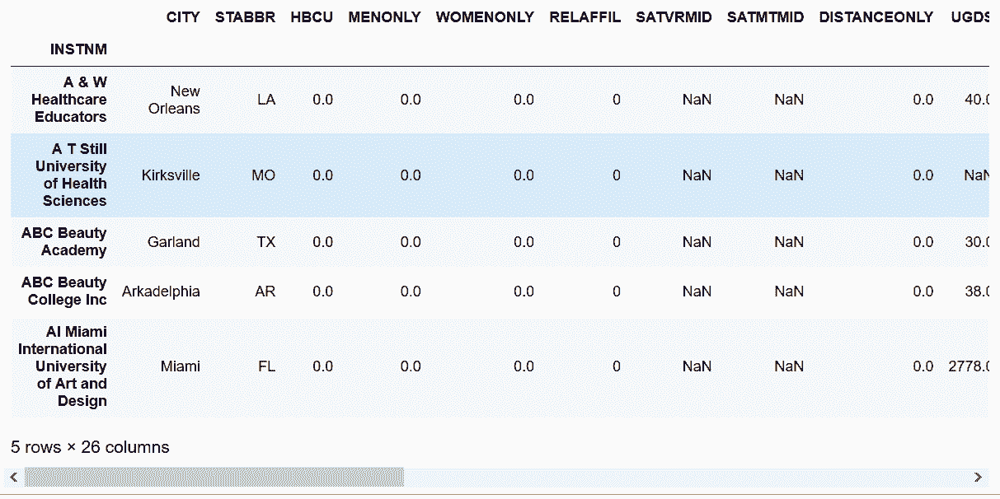

```py
# 再尝试选取字母顺序在‘Sp’和‘Su’之间的学校
 In[60]: pd.options.display.max_rows = 6
 In[61]: college.loc['Sp':'Su']
Out[61]: 
```

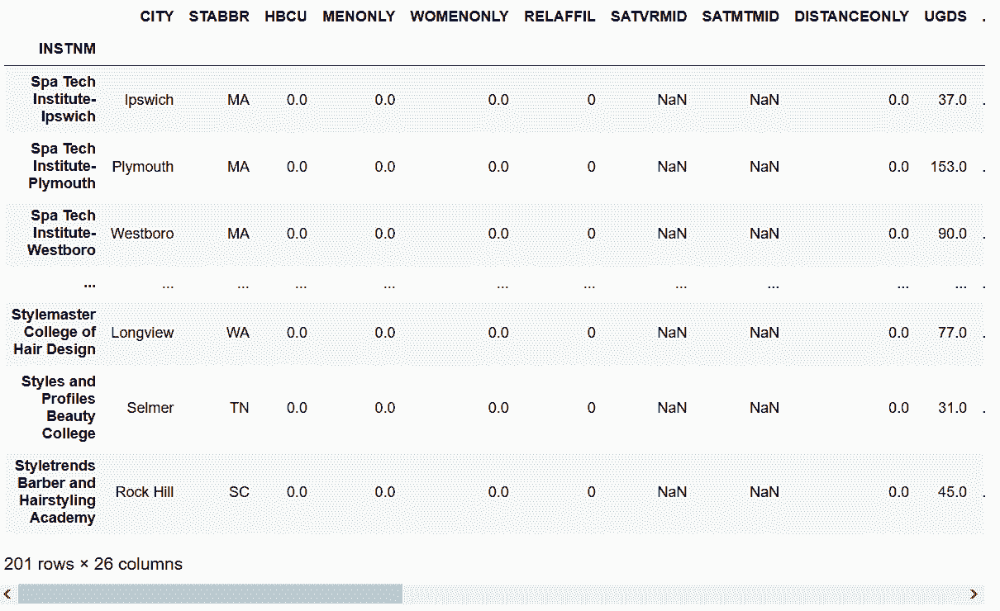

```py
# 可以用is_monotonic_increasing或is_monotonic_decreasing检测字母排序的顺序
 In[62]: college = college.sort_index(ascending=False)
         college.index.is_monotonic_decreasing
Out[62]: True 
```

```py
# 字母逆序选取
 In[63]: college.loc['E':'B']
Out[63]: 
```

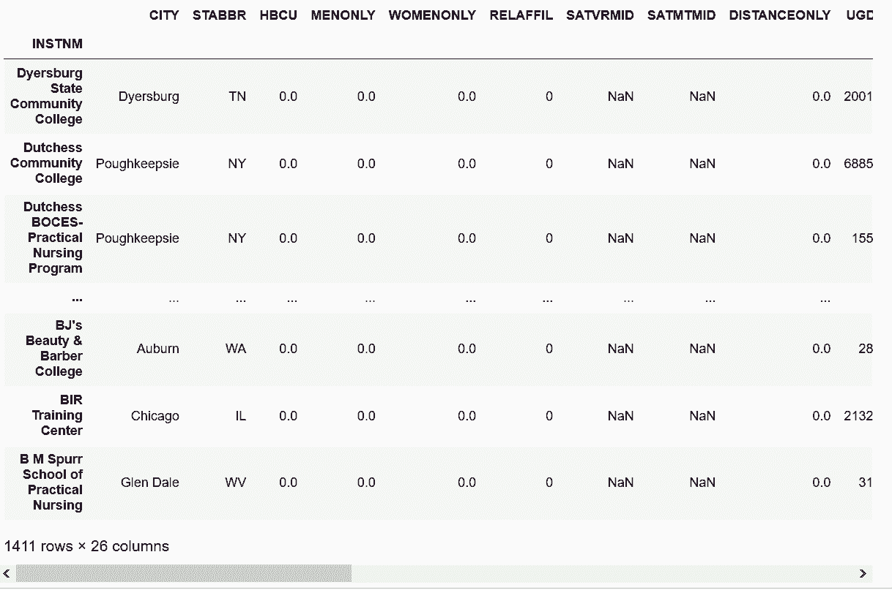

