# 第05章 布尔索引


```py
 In[1]: import pandas as pd
        import numpy as np
        import matplotlib.pyplot as plt

        %matplotlib inline 
```

## 1\. 计算布尔值统计信息

```py
# 读取movie，设定行索引是movie_title
 In[2]: pd.options.display.max_columns = 50
 In[3]: movie = pd.read_csv('data/movie.csv', index_col='movie_title')
        movie.head()
Out[3]: 
```

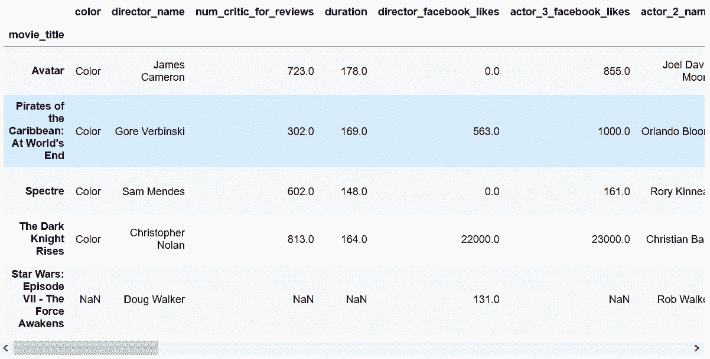

```py
# 判断电影时长是否超过两小时
 In[4]: movie_2_hours = movie['duration'] > 120
        movie_2_hours.head(10)
Out[4]: movie_title
        Avatar                                         True
        Pirates of the Caribbean: At World's End       True
        Spectre                                        True
        The Dark Knight Rises                          True
        Star Wars: Episode VII - The Force Awakens    False
        John Carter                                    True
        Spider-Man 3                                   True
        Tangled                                       False
        Avengers: Age of Ultron                        True
        Harry Potter and the Half-Blood Prince         True
        Name: duration, dtype: bool 
```

```py
# 有多少时长超过两小时的电影
 In[5]: movie_2_hours.sum()
Out[5]: 1039 
```

```py
# 超过两小时的电影的比例
 In[6]: movie_2_hours.mean()
Out[6]: 0.21135069161920261 
```

```py
# 用describe()输出一些该布尔Series信息
 In[7]: movie_2_hours.describe()
Out[7]: count      4916
        unique        2
        top       False
        freq       3877
        Name: duration, dtype: object 
```

```py
# 实际上，dureation这列是有缺失值的，要想获得真正的超过两小时的电影的比例，需要先删掉缺失值
 In[8]: movie['duration'].dropna().gt(120).mean()
Out[8]: 0.21199755152009794 
```

### 原理

```py
# 统计False和True值的比例
 In[9]: movie_2_hours.value_counts(normalize=True)
Out[9]: False    0.788649
        True     0.211351
        Name: duration, dtype: float64 
```

### 更多

```py
# 比较同一个DataFrame中的两列
 In[10]: actors = movie[['actor_1_facebook_likes', 'actor_2_facebook_likes']].dropna()
         (actors['actor_1_facebook_likes'] > actors['actor_2_facebook_likes']).mean()
Out[10]: 0.97776871303283708 
```

## 2\. 构建多个布尔条件

```py
 In[11]: movie = pd.read_csv('data/movie.csv', index_col='movie_title')
         movie.head()
Out[11]: 
```

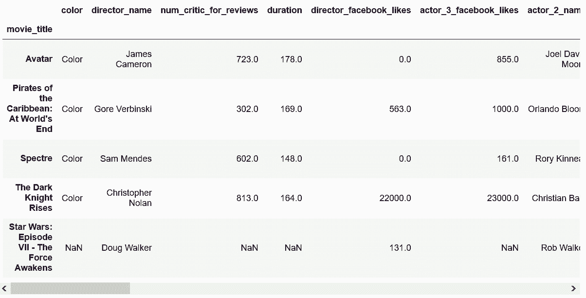

```py
# 创建多个布尔条件
 In[12]: criteria1 = movie.imdb_score > 8
         criteria2 = movie.content_rating == 'PG-13'
         criteria3 = (movie.title_year < 2000) | (movie.title_year >= 2010)
         criteria2.head()
Out[12]: movie_title
         Avatar                                         True
         Pirates of the Caribbean: At World's End       True
         Spectre                                        True
         The Dark Knight Rises                          True
         Star Wars: Episode VII - The Force Awakens    False
         Name: content_rating, dtype: bool 
```

```py
# 将这些布尔条件合并成一个
 In[13]: criteria_final = criteria1 & criteria2 & criteria3
         criteria_final.head()
Out[13]: movie_title
         Avatar                                         False
         Pirates of the Caribbean: At World's End       False
         Spectre                                        False
         The Dark Knight Rises                          True
         Star Wars: Episode VII - The Force Awakens     False
         Name: content_rating, dtype: bool 
```

### 更多

```py
# 在Pandas中，位运算符（&, |, ~）的优先级高于比较运算符，因此如过前面的条件3不加括号，就会报错
 In[14]: movie.title_year < 2000 | movie.title_year > 2009
---------------------------------------------------------------------------
TypeError                                 Traceback (most recent call last)
/Users/Ted/anaconda/lib/python3.6/site-packages/pandas/core/ops.py in na_op(x, y)
    882         try:
--> 883             result = op(x, y)
    884         except TypeError:

/Users/Ted/anaconda/lib/python3.6/site-packages/pandas/core/ops.py in <lambda>(x, y)
    130                                    names('rand_'), op('&')),
--> 131                  ror_=bool_method(lambda x, y: operator.or_(y, x),
    132                                   names('ror_'), op('|')),

TypeError: ufunc 'bitwise_or' not supported for the input types, and the inputs could not be safely coerced to any supported types according to the casting rule ''safe''

During handling of the above exception, another exception occurred:

ValueError                                Traceback (most recent call last)
/Users/Ted/anaconda/lib/python3.6/site-packages/pandas/core/ops.py in na_op(x, y)
    900                         y = bool(y)
--> 901                     result = lib.scalar_binop(x, y, op)
    902                 except:

pandas/_libs/lib.pyx in pandas._libs.lib.scalar_binop (pandas/_libs/lib.c:15035)()

ValueError: Buffer dtype mismatch, expected 'Python object' but got 'double'

During handling of the above exception, another exception occurred:

TypeError                                 Traceback (most recent call last)
<ipython-input-14-1e7ee3f1401c> in <module>()
----> 1 movie.title_year < 2000 | movie.title_year > 2009

/Users/Ted/anaconda/lib/python3.6/site-packages/pandas/core/ops.py in wrapper(self, other)
    933                       is_integer_dtype(np.asarray(other)) else fill_bool)
    934             return filler(self._constructor(
--> 935                 na_op(self.values, other),
    936                 index=self.index)).__finalize__(self)
    937 

/Users/Ted/anaconda/lib/python3.6/site-packages/pandas/core/ops.py in na_op(x, y)
    903                     raise TypeError("cannot compare a dtyped [{0}] array with "
    904                                     "a scalar of type [{1}]".format(
--> 905                                         x.dtype, type(y).__name__))
    906 
    907         return result

TypeError: cannot compare a dtyped [float64] array with a scalar of type [bool] 
```

## 3\. 用布尔索引过滤

```py
# 读取movie数据集，创建布尔条件
 In[15]: movie = pd.read_csv('data/movie.csv', index_col='movie_title')

         crit_a1 = movie.imdb_score > 8
         crit_a2 = movie.content_rating == 'PG-13'
         crit_a3 = (movie.title_year < 2000) | (movie.title_year > 2009)
         final_crit_a = crit_a1 & crit_a2 & crit_a3
# 创建第二个布尔条件
 In[16]: crit_b1 = movie.imdb_score < 5
         crit_b2 = movie.content_rating == 'R'
         crit_b3 = (movie.title_year >= 2000) & (movie.title_year <= 2010)
         final_crit_b = crit_b1 & crit_b2 & crit_b3
# 将这两个条件用或运算合并起来
 In[17]: final_crit_all = final_crit_a | final_crit_b
         final_crit_all.head()
Out[17]: movie_title
         Avatar                                        False
         Pirates of the Caribbean: At World's End      False
         Spectre                                       False
         The Dark Knight Rises                          True
         Star Wars: Episode VII - The Force Awakens    False
         dtype: bool 
```

```py
# 用最终的布尔条件过滤数据
 In[18]: movie[final_crit_all].head()
Out[18]: 
```


```py
# 使用loc，对指定的列做过滤操作，可以清楚地看到过滤是否起作用
 In[19]: cols = ['imdb_score', 'content_rating', 'title_year']
         movie_filtered = movie.loc[final_crit_all, cols]
         movie_filtered.head(10)
Out[19]: 
```


### 更多

```py
# 用一个长布尔表达式代替前面由短表达式生成的布尔条件
 In[21]: final_crit_a2 = (movie.imdb_score > 8) & \
                         (movie.content_rating == 'PG-13') & \
                         ((movie.title_year < 2000) | (movie.title_year > 2009))
         final_crit_a2.equals(final_crit_a)
Out[21]: 
```

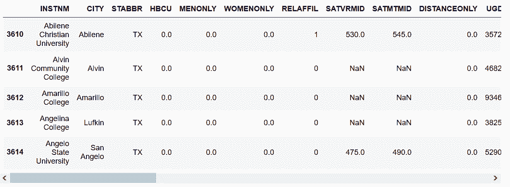

## 4\. 用标签索引代替布尔索引

```py
# 用布尔索引选取所有得克萨斯州的学校
>>> college = pd.read_csv('data/college.csv')
>>> college[college['STABBR'] == 'TX'].head() 
```

```py
# 用STABBR作为行索引，然后用loc选取
 In[22]: college2 = college.set_index('STABBR')
         college2.loc['TX'].head()
Out[22]: 
```

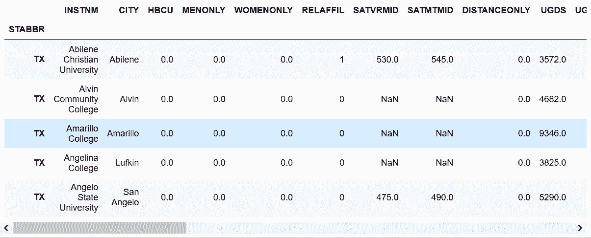

```py
# 比较二者的速度
 In[23]: %timeit college[college['STABBR'] == 'TX']
         1.51 ms ± 51.4 µs per loop (mean ± std. dev. of 7 runs, 1000 loops each)

 In[24]: %timeit college2.loc['TX']
         604 µs ± 23.9 µs per loop (mean ± std. dev. of 7 runs, 1000 loops each) 
```

```py
# 使用STABBR作为行索引所用的时间
 In[25]: %timeit college2 = college.set_index('STABBR')
         1.28 ms ± 47.5 µs per loop (mean ± std. dev. of 7 runs, 1000 loops each) 
```

### 更多

```py
# 使用布尔索引和标签选取多列
 In[26]: states =['TX', 'CA', 'NY']
         college[college['STABBR'].isin(states)]
         college2.loc[states].head()
Out[26]: 
```

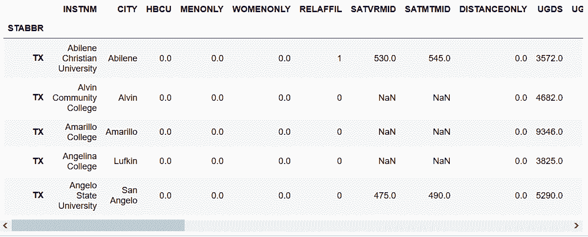

## 5\. 用唯一和有序索引选取

```py
# 读取college数据集，使用STABBR作为行索引，检查行索引是否有序
 In[27]: college = pd.read_csv('data/college.csv')
         college2 = college.set_index('STABBR')
 In[28]: college2.index.is_monotonic
Out[28]: False 
```

```py
# 将college2排序，存储成另一个对象，查看其是否有序
 In[29]: college3 = college2.sort_index()
         college3.index.is_monotonic
Out[29]: True 
```

```py
# 从这三个DataFrame选取得克萨斯州，比较速度
 In[30]: %timeit college[college['STABBR'] == 'TX']
         1.58 ms ± 63.8 µs per loop (mean ± std. dev. of 7 runs, 1000 loops each)

 In[31]: %timeit college2.loc['TX']
         622 µs ± 18.1 µs per loop (mean ± std. dev. of 7 runs, 1000 loops each)

 In[32]: %timeit college3.loc['TX']
         198 µs ± 5.8 µs per loop (mean ± std. dev. of 7 runs, 1000 loops each) 
```

```py
# 使用INSTNM作为行索引，检测行索引是否唯一
 In[33]: college_unique = college.set_index('INSTNM')
         college_unique.index.is_unique
Out[33]: True 
```

```py
# 用布尔索引选取斯坦福大学
 In[34]: college[college['INSTNM'] == 'Stanford University']
Out[34]: 
```

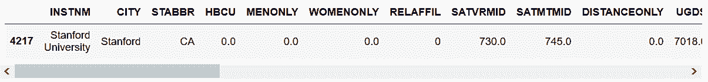

```py
# 用行索引标签选取斯坦福大学
 In[35]: college_unique.loc['Stanford University']
Out[35]: 
CITY                  Stanford
STABBR                      CA
HBCU                         0
MENONLY                      0
WOMENONLY                    0
RELAFFIL                     0
SATVRMID                   730
SATMTMID                   745
DISTANCEONLY                 0
UGDS                      7018
UGDS_WHITE              0.3752
UGDS_BLACK              0.0591
UGDS_HISP               0.1607
UGDS_ASIAN              0.1979
UGDS_AIAN               0.0114
UGDS_NHPI               0.0038
UGDS_2MOR               0.1067
UGDS_NRA                0.0819
UGDS_UNKN               0.0031
PPTUG_EF                     0
CURROPER                     1
PCTPELL                 0.1556
PCTFLOAN                0.1256
UG25ABV                 0.0401
MD_EARN_WNE_P10          86000
GRAD_DEBT_MDN_SUPP       12782
Name: Stanford University, dtype: object 
```

```py
# 比较两种方法的速度
 In[36]: %timeit college[college['INSTNM'] == 'Stanford University']
         1.44 ms ± 66 µs per loop (mean ± std. dev. of 7 runs, 1000 loops each)

 In[37]: %timeit college_unique.loc['Stanford University']
         191 µs ± 5.31 µs per loop (mean ± std. dev. of 7 runs, 10000 loops each) 
```

### 更多

```py
# 使用CITY和STABBR两列作为行索引，并进行排序
 In[38]: college.index = college['CITY'] + ', ' + college['STABBR']
         college = college.sort_index()
         college.head()
Out[38]: 
```

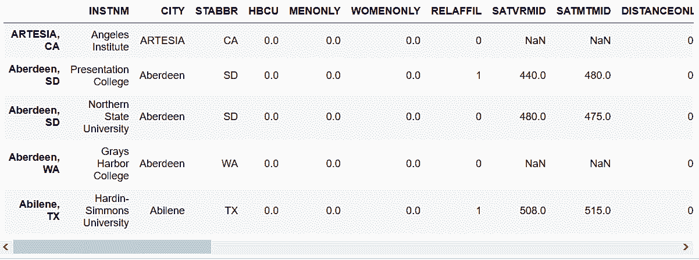

```py
# 选取所有Miami, FL的大学
 In[39]: college.loc['Miami, FL'].head()
Out[39]: 
```

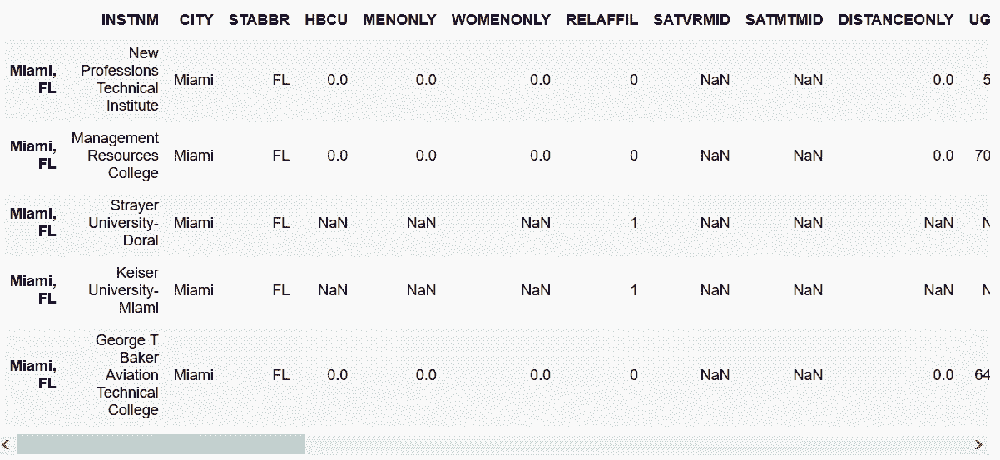

```py
# 速度比较
 In[40]: %%timeit 
         crit1 = college['CITY'] == 'Miami' 
         crit2 = college['STABBR'] == 'FL'
         college[crit1 & crit2]
         2.83 ms ± 82.4 µs per loop (mean ± std. dev. of 7 runs, 100 loops each)

 In[41]: %timeit college.loc['Miami, FL']
         226 µs ± 17.3 µs per loop (mean ± std. dev. of 7 runs, 1000 loops each) 
```

```py
# 判断这两个条件是否相同
 In[42]: college[(college['CITY'] == 'Miami') & (college['STABBR'] == 'FL')].equals(college.loc['Miami, FL'])
Out[42]: True 
```

## 6\. 观察股价

```py
# 读取Schlumberger stock数据集，行索引设为Date列，并将其转变为DatetimeIndex
 In[43]: slb = pd.read_csv('data/slb_stock.csv', index_col='Date', parse_dates=['Date'])
         slb.head()
Out[43]: 
```

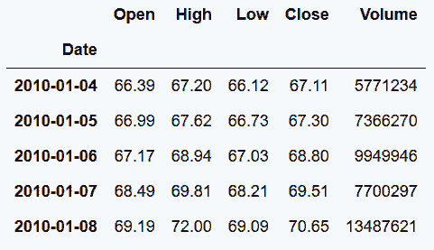

```py
# 选取Close这列，用describe返回统计信息
 In[44]: slb_close = slb['Close']
         slb_summary = slb_close.describe(percentiles=[.1, .9])
         slb_summary
Out[44]: count    1895.000000
         mean       79.121905
         std        11.767802
         min        51.750000
         10%        64.892000
         50%        78.000000
         90%        93.248000
         max       117.950000
         Name: Close, dtype: float64 
```

```py
# 用布尔索引选取最高和最低10%的收盘价
 In[45]: upper_10 = slb_summary.loc['90%']
         lower_10 = slb_summary.loc['10%']
         criteria = (slb_close < lower_10) | (slb_close > upper_10)
         slb_top_bottom_10 = slb_close[criteria]
# 过滤出的数据使用灰色，所有的收盘价使用黑色，用matplotlib在十分之一和十分之九分位数位置画横线
 In[46]: slb_close.plot(color='black', figsize=(12,6))
         slb_top_bottom_10.plot(marker='o', style=' ', ms=4, color='lightgray')

         xmin = criteria.index[0]
         xmax = criteria.index[-1]
         plt.hlines(y=[lower_10, upper_10], xmin=xmin, xmax=xmax,color='black')
Out[46]: <matplotlib.collections.LineCollection at 0x1174b3278> 
```

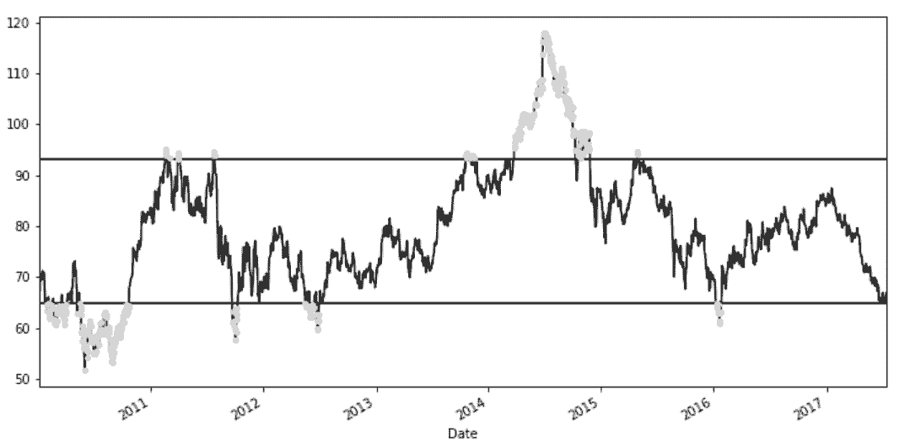

### 更多

```py
# 使用fill_between可以在两条线之间填充颜色
 In[47]: slb_close.plot(color='black', figsize=(12,6))
         plt.hlines(y=[lower_10, upper_10], 
                    xmin=xmin, xmax=xmax,color='lightgray')
         plt.fill_between(x=criteria.index, y1=lower_10,
                          y2=slb_close.values, color='black')
         plt.fill_between(x=criteria.index,y1=lower_10,
                          y2=slb_close.values, where=slb_close < lower_10,
                          color='lightgray')
         plt.fill_between(x=criteria.index, y1=upper_10, 
                          y2=slb_close.values, where=slb_close > upper_10,
                          color='lightgray')
Out[47]: 
```

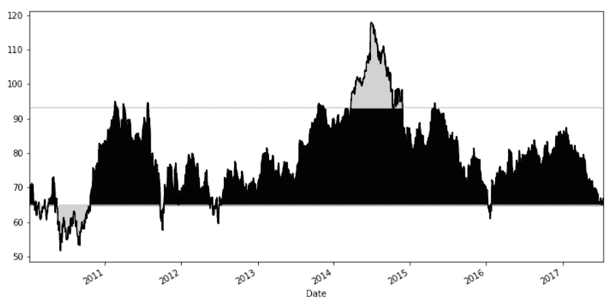

## 7\. 翻译SQL的WHERE语句

```py
# 读取employee数据集
 In[48]: employee = pd.read_csv('data/employee.csv')
# 对各项做下了解
 In[49]: employee.DEPARTMENT.value_counts().head()
Out[49]: Houston Police Department-HPD     638
         Houston Fire Department (HFD)     384
         Public Works & Engineering-PWE    343
         Health & Human Services           110
         Houston Airport System (HAS)      106
         Name: DEPARTMENT, dtype: int64

 In[50]: employee.GENDER.value_counts()
Out[50]: Male      1397
         Female     603
         Name: GENDER, dtype: int64

 In[51]: employee.BASE_SALARY.describe().astype(int)
Out[51]: count      1886
         mean      55767
         std       21693
         min       24960
         25%       40170
         50%       54461
         75%       66614
         max      275000
         Name: BASE_SALARY, dtype: int64 
```

```py
# 创建布尔条件，并从'UNIQUE_ID', 'DEPARTMENT', 'GENDER', 'BASE_SALARY'四列选取
 In[52]: depts = ['Houston Police Department-HPD', 
                  'Houston Fire Department (HFD)']
         criteria_dept = employee.DEPARTMENT.isin(depts)
         criteria_gender = employee.GENDER == 'Female'
         criteria_sal = (employee.BASE_SALARY >= 80000) & \
                        (employee.BASE_SALARY <= 120000)
 In[53]: criteria_final = criteria_dept & criteria_gender & criteria_sal
 In[54]: select_columns = ['UNIQUE_ID', 'DEPARTMENT', 'GENDER', 'BASE_SALARY']
         employee.loc[criteria_final, select_columns].head()
Out[54]: 
```

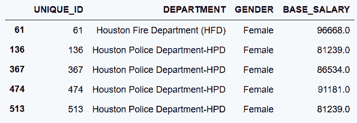

### 更多

```py
# 使用between选取80000到120000之间的薪水
 In[55]: criteria_sal = employee.BASE_SALARY.between(80000, 120000)
# 排除最常出现的5家单位
 In[56]: top_5_depts = employee.DEPARTMENT.value_counts().index[:5]
         criteria = ~employee.DEPARTMENT.isin(top_5_depts)
         employee[criteria].head()
Out[56]: 
```

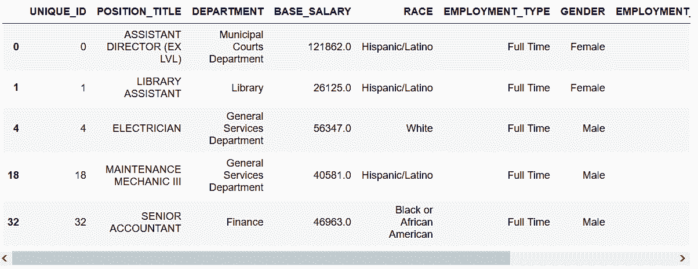

功能一样的SQL语句是：

```py
SELECT 
    * 
FROM 
    EMPLOYEE 
WHERE 
    DEPARTMENT not in 
    (
      SELECT 
          DEPARTMENT 
     FROM (
           SELECT
               DEPARTMENT,
               COUNT(1) as CT
           FROM
               EMPLOYEE
           GROUP BY
               DEPARTMENT
           ORDER BY
               CT DESC
           LIMIT 5
          )
   ); 
```

## 8\. 确定股票收益的正态值

```py
# 加载亚马逊的股票数据，使用Data作为行索引
 In[57]: amzn = pd.read_csv('data/amzn_stock.csv', index_col='Date', parse_dates=['Date'])
         amzn.head()
Out[57]: 
```

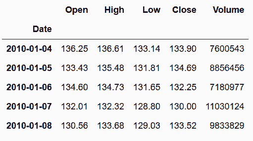

```py
# 选取Close收盘价，用pct_change()计算每日回报率
 In[58]: amzn_daily_return = amzn.Close.pct_change()
         amzn_daily_return.head()
Out[58]: Date
         2010-01-04         NaN
         2010-01-05    0.005900
         2010-01-06   -0.018116
         2010-01-07   -0.017013
         2010-01-08    0.027077
         Name: Close, dtype: float64 
```

```py
# 去掉缺失值，画一张柱状图，查看分布情况
 In[59]: amzn_daily_return = amzn_daily_return.dropna()
         amzn_daily_return.hist(bins=20)
Out[59]: <matplotlib.axes._subplots.AxesSubplot at 0x1174b3128> 
```

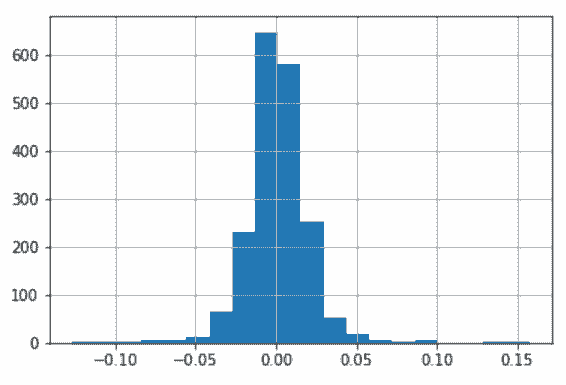

```py
# 计算平均值和标准差
 In[60]: mean = amzn_daily_return.mean()  
         std = amzn_daily_return.std()
# 计算每个数据的z-score的绝对值：z-score是远离平均值的标准差值得个数
 In[61]: abs_z_score = amzn_daily_return.sub(mean).abs().div(std)
# 计算位于1，2，3个标准差之内的收益率的比例
 In[62]: pcts = [abs_z_score.lt(i).mean() for i in range(1,4)]
         print('{:.3f} fall within 1 standard deviation. '
               '{:.3f} within 2 and {:.3f} within 3'.format(*pcts))
         0.787 fall within 1 standard deviation. 0.956 within 2 and 0.985 within 3 
```

### 更多

```py
# 将上面的方法整合成一个函数
 In[63]: def test_return_normality(stock_data):
             close = stock_data['Close']
             daily_return = close.pct_change().dropna()
             daily_return.hist(bins=20)
             mean = daily_return.mean() 
             std = daily_return.std()

             abs_z_score = abs(daily_return - mean) / std
             pcts = [abs_z_score.lt(i).mean() for i in range(1,4)]

             print('{:.3f} fall within 1 standard deviation. '
                   '{:.3f} within 2 and {:.3f} within 3'.format(*pcts))
 In[64]: slb = pd.read_csv('data/slb_stock.csv', 
                           index_col='Date', parse_dates=['Date'])
         test_return_normality(slb)
         0.742 fall within 1 standard deviation. 0.946 within 2 and 0.986 within 3 
```

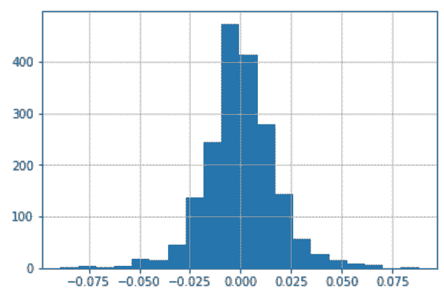

## 9\. 使用查询方法提高布尔索引的可读性

```py
# 读取employee数据，确定选取的部门和列
 In[65]: employee = pd.read_csv('data/employee.csv')
         depts = ['Houston Police Department-HPD', 'Houston Fire Department (HFD)']
         select_columns = ['UNIQUE_ID', 'DEPARTMENT', 'GENDER', 'BASE_SALARY']
# 创建查询字符串，并执行query方法
 In[66]: qs = "DEPARTMENT in @depts " \
              "and GENDER == 'Female' " \
              "and 80000 <= BASE_SALARY <= 120000"

         emp_filtered = employee.query(qs)
         emp_filtered[select_columns].head()
Out[66]: 
```

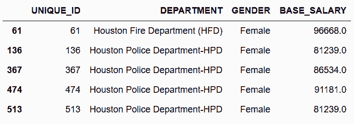

### 更多

```py
# 若要不使用部门列表，也可以使用下面的方法
 In[67]: top10_depts = employee.DEPARTMENT.value_counts().index[:10].tolist()
         qs = "DEPARTMENT not in @top10_depts and GENDER == 'Female'"
         employee_filtered2 = employee.query(qs)
         employee_filtered2[['DEPARTMENT', 'GENDER']].head()
Out[67]: 
```

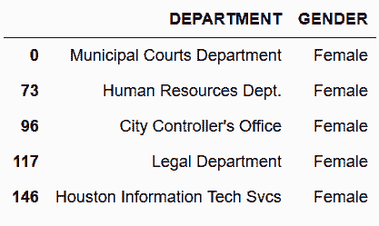

## 10\. 用where方法保留Series

```py
# 读取movie数据集，movie_title作为行索引，actor_1_facebook_likes列删除缺失值
 In[68]: movie = pd.read_csv('data/movie.csv', index_col='movie_title')
         fb_likes = movie['actor_1_facebook_likes'].dropna()
         fb_likes.head()
Out[68]: movie_title
         Avatar                                         1000.0
         Pirates of the Caribbean: At World's End      40000.0
         Spectre                                       11000.0
         The Dark Knight Rises                         27000.0
         Star Wars: Episode VII - The Force Awakens      131.0
         Name: actor_1_facebook_likes, dtype: float64 
```

```py
# 使用describe获得对数据的认知
 In[69]: fb_likes.describe(percentiles=[.1, .25, .5, .75, .9]).astype(int)
Out[69]: count      4909
         mean       6494
         std       15106
         min           0
         10%         240
         25%         607
         50%         982
         75%       11000
         90%       18000
         max      640000
         Name: actor_1_facebook_likes, dtype: int64 
```

```py
# 作用和前面相同（这里是作者代码弄乱了）
 In[70]: fb_likes.describe(percentiles=[.1,.25,.5,.75,.9])
Out[70]: count      4909.000000
         mean       6494.488491
         std       15106.986884
         min           0.000000
         10%         240.000000
         25%         607.000000
         50%         982.000000
         75%       11000.000000
         90%       18000.000000
         max      640000.000000
         Name: actor_1_facebook_likes, dtype: float64 
```

```py
# 画一张柱状图
 In[71]: fb_likes.hist()
Out[71]: <matplotlib.axes._subplots.AxesSubplot at 0x10f9fbe80> 
```

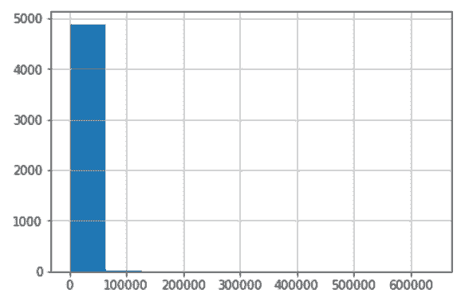

```py
# 检测小于20000个喜欢的的比例
 In[72]: criteria_high = fb_likes < 20000
         criteria_high.mean().round(2)
Out[71]: 0.91000000000000003 
```

```py
# where条件可以返回一个同样大小的Series，但是所有False会被替换成缺失值
 In[73]: fb_likes.where(criteria_high).head()
Out[73]: movie_title
         Avatar                                         1000.0
         Pirates of the Caribbean: At World's End          NaN
         Spectre                                       11000.0
         The Dark Knight Rises                             NaN
         Star Wars: Episode VII - The Force Awakens      131.0
         Name: actor_1_facebook_likes, dtype: float64 
```

```py
# 第二个参数other，可以让你控制替换值
 In[74]: fb_likes.where(criteria_high, other=20000).head()
Out[74]: movie_title
         Avatar                                         1000.0
         Pirates of the Caribbean: At World's End      20000.0
         Spectre                                       11000.0
         The Dark Knight Rises                         20000.0
         Star Wars: Episode VII - The Force Awakens      131.0
         Name: actor_1_facebook_likes, dtype: float64 
```

```py
# 通过where条件，设定上下限的值
 In[75]: criteria_low = fb_likes > 300
         fb_likes_cap = fb_likes.where(criteria_high, other=20000)\
                                .where(criteria_low, 300)
         fb_likes_cap.head()
Out[75]: movie_title
         Avatar                                         1000.0
         Pirates of the Caribbean: At World's End      20000.0
         Spectre                                       11000.0
         The Dark Knight Rises                         20000.0
         Star Wars: Episode VII - The Force Awakens      300.0
         Name: actor_1_facebook_likes, dtype: float64 
```

```py
# 原始Series和修改过的Series的长度是一样的
 In[76]: len(fb_likes), len(fb_likes_cap)
Out[76]: (4909, 4909) 
```

```py
# 再做一张柱状图，效果好多了
 In[77]: fb_likes_cap.hist()
Out[77]: <matplotlib.axes._subplots.AxesSubplot at 0x10eeea8d0> 
```

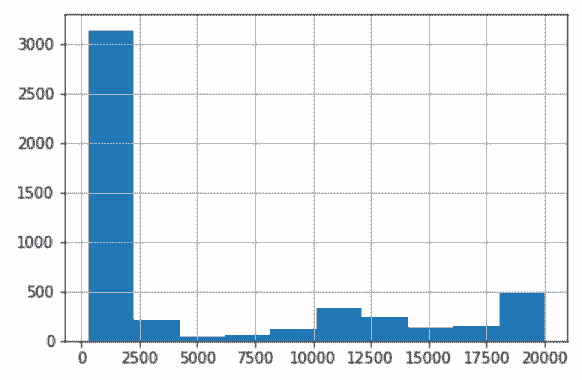

```py
 In[78]: fb_likes_cap2 = fb_likes.clip(lower=300, upper=20000)
         fb_likes_cap2.equals(fb_likes_cap)
Out[78]: True 
```

## 11\. 对DataFrame的行做mask

```py
# 读取movie，根据条件进行筛选
 In[79]: movie = pd.read_csv('data/movie.csv', index_col='movie_title')
         c1 = movie['title_year'] >= 2010
         c2 = movie['title_year'].isnull()
         criteria = c1 | c2
# 使用mask方法，使所有满足条件的数据消失
 In[80]: movie.mask(criteria).head()
Out[80]: 
```

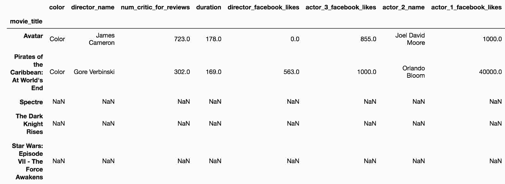

```py
# 去除缺失值
 In[81]: movie_mask = movie.mask(criteria).dropna(how='all')
         movie_mask.head()
Out[81]: 
```

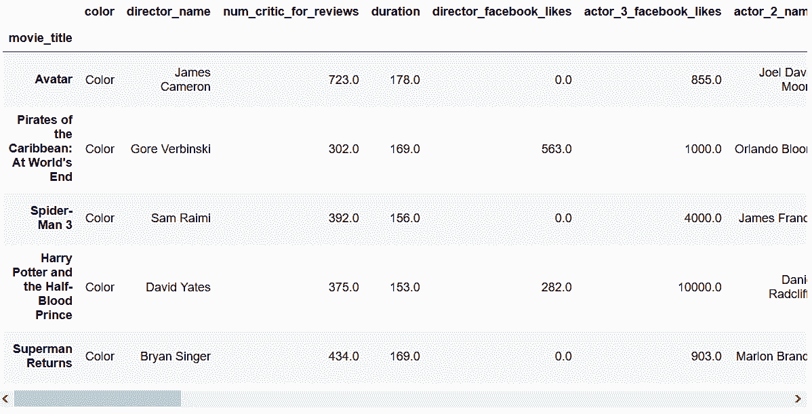

```py
# 用布尔索引选取title_year小于2010的电影
 In[82]: movie_boolean = movie[movie['title_year'] < 2010]
         movie_boolean.head()
Out[82]: 
```

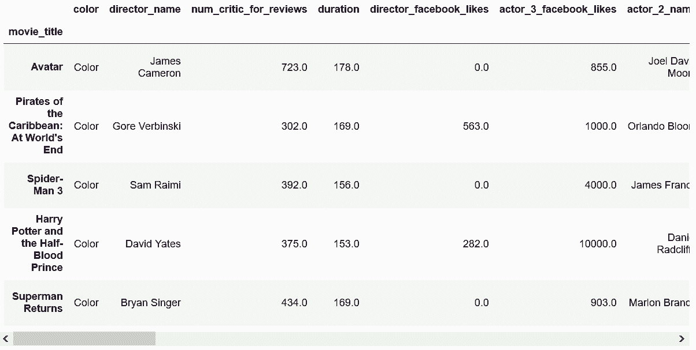

```py
# 判断这两种方法是否相同
 In[83]: movie_mask.equals(movie_boolean)
Out[83]: False 
```

```py
# 判断二者的形状是否相同
 In[84]: movie_mask.shape == movie_boolean.shape
Out[84]: True 
```

```py
# mask方法产生了许多缺失值，缺失值是float类型，所以之前是整数型的列都变成了浮点型
 In[85]: movie_mask.dtypes == movie_boolean.dtypes
Out[85]: 
color                         True
director_name                 True
num_critic_for_reviews        True
duration                      True
director_facebook_likes       True
actor_3_facebook_likes        True
actor_2_name                  True
actor_1_facebook_likes        True
gross                         True
genres                        True
actor_1_name                  True
num_voted_users              False
cast_total_facebook_likes    False
actor_3_name                  True
facenumber_in_poster          True
plot_keywords                 True
movie_imdb_link               True
num_user_for_reviews          True
language                      True
country                       True
content_rating                True
budget                        True
title_year                    True
actor_2_facebook_likes        True
imdb_score                    True
aspect_ratio                  True
movie_facebook_likes         False
dtype: bool 
```

```py
# Pandas有一个assert_frame_equal方法，可以判断两个Pandas对象是否一样，而不检测其数据类型
 In[86]: from pandas.testing import assert_frame_equal
         assert_frame_equal(movie_boolean, movie_mask, check_dtype=False) 
```

### 更多

```py
# 比较mask和布尔索引的速度，两者相差了一个数量级
 In[87]: %timeit movie.mask(criteria).dropna(how='all')
         11.1 ms ± 48.3 µs per loop (mean ± std. dev. of 7 runs, 100 loops each)
 In[88]: %timeit movie[movie['title_year'] < 2010]
         1.12 ms ± 36.7 µs per loop (mean ± std. dev. of 7 runs, 1000 loops each) 
```

## 12\. 使用布尔值、整数、标签进行选取

```py
# 读取movie，根据布尔条件选取
 In[89]: movie = pd.read_csv('data/movie.csv', index_col='movie_title')
         c1 = movie['content_rating'] == 'G'
         c2 = movie['imdb_score'] < 4
         criteria = c1 & c2
 In[90]: movie_loc = movie.loc[criteria]
         movie_loc.head()
Out[90]: 
```

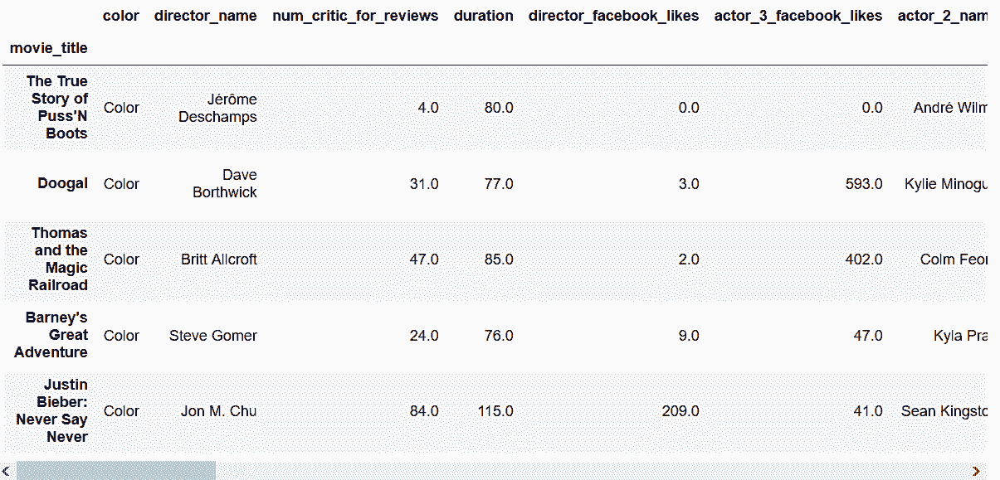

```py
# 检查loc条件和布尔条件创建出来的两个DataFrame是否一样
 In[91]: movie_loc.equals(movie[criteria])
Out[91]: True 
```

```py
# 尝试用.iloc使用布尔索引
 In[92]: movie_iloc = movie.iloc[criteria]
---------------------------------------------------------------------------
ValueError                                Traceback (most recent call last)
<ipython-input-92-24a12062c6c3> in <module>()
----> 1 movie_iloc = movie.iloc[criteria]

/Users/Ted/anaconda/lib/python3.6/site-packages/pandas/core/indexing.py in __getitem__(self, key)
   1326         else:
   1327             key = com._apply_if_callable(key, self.obj)
-> 1328             return self._getitem_axis(key, axis=0)
   1329 
   1330     def _is_scalar_access(self, key):

/Users/Ted/anaconda/lib/python3.6/site-packages/pandas/core/indexing.py in _getitem_axis(self, key, axis)
   1731 
   1732         if is_bool_indexer(key):
-> 1733             self._has_valid_type(key, axis)
   1734             return self._getbool_axis(key, axis=axis)
   1735 

/Users/Ted/anaconda/lib/python3.6/site-packages/pandas/core/indexing.py in _has_valid_type(self, key, axis)
   1588                                               "indexing on an integer type "
   1589                                               "is not available")
-> 1590                 raise ValueError("iLocation based boolean indexing cannot use "
   1591                                  "an indexable as a mask")
   1592             return True

ValueError: iLocation based boolean indexing cannot use an indexable as a mask 
```

```py
# 但是，却可以使用布尔值得ndarray，用values可以取出array
 In[93]: movie_iloc = movie.iloc[criteria.values]
 In[94]: movie_iloc.equals(movie_loc)
Out[94]: True
 In[95]: movie.loc[criteria.values]
Out[95]: 
```

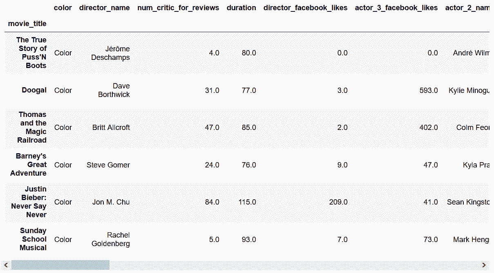

```py
# 布尔索引也可以用来选取列
 In[96]: criteria_col = movie.dtypes == np.int64
         criteria_col.head()
Out[96]: color                      False
         director_name              False
         num_critic_for_reviews     False
         duration                   False
         director_facebook_likes    False
         dtype: bool 
```

```py
 In[97]: movie.loc[:, criteria_col].head()
Out[97]: 
```

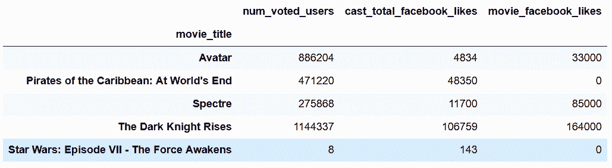

```py
# 因为criteria_col是包含行索引的一个Series，必须要使用底层的ndarray，才能使用，iloc
 In[98]: movie.iloc[:, criteria_col.values].head()
Out[98]: 
```

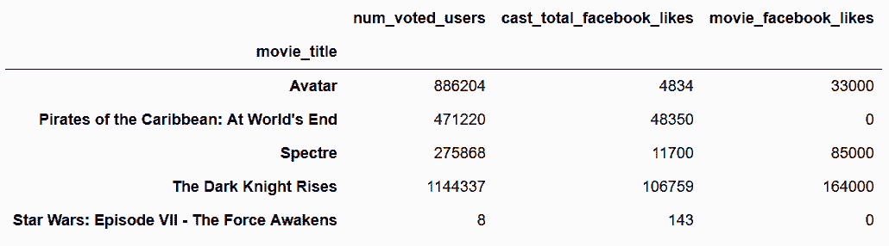

```py
# 选取'content_rating', 'imdb_score', 'title_year', 'gross'四列，按照imdb_score升序排列
 In[99]: cols = ['content_rating', 'imdb_score', 'title_year', 'gross']
         movie.loc[criteria, cols].sort_values('imdb_score')
Out[99]: 
```

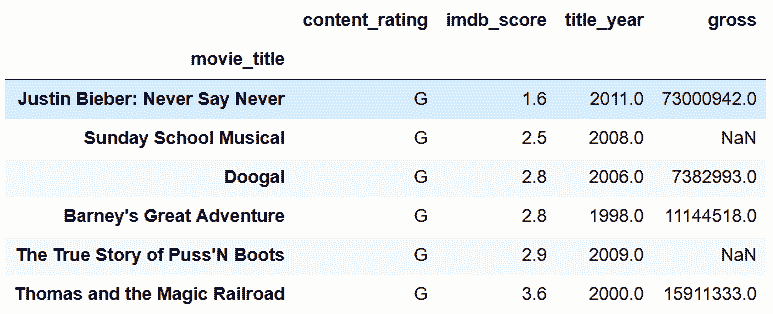

```py
# 用get_loc获取这四列的整数位置
 In[100]: col_index = [movie.columns.get_loc(col) for col in cols]
          col_index
Out[100]: [20, 24, 22, 8] 
```

```py
# 这时候就可以使用iloc了
 In[101]: movie.iloc[criteria.values, col_index].sort_values('imdb_score')
Out[101]: 
```

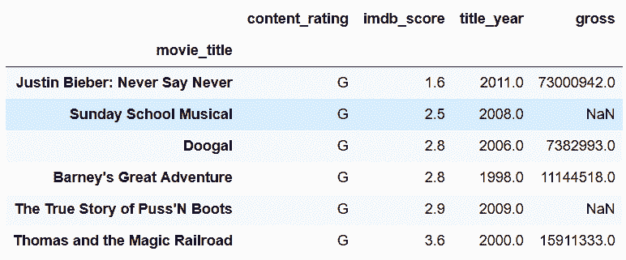

### 原理

```py
# 查看Series的底层结构
 In[102]: a = criteria.values
          a[:5]
Out[102]: array([False, False, False, False, False], dtype=bool)

 In[103]: len(a), len(criteria)
Out[103]: (4916, 4916) 
```

### 更多

```py
# 传入的布尔索引可以跟要操作的DataFrame长度不同
 In[104]: movie.loc[[True, False, True], [True, False, False, True]]
Out[104]: 
```

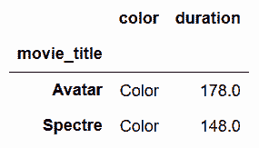

