# 第06章 索引对齐


```py
 In[1]: import pandas as pd
        import numpy as np 
```

## 1\. 检查索引

```py
# 读取college数据集，提取所有的列
 In[2]: college = pd.read_csv('data/college.csv')
        columns = college.columns
        columns
Out[2]: Index(['INSTNM', 'CITY', 'STABBR', 'HBCU', 'MENONLY', 'WOMENONLY', 'RELAFFIL',
                'SATVRMID', 'SATMTMID', 'DISTANCEONLY', 'UGDS', 'UGDS_WHITE',
                'UGDS_BLACK', 'UGDS_HISP', 'UGDS_ASIAN', 'UGDS_AIAN', 'UGDS_NHPI',
                'UGDS_2MOR', 'UGDS_NRA', 'UGDS_UNKN', 'PPTUG_EF', 'CURROPER', 'PCTPELL',
                'PCTFLOAN', 'UG25ABV', 'MD_EARN_WNE_P10', 'GRAD_DEBT_MDN_SUPP'], dtype='object') 
```

```py
# 用values属性，访问底层的NumPy数组
 In[3]: columns.values
Out[3]: array(['INSTNM', 'CITY', 'STABBR', 'HBCU', 'MENONLY', 'WOMENONLY',
                'RELAFFIL', 'SATVRMID', 'SATMTMID', 'DISTANCEONLY', 'UGDS',
                'UGDS_WHITE', 'UGDS_BLACK', 'UGDS_HISP', 'UGDS_ASIAN', 'UGDS_AIAN',
                'UGDS_NHPI', 'UGDS_2MOR', 'UGDS_NRA', 'UGDS_UNKN', 'PPTUG_EF',
                'CURROPER', 'PCTPELL', 'PCTFLOAN', 'UG25ABV', 'MD_EARN_WNE_P10',
                'GRAD_DEBT_MDN_SUPP'], dtype=object) 
```

```py
# 取出该数组的第6个值
 In[4]: columns[5]
Out[4]: 'WOMENONLY' 
```

```py
# 取出该数组的第2\9\11
 In[5]: columns[[1,8,10]]
Out[5]: Index(['CITY', 'SATMTMID', 'UGDS'], dtype='object') 
```

```py
# 逆序切片选取
 In[6]: columns[-7:-4]
Out[6]: Index(['PPTUG_EF', 'CURROPER', 'PCTPELL'], dtype='object') 
```

```py
# 索引有许多和Series和DataFrame相同的方法
 In[7]: columns.min(), columns.max(), columns.isnull().sum()
Out[7]: ('CITY', 'WOMENONLY', 0) 
```

```py
# 索引对象可以直接通过字符串方法修改
 In[8]: columns + '_A'
Out[8]: Index(['INSTNM_A', 'CITY_A', 'STABBR_A', 'HBCU_A', 'MENONLY_A', 'WOMENONLY_A',
               'RELAFFIL_A', 'SATVRMID_A', 'SATMTMID_A', 'DISTANCEONLY_A', 'UGDS_A',
               'UGDS_WHITE_A', 'UGDS_BLACK_A', 'UGDS_HISP_A', 'UGDS_ASIAN_A',
               'UGDS_AIAN_A', 'UGDS_NHPI_A', 'UGDS_2MOR_A', 'UGDS_NRA_A',
               'UGDS_UNKN_A', 'PPTUG_EF_A', 'CURROPER_A', 'PCTPELL_A', 'PCTFLOAN_A',
               'UG25ABV_A', 'MD_EARN_WNE_P10_A', 'GRAD_DEBT_MDN_SUPP_A'],
               dtype='object') 
```

```py
# 索引对象也可以通过比较运算符，得到布尔索引
 In[9]: columns > 'G'
Out[9]: array([ True, False,  True,  True,  True,  True,  True,  True,  True,
                False,  True,  True,  True,  True,  True,  True,  True,  True,
                True,  True,  True, False,  True,  True,  True,  True,  True], dtype=bool) 
```

```py
# 尝试用赋值的方法，修改索引对象的一个值，会导致类型错误，因为索引对象是不可变类型
 In[10]: columns[1] = 'city'
---------------------------------------------------------------------------
TypeError                                 Traceback (most recent call last)
<ipython-input-10-1e9e8e3125de> in <module>()
----> 1 columns[1] = 'city'

/Users/Ted/anaconda/lib/python3.6/site-packages/pandas/core/indexes/base.py in __setitem__(self, key, value)
   1668 
   1669     def __setitem__(self, key, value):
-> 1670         raise TypeError("Index does not support mutable operations")
   1671 
   1672     def __getitem__(self, key):

TypeError: Index does not support mutable operations 
```

### 更多

索引对象支持集合运算：联合、交叉、求差、对称差

```py
# 切片
 In[11]: c1 = columns[:4]
         c1
Out[11]: Index(['INSTNM', 'CITY', 'STABBR', 'HBCU'], dtype='object')

 In[12]: c2 = columns[2:5]
         c2
Out[12]: Index(['STABBR', 'HBCU', 'MENONLY'], dtype='object') 
```

```py
# 联合
 In[13]: c1.union(c2)
Out[13]: Index(['CITY', 'HBCU', 'INSTNM', 'MENONLY', 'STABBR'], dtype='object')

 In[14]: c1 | c2
Out[14]: Index(['CITY', 'HBCU', 'INSTNM', 'MENONLY', 'STABBR'], dtype='object') 
```

```py
# 对称差
 In[15]: c1.symmetric_difference(c2)
Out[15]: Index(['CITY', 'INSTNM', 'MENONLY'], dtype='object')

 In[16]: c1 ^ c2
Out[16]: Index(['CITY', 'INSTNM', 'MENONLY'], dtype='object') 
```

## 2\. 求笛卡尔积

```py
# 创建两个有不同索引、但包含一些相同值的Series
 In[17]: s1 = pd.Series(index=list('aaab'), data=np.arange(4))
         s1
Out[17]: a    0
         a    1
         a    2
         b    3
         dtype: int64

 In[18]: s2 = pd.Series(index=list('cababb'), data=np.arange(6))
         s2
Out[18]: c    0
         a    1
         b    2
         a    3
         b    4
         b    5
         dtype: int64 
```

```py
# 二者相加，以产生一个笛卡尔积
 In[19]: s1 + s2
Out[19]: a    1.0
         a    3.0
         a    2.0
         a    4.0
         a    3.0
         a    5.0
         b    5.0
         b    7.0
         b    8.0
         c    NaN
         dtype: float64 
```

### 更多

```py
# 当两组索引元素完全相同、顺序也相同时，不会生成笛卡尔积；索引会按照它们的位置对齐。下面的例子，两个Series完全相同，结果也是整数
 In[20]: s1 = pd.Series(index=list('aaabb'), data=np.arange(5))
         s2 = pd.Series(index=list('aaabb'), data=np.arange(5))
         s1 + s2
Out[20]: a    0
         a    2
         a    4
         b    6
         b    8
         dtype: int64 
```

```py
# 如果索引元素相同，但顺序不同，是能产生笛卡尔积的
 In[21]: s1 = pd.Series(index=list('aaabb'), data=np.arange(5))
         s2 = pd.Series(index=list('bbaaa'), data=np.arange(5))
         s1 + s2
Out[21]: a    2
         a    3
         a    4
         a    3
         a    4
         a    5
         a    4
         a    5
         a    6
         b    3
         b    4
         b    4
         b    5
         dtype: int64 
```

## 3\. 索引爆炸

```py
# 读取employee数据集，设定行索引是RACE
 In[22]: employee = pd.read_csv('data/employee.csv', index_col='RACE')
         employee.head()
Out[22]: 
```

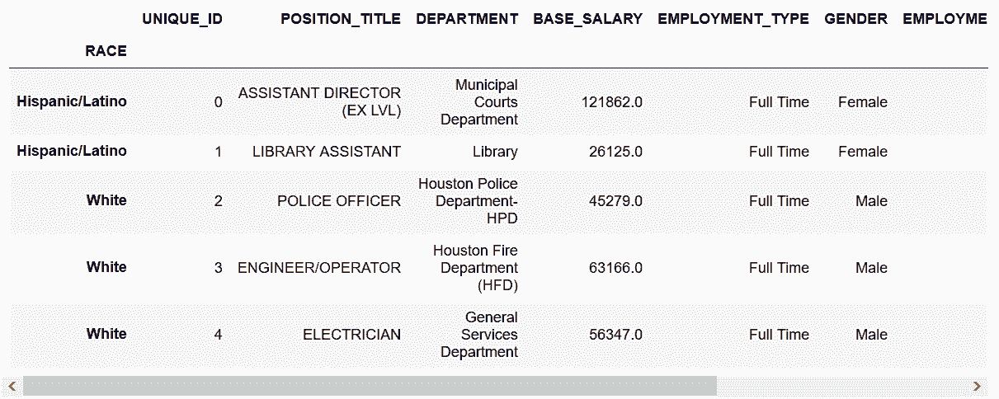

```py
# 选取BASE_SALARY做成两个Series，判断二者是否相同
 In[23]: salary1 = employee['BASE_SALARY']
         salary2 = employee['BASE_SALARY']
         salary1 is salary2
Out[23]: True 
```

```py
# 结果是True，表明二者指向的同一个对象。这意味着，如果修改一个，另一个也会去改变。为了收到一个全新的数据，使用copy方法：
 In[24]: salary1 = employee['BASE_SALARY'].copy()
         salary2 = employee['BASE_SALARY'].copy()
         salary1 is salary2
Out[24]: False 
```

```py
# 对其中一个做索引排序，比较二者是否不同
 In[25]: salary1 = salary1.sort_index()
         salary1.head()
Out[25]: RACE
         American Indian or Alaskan Native    78355.0
         American Indian or Alaskan Native    26125.0
         American Indian or Alaskan Native    98536.0
         American Indian or Alaskan Native        NaN
         American Indian or Alaskan Native    55461.0
         Name: BASE_SALARY, dtype: float64

 In[26]: salary2.head()
Out[26]: RACE
         Hispanic/Latino    121862.0
         Hispanic/Latino     26125.0
         White               45279.0
         White               63166.0
         White               56347.0
         Name: BASE_SALARY, dtype: float64 
```

```py
# 将两个Series相加
 In[27]: salary_add = salary1 + salary2
 In[28]: salary_add.head()
Out[28]: RACE
         American Indian or Alaskan Native    138702.0
         American Indian or Alaskan Native    156710.0
         American Indian or Alaskan Native    176891.0
         American Indian or Alaskan Native    159594.0
         American Indian or Alaskan Native    127734.0
         Name: BASE_SALARY, dtype: float64 
```

```py
# 再将salary1与其自身相加；查看几个所得结果的长度，可以看到长度从2000到达了117万
 In[29]: salary_add1 = salary1 + salary1
         len(salary1), len(salary2), len(salary_add), len(salary_add1)
Out[29]: (2000, 2000, 1175424, 2000) 
```

### 更多

```py
# 验证salary_add值的个数。因为笛卡尔积是作用在相同索引元素上的，可以对其平方值求和
 In[30]: index_vc = salary1.index.value_counts(dropna=False)
         index_vc
Out[30]: Black or African American            700
         White                                665
         Hispanic/Latino                      480
         Asian/Pacific Islander               107
         NaN                                   35
         American Indian or Alaskan Native     11
         Others                                 2
         Name: RACE, dtype: int64

 In[31]: index_vc.pow(2).sum()
Out[31]: 1175424 
```

## 4\. 用不等索引填充数值

```py
# 读取三个baseball数据集，行索引设为playerID
 In[32]: baseball_14 = pd.read_csv('data/baseball14.csv', index_col='playerID')
         baseball_15 = pd.read_csv('data/baseball15.csv', index_col='playerID')
         baseball_16 = pd.read_csv('data/baseball16.csv', index_col='playerID')
         baseball_14.head()
Out[32]: 
```

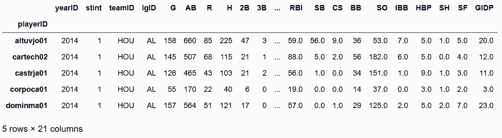

```py
# 用索引方法difference，找到哪些索引标签在baseball_14中，却不在baseball_15、baseball_16中
 In[33]: baseball_14.index.difference(baseball_15.index)
Out[33]: Index(['corpoca01', 'dominma01', 'fowlede01', 'grossro01', 'guzmaje01',
                'hoeslj01', 'krausma01', 'preslal01', 'singljo02'],
                dtype='object', name='playerID')

 In[34]: baseball_14.index.difference(baseball_16.index)
Out[34]: Index(['congeha01', 'correca01', 'gattiev01', 'gomezca01',
                'lowrije01', 'rasmuco01', 'tuckepr01', 'valbulu01'],
                dtype='object', name='playerID') 
```

```py
# 找到每名球员在过去三个赛季的击球数，H列包含了这个数据
 In[35]: hits_14 = baseball_14['H']
         hits_15 = baseball_15['H']
         hits_16 = baseball_16['H']
         hits_14.head()
Out[35]: Index(['corpoca01', 'dominma01', 'fowlede01', 'grossro01', 'guzmaje01',
                'hoeslj01', 'krausma01', 'preslal01', 'singljo02'],
         dtype='object', name='playerID') 
```

```py
# 将hits_14和hits_15两列相加
 In[36]: (hits_14 + hits_15).head()
Out[36]: playerID
         altuvjo01    425.0
         cartech02    193.0
         castrja01    174.0
         congeha01      NaN
         corpoca01      NaN
         Name: H, dtype: float64 
```

```py
# congeha01 和 corpoca01 在2015年是有记录的，但是结果缺失了。使用add方法和参数fill_value，避免产生缺失值
 In[37]: hits_14.add(hits_15, fill_value=0).head()
Out[37]: playerID
         altuvjo01    425.0
         cartech02    193.0
         castrja01    174.0
         congeha01     46.0
         corpoca01     40.0
         Name: H, dtype: float64 
```

```py
# 再将2016的数据也加上
 In[38]: hits_total = hits_14.add(hits_15, fill_value=0).add(hits_16, fill_value=0)
         hits_total.head()
Out[38]: playerID
         altuvjo01    641.0
         bregmal01     53.0
         cartech02    193.0
         castrja01    243.0
         congeha01     46.0
         Name: H, dtype: float64 
```

```py
# 检查结果中是否有缺失值
 In[39]: hits_total.hasnans
Out[39]: False 
```

### 原理

```py
# 如果一个元素在两个Series都是缺失值，即便使用了fill_value，相加的结果也仍是缺失值
 In[40]: s = pd.Series(index=['a', 'b', 'c', 'd'], data=[np.nan, 3, np.nan, 1])
         s
Out[40]: a    NaN
         b    3.0
         c    NaN
         d    1.0
         dtype: float64

 In[41]: s1 = pd.Series(index=['a', 'b', 'c'], data=[np.nan, 6, 10])
         s1
Out[41]: a     NaN
         b     6.0
         c    10.0
         dtype: float64

 In[42]: s.add(s1, fill_value=5)
Out[42]: a     NaN
         b     9.0
         c    15.0
         d     6.0
         dtype: float64

 In[43]: s1.add(s, fill_value=5)
Out[43]: a     NaN
         b     9.0
         c    15.0
         d     6.0
         dtype: float64 
```

### 更多

```py
# 从baseball_14中选取一些列
 In[44]: df_14 = baseball_14[['G','AB', 'R', 'H']]
         df_14.head()
Out[44]: 
```

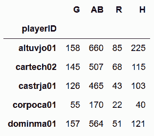

```py
# 再从baseball_15中选取一些列，有相同的、也有不同的
 In[45]: df_15 = baseball_15[['AB', 'R', 'H', 'HR']]
         df_15.head()
Out[45]: 
```

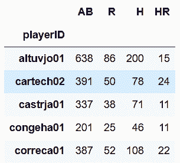

```py
# 将二者相加的话，只要行或列不能对齐，就会产生缺失值。style属性的highlight_null方法可以高亮缺失值
 In[46]: (df_14 + df_15).head(10).style.highlight_null('yellow')
Out[46]: 
```

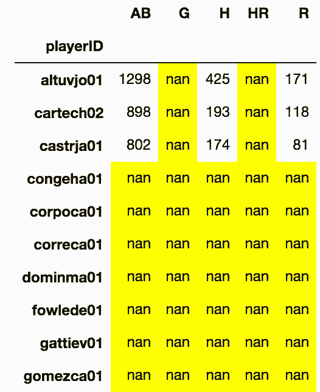

```py
# 即便使用了fill_value=0，有些值也会是缺失值，这是因为一些行和列的组合根本不存在输入的数据中
 In[47]: df_14.add(df_15, fill_value=0).head(10).style.highlight_null('yellow')
Out[47]: 
```

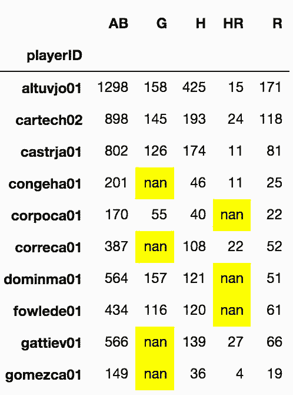

## 5\. 从不同的DataFrame追加列

```py
# 读取employee数据，选取'DEPARTMENT', 'BASE_SALARY'这两列
 In[48]: employee = pd.read_csv('data/employee.csv')
         dept_sal = employee[['DEPARTMENT', 'BASE_SALARY']]
# 在每个部门内，对BASE_SALARY进行排序
 In[49]: dept_sal = dept_sal.sort_values(['DEPARTMENT', 'BASE_SALARY'],
                                         ascending=[True, False])
# 用drop_duplicates方法保留每个部门的第一行
 In[50]: max_dept_sal = dept_sal.drop_duplicates(subset='DEPARTMENT')
         max_dept_sal.head()
Out[50]: 
```

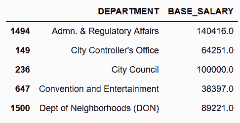

```py
# 使用DEPARTMENT作为行索引
 In[51]: max_dept_sal = max_dept_sal.set_index('DEPARTMENT')
         employee = employee.set_index('DEPARTMENT')
# 现在行索引包含匹配值了，可以向employee的DataFrame新增一列
 In[52]: employee['MAX_DEPT_SALARY'] = max_dept_sal['BASE_SALARY']
 In[53]: pd.options.display.max_columns = 6
Out[54]: 
```

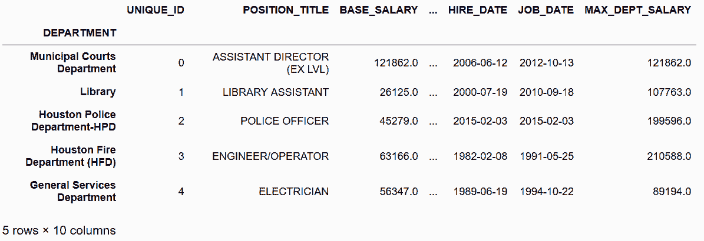

```py
# 现在可以用query查看是否有BASE_SALARY大于MAX_DEPT_SALARY的
 In[55]: employee.query('BASE_SALARY > MAX_DEPT_SALARY')
Out[55]: 
```

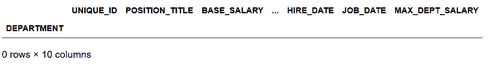

### 原理

```py
# 用random从dept_sal随机取10行，不做替换
 In[56]: np.random.seed(1234)
         random_salary = dept_sal.sample(n=10).set_index('DEPARTMENT')
         random_salary
Out[56]: 
```

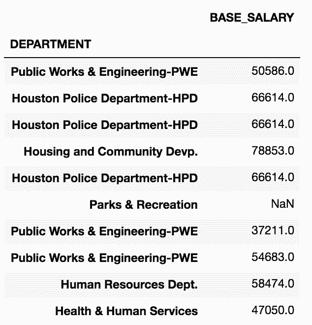

```py
# random_salary中是有重复索引的，employee DataFrame的标签要对应random_salary中的多个标签
 In[57]: employee['RANDOM_SALARY'] = random_salary['BASE_SALARY']
---------------------------------------------------------------------------
ValueError                                Traceback (most recent call last)
<ipython-input-57-1cbebe15fa39> in <module>()
----> 1 employee['RANDOM_SALARY'] = random_salary['BASE_SALARY']

/Users/Ted/anaconda/lib/python3.6/site-packages/pandas/core/frame.py in __setitem__(self, key, value)
   2329         else:
   2330             # set column
-> 2331             self._set_item(key, value)
   2332 
   2333     def _setitem_slice(self, key, value):

/Users/Ted/anaconda/lib/python3.6/site-packages/pandas/core/frame.py in _set_item(self, key, value)
   2395 
   2396         self._ensure_valid_index(value)
-> 2397         value = self._sanitize_column(key, value)
   2398         NDFrame._set_item(self, key, value)
   2399 

/Users/Ted/anaconda/lib/python3.6/site-packages/pandas/core/frame.py in _sanitize_column(self, key, value, broadcast)
   2545 
   2546         if isinstance(value, Series):
-> 2547             value = reindexer(value)
   2548 
   2549         elif isinstance(value, DataFrame):

/Users/Ted/anaconda/lib/python3.6/site-packages/pandas/core/frame.py in reindexer(value)
   2537                     # duplicate axis
   2538                     if not value.index.is_unique:
-> 2539                         raise e
   2540 
   2541                     # other

/Users/Ted/anaconda/lib/python3.6/site-packages/pandas/core/frame.py in reindexer(value)
   2532                 # GH 4107
   2533                 try:
-> 2534                     value = value.reindex(self.index)._values
   2535                 except Exception as e:
   2536 

/Users/Ted/anaconda/lib/python3.6/site-packages/pandas/core/series.py in reindex(self, index, **kwargs)
   2424     @Appender(generic._shared_docs['reindex'] % _shared_doc_kwargs)
   2425     def reindex(self, index=None, **kwargs):
-> 2426         return super(Series, self).reindex(index=index, **kwargs)
   2427 
   2428     @Appender(generic._shared_docs['fillna'] % _shared_doc_kwargs)

/Users/Ted/anaconda/lib/python3.6/site-packages/pandas/core/generic.py in reindex(self, *args, **kwargs)
   2513         # perform the reindex on the axes
   2514         return self._reindex_axes(axes, level, limit, tolerance, method,
-> 2515                                   fill_value, copy).__finalize__(self)
   2516 
   2517     def _reindex_axes(self, axes, level, limit, tolerance, method, fill_value,

/Users/Ted/anaconda/lib/python3.6/site-packages/pandas/core/generic.py in _reindex_axes(self, axes, level, limit, tolerance, method, fill_value, copy)
   2531             obj = obj._reindex_with_indexers({axis: [new_index, indexer]},
   2532                                              fill_value=fill_value,
-> 2533                                              copy=copy, allow_dups=False)
   2534 
   2535         return obj

/Users/Ted/anaconda/lib/python3.6/site-packages/pandas/core/generic.py in _reindex_with_indexers(self, reindexers, fill_value, copy, allow_dups)
   2625                                                 fill_value=fill_value,
   2626                                                 allow_dups=allow_dups,
-> 2627                                                 copy=copy)
   2628 
   2629         if copy and new_data is self._data:

/Users/Ted/anaconda/lib/python3.6/site-packages/pandas/core/internals.py in reindex_indexer(self, new_axis, indexer, axis, fill_value, allow_dups, copy)
   3884         # some axes don't allow reindexing with dups
   3885         if not allow_dups:
-> 3886             self.axes[axis]._can_reindex(indexer)
   3887 
   3888         if axis >= self.ndim:

/Users/Ted/anaconda/lib/python3.6/site-packages/pandas/core/indexes/base.py in _can_reindex(self, indexer)
   2834         # trying to reindex on an axis with duplicates
   2835         if not self.is_unique and len(indexer):
-> 2836             raise ValueError("cannot reindex from a duplicate axis")
   2837 
   2838     def reindex(self, target, method=None, level=None, limit=None,

ValueError: cannot reindex from a duplicate axis 
```

### 更多

```py
# 选取max_dept_sal['BASE_SALARY']的前三行，赋值给employee['MAX_SALARY2']
 In[58]: employee['MAX_SALARY2'] = max_dept_sal['BASE_SALARY'].head(3)
# 对MAX_SALARY2统计
 In[59]: employee.MAX_SALARY2.value_counts()
Out[59]: 140416.0    29
         100000.0    11
         64251.0      5
         Name: MAX_SALARY2, dtype: int64
# 因为只填充了三个部门的值，所有其它部门在结果中都是缺失值
 In[60]: employee.MAX_SALARY2.isnull().mean()
Out[60]: 0.97750000000000004 
```

## 6\. 高亮每列的最大值

```py
 In[61]: pd.options.display.max_rows = 8
# 读取college数据集，INSTNM作为列
 In[62]: college = pd.read_csv('data/college.csv', index_col='INSTNM')
         college.dtypes
Out[62]: CITY                   object
         STABBR                 object
         HBCU                  float64
         MENONLY               float64
                                   ...   
         PCTFLOAN              float64
         UG25ABV               float64
         MD_EARN_WNE_P10        object
         GRAD_DEBT_MDN_SUPP     object
         Length: 26, dtype: object 
```

```py
# MD_EARN_WNE_P10 和 GRAD_DEBT_MDN_SUPP 两列是对象类型，对其进行检查，发现含有字符串
 In[63]: college.MD_EARN_WNE_P10.iloc[0]
Out[63]: '30300'

 In[64]: college.MD_EARN_WNE_P10.iloc[0]
Out[64]: '30300' 
```

```py
# 降序检查
 In[65]: college.MD_EARN_WNE_P10.sort_values(ascending=False).head()
Out[65]: INSTNM
         Sharon Regional Health System School of Nursing    PrivacySuppressed
         Northcoast Medical Training Academy                PrivacySuppressed
         Success Schools                                    PrivacySuppressed
         Louisiana Culinary Institute                       PrivacySuppressed
         Bais Medrash Toras Chesed                          PrivacySuppressed
         Name: MD_EARN_WNE_P10, dtype: object 
```

```py
# 可以用to_numeric，将某列的值做强制转换
 In[66]: cols = ['MD_EARN_WNE_P10', 'GRAD_DEBT_MDN_SUPP']
         for col in cols:
             college[col] = pd.to_numeric(college[col], errors='coerce')

         college.dtypes.loc[cols]
Out[66]: MD_EARN_WNE_P10       float64
         GRAD_DEBT_MDN_SUPP    float64
         dtype: object 
```

```py
# 用select_dtypes方法过滤出数值列
 In[67]: college_n = college.select_dtypes(include=[np.number])
         college_n.head() 
Out[67]: 
```

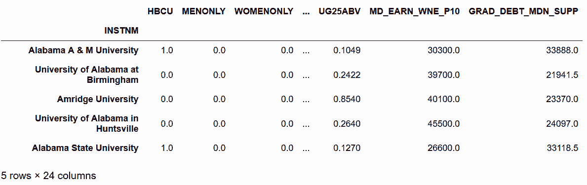

```py
# 有的列只含有两个值，用nunique()方法挑出这些列
 In[68]: criteria = college_n.nunique() == 2
         criteria.head()
Out[68]: HBCU          True
         MENONLY       True
         WOMENONLY     True
         RELAFFIL      True
         SATVRMID     False
         dtype: bool 
```

```py
# 将布尔Series传给索引运算符，生成二元列的列表
 In[69]: binary_cols = college_n.columns[criteria].tolist()
         binary_cols
Out[69]: ['HBCU', 'MENONLY', 'WOMENONLY', 'RELAFFIL', 'DISTANCEONLY', 'CURROPER'] 
```

```py
# 用drop方法删除这些列
 In[70]: college_n2 = college_n.drop(labels=binary_cols, axis='columns')
         college_n2.head()
Out[70]: 
```

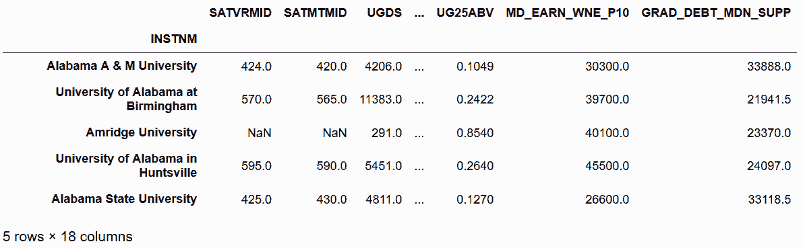

```py
# 用idxmax方法选出每列最大值的行索引标签
 In[71]: max_cols = college_n2.idxmax()
         max_cols
Out[71]: SATVRMID                      California Institute of Technology
         SATMTMID                      California Institute of Technology
         UGDS                               University of Phoenix-Arizona
         UGDS_WHITE                Mr Leon's School of Hair Design-Moscow
                                                  ...                    
         PCTFLOAN                                  ABC Beauty College Inc
         UG25ABV                           Dongguk University-Los Angeles
         MD_EARN_WNE_P10                     Medical College of Wisconsin
         GRAD_DEBT_MDN_SUPP    Southwest University of Visual Arts-Tucson
         Length: 18, dtype: object 
```

```py
# 用unique()方法选出所有不重复的列名
 In[72]: unique_max_cols = max_cols.unique()
         unique_max_cols[:5]
Out[72]: array(['California Institute of Technology',
                'University of Phoenix-Arizona',
                "Mr Leon's School of Hair Design-Moscow",
                'Velvatex College of Beauty Culture',
                'Thunderbird School of Global Management'], dtype=object) 
```

```py
# 用max_cols选出只包含最大值的行，用style的highlight_max()高亮
 In[73]: college_n2.loc[unique_max_cols].style.highlight_max()
Out[73]: 
```

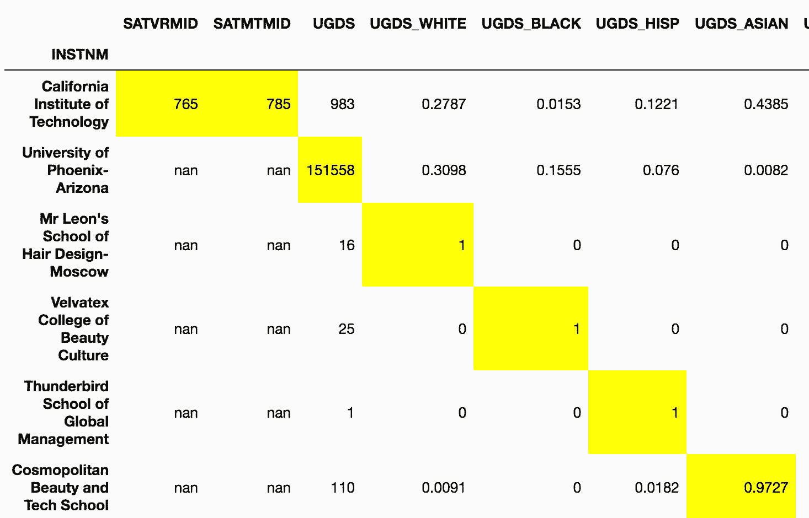

### 更多

```py
# 用axis参数可以高亮每行的最大值
 In[74]: college = pd.read_csv('data/college.csv', index_col='INSTNM')
         college_ugds = college.filter(like='UGDS_').head()
         college_ugds.style.highlight_max(axis='columns')
Out[74]: 
```

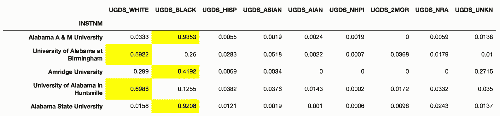

```py
 In[75]: pd.Timedelta(1, unit='Y')
Out[75]: Timedelta('365 days 05:49:12') 
```

## 7\. 用链式方法重现idxmax

```py
# 和前面一样，只选出数值列
 In[76]: college = pd.read_csv('data/college.csv', index_col='INSTNM')

         cols = ['MD_EARN_WNE_P10', 'GRAD_DEBT_MDN_SUPP']
         for col in cols:
             college[col] = pd.to_numeric(college[col], errors='coerce')

         college_n = college.select_dtypes(include=[np.number])
         criteria = college_n.nunique() == 2
         binary_cols = college_n.columns[criteria].tolist()
         college_n = college_n.drop(labels=binary_cols, axis='columns')
 In[77]: college_n.max().head()
Out[77]: SATVRMID         765.0
         SATMTMID         785.0
         UGDS          151558.0
         UGDS_WHITE         1.0
         UGDS_BLACK         1.0
         dtype: float64 
```

```py
# college_n.max()可以选出每列的最大值，用eq方法比较DataFrame的每个值和该列的最大值
 In[78]: college_n.eq(college_n.max()).head()
Out[78]: 
```

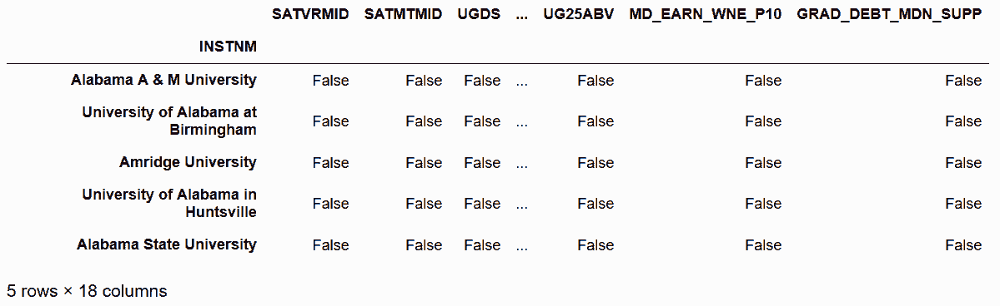

```py
# 用any方法，选出至少包含一个True值的行
 In[79]: has_row_max = college_n.eq(college_n.max()).any(axis='columns')
         has_row_max.head()
Out[79]: INSTNM
         Alabama A & M University               False
         University of Alabama at Birmingham    False
         Amridge University                     False
         University of Alabama in Huntsville    False
         Alabama State University               False
         dtype: bool 
```

```py
# 因为只有18列，has_row_max最多只能有18个True，来看下实际共有多少个
 In[80]: college_n.shape
Out[80]: (7535, 18)

 In[81]: has_row_max.sum()
Out[81]: 401 
```

```py
# 结果很奇怪，这是因为许多百分比的列的最大值是1。转而使用cumsum()累积求和
 In[82]: has_row_max.sum()
 In[83]: college_n.eq(college_n.max()).cumsum()
Out[83]: 
```

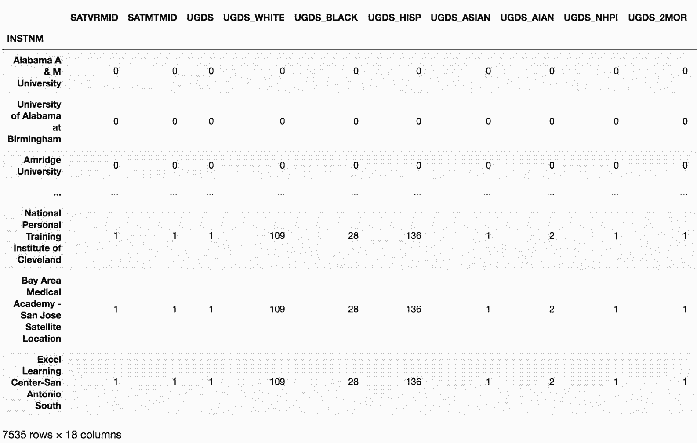

```py
# 一些列只有一个最大值，比如SATVRMID和SATMTMID，UGDS_WHITE列却有许多最大值。有109所学校的学生100%是白人。如果再使用一次cunsum，1在每列中就只出现一次，而且会是最大值首次出现的位置：
>>> college_n.eq(college_n.max()).cumsum().cumsum() 
```

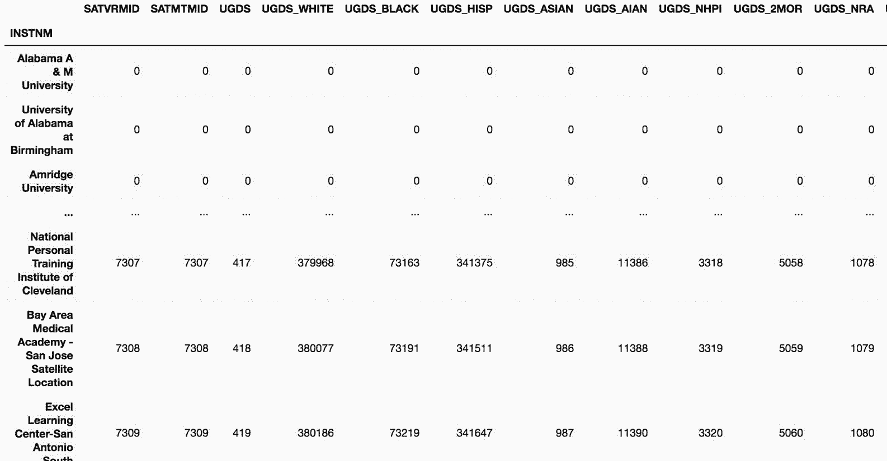

```py
# 现在就可以用eq方法去和1进行比较，然后用any方法，选出所有至少包含一个True值的行
 In[84]: has_row_max2 = college_n.eq(college_n.max())\
                                 .cumsum()\
                                 .cumsum()\
                                 .eq(1)\
                                 .any(axis='columns')
         has_row_max2.head()
Out[84]: INSTNM
         Alabama A & M University               False
         University of Alabama at Birmingham    False
         Amridge University                     False
         University of Alabama in Huntsville    False
         Alabama State University               False
         dtype: bool 
```

```py
# 查看有多少True值
 In[85]: has_row_max2.sum()
Out[85]: 16 
```

```py
# 直接通过布尔索引选出这些学校
 In[86]: idxmax_cols = has_row_max2[has_row_max2].index
         idxmax_cols
Out[86]: Index(['Thunderbird School of Global Management',
                'Southwest University of Visual Arts-Tucson', 'ABC Beauty College Inc',
                'Velvatex College of Beauty Culture',
                'California Institute of Technology',
                'Le Cordon Bleu College of Culinary Arts-San Francisco',
                'MTI Business College Inc', 'Dongguk University-Los Angeles',
                'Mr Leon's School of Hair Design-Moscow',
                'Haskell Indian Nations University', 'LIU Brentwood',
                'Medical College of Wisconsin', 'Palau Community College',
                'California University of Management and Sciences',
                'Cosmopolitan Beauty and Tech School', 'University of Phoenix-Arizona'],
                dtype='object', name='INSTNM') 
```

```py
# 和idxmax方法的结果比较
 In[87]: set(college_n.idxmax().unique()) == set(idxmax_cols)
Out[87]: True 
```

### 更多

```py
# 耗时比较
 In[88]: %timeit college_n.idxmax().values
         1.11 ms ± 50.9 µs per loop (mean ± std. dev. of 7 runs, 1000 loops each)

Out[89]: %timeit college_n.eq(college_n.max())\
                                       .cumsum()\
                                       .cumsum()\
                                       .eq(1)\
                                       .any(axis='columns')\
                                       [lambda x: x].index
         5.26 ms ± 35.6 µs per loop (mean ± std. dev. of 7 runs, 100 loops each) 
```

## 8\. 找到最常见的最大值

```py
# 读取college，过滤出只包含本科生种族比例信息的列
 In[90]: pd.options.display.max_rows= 40
 In[91]: college = pd.read_csv('data/college.csv', index_col='INSTNM')
         college_ugds = college.filter(like='UGDS_')
         college_ugds.head()
Out[91]: 
```

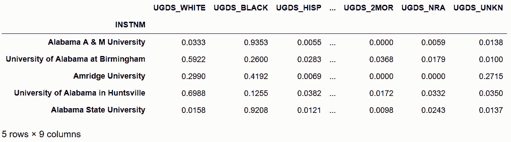

```py
# 用idxmax方法选出每行种族比例最高的列名
 In[92]: highest_percentage_race = college_ugds.idxmax(axis='columns')
         highest_percentage_race.head()
Out[92]: INSTNM
         Alabama A & M University               UGDS_BLACK
         University of Alabama at Birmingham    UGDS_WHITE
         Amridge University                     UGDS_BLACK
         University of Alabama in Huntsville    UGDS_WHITE
         Alabama State University               UGDS_BLACK
         dtype: object 
```

```py
# 用value_counts，查看最大值的分布
 In[93]: highest_percentage_race.value_counts(normalize=True)
Out[93]: UGDS_WHITE    0.670352
         UGDS_BLACK    0.151586
         UGDS_HISP     0.129473
         UGDS_UNKN     0.023422
         UGDS_ASIAN    0.012074
         UGDS_AIAN     0.006110
         UGDS_NRA      0.004073
         UGDS_NHPI     0.001746
         UGDS_2MOR     0.001164
         dtype: float64 
```

### 更多

```py
# 对于黑人比例最高的学校，排名第二的种族的分布情况
 In[94]: college_black = college_ugds[highest_percentage_race == 'UGDS_BLACK']
         college_black = college_black.drop('UGDS_BLACK', axis='columns')
         college_black.idxmax(axis='columns').value_counts(normalize=True)
Out[94]: UGDS_WHITE    0.670352
         UGDS_BLACK    0.151586
         UGDS_HISP     0.129473
         UGDS_UNKN     0.023422
         UGDS_ASIAN    0.012074
         UGDS_AIAN     0.006110
         UGDS_NRA      0.004073
         UGDS_NHPI     0.001746
         UGDS_2MOR     0.001164
         dtype: float64 
```

