# 第07章 分组聚合、过滤、转换


```py
 In[1]: import pandas as pd
        import numpy as np 
```

## 1\. 定义聚合

```py
# 读取flights数据集，查询头部
 In[2]: flights = pd.read_csv('data/flights.csv')
        flights.head()
Out[2]: 
```

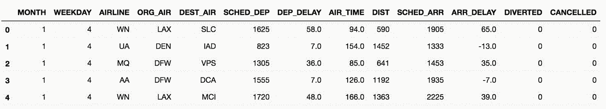

```py
# 按照AIRLINE分组，使用agg方法，传入要聚合的列和聚合函数
 In[3]: flights.groupby('AIRLINE').agg({'ARR_DELAY':'mean'}).head()
Out[3]: 
```

```py
# 或者要选取的列使用索引，聚合函数作为字符串传入agg
 In[4]: flights.groupby('AIRLINE')['ARR_DELAY'].agg('mean').head()
Out[4]: 
AIRLINE
AA     5.542661
AS    -0.833333
B6     8.692593
DL     0.339691
EV     7.034580
Name: ARR_DELAY, dtype: float64 
```

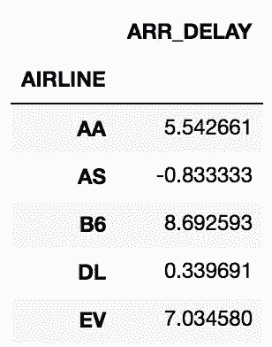

```py
# 也可以向agg中传入NumPy的mean函数
 In[5]: flights.groupby('AIRLINE')['ARR_DELAY'].agg(np.mean).head()
Out[5]: 
```


```py
# 也可以直接使用mean()函数
 In[6]: flights.groupby('AIRLINE')['ARR_DELAY'].mean().head()
Out[6]: 
```


### 原理

```py
# groupby方法产生的是一个DataFrameGroupBy对象
 In[7]: grouped = flights.groupby('AIRLINE')
        type(grouped)
Out[7]: pandas.core.groupby.DataFrameGroupBy 
```

### 更多

```py
# 如果agg接收的不是聚合函数，则会导致异常
 In[8]: flights.groupby('AIRLINE')['ARR_DELAY'].agg(np.sqrt)
/Users/Ted/anaconda/lib/python3.6/site-packages/pandas/core/groupby.py:842: RuntimeWarning: invalid value encountered in sqrt
  f = lambda x: func(x, *args, **kwargs)
/Users/Ted/anaconda/lib/python3.6/site-packages/pandas/core/groupby.py:3015: RuntimeWarning: invalid value encountered in sqrt
  output = func(group, *args, **kwargs)

---------------------------------------------------------------------------
ValueError                                Traceback (most recent call last)
/Users/Ted/anaconda/lib/python3.6/site-packages/pandas/core/groupby.py in agg_series(self, obj, func)
   2177         try:
-> 2178             return self._aggregate_series_fast(obj, func)
   2179         except Exception:

/Users/Ted/anaconda/lib/python3.6/site-packages/pandas/core/groupby.py in _aggregate_series_fast(self, obj, func)
   2197                                     dummy)
-> 2198         result, counts = grouper.get_result()
   2199         return result, counts

pandas/_libs/src/reduce.pyx in pandas._libs.lib.SeriesGrouper.get_result (pandas/_libs/lib.c:39105)()

pandas/_libs/src/reduce.pyx in pandas._libs.lib.SeriesGrouper.get_result (pandas/_libs/lib.c:38973)()

pandas/_libs/src/reduce.pyx in pandas._libs.lib._get_result_array (pandas/_libs/lib.c:32039)()

ValueError: function does not reduce

During handling of the above exception, another exception occurred:

ValueError                                Traceback (most recent call last)
/Users/Ted/anaconda/lib/python3.6/site-packages/pandas/core/groupby.py in aggregate(self, func_or_funcs, *args, **kwargs)
   2882             try:
-> 2883                 return self._python_agg_general(func_or_funcs, *args, **kwargs)
   2884             except Exception:

/Users/Ted/anaconda/lib/python3.6/site-packages/pandas/core/groupby.py in _python_agg_general(self, func, *args, **kwargs)
    847             try:
--> 848                 result, counts = self.grouper.agg_series(obj, f)
    849                 output[name] = self._try_cast(result, obj, numeric_only=True)

/Users/Ted/anaconda/lib/python3.6/site-packages/pandas/core/groupby.py in agg_series(self, obj, func)
   2179         except Exception:
-> 2180             return self._aggregate_series_pure_python(obj, func)
   2181 

/Users/Ted/anaconda/lib/python3.6/site-packages/pandas/core/groupby.py in _aggregate_series_pure_python(self, obj, func)
   2214                         isinstance(res, list)):
-> 2215                     raise ValueError('Function does not reduce')
   2216                 result = np.empty(ngroups, dtype='O')

ValueError: Function does not reduce

During handling of the above exception, another exception occurred:

Exception                                 Traceback (most recent call last)
<ipython-input-8-2bcc9ccfec77> in <module>()
----> 1 flights.groupby('AIRLINE')['ARR_DELAY'].agg(np.sqrt)

/Users/Ted/anaconda/lib/python3.6/site-packages/pandas/core/groupby.py in aggregate(self, func_or_funcs, *args, **kwargs)
   2883                 return self._python_agg_general(func_or_funcs, *args, **kwargs)
   2884             except Exception:
-> 2885                 result = self._aggregate_named(func_or_funcs, *args, **kwargs)
   2886 
   2887             index = Index(sorted(result), name=self.grouper.names[0])

/Users/Ted/anaconda/lib/python3.6/site-packages/pandas/core/groupby.py in _aggregate_named(self, func, *args, **kwargs)
   3015             output = func(group, *args, **kwargs)
   3016             if isinstance(output, (Series, Index, np.ndarray)):
-> 3017                 raise Exception('Must produce aggregated value')
   3018             result[name] = self._try_cast(output, group)
   3019 

Exception: Must produce aggregated value 
```

## 2\. 用多个列和函数进行分组和聚合

```py
# 导入数据
 In[9]: flights = pd.read_csv('data/flights.csv')
        flights.head()
Out[9]: 
```

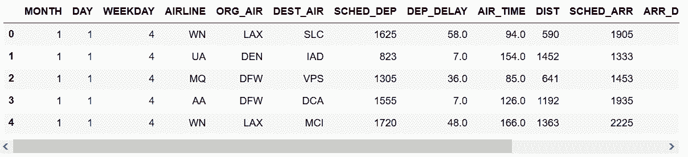

```py
# 每家航空公司每周平均每天取消的航班数
 In[10]: flights.groupby(['AIRLINE', 'WEEKDAY'])['CANCELLED'].agg('sum').head(7)
Out[10]: AIRLINE  WEEKDAY
         AA       1          41
                  2           9
                  3          16
                  4          20
                  5          18
                  6          21
                  7          29
         Name: CANCELLED, dtype: int64 
```

```py
# 分组可以是多组，选取可以是多组，聚合函数也可以是多个
# 每周每家航空公司取消或改变航线的航班总数和比例
 In[11]: flights.groupby(['AIRLINE', 'WEEKDAY'])['CANCELLED', 'DIVERTED'].agg(['sum', 'mean']).head(7)
Out[11]: 
```

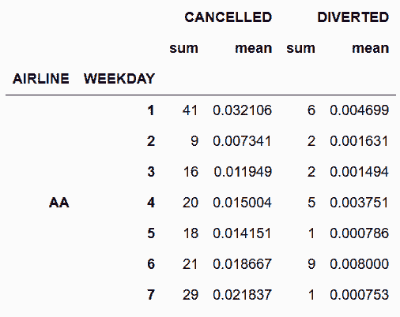

```py
# 用列表和嵌套字典对多列分组和聚合
# 对于每条航线，找到总航班数，取消的数量和比例，飞行时间的平均时间和方差
 In[12]: group_cols = ['ORG_AIR', 'DEST_AIR']
         agg_dict = {'CANCELLED':['sum', 'mean', 'size'], 
                     'AIR_TIME':['mean', 'var']}
         flights.groupby(group_cols).agg(agg_dict).head()
         # flights.groupby(['ORG_AIR', 'DEST_AIR']).agg({'CANCELLED': ['sum', 'mean', 'size'], 
         #                                               'AIR_TIME':['mean', 'var']}).head()
Out[12]: 
```

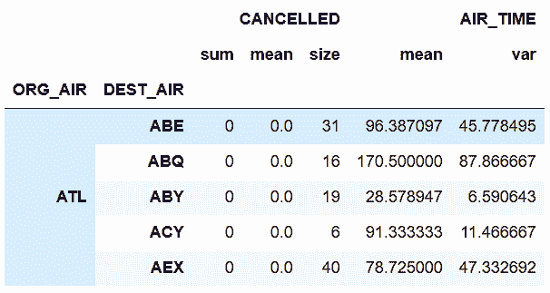

## 3\. 分组后去除多级索引

```py
# 读取数据
 In[13]: flights = pd.read_csv('data/flights.csv')
         flights.head()
Out[13]: 
```

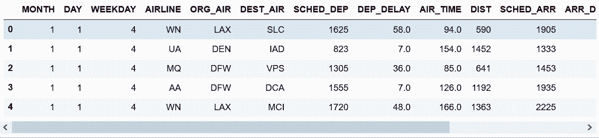

```py
# 按'AIRLINE', 'WEEKDAY'分组，分别对DIST和ARR_DELAY聚合
 In[14]: airline_info = flights.groupby(['AIRLINE', 'WEEKDAY'])\
                               .agg({'DIST':['sum', 'mean'], 
                                     'ARR_DELAY':['min', 'max']}).astype(int)
         airline_info.head()
Out[14]: 
```

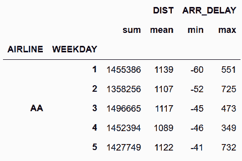

```py
# 行和列都有两级索引，get_level_values(0)取出第一级索引
 In[15]: level0 = airline_info.columns.get_level_values(0)
         level0
Out[15]: Index(['DIST', 'DIST', 'ARR_DELAY', 'ARR_DELAY'], dtype='object') 
```

```py
# get_level_values(1)取出第二级索引
 In[16]: level1 = airline_info.columns.get_level_values(1)
         level1
Out[16]: Index(['sum', 'mean', 'min', 'max'], dtype='object') 
```

```py
# 一级和二级索引拼接成新的列索引
 In[17]: airline_info.columns = level0 + '_' + level1
 In[18]: airline_info.head(7)
Out[18]: 
```

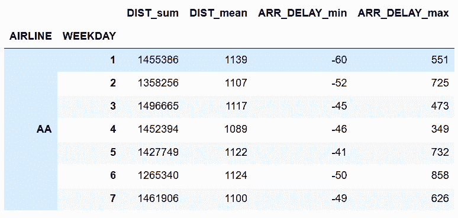

```py
# reset_index()可以将行索引变成单级
 In[19]: airline_info.reset_index().head(7)
Out[19]: 
```

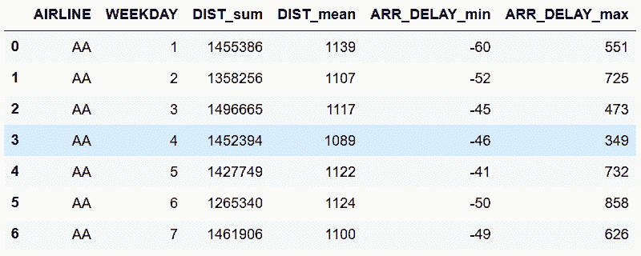

### 更多

```py
# Pandas默认会在分组运算后，将所有分组的列放在索引中，as_index设为False可以避免这么做。分组后使用reset_index，也可以达到同样的效果
 In[20]: flights.groupby(['AIRLINE'], as_index=False)['DIST'].agg('mean').round(0)
Out[20]: 
```

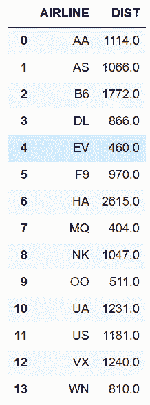

```py
# 上面这么做，会默认对AIRLINE排序，sort设为False可以避免排序
 In[21]: flights.groupby(['AIRLINE'], as_index=False, sort=False)['DIST'].agg('mean')
Out[21]: 
```

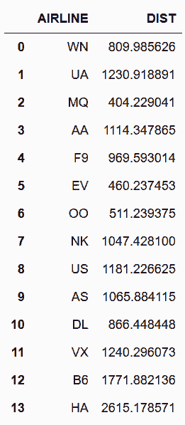

## 4\. 自定义聚合函数

```py
 In[22]: college = pd.read_csv('data/college.csv')
         college.head()
Out[22]: 
```


```py
# 求出每个州的本科生的平均值和标准差
 In[23]: college.groupby('STABBR')['UGDS'].agg(['mean', 'std']).round(0).head()
Out[23]: 
```

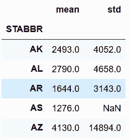

```py
# 远离平均值的标准差的最大个数，写一个自定义函数
 In[24]: def max_deviation(s):
             std_score = (s - s.mean()) / s.std()
             return std_score.abs().max()
# agg聚合函数在调用方法时，直接引入自定义的函数名
 In[25]: college.groupby('STABBR')['UGDS'].agg(max_deviation).round(1).head()
Out[25]: STABBR
         AK    2.6
         AL    5.8
         AR    6.3
         AS    NaN
         AZ    9.9
         Name: UGDS, dtype: float64 
```

### 更多

```py
# 自定义的聚合函数也适用于多个数值列
 In[26]: college.groupby('STABBR')['UGDS', 'SATVRMID', 'SATMTMID'].agg(max_deviation).round(1).head()
Out[26]: 
```

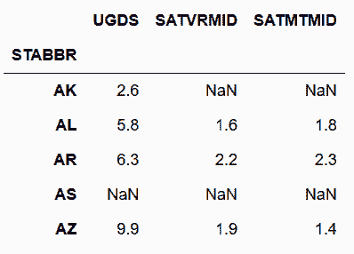

```py
# 自定义聚合函数也可以和预先定义的函数一起使用
 In[27]: college.groupby(['STABBR', 'RELAFFIL'])['UGDS', 'SATVRMID', 'SATMTMID']\
                .agg([max_deviation, 'mean', 'std']).round(1).head()
Out[27]: 
```

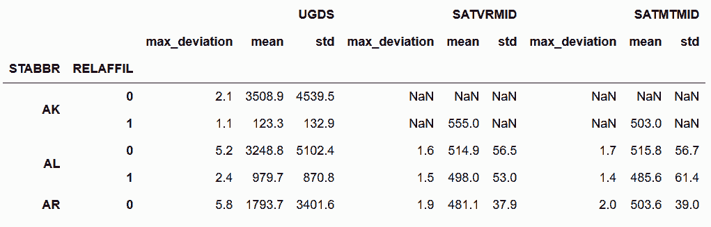

```py
# Pandas使用函数名作为返回列的名字；你可以直接使用rename方法修改，或通过__name__属性修改
 In[28]: max_deviation.__name__
Out[28]: 'max_deviation'

 In[29]: max_deviation.__name__ = 'Max Deviation'
 In[30]: college.groupby(['STABBR', 'RELAFFIL'])['UGDS', 'SATVRMID', 'SATMTMID']\
                .agg([max_deviation, 'mean', 'std']).round(1).head()
Out[30]: 
```

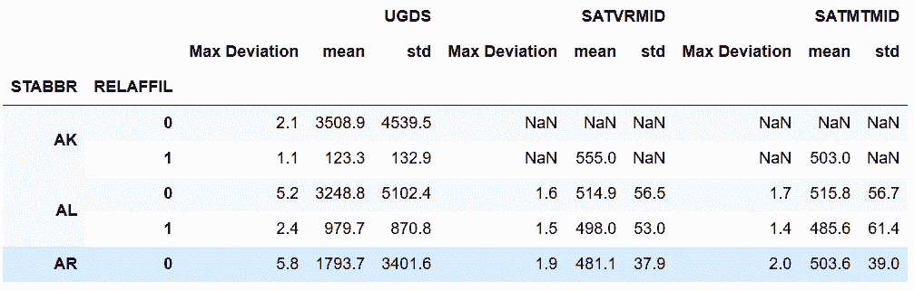

## 5\. 用 *args 和 **kwargs 自定义聚合函数

```py
# 用inspect模块查看groupby对象的agg方法的签名
 In[31]: college = pd.read_csv('data/college.csv')
         grouped = college.groupby(['STABBR', 'RELAFFIL'])
 In[32]: import inspect
         inspect.signature(grouped.agg)
Out[32]: <Signature (arg, *args, **kwargs)> 
```

### 如何做

```py
# 自定义一个返回去本科生人数在1000和3000之间的比例的函数
 In[33]: def pct_between_1_3k(s):
             return s.between(1000, 3000).mean()
# 用州和宗教分组，再聚合
 In[34]: college.groupby(['STABBR', 'RELAFFIL'])['UGDS'].agg(pct_between_1_3k).head(9)
Out[34]: 
STABBR  RELAFFIL
AK      0           0.142857
        1           0.000000
AL      0           0.236111
        1           0.333333
AR      0           0.279412
        1           0.111111
AS      0           1.000000
AZ      0           0.096774
        1           0.000000
Name: UGDS, dtype: float64 
```

```py
# 但是这个函数不能让用户自定义上下限，再新写一个函数
 In[35]: def pct_between(s, low, high):
             return s.between(low, high).mean()
# 使用这个自定义聚合函数，并传入最大和最小值
 In[36]: college.groupby(['STABBR', 'RELAFFIL'])['UGDS'].agg(pct_between, 1000, 10000).head(9)
Out[36]: 
STABBR  RELAFFIL
AK      0           0.428571
        1           0.000000
AL      0           0.458333
        1           0.375000
AR      0           0.397059
        1           0.166667
AS      0           1.000000
AZ      0           0.233871
        1           0.111111
Name: UGDS, dtype: float64 
```

### 原理

```py
# 显示指定最大和最小值
 In[37]: college.groupby(['STABBR', 'RELAFFIL'])['UGDS'].agg(pct_between, high=10000, low=1000).head(9)
Out[37]: 
STABBR  RELAFFIL
AK      0           0.428571
        1           0.000000
AL      0           0.458333
        1           0.375000
AR      0           0.397059
        1           0.166667
AS      0           1.000000
AZ      0           0.233871
        1           0.111111
Name: UGDS, dtype: float64 
```

```py
# 也可以关键字参数和非关键字参数混合使用，只要非关键字参数在后面
 In[38]: college.groupby(['STABBR', 'RELAFFIL'])['UGDS'].agg(pct_between, 1000, high=10000).head(9)
Out[38]: 
STABBR  RELAFFIL
AK      0           0.428571
        1           0.000000
AL      0           0.458333
        1           0.375000
AR      0           0.397059
        1           0.166667
AS      0           1.000000
AZ      0           0.233871
        1           0.111111
Name: UGDS, dtype: float64 
```

### 更多

```py
# Pandas不支持多重聚合时，使用参数
 In[39]: college.groupby(['STABBR', 'RELAFFIL'])['UGDS'].agg(['mean', pct_between], low=100, high=1000)
---------------------------------------------------------------------------
TypeError                                 Traceback (most recent call last)
<ipython-input-39-3e3e18919cf9> in <module>()
----> 1 college.groupby(['STABBR', 'RELAFFIL'])['UGDS'].agg(['mean', pct_between], low=100, high=1000)

/Users/Ted/anaconda/lib/python3.6/site-packages/pandas/core/groupby.py in aggregate(self, func_or_funcs, *args, **kwargs)
   2871         if hasattr(func_or_funcs, '__iter__'):
   2872             ret = self._aggregate_multiple_funcs(func_or_funcs,
-> 2873                                                  (_level or 0) + 1)
   2874         else:
   2875             cyfunc = self._is_cython_func(func_or_funcs)

/Users/Ted/anaconda/lib/python3.6/site-packages/pandas/core/groupby.py in _aggregate_multiple_funcs(self, arg, _level)
   2944                 obj._reset_cache()
   2945                 obj._selection = name
-> 2946             results[name] = obj.aggregate(func)
   2947 
   2948         if isinstance(list(compat.itervalues(results))[0],

/Users/Ted/anaconda/lib/python3.6/site-packages/pandas/core/groupby.py in aggregate(self, func_or_funcs, *args, **kwargs)
   2878 
   2879             if self.grouper.nkeys > 1:
-> 2880                 return self._python_agg_general(func_or_funcs, *args, **kwargs)
   2881 
   2882             try:

/Users/Ted/anaconda/lib/python3.6/site-packages/pandas/core/groupby.py in _python_agg_general(self, func, *args, **kwargs)
    852 
    853         if len(output) == 0:
--> 854             return self._python_apply_general(f)
    855 
    856         if self.grouper._filter_empty_groups:

/Users/Ted/anaconda/lib/python3.6/site-packages/pandas/core/groupby.py in _python_apply_general(self, f)
    718     def _python_apply_general(self, f):
    719         keys, values, mutated = self.grouper.apply(f, self._selected_obj,
--> 720                                                    self.axis)
    721 
    722         return self._wrap_applied_output(

/Users/Ted/anaconda/lib/python3.6/site-packages/pandas/core/groupby.py in apply(self, f, data, axis)
   1800             # group might be modified
   1801             group_axes = _get_axes(group)
-> 1802             res = f(group)
   1803             if not _is_indexed_like(res, group_axes):
   1804                 mutated = True

/Users/Ted/anaconda/lib/python3.6/site-packages/pandas/core/groupby.py in <lambda>(x)
    840     def _python_agg_general(self, func, *args, **kwargs):
    841         func = self._is_builtin_func(func)
--> 842         f = lambda x: func(x, *args, **kwargs)
    843 
    844         # iterate through "columns" ex exclusions to populate output dict

TypeError: pct_between() missing 2 required positional arguments: 'low' and 'high' 
```

```py
# 用闭包自定义聚合函数
 In[40]: def make_agg_func(func, name, *args, **kwargs):
             def wrapper(x):
                 return func(x, *args, **kwargs)
             wrapper.__name__ = name
             return wrapper

         my_agg1 = make_agg_func(pct_between, 'pct_1_3k', low=1000, high=3000)
         my_agg2 = make_agg_func(pct_between, 'pct_10_30k', 10000, 30000)['UGDS'].agg(pct_between, 1000, high=10000).head(9)
Out[41]: 
```

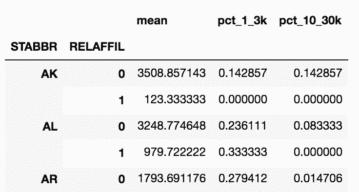

## 6\. 检查分组对象

```py
# 查看分组对象的类型
 In[42]: college = pd.read_csv('data/college.csv')
         grouped = college.groupby(['STABBR', 'RELAFFIL'])
         type(grouped)
Out[42]: pandas.core.groupby.DataFrameGroupBy 
```

```py
# 用dir函数找到该对象所有的可用函数
 In[43]: print([attr for attr in dir(grouped) if not attr.startswith('_')])
['CITY', 'CURROPER', 'DISTANCEONLY', 'GRAD_DEBT_MDN_SUPP', 'HBCU', 'INSTNM', 'MD_EARN_WNE_P10', 'MENONLY', 'PCTFLOAN', 'PCTPELL', 'PPTUG_EF', 'RELAFFIL', 'SATMTMID', 'SATVRMID', 'STABBR', 'UG25ABV', 'UGDS', 'UGDS_2MOR', 'UGDS_AIAN', 'UGDS_ASIAN', 'UGDS_BLACK', 'UGDS_HISP', 'UGDS_NHPI', 'UGDS_NRA', 'UGDS_UNKN', 'UGDS_WHITE', 'WOMENONLY', 'agg', 'aggregate', 'all', 'any', 'apply', 'backfill', 'bfill', 'boxplot', 'corr', 'corrwith', 'count', 'cov', 'cumcount', 'cummax', 'cummin', 'cumprod', 'cumsum', 'describe', 'diff', 'dtypes', 'expanding', 'ffill', 'fillna', 'filter', 'first', 'get_group', 'groups', 'head', 'hist', 'idxmax', 'idxmin', 'indices', 'last', 'mad', 'max', 'mean', 'median', 'min', 'ndim', 'ngroup', 'ngroups', 'nth', 'nunique', 'ohlc', 'pad', 'pct_change', 'plot', 'prod', 'quantile', 'rank', 'resample', 'rolling', 'sem', 'shift', 'size', 'skew', 'std', 'sum', 'tail', 'take', 'transform', 'tshift', 'var'] 
```

```py
# 用ngroups属性查看分组的数量
 In[44]: grouped.ngroups
Out[44]: 112 
```

```py
# 查看每个分组的唯一识别标签，groups属性是一个字典，包含每个独立分组与行索引标签的对应
 In[45]: groups = list(grouped.groups.keys())
         groups[:6]
Out[45]: [('AK', 0), ('AK', 1), ('AL', 0), ('AL', 1), ('AR', 0), ('AR', 1)] 
```

```py
# 用get_group，传入分组标签的元组。例如，获取佛罗里达州所有与宗教相关的学校
 In[46]: grouped.get_group(('FL', 1)).head()
Out[46]: 
```

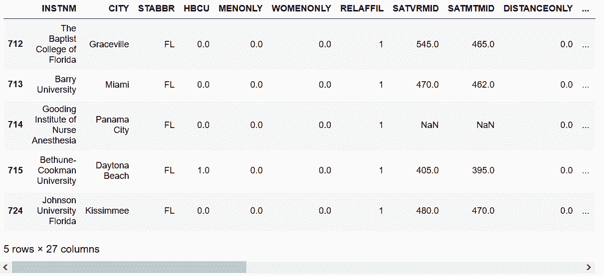

```py
# groupby对象是一个可迭代对象，可以挨个查看每个独立分组
 In[47]: from IPython.display import display
 In[48]: i = 0
         for name, group in grouped:
             print(name)
             display(group.head(2))
             i += 1
             if i == 5:
                 break 
```

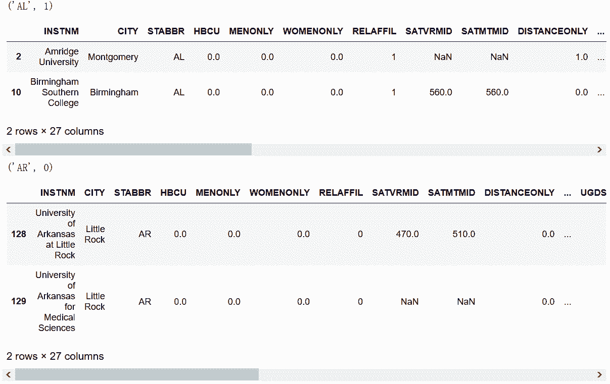

```py
# groupby对象使用head方法，可以在一个DataFrame钟显示每个分组的头几行
 In[49]: grouped.head(2).head(6)
Out[49]: 
```

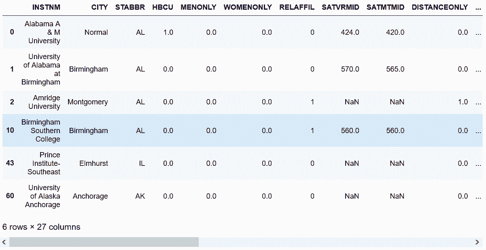

### 更多

```py
# nth方法可以选出每个分组指定行的数据，下面选出的是第1行和最后1行
 In[50]: grouped.nth([1, -1]).head(8)
Out[50]: 
```

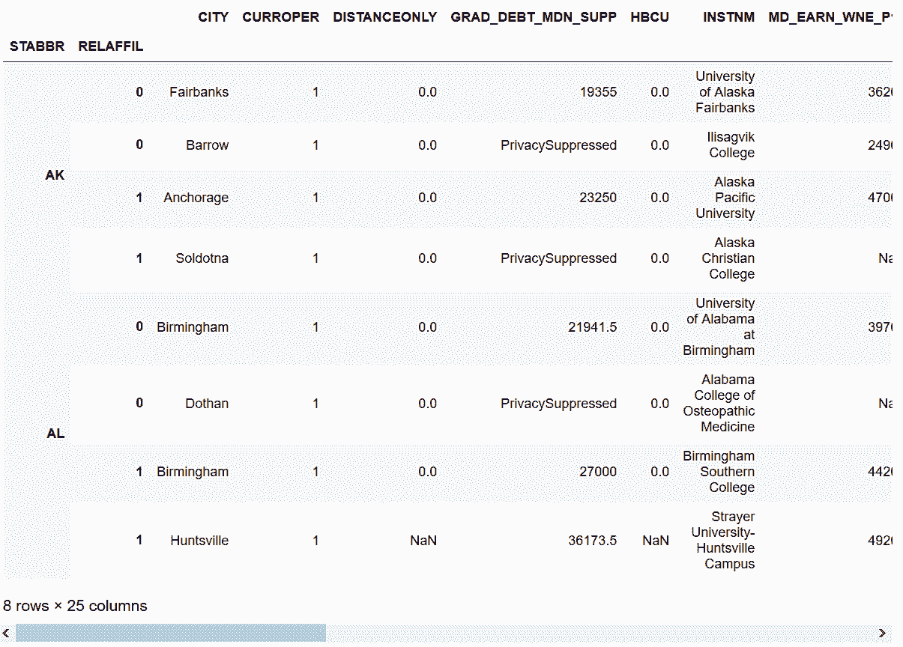

## 7\. 过滤状态

```py
 In[51]: college = pd.read_csv('data/college.csv', index_col='INSTNM')
         grouped = college.groupby('STABBR')
         grouped.ngroups
Out[51]: 59 
```

```py
# 这等于求出不同州的个数，nunique()可以得到同样的结果
 In[52]: college['STABBR'].nunique()
Out[52]: 59 
```

```py
# 自定义一个计算少数民族学生总比例的函数，如果比例大于阈值，还返回True
 In[53]: def check_minority(df, threshold):
             minority_pct = 1 - df['UGDS_WHITE']
             total_minority = (df['UGDS'] * minority_pct).sum()
             total_ugds = df['UGDS'].sum()
             total_minority_pct = total_minority / total_ugds
             return total_minority_pct > threshold
# grouped变量有一个filter方法，可以接收一个自定义函数，决定是否保留一个分组
 In[54]: college_filtered = grouped.filter(check_minority, threshold=.5)
         college_filtered.head()
Out[54]: 
```

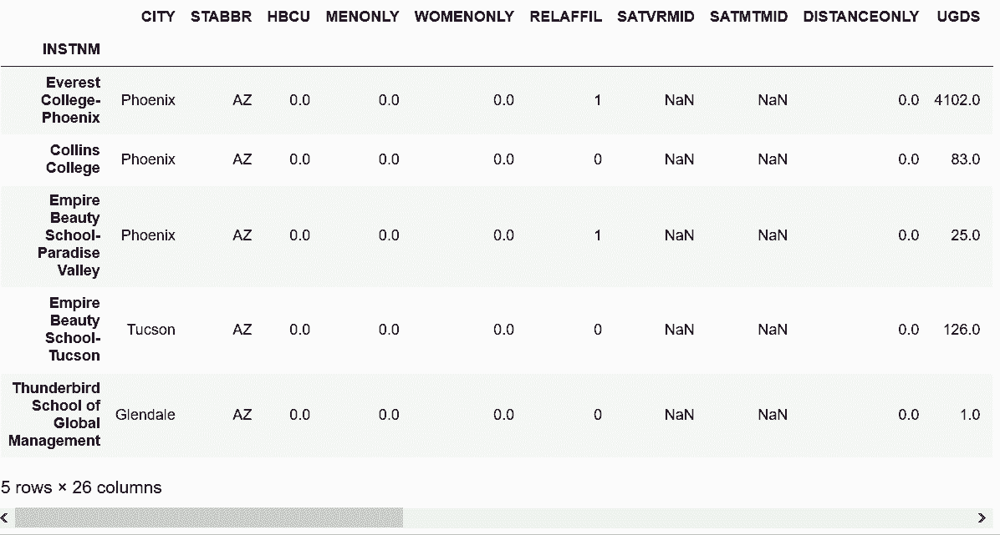

```py
# 通过查看形状，可以看到过滤了60%，只有20个州的少数学生占据多数
 In[55]: college.shape
Out[55]: (7535, 26)

 In[56]: college_filtered.shape
Out[56]: (3028, 26)

 In[57]: college_filtered['STABBR'].nunique()
Out[57]: 20 
```

### 更多

```py
# 用一些不同的阈值，检查形状和不同州的个数
 In[58]: college_filtered_20 = grouped.filter(check_minority, threshold=.2)
        college_filtered_20.shape
Out[58]: (7461, 26)

 In[59]: college_filtered_20['STABBR'].nunique()
Out[59]: 57

 In[60]: college_filtered_70 = grouped.filter(check_minority, threshold=.7)
         college_filtered_70.shape
Out[60]: (957, 26)

 In[61]: college_filtered_70['STABBR'].nunique()
Out[61]: 10

 In[62]: college_filtered_95 = grouped.filter(check_minority, threshold=.95)
         college_filtered_95.shape
Out[62]: (156, 26) 
```

## 8\. 减肥对赌

```py
# 读取减肥数据集，查看一月的数据
 In[63]: weight_loss = pd.read_csv('data/weight_loss.csv')
         weight_loss.query('Month == "Jan"')
Out[63]: 
```

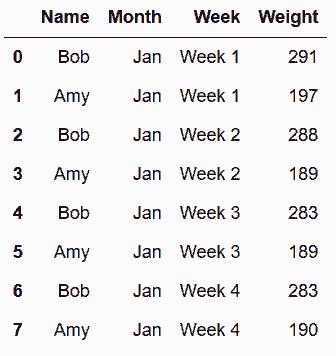

```py
# 定义一个求减肥比例的函数
 In[64]: def find_perc_loss(s):
            return (s - s.iloc[0]) / s.iloc[0]
# 查看Bob在一月的减肥成果
 In[65]: bob_jan = weight_loss.query('Name=="Bob" and Month=="Jan"')
         find_perc_loss(bob_jan['Weight'])
Out[65]: 0    0.000000
         2   -0.010309
         4   -0.027491
         6   -0.027491
         Name: Weight, dtype: float64 
```

```py
# 对Name和Month进行分组，然后使用transform方法，传入函数，对数值进行转换
 In[66]: pcnt_loss = weight_loss.groupby(['Name', 'Month'])['Weight'].transform(find_perc_loss)
         pcnt_loss.head(8)
Out[66]: 0    0.000000
         1    0.000000
         2   -0.010309
         3   -0.040609
         4   -0.027491
         5   -0.040609
         6   -0.027491
         7   -0.035533
         Name: Weight, dtype: float64 
```

```py
# transform之后的结果，行数不变，可以赋值给原始DataFrame作为一个新列；
# 为了缩短输出，只选择Bob的前两个月数据
 In[67]: weight_loss['Perc Weight Loss'] = pcnt_loss.round(3)
         weight_loss.query('Name=="Bob" and Month in ["Jan", "Feb"]')
Out[67]: 
```

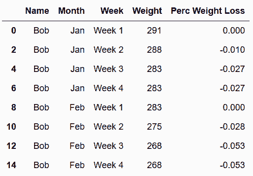

```py
# 因为最重要的是每个月的第4周，只选择第4周的数据
 In[68]: week4 = weight_loss.query('Week == "Week 4"')
         week4
Out[68]: 
```

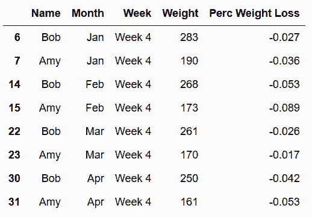

```py
# 用pivot重构DataFrame，让Amy和Bob的数据并排放置
 In[69]: winner = week4.pivot(index='Month', columns='Name', values='Perc Weight Loss')
         winner
Out[69]: 
```

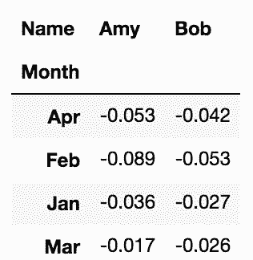

```py
# 用where方法选出每月的赢家
 In[70]: winner['Winner'] = np.where(winner['Amy'] < winner['Bob'], 'Amy', 'Bob')
         winner.style.highlight_min(axis=1)
Out[70]: 
```

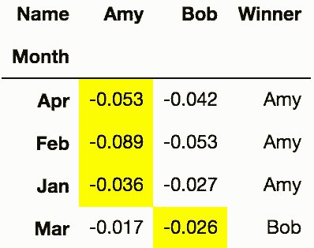

```py
# 用value_counts()返回最后的比分
 In[71]: winner.Winner.value_counts()
Out[71]: Amy    3
         Bob    1
         Name: Winner, dtype: int64 
```

### 更多

```py
# Pandas默认是按字母排序的
 In[72]: week4a = week4.copy()
         month_chron = week4a['Month'].unique() 
         month_chron
Out[72]: array(['Jan', 'Feb', 'Mar', 'Apr'], dtype=object) 
```

```py
# 转换为Categorical变量，可以做成按时间排序
 In[73]: week4a['Month'] = pd.Categorical(week4a['Month'], 
                                          categories=month_chron,
                                          ordered=True)
         week4a.pivot(index='Month', columns='Name', values='Perc Weight Loss')
Out[73]: 
```

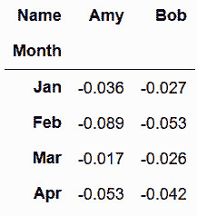

## 9\. 用apply计算每州的加权平均SAT分数

```py
# 读取college，'UGDS', 'SATMTMID', 'SATVRMID'三列如果有缺失值则删除行
 In[74]: college = pd.read_csv('data/college.csv')
         subset = ['UGDS', 'SATMTMID', 'SATVRMID']
         college2 = college.dropna(subset=subset)
         college.shape
Out[74]: (7535, 27)

 In[75]: college2.shape
Out[75]: (1184, 27) 
```

```py
# 自定义一个求SAT数学成绩的加权平均值的函数
 In[76]: def weighted_math_average(df):
             weighted_math = df['UGDS'] * df['SATMTMID']
             return int(weighted_math.sum() / df['UGDS'].sum())
# 按州分组，并调用apply方法，传入自定义函数
 In[77]: college2.groupby('STABBR').apply(weighted_math_average).head()
Out[77]: STABBR
         AK    503
         AL    536
         AR    529
         AZ    569
         CA    564
         dtype: int64 
```

```py
# 效果同上
 In[78]: college2.groupby('STABBR').agg(weighted_math_average).head()
Out[78]: 
```

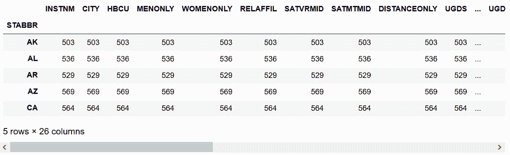

```py
# 如果将列限制到SATMTMID，会报错。这是因为不能访问UGDS。
 In[79]: college2.groupby('STABBR')['SATMTMID'].agg(weighted_math_average)
---------------------------------------------------------------------------
TypeError                                 Traceback (most recent call last)
pandas/_libs/index.pyx in pandas._libs.index.IndexEngine.get_loc (pandas/_libs/index.c:5126)()

pandas/_libs/hashtable_class_helper.pxi in pandas._libs.hashtable.Int64HashTable.get_item (pandas/_libs/hashtable.c:14010)()

TypeError: an integer is required

During handling of the above exception, another exception occurred:

KeyError                                  Traceback (most recent call last)
/Users/Ted/anaconda/lib/python3.6/site-packages/pandas/core/groupby.py in agg_series(self, obj, func)
  2177         try:
-> 2178             return self._aggregate_series_fast(obj, func)
  2179         except Exception:

/Users/Ted/anaconda/lib/python3.6/site-packages/pandas/core/groupby.py in _aggregate_series_fast(self, obj, func)
  2197                                     dummy)
-> 2198         result, counts = grouper.get_result()
  2199         return result, counts

pandas/_libs/src/reduce.pyx in pandas._libs.lib.SeriesGrouper.get_result (pandas/_libs/lib.c:39105)()

pandas/_libs/src/reduce.pyx in pandas._libs.lib.SeriesGrouper.get_result (pandas/_libs/lib.c:38888)()

/Users/Ted/anaconda/lib/python3.6/site-packages/pandas/core/groupby.py in <lambda>(x)
   841         func = self._is_builtin_func(func)
--> 842         f = lambda x: func(x, *args, **kwargs)
   843 

<ipython-input-76-01eb90aa258d> in weighted_math_average(df)
     1 def weighted_math_average(df):
----> 2     weighted_math = df['UGDS'] * df['SATMTMID']
     3     return int(weighted_math.sum() / df['UGDS'].sum())

/Users/Ted/anaconda/lib/python3.6/site-packages/pandas/core/series.py in __getitem__(self, key)
   600         try:
--> 601             result = self.index.get_value(self, key)
   602 

/Users/Ted/anaconda/lib/python3.6/site-packages/pandas/core/indexes/base.py in get_value(self, series, key)
  2476             return self._engine.get_value(s, k,
-> 2477                                           tz=getattr(series.dtype, 'tz', None))
  2478         except KeyError as e1:

pandas/_libs/index.pyx in pandas._libs.index.IndexEngine.get_value (pandas/_libs/index.c:4404)()

pandas/_libs/index.pyx in pandas._libs.index.IndexEngine.get_value (pandas/_libs/index.c:4087)()

pandas/_libs/index.pyx in pandas._libs.index.IndexEngine.get_loc (pandas/_libs/index.c:5210)()

KeyError: 'UGDS'

During handling of the above exception, another exception occurred:

TypeError                                 Traceback (most recent call last)
pandas/_libs/index.pyx in pandas._libs.index.IndexEngine.get_loc (pandas/_libs/index.c:5126)()

pandas/_libs/hashtable_class_helper.pxi in pandas._libs.hashtable.Int64HashTable.get_item (pandas/_libs/hashtable.c:14010)()

TypeError: an integer is required

During handling of the above exception, another exception occurred:

KeyError                                  Traceback (most recent call last)
/Users/Ted/anaconda/lib/python3.6/site-packages/pandas/core/groupby.py in aggregate(self, func_or_funcs, *args, **kwargs)
  2882             try:
-> 2883                 return self._python_agg_general(func_or_funcs, *args, **kwargs)
  2884             except Exception:

/Users/Ted/anaconda/lib/python3.6/site-packages/pandas/core/groupby.py in _python_agg_general(self, func, *args, **kwargs)
   847             try:
--> 848                 result, counts = self.grouper.agg_series(obj, f)
   849                 output[name] = self._try_cast(result, obj, numeric_only=True)

/Users/Ted/anaconda/lib/python3.6/site-packages/pandas/core/groupby.py in agg_series(self, obj, func)
  2179         except Exception:
-> 2180             return self._aggregate_series_pure_python(obj, func)
  2181 

/Users/Ted/anaconda/lib/python3.6/site-packages/pandas/core/groupby.py in _aggregate_series_pure_python(self, obj, func)
  2210         for label, group in splitter:
-> 2211             res = func(group)
  2212             if result is None:

/Users/Ted/anaconda/lib/python3.6/site-packages/pandas/core/groupby.py in <lambda>(x)
   841         func = self._is_builtin_func(func)
--> 842         f = lambda x: func(x, *args, **kwargs)
   843 

<ipython-input-76-01eb90aa258d> in weighted_math_average(df)
     1 def weighted_math_average(df):
----> 2     weighted_math = df['UGDS'] * df['SATMTMID']
     3     return int(weighted_math.sum() / df['UGDS'].sum())

/Users/Ted/anaconda/lib/python3.6/site-packages/pandas/core/series.py in __getitem__(self, key)
   600         try:
--> 601             result = self.index.get_value(self, key)
   602 

/Users/Ted/anaconda/lib/python3.6/site-packages/pandas/core/indexes/base.py in get_value(self, series, key)
  2476             return self._engine.get_value(s, k,
-> 2477                                           tz=getattr(series.dtype, 'tz', None))
  2478         except KeyError as e1:

pandas/_libs/index.pyx in pandas._libs.index.IndexEngine.get_value (pandas/_libs/index.c:4404)()

pandas/_libs/index.pyx in pandas._libs.index.IndexEngine.get_value (pandas/_libs/index.c:4087)()

pandas/_libs/index.pyx in pandas._libs.index.IndexEngine.get_loc (pandas/_libs/index.c:5210)()

KeyError: 'UGDS'

During handling of the above exception, another exception occurred:

TypeError                                 Traceback (most recent call last)
pandas/_libs/index.pyx in pandas._libs.index.IndexEngine.get_loc (pandas/_libs/index.c:5126)()

pandas/_libs/hashtable_class_helper.pxi in pandas._libs.hashtable.Int64HashTable.get_item (pandas/_libs/hashtable.c:14010)()

TypeError: an integer is required

During handling of the above exception, another exception occurred:

KeyError                                  Traceback (most recent call last)
<ipython-input-79-1351e4f306c7> in <module>()
----> 1 college2.groupby('STABBR')['SATMTMID'].agg(weighted_math_average)

/Users/Ted/anaconda/lib/python3.6/site-packages/pandas/core/groupby.py in aggregate(self, func_or_funcs, *args, **kwargs)
  2883                 return self._python_agg_general(func_or_funcs, *args, **kwargs)
  2884             except Exception:
-> 2885                 result = self._aggregate_named(func_or_funcs, *args, **kwargs)
  2886 
  2887             index = Index(sorted(result), name=self.grouper.names[0])

/Users/Ted/anaconda/lib/python3.6/site-packages/pandas/core/groupby.py in _aggregate_named(self, func, *args, **kwargs)
  3013         for name, group in self:
  3014             group.name = name
-> 3015             output = func(group, *args, **kwargs)
  3016             if isinstance(output, (Series, Index, np.ndarray)):
  3017                 raise Exception('Must produce aggregated value')

<ipython-input-76-01eb90aa258d> in weighted_math_average(df)
     1 def weighted_math_average(df):
----> 2     weighted_math = df['UGDS'] * df['SATMTMID']
     3     return int(weighted_math.sum() / df['UGDS'].sum())

/Users/Ted/anaconda/lib/python3.6/site-packages/pandas/core/series.py in __getitem__(self, key)
   599         key = com._apply_if_callable(key, self)
   600         try:
--> 601             result = self.index.get_value(self, key)
   602 
   603             if not is_scalar(result):

/Users/Ted/anaconda/lib/python3.6/site-packages/pandas/core/indexes/base.py in get_value(self, series, key)
  2475         try:
  2476             return self._engine.get_value(s, k,
-> 2477                                           tz=getattr(series.dtype, 'tz', None))
  2478         except KeyError as e1:
  2479             if len(self) > 0 and self.inferred_type in ['integer', 'boolean']:

pandas/_libs/index.pyx in pandas._libs.index.IndexEngine.get_value (pandas/_libs/index.c:4404)()

pandas/_libs/index.pyx in pandas._libs.index.IndexEngine.get_value (pandas/_libs/index.c:4087)()

pandas/_libs/index.pyx in pandas._libs.index.IndexEngine.get_loc (pandas/_libs/index.c:5210)()

KeyError: 'UGDS' 
```

```py
# apply的一个不错的功能是通过返回Series，创建多个新的列
 In[80]: from collections import OrderedDict
         def weighted_average(df):
             data = OrderedDict()
             weight_m = df['UGDS'] * df['SATMTMID']
             weight_v = df['UGDS'] * df['SATVRMID']

             data['weighted_math_avg'] = weight_m.sum() / df['UGDS'].sum()
             data['weighted_verbal_avg'] = weight_v.sum() / df['UGDS'].sum()
             data['math_avg'] = df['SATMTMID'].mean()
             data['verbal_avg'] = df['SATVRMID'].mean()
             data['count'] = len(df)
             return pd.Series(data, dtype='int')

         college2.groupby('STABBR').apply(weighted_average).head(10)
Out[80]: 
```

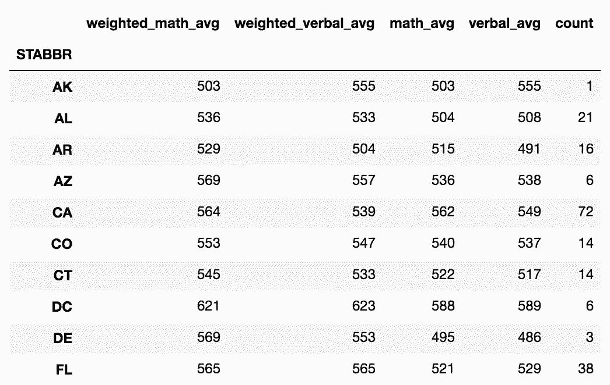

```py
# 多创建两个新的列
 In[81]: from collections import OrderedDict
         def weighted_average(df):
             data = OrderedDict()
             weight_m = df['UGDS'] * df['SATMTMID']
             weight_v = df['UGDS'] * df['SATVRMID']

             wm_avg = weight_m.sum() / df['UGDS'].sum()
             wv_avg = weight_v.sum() / df['UGDS'].sum()

             data['weighted_math_avg'] = wm_avg
             data['weighted_verbal_avg'] = wv_avg
             data['math_avg'] = df['SATMTMID'].mean()
             data['verbal_avg'] = df['SATVRMID'].mean()
             data['count'] = len(df)
             return pd.Series(data, dtype='int')

         college2.groupby('STABBR').apply(weighted_average).head(10)
Out[81]: 
```

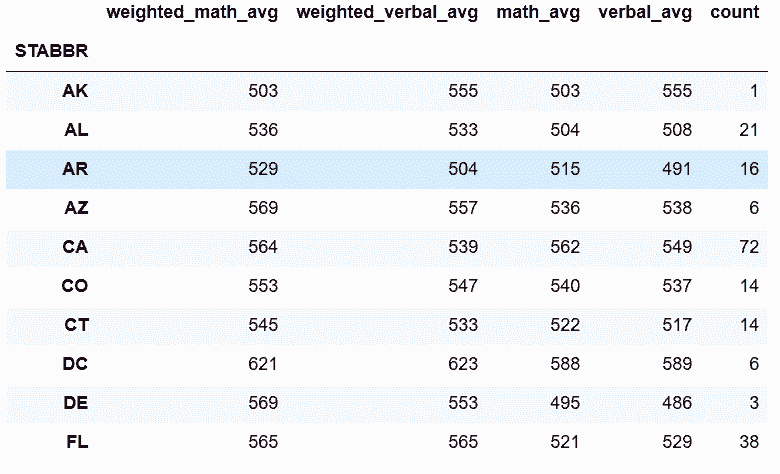

### 更多

```py
# 自定义一个返回DataFrame的函数，使用NumPy的函数average计算加权平均值，使用SciPy的gmean和hmean计算几何和调和平均值
 In[82]: from scipy.stats import gmean, hmean
         def calculate_means(df):
             df_means = pd.DataFrame(index=['Arithmetic', 'Weighted', 'Geometric', 'Harmonic'])
             cols = ['SATMTMID', 'SATVRMID']
             for col in cols:
                 arithmetic = df[col].mean()
                 weighted = np.average(df[col], weights=df['UGDS'])
                 geometric = gmean(df[col])
                 harmonic = hmean(df[col])
                 df_means[col] = [arithmetic, weighted, geometric, harmonic]

             df_means['count'] = len(df)
             return df_means.astype(int)

         college2.groupby('STABBR').filter(lambda x: len(x) != 1).groupby('STABBR').apply(calculate_means).head(10)
Out[82]: 
```

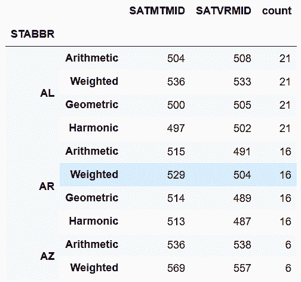

## 10\. 用连续变量分组

```py
 In[83]: flights = pd.read_csv('data/flights.csv')
         flights.head()
Out[83]: 
```

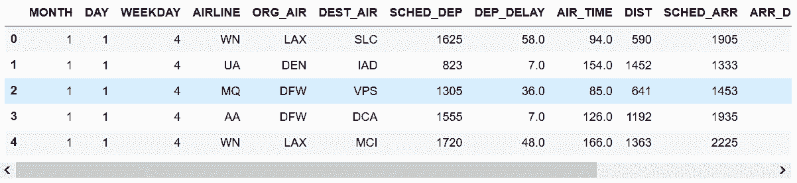

```py
# 判断DIST列有无缺失值
 In[84]: flights.DIST.hasnans
Out[84]: False 
```

```py
# 再次删除DIST列的缺失值（原书是没有这两段的）
 In[85]: flights.dropna(subset=['DIST']).shape
Out[85]: (58492, 14) 
```

```py
# 使用Pandas的cut函数，将数据分成5个面元
 In[86]: bins = [-np.inf, 200, 500, 1000, 2000, np.inf]
         cuts = pd.cut(flights['DIST'], bins=bins)
         cuts.head()
Out[86]: 0     (500.0, 1000.0]
         1    (1000.0, 2000.0]
         2     (500.0, 1000.0]
         3    (1000.0, 2000.0]
         4    (1000.0, 2000.0]
         Name: DIST, dtype: category
         Categories (5, interval[float64]): [(-inf, 200.0] < (200.0, 500.0] < (500.0, 1000.0] < (1000.0, 2000.0] < (2000.0, inf]] 
```

```py
# 对每个面元进行统计
 In[87]: cuts.value_counts()
Out[87]: (500.0, 1000.0]     20659
         (200.0, 500.0]      15874
         (1000.0, 2000.0]    14186
         (2000.0, inf]        4054
         (-inf, 200.0]        3719
         Name: DIST, dtype: int64 
```

```py
# 面元Series可以用来进行分组
 In[88]: flights.groupby(cuts)['AIRLINE'].value_counts(normalize=True).round(3).head(15)
Out[88]: DIST            AIRLINE
         (-inf, 200.0]   OO         0.326
                         EV         0.289
                         MQ         0.211
                         DL         0.086
                         AA         0.052
                         UA         0.027
                         WN         0.009
         (200.0, 500.0]  WN         0.194
                         DL         0.189
                         OO         0.159
                         EV         0.156
                         MQ         0.100
                         AA         0.071
                         UA         0.062
                         VX         0.028
         Name: AIRLINE, dtype: float64 
```

### 原理

```py
 In[89]: flights.groupby(cuts)['AIRLINE'].value_counts(normalize=True)['AIRLINE'].value_counts(normalize=True).round(3).head(15)
Out[89]: 
DIST              AIRLINE
(-inf, 200.0]     OO         0.325625
                 EV         0.289325
                 MQ         0.210809
                 DL         0.086045
                 AA         0.052165
                 UA         0.027427
                 WN         0.008604
(200.0, 500.0]    WN         0.193902
                 DL         0.188736
                 OO         0.158687
                 EV         0.156293
                 MQ         0.100164
                 AA         0.071375
                 UA         0.062051
                 VX         0.028222
                 US         0.016001
                 NK         0.011843
                 B6         0.006867
                 F9         0.004914
                 AS         0.000945
(500.0, 1000.0]   DL         0.205625
                 AA         0.143908
                 WN         0.138196
                 UA         0.131129
                 OO         0.106443
                 EV         0.100683
                 MQ         0.051213
                 F9         0.038192
                 NK         0.029527
                 US         0.025316
                 AS         0.023234
                 VX         0.003582
                 B6         0.002953
(1000.0, 2000.0]  AA         0.263781
                 UA         0.199070
                 DL         0.165092
                 WN         0.159664
                 OO         0.046454
                 NK         0.045115
                 US         0.040462
                 F9         0.030664
                 AS         0.015931
                 EV         0.015579
                 VX         0.012125
                 B6         0.003313
                 MQ         0.002749
(2000.0, inf]     UA         0.289097
                 AA         0.211643
                 DL         0.171436
                 B6         0.080414
                 VX         0.073754
                 US         0.065121
                 WN         0.046374
                 HA         0.027627
                 NK         0.019240
                 AS         0.011593
                 F9         0.003700
Name: AIRLINE, dtype: float64 
```

### 更多

```py
# 求飞行时间的0.25，0.5，0.75分位数
 In[90]: flights.groupby(cuts)['AIR_TIME'].quantile(q=[.25, .5, .75]).div(60).round(2)
Out[90]: DIST                  
         (-inf, 200.0]     0.25    0.43
                           0.50    0.50
                           0.75    0.57
         (200.0, 500.0]    0.25    0.77
                           0.50    0.92
                           0.75    1.05
         (500.0, 1000.0]   0.25    1.43
                           0.50    1.65
                           0.75    1.92
         (1000.0, 2000.0]  0.25    2.50
                           0.50    2.93
                           0.75    3.40
         (2000.0, inf]     0.25    4.30
                           0.50    4.70
                           0.75    5.03
         Name: AIR_TIME, dtype: float64 
```

```py
# unstack方法可以将内层的索引变为列名
 In[91]: labels=['Under an Hour', '1 Hour', '1-2 Hours', '2-4 Hours', '4+ Hours']
         cuts2 = pd.cut(flights['DIST'], bins=bins, labels=labels)
         flights.groupby(cuts2)['AIRLINE'].value_counts(normalize=True).round(3).unstack().style.highlight_max(axis=1)
Out[91]: 
```

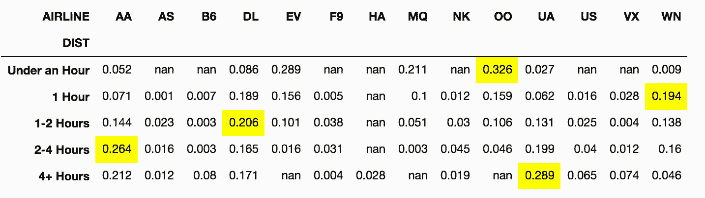

## 11\. 计算城市之间的航班总数

```py
 In[92]: flights = pd.read_csv('data/flights.csv')
         flights.head()
Out[92]: 
```

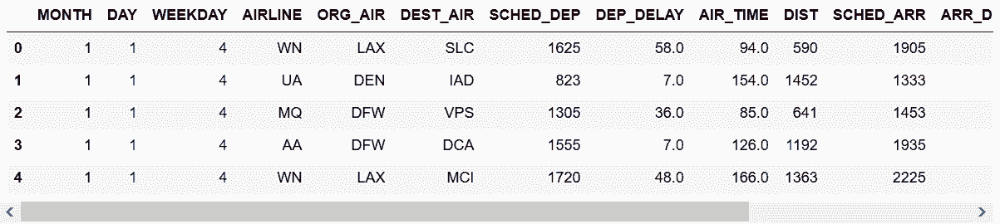

```py
# 求每两个城市间的航班总数
 In[93]: flights_ct = flights.groupby(['ORG_AIR', 'DEST_AIR']).size()
         flights_ct.head()
Out[93]: ORG_AIR  DEST_AIR
         ATL      ABE         31
                  ABQ         16
                  ABY         19
                  ACY          6
                  AEX         40
         dtype: int64 
```

```py
# 选出休斯顿（IAH）和亚特兰大（ATL）之间双方向的航班总数
 In[94]: flights_ct.loc[[('ATL', 'IAH'), ('IAH', 'ATL')]]
Out[94]: ORG_AIR  DEST_AIR
         ATL      IAH         121
         IAH      ATL         148
         dtype: int64 
```

```py
# 分别对每行按照出发地和目的地，按字母排序
 In[95]: flights_sort = flights[['ORG_AIR', 'DEST_AIR']].apply(sorted, axis=1)
         flights_sort.head()
Out[95]: 
```

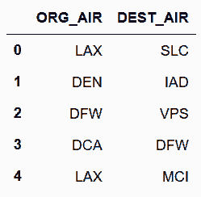

```py
# 因为现在每行都是独立排序的，列名存在问题。对列重命名，然后再计算所有城市间的航班数
 In[96]: rename_dict = {'ORG_AIR':'AIR1','DEST_AIR':'AIR2'}
         flights_sort = flights_sort.rename(columns=rename_dict)
         flights_ct2 = flights_sort.groupby(['AIR1', 'AIR2']).size()
         flights_ct2.head()
Out[96]: AIR1  AIR2
         ABE   ATL     31
               ORD     24
         ABI   DFW     74
         ABQ   ATL     16
               DEN     46
         dtype: int64 
```

```py
# 找到亚特兰大和休斯顿之间的航班数
 In[97]: flights_ct2.loc[('ATL', 'IAH')]
Out[97]: 269 
```

```py
# 如果调换顺序，则会出错
 In[98]: flights_ct2.loc[('IAH', 'ATL')]
---------------------------------------------------------------------------
IndexingError                             Traceback (most recent call last)
<ipython-input-98-56147a7d0bb5> in <module>()
----> 1 flights_ct2.loc[('IAH', 'ATL')]

/Users/Ted/anaconda/lib/python3.6/site-packages/pandas/core/indexing.py in __getitem__(self, key)
  1323             except (KeyError, IndexError):
  1324                 pass
-> 1325             return self._getitem_tuple(key)
  1326         else:
  1327             key = com._apply_if_callable(key, self.obj)

/Users/Ted/anaconda/lib/python3.6/site-packages/pandas/core/indexing.py in _getitem_tuple(self, tup)
   839 
   840         # no multi-index, so validate all of the indexers
--> 841         self._has_valid_tuple(tup)
   842 
   843         # ugly hack for GH #836

/Users/Ted/anaconda/lib/python3.6/site-packages/pandas/core/indexing.py in _has_valid_tuple(self, key)
   186         for i, k in enumerate(key):
   187             if i >= self.obj.ndim:
--> 188                 raise IndexingError('Too many indexers')
   189             if not self._has_valid_type(k, i):
   190                 raise ValueError("Location based indexing can only have [%s] "

IndexingError: Too many indexers 
```

### 更多

```py
# 用NumPy的sort函数可以大大提高速度
 In[99]: data_sorted = np.sort(flights[['ORG_AIR', 'DEST_AIR']])
         data_sorted[:10]
Out[99]: array([['LAX', 'SLC'],
                ['DEN', 'IAD'],
                ['DFW', 'VPS'],
                ['DCA', 'DFW'],
                ['LAX', 'MCI'],
                ['IAH', 'SAN'],
                ['DFW', 'MSY'],
                ['PHX', 'SFO'],
                ['ORD', 'STL'],
                ['IAH', 'SJC']], dtype=object) 
```

```py
# 重新用DataFrame构造器创建一个DataFrame，检测其是否与flights_sorted相等
 In[100]: flights_sort2 = pd.DataFrame(data_sorted, columns=['AIR1', 'AIR2'])
          fs_orig = flights_sort.rename(columns={'ORG_AIR':'AIR1', 'DEST_AIR':'AIR2'})
          flights_sort2.equals(fs_orig)
Out[100]: True 
```

```py
# 比较速度
 In[101]: %timeit flights_sort = flights[['ORG_AIR', 'DEST_AIR']].apply(sorted, axis=1)
          7.82 s ± 189 ms per loop (mean ± std. dev. of 7 runs, 1 loop each)

 In[102]: %%timeit
          data_sorted = np.sort(flights[['ORG_AIR', 'DEST_AIR']])
          flights_sort2 = pd.DataFrame(data_sorted, columns=['AIR1', 'AIR2'])
          10.9 ms ± 325 µs per loop (mean ± std. dev. of 7 runs, 100 loops each) 
```

## 12\. 找到持续最长的准时航班

```py
# 创建一个Series
 In[103]: s = pd.Series([1, 1, 1, 0, 1, 1, 1, 0])
          s
Out[103]: 0    1
          1    1
          2    1
          3    0
          4    1
          5    1
          6    1
          7    0
          dtype: int64 
```

```py
# 累积求和
 In[104]: s1 = s.cumsum()
          s1
Out[104]: 0    1
          1    2
          2    3
          3    3
          4    4
          5    5
          6    6
          7    6
          dtype: int64 
```

```py
 In[105]: s.mul(s1).diff()
Out[105]: 0    NaN
          1    1.0
          2    1.0
          3   -3.0
          4    4.0
          5    1.0
          6    1.0
          7   -6.0
          dtype: float64 
```

```py
# 将所有非负值变为缺失值
 In[106]: s.mul(s1).diff().where(lambda x: x < 0)
Out[106]: 0    NaN
          1    NaN
          2    NaN
          3   -3.0
          4    NaN
          5    NaN
          6    NaN
          7   -6.0
          dtype: float64 
```

```py
 In[107]: s.mul(s1).diff().where(lambda x: x < 0).ffill().add(s1, fill_value=0)
Out[107]: 0    1.0
          1    2.0
          2    3.0
          3    0.0
          4    1.0
          5    2.0
          6    3.0
          7    0.0
          dtype: float64 
```

```py
# 创建一个准时的列 ON_TIME
 In[108]: flights = pd.read_csv('data/flights.csv')
          flights['ON_TIME'] = flights['ARR_DELAY'].lt(15).astype(int)
          flights[['AIRLINE', 'ORG_AIR', 'ON_TIME']].head(10)
Out[108]: 
```

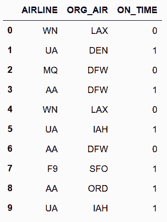

```py
# 将之前的逻辑做成一个函数
 In[109]: def max_streak(s):
              s1 = s.cumsum()
              return s.mul(s1).diff().where(lambda x: x < 0) \
                      .ffill().add(s1, fill_value=0).max()
 In[110]: flights.sort_values(['MONTH', 'DAY', 'SCHED_DEP']) \
                 .groupby(['AIRLINE', 'ORG_AIR'])['ON_TIME'] \
                 .agg(['mean', 'size', max_streak]).round(2).head()
Out[110]: 
```


### 更多

```py
# 求最长的延误航班
 In[111]: def max_delay_streak(df):
              df = df.reset_index(drop=True)
              s = 1 - df['ON_TIME']
              s1 = s.cumsum()
              streak = s.mul(s1).diff().where(lambda x: x < 0) \
                        .ffill().add(s1, fill_value=0)
              last_idx = streak.idxmax()
              first_idx = last_idx - streak.max() + 1
              df_return = df.loc[[first_idx, last_idx], ['MONTH', 'DAY']]
              df_return['streak'] = streak.max()
              df_return.index = ['first', 'last']
              df_return.index.name='streak_row'
              return df_return
 In[112]: flights.sort_values(['MONTH', 'DAY', 'SCHED_DEP']) \
                 .groupby(['AIRLINE', 'ORG_AIR']) \
                 .apply(max_delay_streak) \
                 .sort_values(['streak','MONTH','DAY'], ascending=[False, True, True]).head(10)
Out[112]: 
```

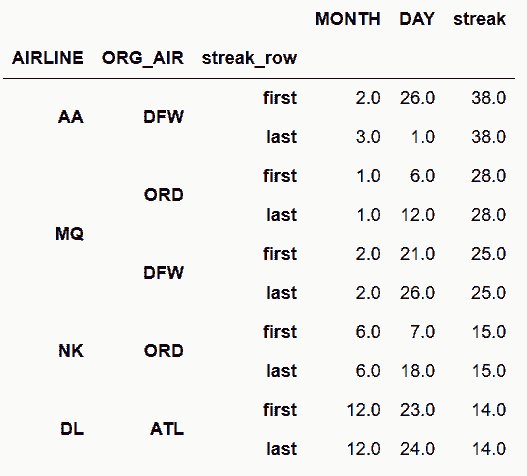

