# 第08章 数据清理


```py
 In[1]: import pandas as pd
        import numpy as np 
```

## 1\. 用stack清理变量值作为列名

```py
# 加载state_fruit数据集
 In[2]: state_fruit = pd.read_csv('data/state_fruit.csv', index_col=0)
        state_fruit
out[2]: 
```

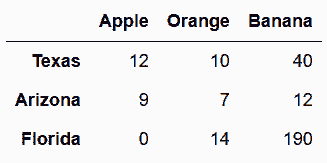

```py
# stack方法可以将所有列名，转变为垂直的一级行索引
 In[3]: state_fruit.stack()
out[3]: Texas    Apple      12
                 Orange     10
                 Banana     40
        Arizona  Apple       9
                 Orange      7
                 Banana     12
        Florida  Apple       0
                 Orange     14
                 Banana    190
        dtype: int64 
```

```py
# 使用reset_index()，将结果变为DataFrame
 In[4]: state_fruit_tidy = state_fruit.stack().reset_index()
        state_fruit_tidy
out[4]: 
```

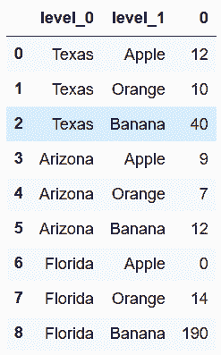

```py
# 重命名列名
 In[5]: state_fruit_tidy.columns = ['state', 'fruit', 'weight']
        state_fruit_tidy
out[5]: 
```

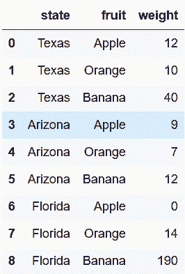

```py
# 也可以使用rename_axis给不同的行索引层级命名
 In[6]: state_fruit.stack()\
                   .rename_axis(['state', 'fruit'])\
out[6]: state    fruit 
        Texas    Apple      12
                 Orange     10
                 Banana     40
        Arizona  Apple       9
                 Orange      7
                 Banana     12
        Florida  Apple       0
                 Orange     14
                 Banana    190
        dtype: int64 
```

```py
# 再次使用reset_index方法
 In[7]: state_fruit.stack()\
                   .rename_axis(['state', 'fruit'])\
                   .reset_index(name='weight')
out[7]: 
```

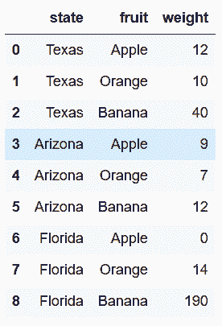

### 更多

```py
# 读取state_fruit2数据集
 In[8]: state_fruit2 = pd.read_csv('data/state_fruit2.csv')
        state_fruit2
out[8]: 
```

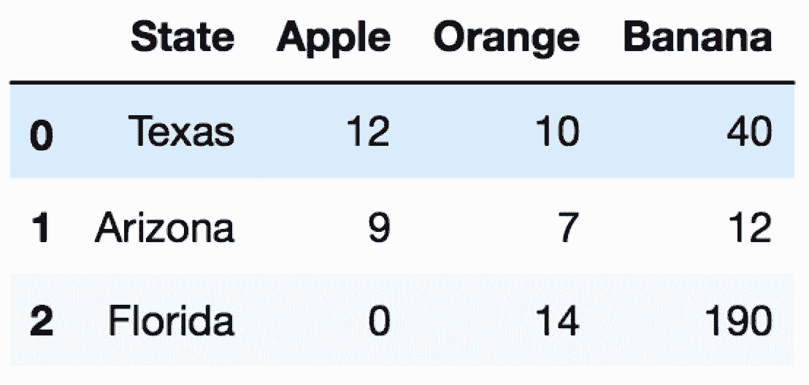

```py
# 州名不在行索引的位置上，使用stack将所有列名变为一个长Series
 In[9]: state_fruit2.stack()
out[9]: 0  State       Texas
           Apple          12
           Orange         10
           Banana         40
        1  State     Arizona
           Apple           9
           Orange          7
           Banana         12
        2  State     Florida
           Apple           0
           Orange         14
           Banana        190
        dtype: object 
```

```py
# 先设定state作为行索引名，再stack，可以得到和前面相似的结果
 In[10]: state_fruit2.set_index('State').stack()
out[10]: 0  State       Texas
            Apple          12
            Orange         10
            Banana         40
         1  State     Arizona
            Apple           9
            Orange          7
            Banana         12
         2  State     Florida
            Apple           0
            Orange         14
            Banana        190
         dtype: object 
```

## 2\. 用melt清理变量值作为列名

```py
# 读取state_fruit2数据集
 In[11]: state_fruit2 = pd.read_csv('data/state_fruit2.csv')
         state_fruit2
out[11]: 
```

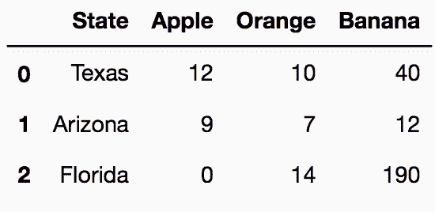

```py
# 使用melt方法，将列传给id_vars和value_vars。melt可以将原先的列名作为变量，原先的值作为值。
 In[12]: state_fruit2.melt(id_vars=['State'],
                           value_vars=['Apple', 'Orange', 'Banana'])
out[12]: 
```

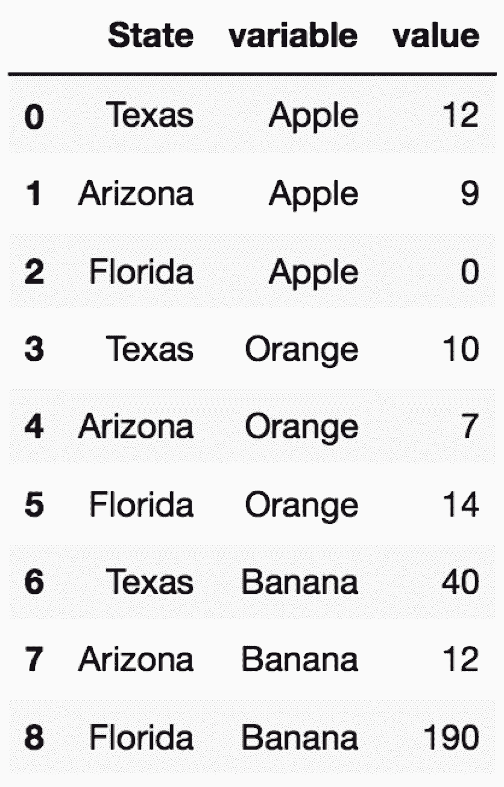

```py
# 随意设定一个行索引
 In[13]: state_fruit2.index=list('abc')
         state_fruit2.index.name = 'letter'
 In[14]: state_fruit2
out[14]: 
```

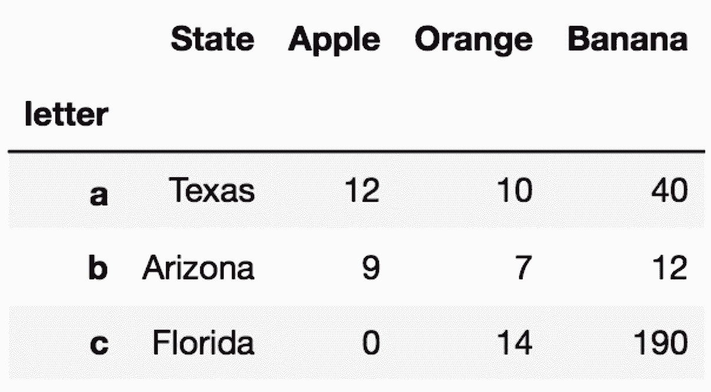

```py
# var_name和value_name可以用来重命名新生成的变量列和值的列
 In[15]: state_fruit2.melt(id_vars=['State'],
                      value_vars=['Apple', 'Orange', 'Banana'],
                      var_name='Fruit',
                      value_name='Weight')
out[15]: 
```

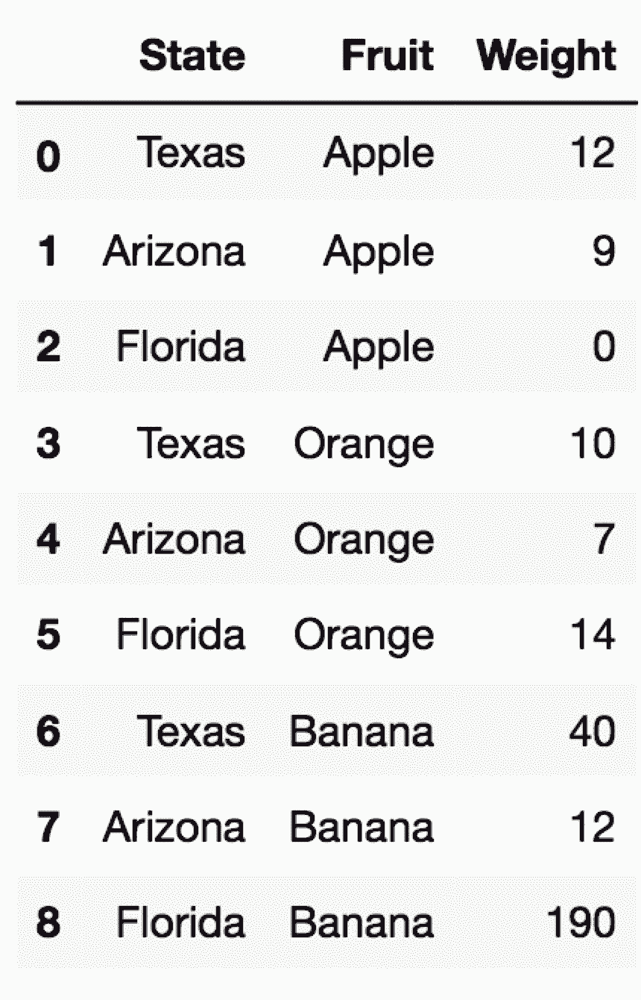

```py
# 如果你想让所有值都位于一列，旧的列标签位于另一列，可以直接使用melt
 In[16]: state_fruit2.melt()
out[16]: 
```

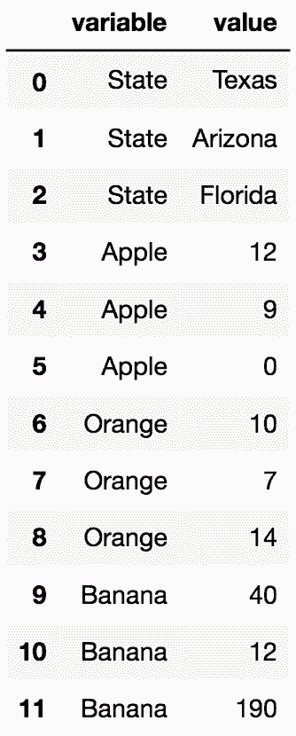

```py
# 要指明id变量，只需使用id_vars参数
 In[17]: state_fruit2.melt(id_vars='State')
out[17]: 
```

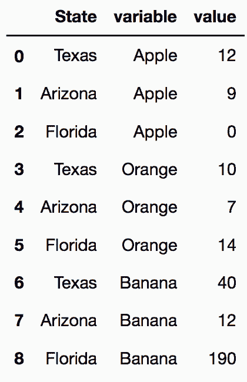

## 3\. 同时stack多组变量

```py
# 读取movie数据集，选取所有演员名和其Facebook likes
 In[18]: movie = pd.read_csv('data/movie.csv')
         actor = movie[['movie_title', 'actor_1_name', 'actor_2_name', 'actor_3_name', 
               'actor_1_facebook_likes', 'actor_2_facebook_likes', 'actor_3_facebook_likes']]
         actor.head()
out[18]: 
```

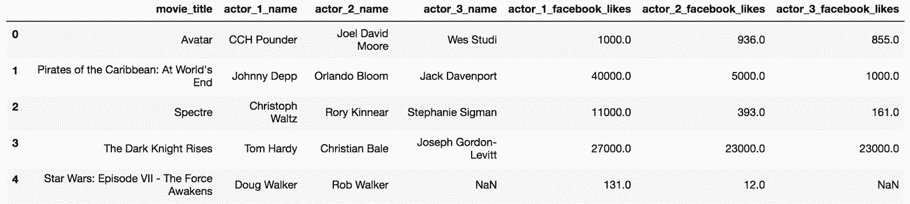

```py
# 创建一个自定义函数，用来改变列名。wide_to_long要求分组的变量要有相同的数字结尾：
 In[19]: def change_col_name(col_name):
             col_name = col_name.replace('_name', '')
             if 'facebook' in col_name:
                 fb_idx = col_name.find('facebook')
                 col_name = col_name[:5] + col_name[fb_idx - 1:] + col_name[5:fb_idx-1]
             return col_name
 In[20]: actor2 = actor.rename(columns=change_col_name)
         actor2.head()
out[20]: 
```

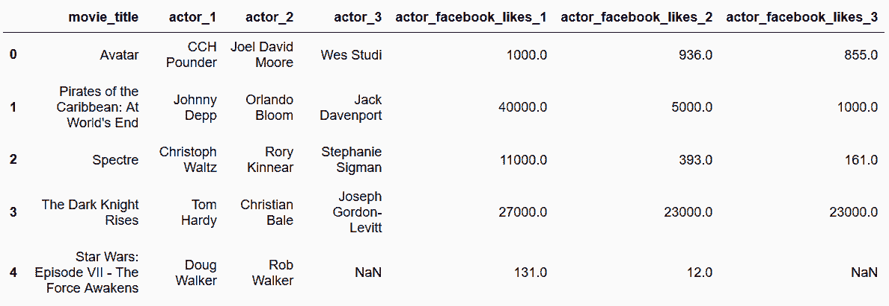

```py
# 使用wide_to_long函数，同时stack两列actor和Facebook
 In[21]: stubs = ['actor', 'actor_facebook_likes']
         actor2_tidy = pd.wide_to_long(actor2, 
                                       stubnames=stubs, 
                                       i=['movie_title'], 
                                       j='actor_num', 
                                       sep='_').reset_index()
         actor2_tidy.head()
out[21]: 
```

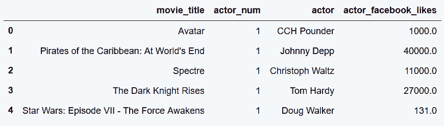

### 更多

```py
# 加载数据
 In[22]: df = pd.read_csv('data/stackme.csv')
         df
out[22]: 
```

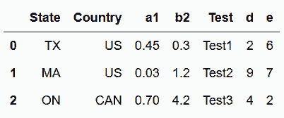

```py
# 对列重命名
 In[23]: df2 = df.rename(columns = {'a1':'group1_a1', 'b2':'group1_b2',
                                    'd':'group2_a1', 'e':'group2_b2'})
         df2
out[23]: 
```

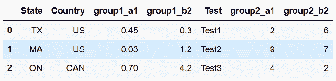

```py
# 设定stubnames=['group1', 'group2']，对任何数字都起作用
 In[24]: pd.wide_to_long(df2, 
                         stubnames=['group1', 'group2'], 
                         i=['State', 'Country', 'Test'], 
                         j='Label', 
                         suffix='.+', 
                         sep='_')
out[24]: 
```

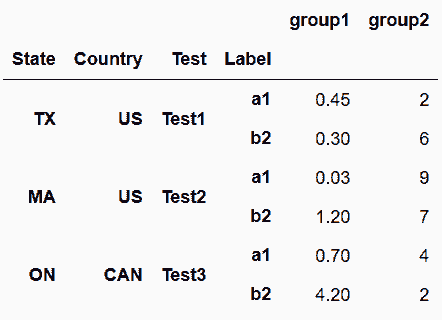

## 4\. 反转stacked数据

```py
# 读取college数据集，学校名作为行索引，，只选取本科生的列
 In[25]: usecol_func = lambda x: 'UGDS_' in x or x == 'INSTNM'
         college = pd.read_csv('data/college.csv', 
                                   index_col='INSTNM', 
                                   usecols=usecol_func)
         college.head()
out[25]: 
```

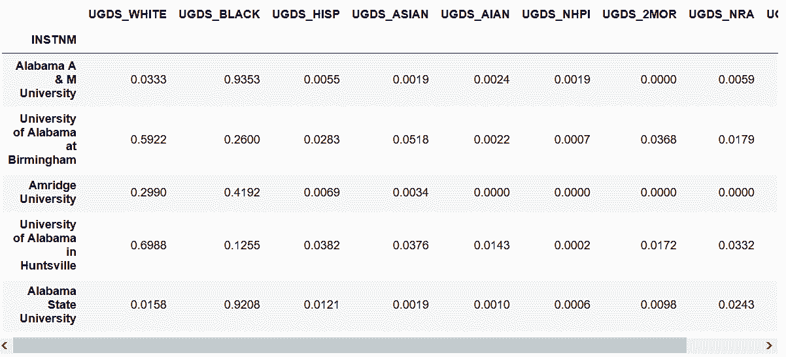

```py
# 用stack方法，将所有水平列名，转化为垂直的行索引
 In[26]: college_stacked = college.stack()
         college_stacked.head(18)
out[26]: INSTNM                                         
Alabama A & M University             UGDS_WHITE    0.0333
                                     UGDS_BLACK    0.9353
                                     UGDS_HISP     0.0055
                                     UGDS_ASIAN    0.0019
                                     UGDS_AIAN     0.0024
                                     UGDS_NHPI     0.0019
                                     UGDS_2MOR     0.0000
                                     UGDS_NRA      0.0059
                                     UGDS_UNKN     0.0138
University of Alabama at Birmingham  UGDS_WHITE    0.5922
                                     UGDS_BLACK    0.2600
                                     UGDS_HISP     0.0283
                                     UGDS_ASIAN    0.0518
                                     UGDS_AIAN     0.0022
                                     UGDS_NHPI     0.0007
                                     UGDS_2MOR     0.0368
                                     UGDS_NRA      0.0179
                                     UGDS_UNKN     0.0100
dtype: float64 
```

```py
# unstack方法可以将其还原
 In[27]: college_stacked.unstack().head()
out[27]: 
```

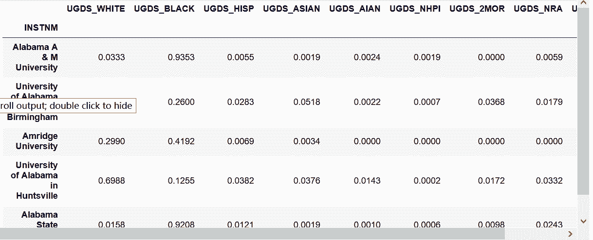

```py
# 另一种方式是先用melt，再用pivot。先加载数据，不指定行索引名
 In[28]: college2 = pd.read_csv('data/college.csv', 
                               usecols=usecol_func)
         college2.head()
out[28]: 
```

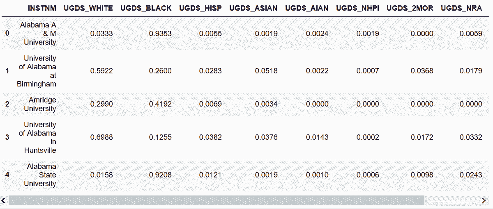

```py
# 使用melt，将所有race列变为一列
 In[29]: college_melted = college2.melt(id_vars='INSTNM', 
                                        var_name='Race',
                                        value_name='Percentage')
         college_melted.head()
out[29]: 
```

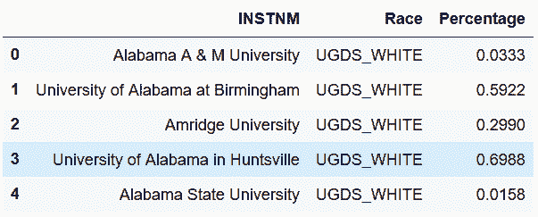

```py
# 用pivot还原
 In[30]: melted_inv = college_melted.pivot(index='INSTNM',
                                           columns='Race',
                                           values='Percentage')
         melted_inv.head()
out[30]: 
```

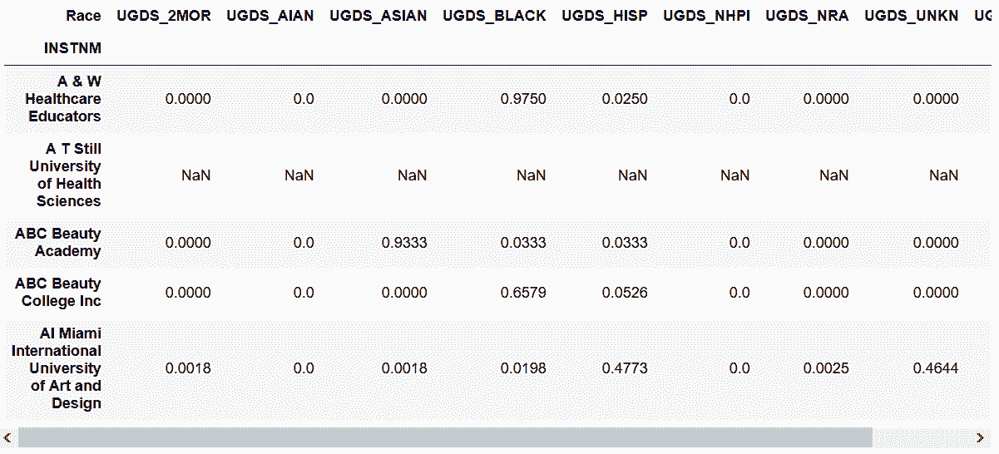

```py
# 用loc同时选取行和列，然后重置索引，可以获得和原先索引顺序一样的DataFrame
 In[31]: college2_replication = melted_inv.loc[college2['INSTNM'], 
                                               college2.columns[1:]]\
                                                  .reset_index()
         college2.equals(college2_replication)
out[31]: True 
```

### 更多

```py
# 使用最外层的行索引做unstack
 In[32]: college.stack().unstack(0)
out[32]: 
```

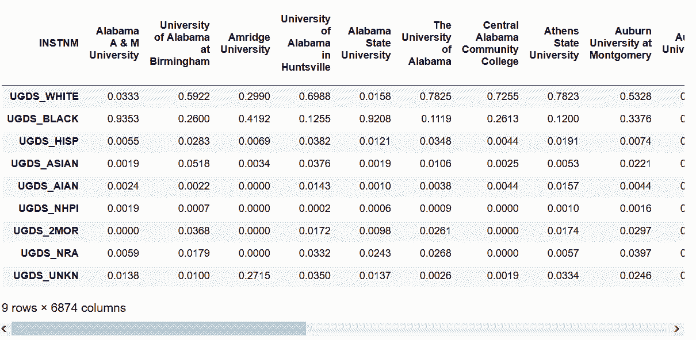

```py
# 转置DataFrame更简单的方法是transpose()或T
 In[33]: college.T
out[33]: 
```

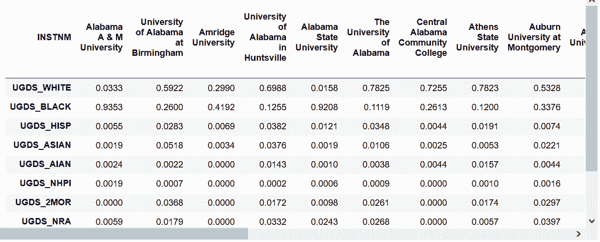

## 5\. 分组聚合后unstacking

```py
# 读取employee数据集，求出每个种族的平均工资
 In[34]: employee = pd.read_csv('data/employee.csv')
 In[35]: employee.groupby('RACE')['BASE_SALARY'].mean().astype(int)
out[35]: RACE
         American Indian or Alaskan Native    60272
         Asian/Pacific Islander               61660
         Black or African American            50137
         Hispanic/Latino                      52345
         Others                               51278
         White                                64419
         Name: BASE_SALARY, dtype: int64 
```

```py
# 对种族和性别分组，求平均工资
 In[36]: agg = employee.groupby(['RACE', 'GENDER'])['BASE_SALARY'].mean().astype(int)
         agg
out[36]: RACE                               GENDER
         American Indian or Alaskan Native  Female    60238
                                            Male      60305
         Asian/Pacific Islander             Female    63226
                                            Male      61033
         Black or African American          Female    48915
                                            Male      51082
         Hispanic/Latino                    Female    46503
                                            Male      54782
         Others                             Female    63785
                                            Male      38771
         White                              Female    66793
                                            Male      63940
         Name: BASE_SALARY, dtype: int64 
```

```py
# 对索引层GENDER做unstack
 In[37]: agg.unstack('GENDER')
out[37]: 
```

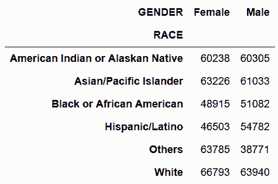

```py
# 对索引层RACE做unstack
 In[38]: agg.unstack('RACE')
out[38]: 
```

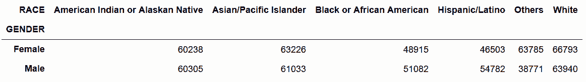

### 更多

```py
# 按RACE和GENDER分组，求工资的平均值、最大值和最小值
 In[39]: agg2 = employee.groupby(['RACE', 'GENDER'])['BASE_SALARY'].agg(['mean', 'max', 'min']).astype(int)
         agg2
out[39]: 
```

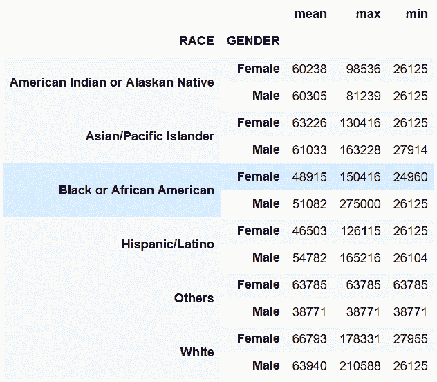

```py
# 此时unstack('GENDER')会生成多级列索引，可以用stack和unstack调整结构
agg2.unstack('GENDER') 
```

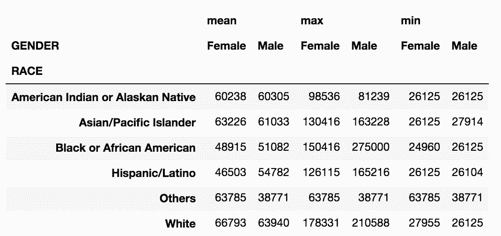

## 6\. 用分组聚合实现透视表

```py
# 读取flights数据集
 In[40]: flights = pd.read_csv('data/flights.csv')
         flights.head()
out[40]: 
```

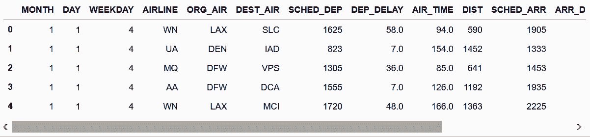

```py
# 用pivot_table方法求出每条航线每个始发地的被取消的航班总数
 In[41]: fp = flights.pivot_table(index='AIRLINE', 
                                  columns='ORG_AIR', 
                                  values='CANCELLED', 
                                  aggfunc='sum',
                                  fill_value=0).round(2)
         fp.head()
out[41]: 
```

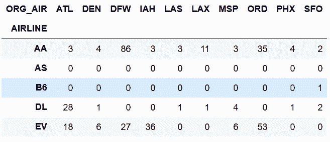

```py
# groupby聚合不能直接复现这张表。需要先按所有index和columns的列聚合
 In[42]: fg = flights.groupby(['AIRLINE', 'ORG_AIR'])['CANCELLED'].sum()
         fg.head()
out[42]: AIRLINE  ORG_AIR
         AA       ATL         3
                  DEN         4
                  DFW        86
                  IAH         3
                  LAS         3
         Name: CANCELLED, dtype: int64 
```

```py
# 再使用unstack，将ORG_AIR这层索引作为列名
 In[43]: fg_unstack = fg.unstack('ORG_AIR', fill_value=0)
         fg_unstack.head()
out[43]: 
```

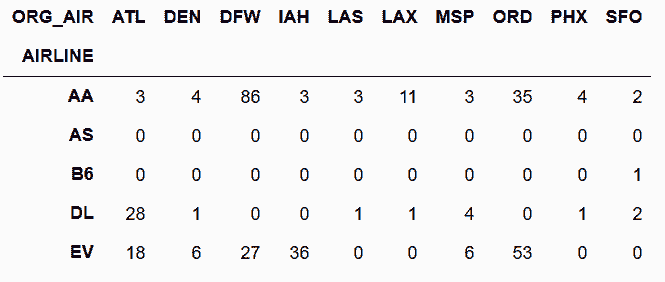

```py
# 判断两个方式是否等价
 In[44]: fg_unstack = fg.unstack('ORG_AIR', fill_value=0)
         fp.equals(fg_unstack)
out[44]: True 
```

### 更多

```py
# 先实现一个稍微复杂的透视表
 In[45]: fp2 = flights.pivot_table(index=['AIRLINE', 'MONTH'],
                                   columns=['ORG_AIR', 'CANCELLED'],
                                   values=['DEP_DELAY', 'DIST'],
                                   aggfunc=[np.mean, np.sum],
                                   fill_value=0)
         fp2.head()
out[45]: 
```

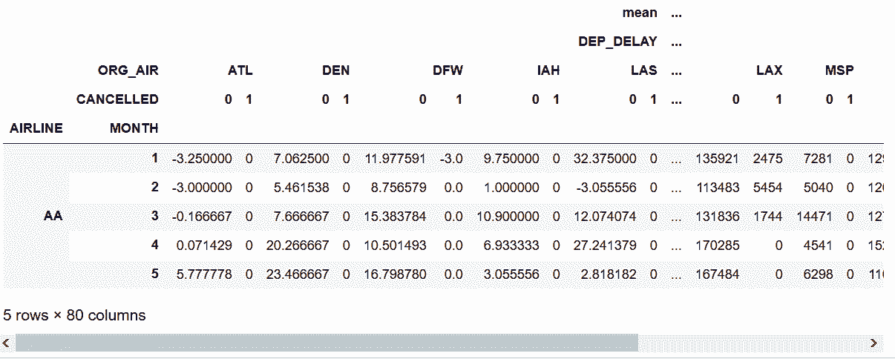

```py
# 用groupby和unstack复现上面的方法
 In[46]: flights.groupby(['AIRLINE', 'MONTH', 'ORG_AIR', 'CANCELLED'])['DEP_DELAY', 'DIST'] \
                .agg(['mean', 'sum']) \
                .unstack(['ORG_AIR', 'CANCELLED'], fill_value=0) \
                .swaplevel(0, 1, axis='columns') \
                .head()
out[46]: 
```

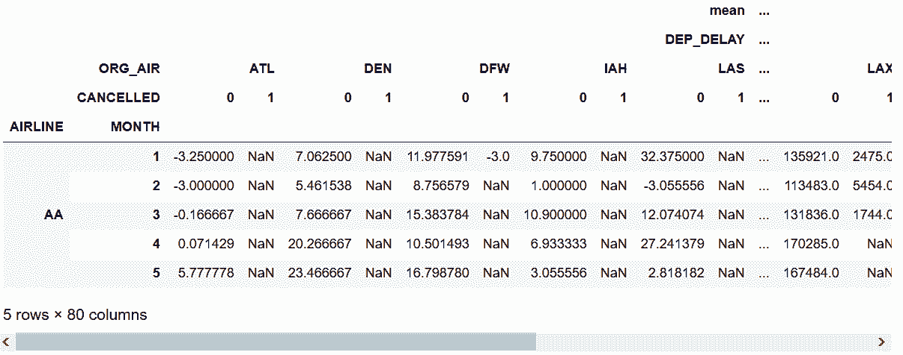

## 7\. 为了更容易reshaping，重新命名索引层

```py
# 读取college数据集，分组后，统计本科生的SAT数学成绩信息
 In[47]: college = pd.read_csv('data/college.csv')
 In[48]: cg = college.groupby(['STABBR', 'RELAFFIL'])['UGDS', 'SATMTMID'] \
                     .agg(['count', 'min', 'max']).head(6)
 In[49]: cg
out[49]: 
```

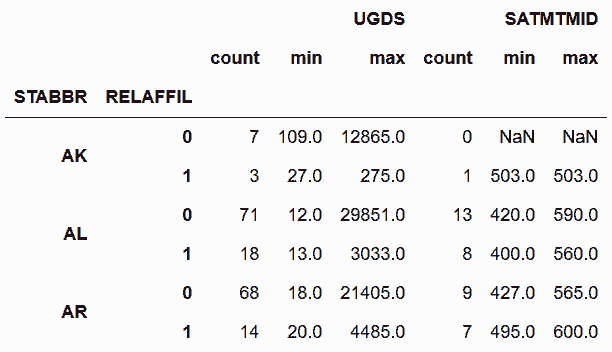

```py
# 行索引的两级都有名字，而列索引没有名字。用rename_axis给列索引的两级命名
 In[50]:cg = cg.rename_axis(['AGG_COLS', 'AGG_FUNCS'], axis='columns')
        cg
out[50]: 
```

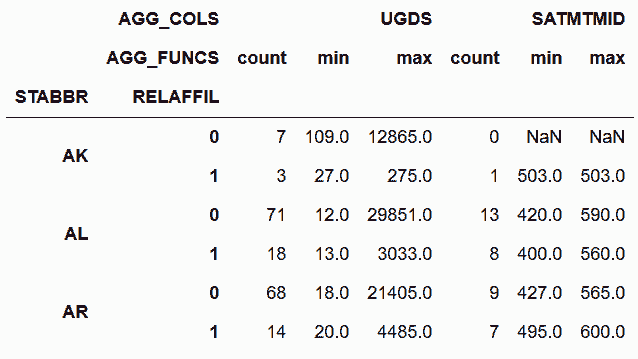

```py
# 将AGG_FUNCS列移到行索引
 In[51]:cg.stack('AGG_FUNCS').head()
out[51]: 
```

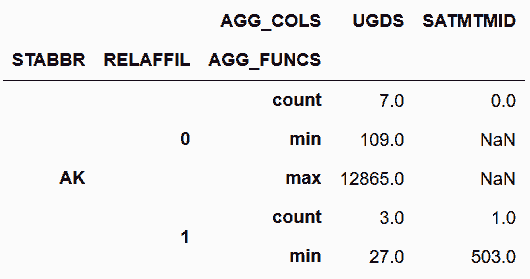

```py
# stack默认是将列放到行索引的最内层，可以使用swaplevel改变层级
 In[52]:cg.stack('AGG_FUNCS').swaplevel('AGG_FUNCS', 'STABBR', axis='index').head()
out[52]: 
```

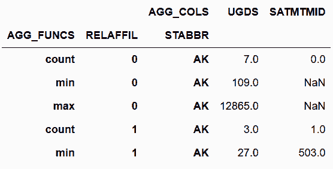

```py
# 在此前的基础上再做sort_index
 In[53]:cg.stack('AGG_FUNCS') \
          .swaplevel('AGG_FUNCS', 'STABBR', axis='index') \
          .sort_index(level='RELAFFIL', axis='index') \
          .sort_index(level='AGG_COLS', axis='columns').head(6)
out[53]: 
```

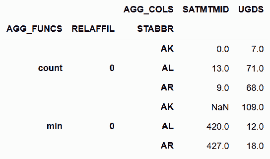

```py
# 对一些列做stack，对其它列做unstack
 In[54]:cg.stack('AGG_FUNCS').unstack(['RELAFFIL', 'STABBR'])
out[54]: 
```

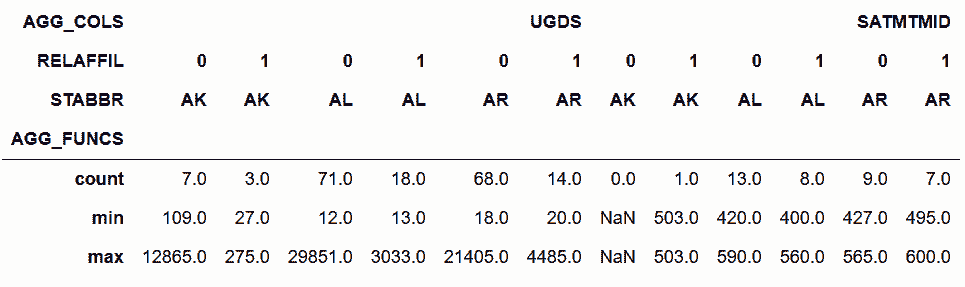

```py
# 对所有列做stack，会返回一个Series
 In[55]:cg.stack(['AGG_FUNCS', 'AGG_COLS']).head(12)
out[55]: 
```

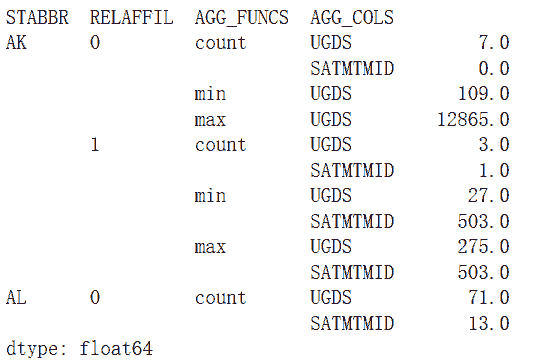

### 更多

```py
# 删除行和列索引所有层级的名称
 In[56]:cg.rename_axis([None, None], axis='index').rename_axis([None, None], axis='columns')
out[56]: 
```

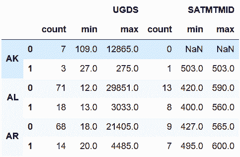

## 8\. 当多个变量被存储为列名时进行清理

```py
# 读取weightlifting数据集
 In[57]:weightlifting = pd.read_csv('data/weightlifting_men.csv')
        weightlifting
out[57]: 
```

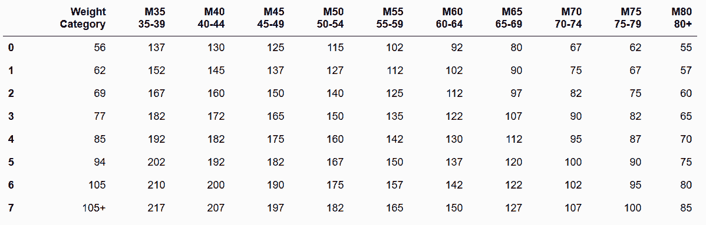

```py
# 用melt方法，将sex_age放入一个单独的列
 In[58]:wl_melt = weightlifting.melt(id_vars='Weight Category', 
                                     var_name='sex_age', 
                                     value_name='Qual Total')
        wl_melt.head()
out[58]: 
```

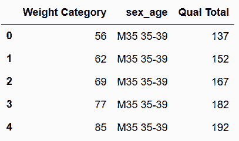

```py
# 用split方法将sex_age列分为两列
 In[59]:sex_age = wl_melt['sex_age'].str.split(expand=True)
        sex_age.head()
out[59]:      0         1
      0     M35     35-39
      1     M35     35-39
      2     M35     35-39
      3     M35     35-39
      4     M35     35-39 
```

```py
# 给列起名
 In[60]:sex_age.columns = ['Sex', 'Age Group']
        sex_age.head()
out[60]: 
```

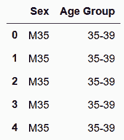

```py
# 只取出字符串中的M
 In[61]:sex_age['Sex'] = sex_age['Sex'].str[0]
        sex_age.head()
out[61]: 
```

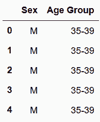

```py
# 用concat方法，将sex_age,与wl_cat_total连接起来
 In[62]:wl_cat_total = wl_melt[['Weight Category', 'Qual Total']]
        wl_tidy = pd.concat([sex_age, wl_cat_total], axis='columns')
        wl_tidy.head()
out[62]: 
```

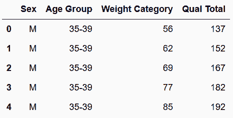

```py
# 上面的结果也可以如下实现
 In[63]:cols = ['Weight Category', 'Qual Total']
        sex_age[cols] = wl_melt[cols] 
```

### 更多

```py
# 也可以通过assign的方法，动态加载新的列
 In[64]: age_group = wl_melt.sex_age.str.extract('(\d{2}[-+](?:\d{2})?)', expand=False)
         sex = wl_melt.sex_age.str[0]
         new_cols = {'Sex':sex, 
                     'Age Group': age_group}
 In[65]: wl_tidy2 = wl_melt.assign(**new_cols).drop('sex_age', axis='columns')
         wl_tidy2.head()
out[65]: 
```

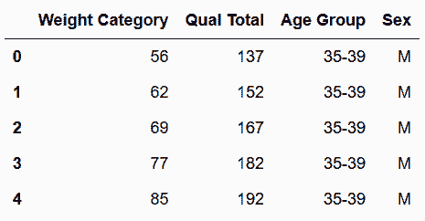

```py
# 判断两种方法是否等效
 In[66]: wl_tidy2.sort_index(axis=1).equals(wl_tidy.sort_index(axis=1))
out[66]: True 
```

## 9\. 当多个变量被存储为列的值时进行清理

```py
# 读取restaurant_inspections数据集，将Date列的数据类型变为datetime64
 In[67]: inspections = pd.read_csv('data/restaurant_inspections.csv', parse_dates=['Date'])
         inspections.head(10)
out[67]: 
```

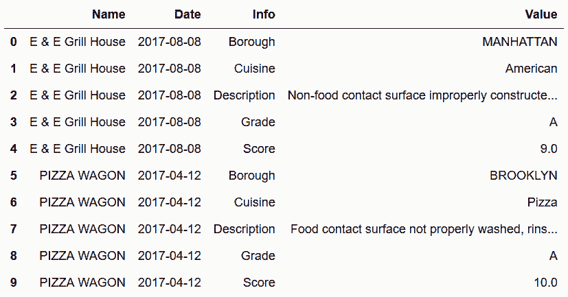

```py
# 用info列的所有值造一个新列。但是，Pandas不支持这种功能
 In[68]: inspections.pivot(index=['Name', 'Date'], columns='Info', values='Value')
---------------------------------------------------------------------------
ValueError                                Traceback (most recent call last)
/Users/Ted/anaconda/lib/python3.6/site-packages/pandas/core/categorical.py in __init__(self, values, categories, ordered, fastpath)
    297             try:
--> 298                 codes, categories = factorize(values, sort=True)
    299             except TypeError:

/Users/Ted/anaconda/lib/python3.6/site-packages/pandas/core/algorithms.py in factorize(values, sort, order, na_sentinel, size_hint)
    559     check_nulls = not is_integer_dtype(original)
--> 560     labels = table.get_labels(values, uniques, 0, na_sentinel, check_nulls)
    561 

pandas/_libs/hashtable_class_helper.pxi in pandas._libs.hashtable.PyObjectHashTable.get_labels (pandas/_libs/hashtable.c:21922)()

ValueError: Buffer has wrong number of dimensions (expected 1, got 2)

During handling of the above exception, another exception occurred:

NotImplementedError                       Traceback (most recent call last)
<ipython-input-68-754f69d68d6c> in <module>()
----> 1 inspections.pivot(index=['Name', 'Date'], columns='Info', values='Value')

/Users/Ted/anaconda/lib/python3.6/site-packages/pandas/core/frame.py in pivot(self, index, columns, values)
   3851         """
   3852         from pandas.core.reshape.reshape import pivot
-> 3853         return pivot(self, index=index, columns=columns, values=values)
   3854 
   3855     def stack(self, level=-1, dropna=True):

/Users/Ted/anaconda/lib/python3.6/site-packages/pandas/core/reshape/reshape.py in pivot(self, index, columns, values)
    375             index = self[index]
    376         indexed = Series(self[values].values,
--> 377                          index=MultiIndex.from_arrays([index, self[columns]]))
    378         return indexed.unstack(columns)
    379 

/Users/Ted/anaconda/lib/python3.6/site-packages/pandas/core/indexes/multi.py in from_arrays(cls, arrays, sortorder, names)
   1098         from pandas.core.categorical import _factorize_from_iterables
   1099 
-> 1100         labels, levels = _factorize_from_iterables(arrays)
   1101         if names is None:
   1102             names = [getattr(arr, "name", None) for arr in arrays]

/Users/Ted/anaconda/lib/python3.6/site-packages/pandas/core/categorical.py in _factorize_from_iterables(iterables)
   2191         # For consistency, it should return a list of 2 lists.
   2192         return [[], []]
-> 2193     return map(list, lzip(*[_factorize_from_iterable(it) for it in iterables]))

/Users/Ted/anaconda/lib/python3.6/site-packages/pandas/core/categorical.py in <listcomp>(.0)
   2191         # For consistency, it should return a list of 2 lists.
   2192         return [[], []]
-> 2193     return map(list, lzip(*[_factorize_from_iterable(it) for it in iterables]))

/Users/Ted/anaconda/lib/python3.6/site-packages/pandas/core/categorical.py in _factorize_from_iterable(values)
   2163         codes = values.codes
   2164     else:
-> 2165         cat = Categorical(values, ordered=True)
   2166         categories = cat.categories
   2167         codes = cat.codes

/Users/Ted/anaconda/lib/python3.6/site-packages/pandas/core/categorical.py in __init__(self, values, categories, ordered, fastpath)
    308 
    309                 # FIXME
--> 310                 raise NotImplementedError("> 1 ndim Categorical are not "
    311                                           "supported at this time")
    312 

NotImplementedError: > 1 ndim Categorical are not supported at this time 
```

```py
# 将'Name','Date', 'Info'作为所索引
 In[69]: inspections.set_index(['Name','Date', 'Info']).head(10)
out[69]: 
```


```py
# 用pivot，将info列中的值变为新的列
 In[70]: inspections.set_index(['Name','Date', 'Info']).unstack('Info').head()
out[70]: 
```


```py
# 用reset_index方法，使行索引层级与列索引相同
 In[71]: insp_tidy = inspections.set_index(['Name','Date', 'Info']) \
                                        .unstack('Info') \
                                        .reset_index(col_level=-1)
         insp_tidy.head()
out[71]: 
```

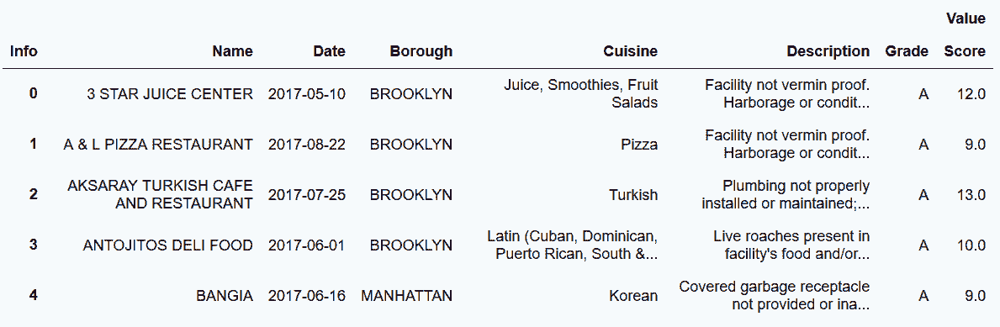

```py
# 除掉列索引的最外层，重命名行索引的层为None
 In[72]: insp_tidy.columns = insp_tidy.columns.droplevel(0).rename(None)
         insp_tidy.head()
out[72]: 
```

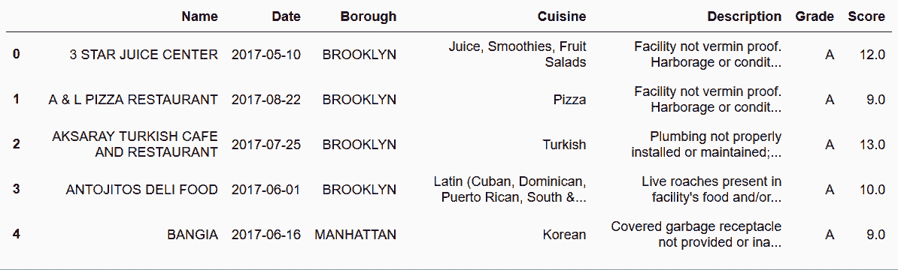

```py
# 使用squeeze方法，可以避免前面的多级索引
 In[73]: inspections.set_index(['Name','Date', 'Info']) \
                    .squeeze() \
                    .unstack('Info') \
                    .reset_index() \
                    .rename_axis(None, axis='columns')
out[73]: 
```

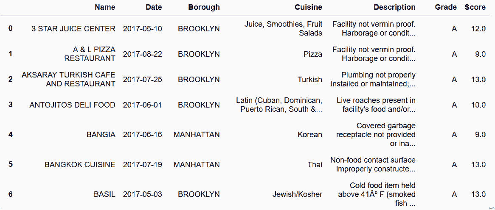

### 更多

```py
# pivot_table需要传入聚合函数，才能产生一个单一值
 In[74]: inspections.pivot_table(index=['Name', 'Date'], 
                                 columns='Info', 
                                 values='Value', 
                                 aggfunc='first') \
                    .reset_index()\
                    .rename_axis(None, axis='columns')
out[74]: 
```

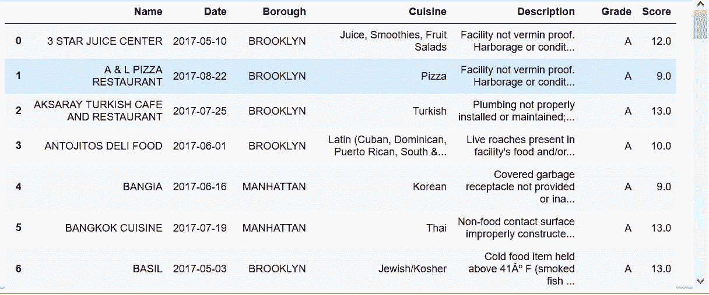

## 10\. 当两个或多个值存储于一个单元格时进行清理

```py
# 读取texas_cities数据集
 In[75]: cities = pd.read_csv('data/texas_cities.csv')
         cities
out[75]: 
```

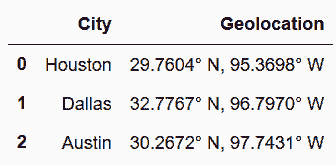

```py
# 将Geolocation分解为四个单独的列
 In[76]: geolocations = cities.Geolocation.str.split(pat='. ', expand=True)
         geolocations.columns = ['latitude', 'latitude direction', 'longitude', 'longitude direction']
         geolocations
out[76]: 
```

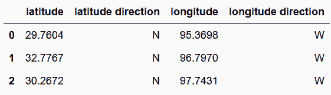

```py
# 转变数据类型
 In[77]: geolocations = geolocations.astype({'latitude':'float', 'longitude':'float'})
         geolocations.dtypes
out[77]: latitude               float64
         latitude direction      object
         longitude              float64
         longitude direction     object
         dtype: object 
```

```py
# 将新列与原先的city列连起来
 In[78]: cities_tidy = pd.concat([cities['City'], geolocations], axis='columns')
         cities_tidy
out[78]: 
```

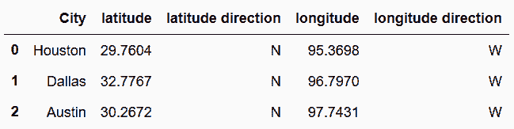

```py
# 忽略，作者这里是写重复了
 In[79]: pd.concat([cities['City'], geolocations], axis='columns')
out[79]: 
```

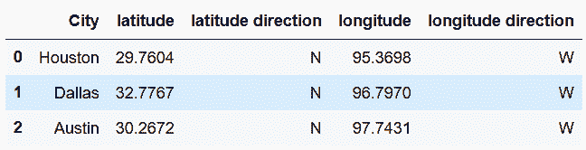

### 原理

```py
# 函数to_numeric可以将每列自动变为整数或浮点数
 In[80]: temp = geolocations.apply(pd.to_numeric, errors='ignore')
         temp
out[80]: 
```

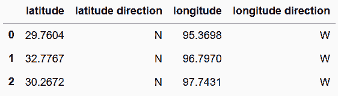

```py
# 再查看数据类型
 In[81]: temp.dtypes
out[81]: latitude               float64
         latitude direction      object
         longitude              float64
         longitude direction     object
         dtype: object 
```

### 更多

```py
# |符，可以对多个标记进行分割
 In[82]: cities.Geolocation.str.split(pat='° |, ', expand=True)
out[82]: 
```

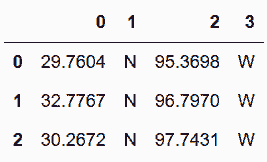

```py
# 更复杂的提取方式
 In[83]: cities.Geolocation.str.extract('([0-9.]+). (N|S), ([0-9.]+). (E|W)', expand=True)
out[83]: 
```

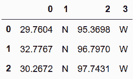

## 11\. 当多个变量被存储为列名和列值时进行清理

```py
# 读取sensors数据集
 In[84]: sensors = pd.read_csv('data/sensors.csv')
         sensors
out[84]: 
```

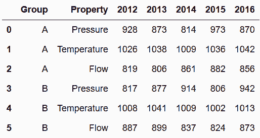

```py
# 用melt清理数据
 In[85]: sensors.melt(id_vars=['Group', 'Property'], var_name='Year').head(6)
out[85]: 
```

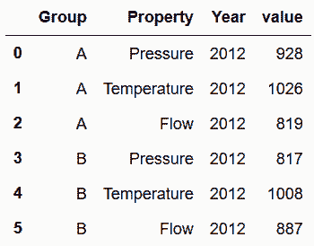

```py
# 用pivot_table，将Property列转化为新的列名
 In[86]: sensors.melt(id_vars=['Group', 'Property'], var_name='Year') \
                .pivot_table(index=['Group', 'Year'], columns='Property', values='value') \
                .reset_index() \
                .rename_axis(None, axis='columns')
out[86]: 
```

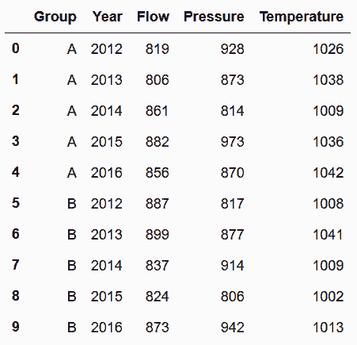

### 更多

```py
# 用stack和unstack实现上述方法
 In[87]: sensors.set_index(['Group', 'Property']) \
                .stack() \
                .unstack('Property') \
                .rename_axis(['Group', 'Year'], axis='index') \
                .rename_axis(None, axis='columns') \
                .reset_index()
out[87]: 
```

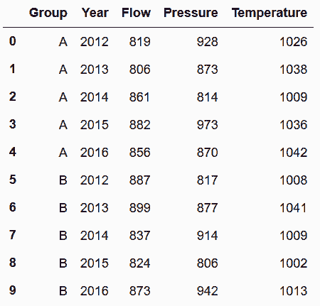

## 12\. 当多个观察单位被存储于同一张表时进行清理

```py
# 读取movie_altered数据集
 In[88]: movie = pd.read_csv('data/movie_altered.csv')
         movie.head()
out[88]: 
```


```py
# 插入新的列，用来标识每一部电影
 In[89]: movie.insert(0, 'id', np.arange(len(movie)))
         movie.head()
out[89]: 
```

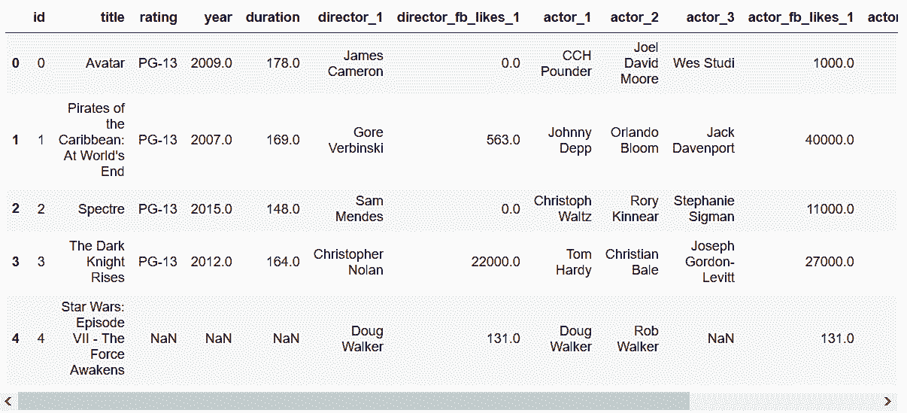

```py
# 用wide_to_long，将所有演员放到一列，将所有Facebook likes放到一列
 In[90]: stubnames = ['director', 'director_fb_likes', 'actor', 'actor_fb_likes']
         movie_long = pd.wide_to_long(movie, 
                                      stubnames=stubnames, 
                                      i='id', 
                                      j='num', 
                                      sep='_').reset_index()
         movie_long['num'] = movie_long['num'].astype(int)
         movie_long.head(9)
out[90]: 
```

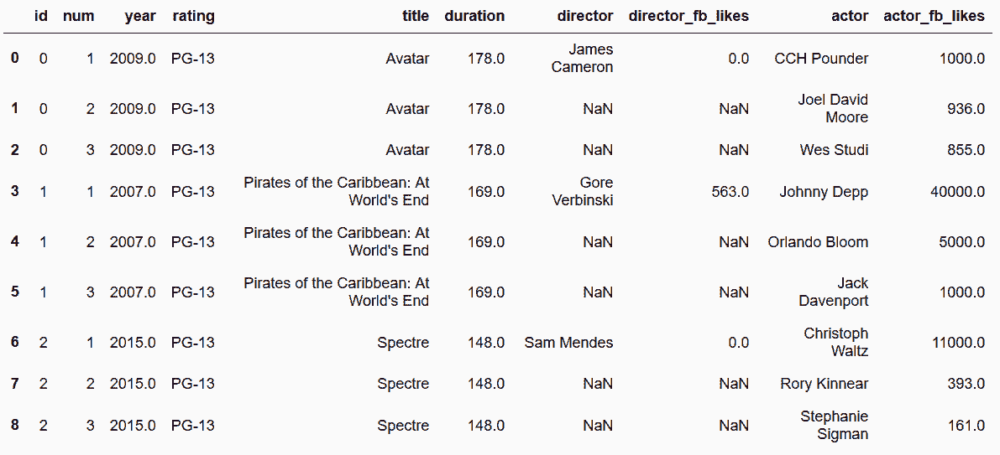

```py
# 将这个数据分解成多个小表
 In[91]: movie_table = movie_long[['id','title', 'year', 'duration', 'rating']]
         director_table = movie_long[['id', 'director', 'num', 'director_fb_likes']]
         actor_table = movie_long[['id', 'actor', 'num', 'actor_fb_likes']]
 In[92]: movie_table.head(9)
out[90]: 
```

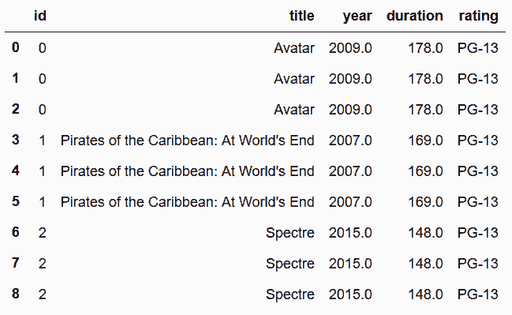

```py
 In[93]: director_table.head(9)
out[93]: 
```

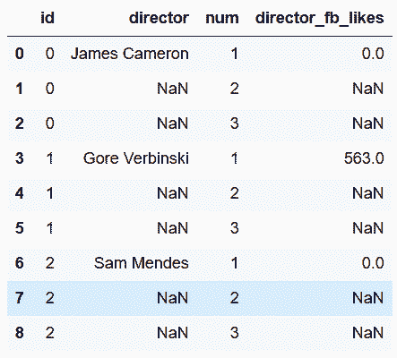

```py
 In[94]: actor_table.head(9)
out[94]: 
```

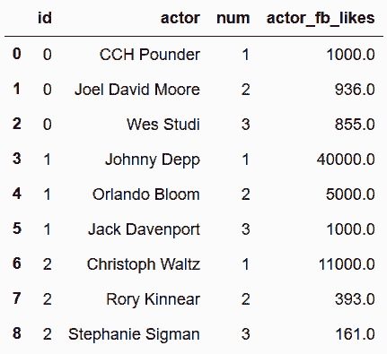

```py
# 做一些去重和去除缺失值的工作
 In[95]: movie_table = movie_table.drop_duplicates().reset_index(drop=True)
         director_table = director_table.dropna().reset_index(drop=True)
         actor_table = actor_table.dropna().reset_index(drop=True)
 In[96]: movie_table.head()
out[96]: 
```

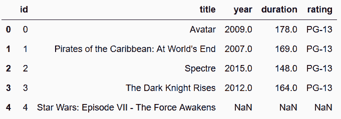

```py
 In[97]: director_table.head()
out[97]: 
```

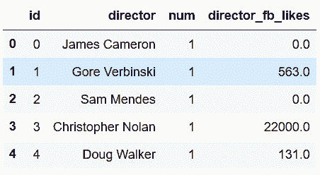

```py
# 比较内存的使用量
 In[98]: movie.memory_usage(deep=True).sum()
out[98]: 2318234

 In[99]: movie_table.memory_usage(deep=True).sum() + \
         director_table.memory_usage(deep=True).sum() + \
         actor_table.memory_usage(deep=True).sum()
out[99]: 2624898 
```

```py
# 创建演员和导演的id列
 In[100]: director_cat = pd.Categorical(director_table['director'])
          director_table.insert(1, 'director_id', director_cat.codes)

          actor_cat = pd.Categorical(actor_table['actor'])
          actor_table.insert(1, 'actor_id', actor_cat.codes)

          director_table.head()
out[100]: 
```

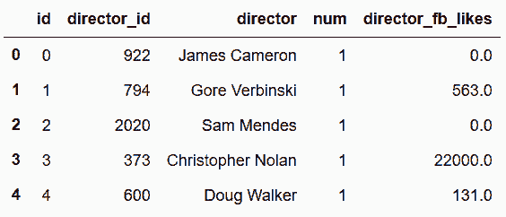

```py
 In[101]: actor_table.head()
out[101]: 
```

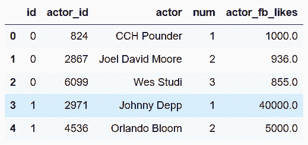

```py
# 可以用这两张表生成要用的中间表。先来做director表
 In[102]: director_associative = director_table[['id', 'director_id', 'num']]
          dcols = ['director_id', 'director', 'director_fb_likes']
          director_unique = director_table[dcols].drop_duplicates().reset_index(drop=True)
          director_associative.head()         
out[102]: 
```

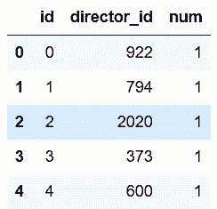

```py
 In[103]: director_unique.head()
out[103]: 
```

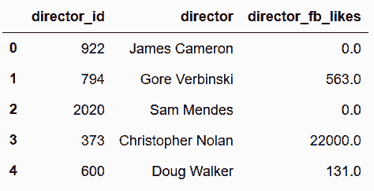

```py
# 再来做actor表
 In[104]: actor_associative = actor_table[['id', 'actor_id', 'num']]
          acols = ['actor_id', 'actor', 'actor_fb_likes']
          actor_unique = actor_table[acols].drop_duplicates().reset_index(drop=True)
          actor_associative.head()
out[104]: 
```

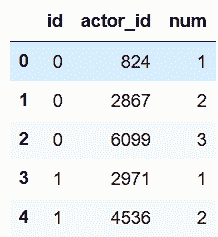

```py
 In[105]: actor_unique.head()
out[105]: 
```

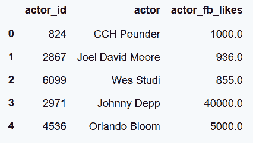

```py
# 查看新的表所使用的内存量
 In[106]: movie_table.memory_usage(deep=True).sum() + \
          director_associative.memory_usage(deep=True).sum() + \
          director_unique.memory_usage(deep=True).sum() + \
          actor_associative.memory_usage(deep=True).sum() + \
          actor_unique.memory_usage(deep=True).sum()
out[106]: 1833402 
```

```py
 In[107]: movie_table.head()
out[107]: 
```

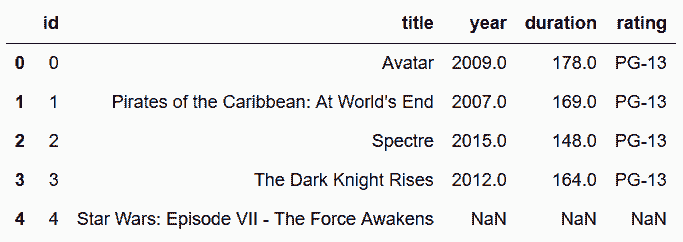

```py
# 可以通过将左右表组合起来形成movie表。首先将附表与actor/director表结合，然后将num列pivot，再加上列的前缀
 In[108]: actors = actor_associative.merge(actor_unique, on='actor_id') \
                                    .drop('actor_id', 1) \
                                    .pivot_table(index='id', columns='num', aggfunc='first')

          actors.columns = actors.columns.get_level_values(0) + '_' + \
                           actors.columns.get_level_values(1).astype(str)

          directors = director_associative.merge(director_unique, on='director_id') \
                                          .drop('director_id', 1) \
                                          .pivot_table(index='id', columns='num', aggfunc='first')

          directors.columns = directors.columns.get_level_values(0) + '_' + \
                              directors.columns.get_level_values(1).astype(str)
 In[109]: actors.head()
out[109]: 
```

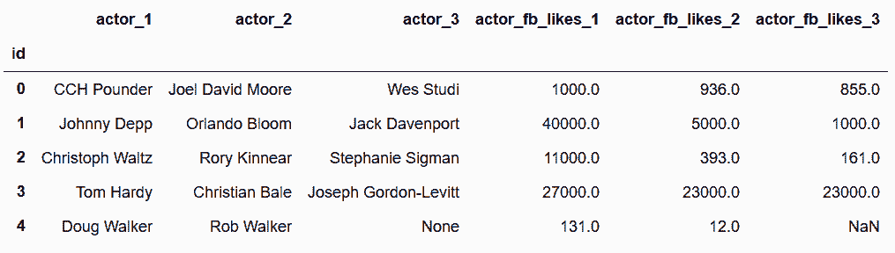

```py
 In[110]: directors.head()
out[110]: 
```

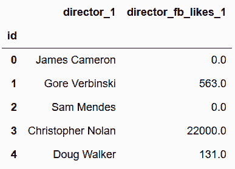

```py
 In[111]: movie2 = movie_table.merge(directors.reset_index(), on='id', how='left') \
                              .merge(actors.reset_index(), on='id', how='left')
 In[112]: movie2.head()
out[112]: 
```


```py
 In[113]: movie.equals(movie2[movie.columns])
out[113]: True 
```

