# 第09章 合并Pandas对象


```py
 In[1]: import pandas as pd
        import numpy as np

        import matplotlib.pyplot as plt
        %matplotlib inline 
```

## 1\. DataFrame添加新的行

```py
# 读取names数据集
 In[2]: names = pd.read_csv('data/names.csv')
        names
Out[2]: 
```


```py
# 用loc直接赋值新的行
 In[3]: new_data_list = ['Aria', 1]
        names.loc[4] = new_data_list
        names
Out[3]: 
```


```py
# 用loc的标签直接赋值新的行
 In[4]: names.loc['five'] = ['Zach', 3]
        names
Out[4]: 
```

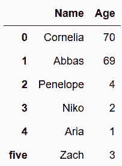

```py
# 也可以用字典赋值新行
 In[5]: names.loc[len(names)] = {'Name':'Zayd', 'Age':2}
        names
Out[5]: 
```


```py
 In[6]: names
Out[6]: 
```


```py
# 字典可以打乱列名的顺序
 In[7]: names.loc[len(names)] = pd.Series({'Age':32, 'Name':'Dean'})
        names
Out[7]: 
```


```py
# 直接append一个字典
 In[8]: names = pd.read_csv('data/names.csv')
        names.append({'Name':'Aria', 'Age':1})
---------------------------------------------------------------------------
TypeError                                 Traceback (most recent call last)
<ipython-input-8-562aecc73587> in <module>()
      1 # Use append with fresh copy of names
      2 names = pd.read_csv('data/names.csv')
----> 3 names.append({'Name':'Aria', 'Age':1})

/Users/Ted/anaconda/lib/python3.6/site-packages/pandas/core/frame.py in append(self, other, ignore_index, verify_integrity)
   4515                 other = Series(other)
   4516             if other.name is None and not ignore_index:
-> 4517                 raise TypeError('Can only append a Series if ignore_index=True'
   4518                                 ' or if the Series has a name')
   4519 

TypeError: Can only append a Series if ignore_index=True or if the Series has a name 
```

```py
# 按照错误提示，加上ignore_index=True
 In[9]: names.append({'Name':'Aria', 'Age':1}, ignore_index=True)
Out[9]: 
```

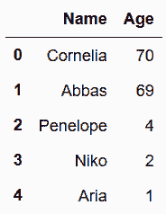

```py
# 设定行索引
 In[10]: names.index = ['Canada', 'Canada', 'USA', 'USA']
         names
Out[10]: 
```


```py
# 添加一行
 In[11]: names.append({'Name':'Aria', 'Age':1}, ignore_index=True)
Out[11]: 
```

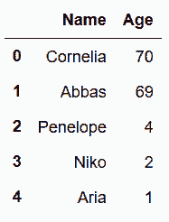

```py
# 创建一个Series对象
 In[12]: s = pd.Series({'Name': 'Zach', 'Age': 3}, name=len(names))
         s
Out[12]: Age        3
         Name    Zach
         Name: 4, dtype: object 
```

```py
# append方法可以将DataFrame和Series相连
 In[13]: names.append(s)
Out[13]: 
```


```py
# append方法可以同时连接多行，只要将对象放到列表中
 In[14]: s1 = pd.Series({'Name': 'Zach', 'Age': 3}, name=len(names))
         s2 = pd.Series({'Name': 'Zayd', 'Age': 2}, name='USA')
         names.append([s1, s2])
Out[14]: 
```


```py
# 读取baseball16数据集
 In[15]: bball_16 = pd.read_csv('data/baseball16.csv')
         bball_16.head()
Out[15]: 
```

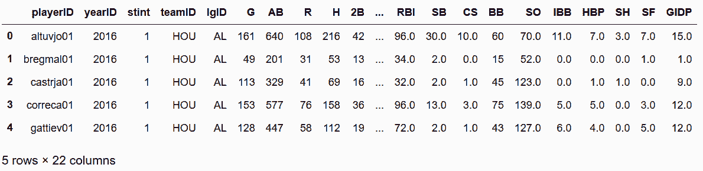

```py
# 选取一行，并将其转换为字典
 In[16]: data_dict = bball_16.iloc[0].to_dict()
         print(data_dict)
{'playerID': 'altuvjo01', 'yearID': 2016, 'stint': 1, 'teamID': 'HOU', 'lgID': 'AL', 'G': 161, 'AB': 640, 'R': 108, 'H': 216, '2B': 42, '3B': 5, 'HR': 24, 'RBI': 96.0, 'SB': 30.0, 'CS': 10.0, 'BB': 60, 'SO': 70.0, 'IBB': 11.0, 'HBP': 7.0, 'SH': 3.0, 'SF': 7.0, 'GIDP': 15.0} 
```

```py
# 对这个字典做格式处理，如果是字符串则为空，否则为缺失值
 In[17]: new_data_dict = {k: '' if isinstance(v, str) else np.nan for k, v in data_dict.items()}
         print(new_data_dict)
{'playerID': '', 'yearID': nan, 'stint': nan, 'teamID': '', 'lgID': '', 'G': nan, 'AB': nan, 'R': nan, 'H': nan, '2B': nan, '3B': nan, 'HR': nan, 'RBI': nan, 'SB': nan, 'CS': nan, 'BB': nan, 'SO': nan, 'IBB': nan, 'HBP': nan, 'SH': nan, 'SF': nan, 'GIDP': nan} 
```

### 更多

```py
# 将一行数据添加到DataFrame是非常消耗资源的，不能通过循环的方法来做。下面是创建一千行的新数据，用作Series的列表：
 In[18]: random_data = []
         for i in range(1000):
             d = dict()
             for k, v in data_dict.items():
                 if isinstance(v, str):
                     d[k] = np.random.choice(list('abcde'))
                 else:
                     d[k] = np.random.randint(10)
             random_data.append(pd.Series(d, name=i + len(bball_16)))

         random_data[0].head()
Out[18]: 2B    2
         3B    6
         AB    8
         BB    2
         CS    0
         Name: 16, dtype: object 
```

```py
# 给上面的append操作计时，1000行的数据用了5秒钟
 In[19]: %%timeit
         bball_16_copy = bball_16.copy()
         for row in random_data:
             bball_16_copy = bball_16_copy.append(row)
5.36 s ± 298 ms per loop (mean ± std. dev. of 7 runs, 1 loop each) 
```

```py
# 如果是通过列表的方式append，可以大大节省时间
 In[20]: %%timeit
         bball_16_copy = bball_16.copy()
         bball_16_copy = bball_16_copy.append(random_data)
86.2 ms ± 3.71 ms per loop (mean ± std. dev. of 7 runs, 10 loops each) 
```

## 2\. 连接多个DataFrame

```py
# 读取stocks_2016和stocks_2017两个数据集，用Symbol作为行索引名
 In[21]: stocks_2016 = pd.read_csv('data/stocks_2016.csv', index_col='Symbol')
         stocks_2017 = pd.read_csv('data/stocks_2017.csv', index_col='Symbol')
 In[22]: stocks_2016
Out[22]: 
```

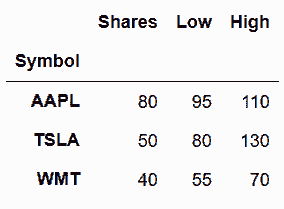

```py
 In[23]: stocks_2017
Out[23]: 
```

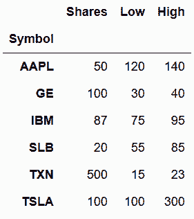

```py
# 将两个DataFrame放到一个列表中，用pandas的concat方法将它们连接起来
 In[24]: s_list = [stocks_2016, stocks_2017]
         pd.concat(s_list)
Out[24]: 
```

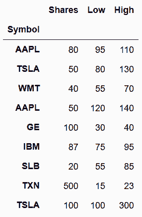

```py
# keys参数可以给两个DataFrame命名，该标签会出现在行索引的最外层，会生成多层索引，names参数可以重命名每个索引层
 In[25]: pd.concat(s_list, keys=['2016', '2017'], names=['Year', 'Symbol'])
Out[25]: 
```

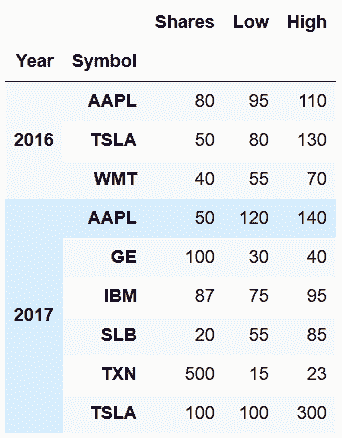

```py
# 也可以横向连接。只要将axis参数设为columns或1
 In[26]: pd.concat(s_list, keys=['2016', '2017'], axis='columns', names=['Year', None])
Out[26]: 
```

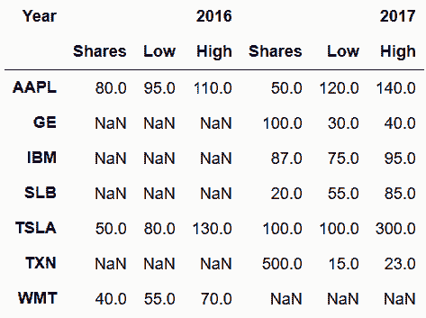

```py
# concat函数默认使用的是外连接，会保留每个DataFrame中的所有行。也可以通过设定join参数，使用内连接：
 In[27]: pd.concat(s_list, join='inner', keys=['2016', '2017'], axis='columns', names=['Year', None])
Out[27]: 
```

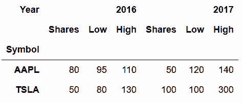

### 更多

```py
# append是concat方法的超简化版本，append内部其实就是调用concat。前本节的第二个例子，pd.concat也可以如下实现：
 In[28]: stocks_2016.append(stocks_2017)
Out[28]: 
```

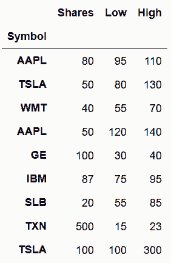

```py
# 原书没有下面三行代码
 In[29]: stocks_2015 = stocks_2016.copy()
 In[30]: stocks_2017
Out[30]: 
```

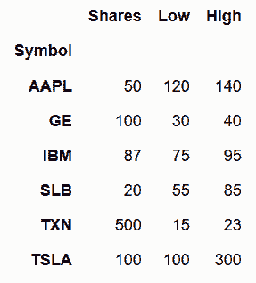

## 3\. 比较特朗普和奥巴马的支持率

```py
# pandas的read_html函数可以从网页抓取表格数据
 In[31]: base_url = 'http://www.presidency.ucsb.edu/data/popularity.php?pres={}'
         trump_url = base_url.format(45)

         df_list = pd.read_html(trump_url)
         len(df_list)
Out[31]: 14 
```

```py
# 一共返回了14个表的DataFrame，取第一个
 In[32]: df0 = df_list[0]
         df0.shape
Out[32]: (324, 1906)

 In[33]: df0.head(7)
Out[33]: 
```

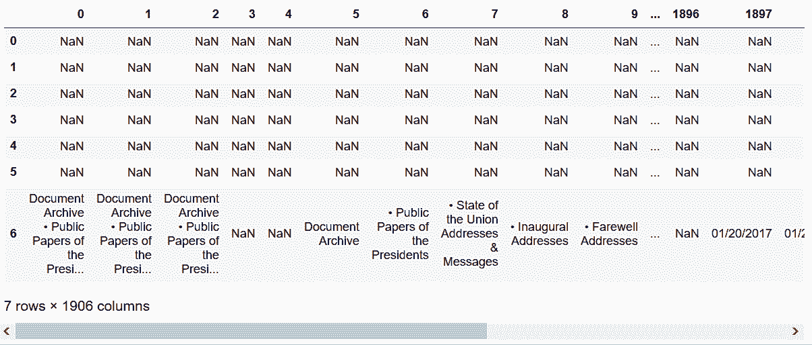

```py
# 用match参数匹配table中的字符串
 In[34]: df_list = pd.read_html(trump_url, match='Start Date')
         len(df_list)
Out[34]: 3 
```

```py
# 通过检查页面元素的属性，用attrs参数进行匹配
 In[35]: df_list = pd.read_html(trump_url, match='Start Date', attrs={'align':'center'})
         len(df_list)
Out[35]: 1 
```

```py
# 查看DataFrame的形状
 In[36]: trump = df_list[0]
         trump.shape
Out[36]: (265, 19) 
```

```py
 In[37]: trump.head(8)
Out[37]: 
```

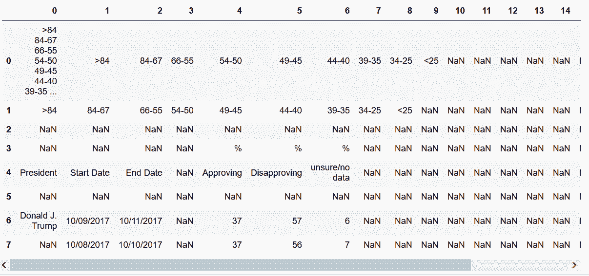

```py
# skiprows可以指定跳过一些行，header参数可以指定列名，用parse_dates指定开始和结束日期
 In[38]: df_list = pd.read_html(trump_url, match='Start Date', attrs={'align':'center'}, 
                       header=0, skiprows=[0,1,2,3,5], parse_dates=['Start Date', 'End Date'])
         trump = df_list[0]
         trump.head()
Out[38]: 
```

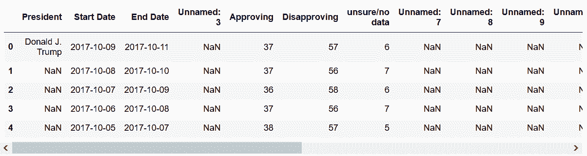

```py
# 删除所有值都是缺失值的列
 In[39]: trump = trump.dropna(axis=1, how='all')
         trump.head()
Out[39]: 
```

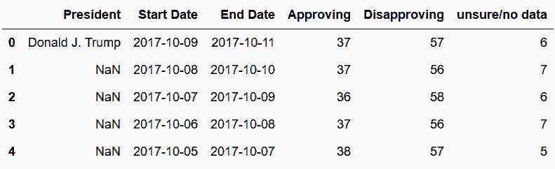

```py
# 统计各列的缺失值个数
 In[40]: trump.isnull().sum()
Out[40]: President         258
         Start Date          0
         End Date            0
         Approving           0
         Disapproving        0
         unsure/no data      0
         dtype: int64

# 缺失值向前填充
 In[41]: trump = trump.ffill()
         trump.head()
Out[41]: 
```

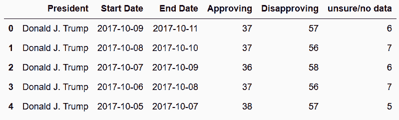

```py
# 确认数据类型
 In[42]: trump.dtypes
Out[42]: President                 object
         Start Date        datetime64[ns]
         End Date          datetime64[ns]
         Approving                  int64
         Disapproving               int64
         unsure/no data             int64
         dtype: object 
```

```py
# 将前面的步骤做成一个函数，用于获取任意总统的信息
 In[43]: def get_pres_appr(pres_num):
             base_url = 'http://www.presidency.ucsb.edu/data/popularity.php?pres={}'
             pres_url = base_url.format(pres_num)
             df_list = pd.read_html(pres_url, match='Start Date', attrs={'align':'center'}, 
                                    header=0, skiprows=[0,1,2,3,5], parse_dates=['Start Date', 'End Date'])
             pres = df_list[0].copy()
             pres = pres.dropna(axis=1, how='all')
             pres['President'] = pres['President'].ffill()
             return pres.sort_values('End Date').reset_index(drop=True)

# 括号中的数字是总统的编号，奥巴马是44
 In[44]: obama = get_pres_appr(44)
         obama.head()
Out[44]: 
```

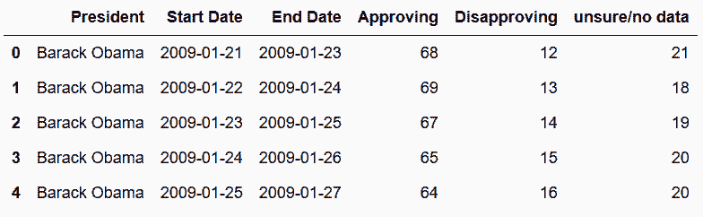

```py
# 获取最近五位总统的数据，输出每位的前三行数据
 In[45]: pres_41_45 = pd.concat([get_pres_appr(x) for x in range(41,46)], ignore_index=True)
         pres_41_45.groupby('President').head(3)
Out[45]: 
```

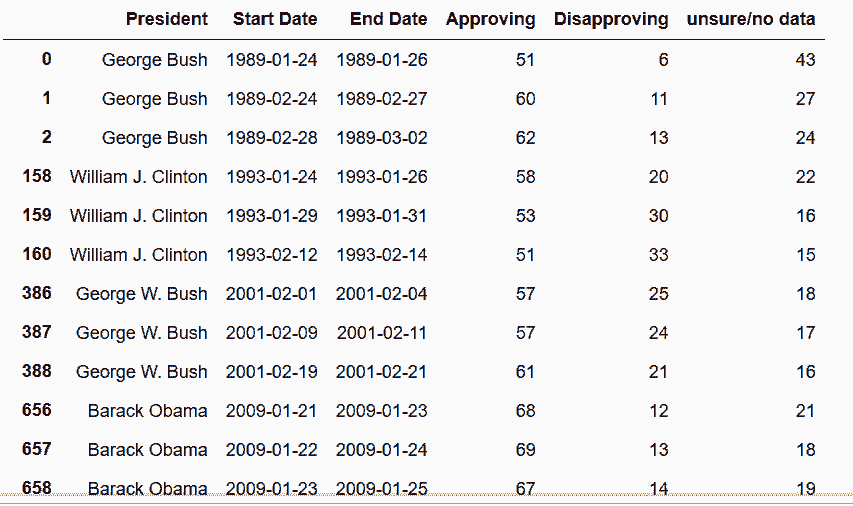

```py
# 确认一下是否有一个日期对应多个支持率
 In[46]: pres_41_45['End Date'].value_counts().head(8)
Out[46]: 1990-03-11    2
         1990-08-12    2
         1990-08-26    2
         2013-10-10    2
         1999-02-09    2
         1992-11-22    2
         1990-05-22    2
         2005-01-05    1
         Name: End Date, dtype: int64 
```

```py
# 去除重复值
 In[47]: pres_41_45 = pres_41_45.drop_duplicates(subset='End Date')
 In[48]: pres_41_45.shape
Out[48]: (3695, 6) 
```

```py
# 对数据做简单的统计
 In[49]: pres_41_45['President'].value_counts()
Out[49]: Barack Obama          2786
         George W. Bush         270
         Donald J. Trump        259
         William J. Clinton     227
         George Bush            153
         Name: President, dtype: int64

 In[50]: pres_41_45.groupby('President', sort=False).median().round(1)
Out[50]: 
```


```py
# 画出每任总统的支持率变化
 In[51]: from matplotlib import cm
         fig, ax = plt.subplots(figsize=(16,6))

         styles = ['-.', '-', ':', '-', ':']
         colors = [.9, .3, .7, .3, .9]
         groups = pres_41_45.groupby('President', sort=False)

         for style, color, (pres, df) in zip(styles, colors, groups):
             df.plot('End Date', 'Approving', ax=ax, label=pres, style=style, color=cm.Greys(color), 
                     title='Presedential Approval Rating') 
```


```py
# 上面的图是将数据前后串起来，也可以用支持率对在职天数作图
 In[52]: days_func = lambda x: x - x.iloc[0]
         pres_41_45['Days in Office'] = pres_41_45.groupby('President') \
                                                  ['End Date'] \
                                                  .transform(days_func)
 In[82]: pres_41_45['Days in Office'] = pres_41_45.groupby('President')['End Date'].transform(lambda x: x - x.iloc[0])
         pres_41_45.groupby('President').head(3)
Out[82]: 
```

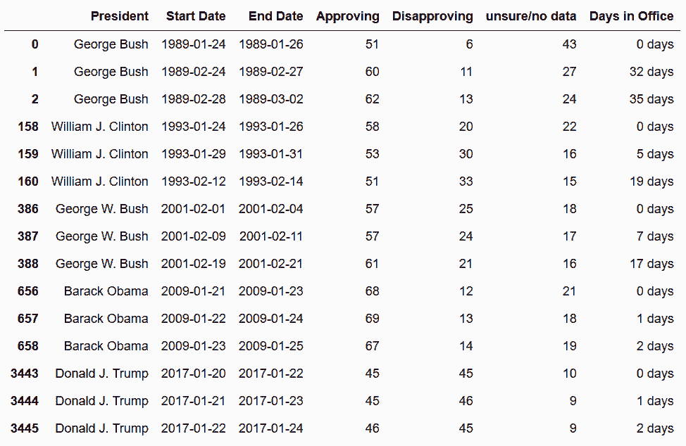

```py
# 查看数据类型
 In[83]: pres_41_45.dtypes
Out[83]: President                  object
         Start Date         datetime64[ns]
         End Date           datetime64[ns]
         Approving                   int64
         Disapproving                int64
         unsure/no data              int64
         Days in Office    timedelta64[ns]
         dtype: object 
```

```py
# Days in Office的数据类型是timedelta64[ns]，单位是纳秒，将其转换为整数
 In[86]: pres_41_45['Days in Office'] = pres_41_45['Days in Office'].dt.days
         pres_41_45['Days in Office'].head()
Out[86]: 0     0
         1    32
         2    35
         3    43
         4    46
         Name: Days in Office, dtype: int64 
```

```py
# 转换数据，使每位总统的支持率各成一列
 In[87]: pres_pivot = pres_41_45.pivot(index='Days in Office', columns='President', values='Approving')
         pres_pivot.head()
Out[87]: 
```

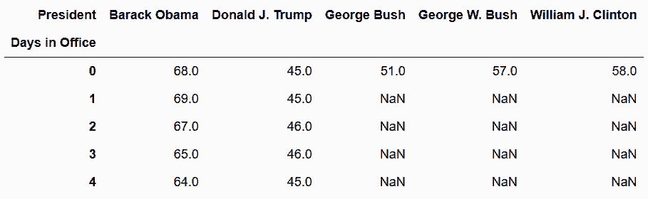

```py
# 只画出特朗普和奥巴马的支持率
 In[88]: plot_kwargs = dict(figsize=(16,6), color=cm.gray([.3, .7]), style=['-', '--'], title='Approval Rating')
         pres_pivot.loc[:250, ['Donald J. Trump', 'Barack Obama']].ffill().plot(**plot_kwargs)
Out[88]: <matplotlib.axes._subplots.AxesSubplot at 0x1152254a8> 
```

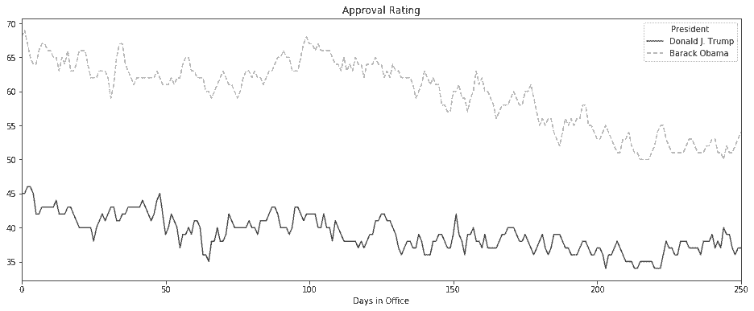

### 更多

```py
# rolling average方法可以平滑曲线，在这个例子中，使用的是90天求平均，参数on指明了滚动窗口是从哪列计算的
 In[89]: pres_rm = pres_41_45.groupby('President', sort=False) \
                             .rolling('90D', on='End Date')['Approving'] \
                             .mean()
         pres_rm.head()
Out[89]: President    End Date  
         George Bush  1989-01-26    51.000000
                      1989-02-27    55.500000
                      1989-03-02    57.666667
                      1989-03-10    58.750000
                      1989-03-13    58.200000
         Name: Approving, dtype: float64 
```

```py
# 对数据的行和列做调整，然后作图
 In[90]: styles = ['-.', '-', ':', '-', ':']
         colors = [.9, .3, .7, .3, .9]
         color = cm.Greys(colors)
         title='90 Day Approval Rating Rolling Average'
         plot_kwargs = dict(figsize=(16,6), style=styles, color = color, title=title)
         correct_col_order = pres_41_45.President.unique()
         pres_rm.unstack('President')[correct_col_order].plot(**plot_kwargs)
Out[90]: <matplotlib.axes._subplots.AxesSubplot at 0x1162d0780> 
```

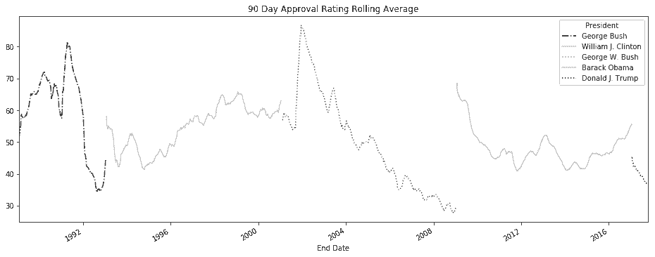

## 4\. concat, join, 和merge的区别

`concat`：

*   Pandas函数
*   可以垂直和水平地连接两个或多个pandas对象
*   只用索引对齐
*   索引出现重复值时会报错
*   默认是外连接（也可以设为内连接）

`join`：

*   DataFrame方法
*   只能水平连接两个或多个pandas对象
*   对齐是靠被调用的DataFrame的列索引或行索引和另一个对象的行索引（不能是列索引）
*   通过笛卡尔积处理重复的索引值
*   默认是左连接（也可以设为内连接、外连接和右连接）

`merge`：

*   DataFrame方法
*   只能水平连接两个DataFrame对象
*   对齐是靠被调用的DataFrame的列或行索引和另一个DataFrame的列或行索引
*   通过笛卡尔积处理重复的索引值
*   默认是内连接（也可以设为左连接、外连接、右连接）

```py
# 用户自定义的display_frames函数，可以接收一列DataFrame，然后在一行中显示：
 In[91]: from IPython.display import display_html

         years = 2016, 2017, 2018
         stock_tables = [pd.read_csv('data/stocks_{}.csv'.format(year), index_col='Symbol') 
                         for year in years]

         def display_frames(frames, num_spaces=0):
             t_style = '<table style="display: inline;"'
             tables_html = [df.to_html().replace('<table', t_style) for df in frames]

             space = '&nbsp;' * num_spaces
             display_html(space.join(tables_html), raw=True)

         display_frames(stock_tables, 30)
         stocks_2016, stocks_2017, stocks_2018 = stock_tables 
```


```py
# concat是唯一一个可以将DataFrames垂直连接起来的函数
 In[92]: pd.concat(stock_tables, keys=[2016, 2017, 2018])
Out[92]: 
```

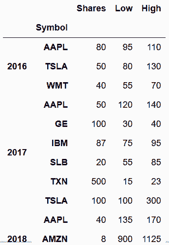

```py
# concat也可以将DataFrame水平连起来
 In[93]: pd.concat(dict(zip(years,stock_tables)), axis='columns')
Out[93]: 
```

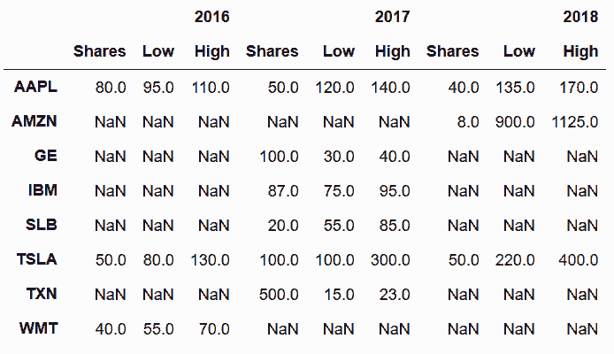

```py
# 用join将DataFrame连起来；如果列名有相同的，需要设置lsuffix或rsuffix以进行区分
 In[94]: stocks_2016.join(stocks_2017, lsuffix='_2016', rsuffix='_2017', how='outer')
Out[94]: 
```

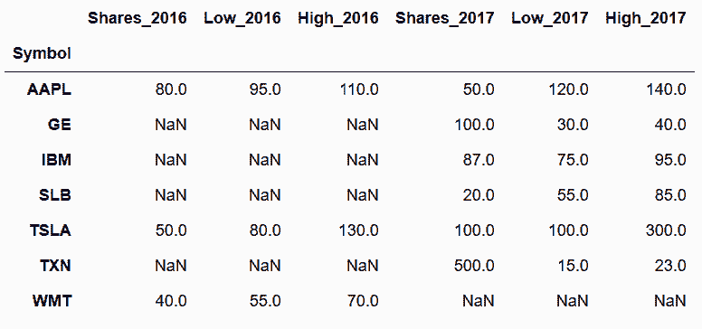

```py
 In[95]: stocks_2016
Out[95]: 
```

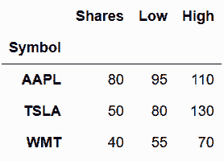

```py
# 要重现前面的concat方法，可以将一个DataFrame列表传入join
 In[96]: other = [stocks_2017.add_suffix('_2017'), stocks_2018.add_suffix('_2018')]
         stocks_2016.add_suffix('_2016').join(other, how='outer')
Out[96]: 
```

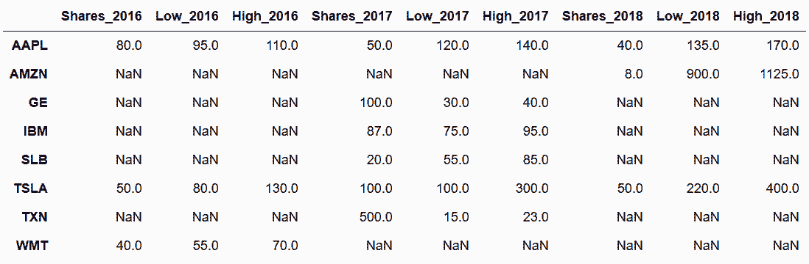

```py
# 检验这两个方法是否相同
 In[97]: stock_join = stocks_2016.add_suffix('_2016').join(other, how='outer')
         stock_concat = pd.concat(dict(zip(years,stock_tables)), axis='columns')
 In[98]: stock_concat.columns = stock_concat.columns.get_level_values(1) + '_' + \
                                     stock_concat.columns.get_level_values(0).astype(str)
 In[99]: stock_concat
Out[99]: 
```

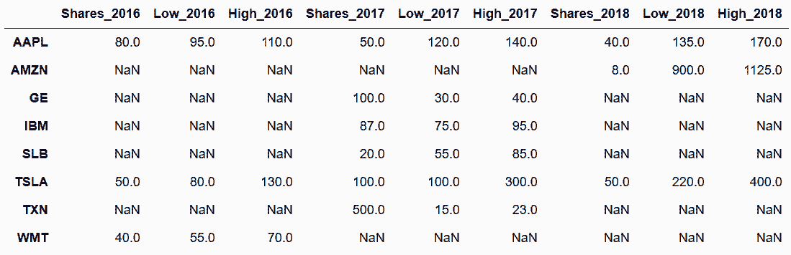

```py
 In[100]: step1 = stocks_2016.merge(stocks_2017, left_index=True, right_index=True, 
                                    how='outer', suffixes=('_2016', '_2017'))
          stock_merge = step1.merge(stocks_2018.add_suffix('_2018'), 
                                    left_index=True, right_index=True, how='outer')

          stock_concat.equals(stock_merge)
Out[100]: True 
```

```py
# 查看food_prices和food_transactions两个小数据集
 In[101]: names = ['prices', 'transactions']
          food_tables = [pd.read_csv('data/food_{}.csv'.format(name)) for name in names]
          food_prices, food_transactions = food_tables
          display_frames(food_tables, 30) 
```

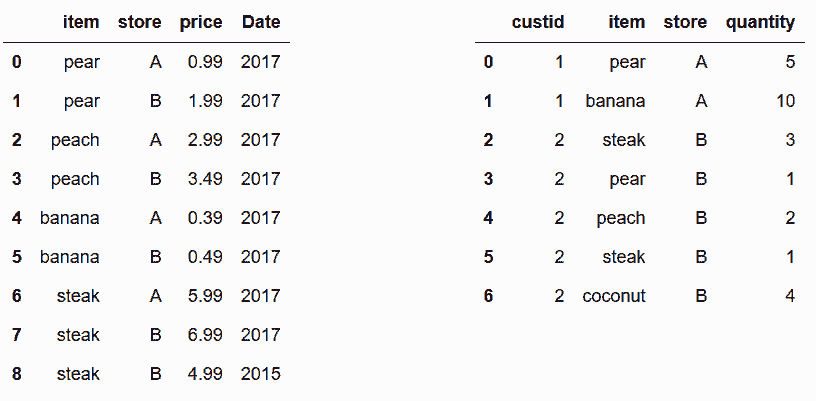

```py
# 通过键item和store，将food_transactions和food_prices两个数据集融合
 In[102]: food_transactions.merge(food_prices, on=['item', 'store'])
Out[102]: 
```

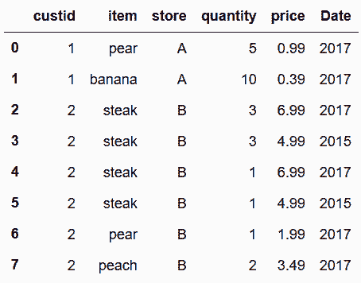

```py
# 因为steak在两张表中分别出现了两次，融合时产生了笛卡尔积，造成结果中出现了四行steak；因为coconut没有对应的价格，造成结果中没有coconut
# 下面只融合2017年的数据
 In[103]: food_transactions.merge(food_prices.query('Date == 2017'), how='left')
Out[103]: 
```

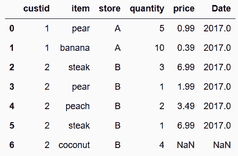

```py
# 使用join复现上面的方法，需要需要将要连接的food_prices列转换为行索引
 In[104]: food_prices_join = food_prices.query('Date == 2017').set_index(['item', 'store'])
          food_prices_join
Out[104]: 
```

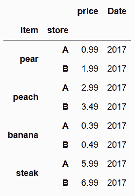

```py
# join方法只对齐传入DataFrame的行索引，但可以对齐调用DataFrame的行索引和列索引；
# 要使用列做对齐，需要将其传给参数on
 In[105]: food_transactions.join(food_prices_join, on=['item', 'store'])
Out[105]: 
```

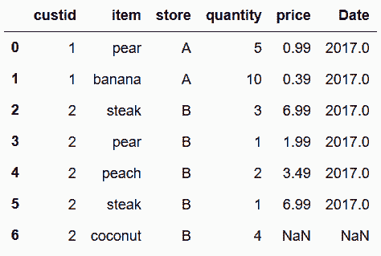

```py
# 要使用concat，需要将item和store两列放入两个DataFrame的行索引。但是，因为行索引值有重复，造成了错误
 In[106]: pd.concat([food_transactions.set_index(['item', 'store']), 
                     food_prices.set_index(['item', 'store'])], axis='columns')
---------------------------------------------------------------------------
Exception                                 Traceback (most recent call last)
<ipython-input-106-8aa3223bf3d1> in <module>()
      1 pd.concat([food_transactions.set_index(['item', 'store']), 
----> 2            food_prices.set_index(['item', 'store'])], axis='columns')

/Users/Ted/anaconda/lib/python3.6/site-packages/pandas/core/reshape/concat.py in concat(objs, axis, join, join_axes, ignore_index, keys, levels, names, verify_integrity, copy)
    205                        verify_integrity=verify_integrity,
    206                        copy=copy)
--> 207     return op.get_result()
    208 
    209 

/Users/Ted/anaconda/lib/python3.6/site-packages/pandas/core/reshape/concat.py in get_result(self)
    399                     obj_labels = mgr.axes[ax]
    400                     if not new_labels.equals(obj_labels):
--> 401                         indexers[ax] = obj_labels.reindex(new_labels)[1]
    402 
    403                 mgrs_indexers.append((obj._data, indexers))

/Users/Ted/anaconda/lib/python3.6/site-packages/pandas/core/indexes/multi.py in reindex(self, target, method, level, limit, tolerance)
   1861                                                tolerance=tolerance)
   1862                 else:
-> 1863                     raise Exception("cannot handle a non-unique multi-index!")
   1864 
   1865         if not isinstance(target, MultiIndex):

Exception: cannot handle a non-unique multi-index! 
```

```py
# glob模块的glob函数可以将文件夹中的文件迭代取出，取出的是文件名字符串列表，可以直接传给read_csv函数
 In[107]: import glob

          df_list = []
          for filename in glob.glob('data/gas prices/*.csv'):
              df_list.append(pd.read_csv(filename, index_col='Week', parse_dates=['Week']))

          gas = pd.concat(df_list, axis='columns')
          gas.head()
Out[107]: 
```


## 5\. 连接SQL数据库

```py
# 在读取chinook数据库之前，需要创建SQLAlchemy引擎
 In[108]: from sqlalchemy import create_engine
          engine = create_engine('sqlite:///data/chinook.db')
 In[109]: tracks = pd.read_sql_table('tracks', engine)
          tracks.head()
Out[109]: 
```

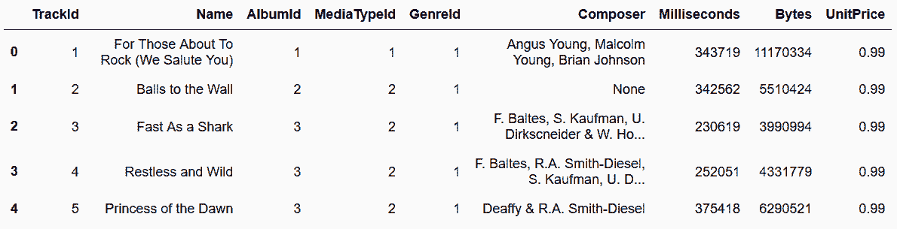

```py
# read_sql_table函数可以读取一张表，第一个参数是表名，第二个参数是引擎
 In[110]: genres = pd.read_sql_table('genres', engine)
          genres.head()
Out[110]: 
```

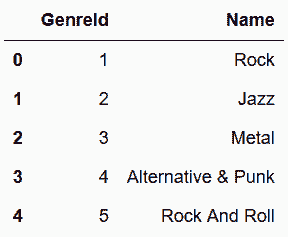

```py
# 找到每种类型歌曲的平均时长
 In[111]: genre_track = genres.merge(tracks[['GenreId', 'Milliseconds']], 
                                     on='GenreId', how='left') \
                              .drop('GenreId', axis='columns')
          genre_track.head()
Out[111]: 
```

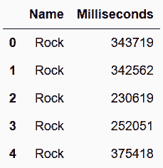

```py
# 将Milliseconds列转变为timedelta数据类型
 In[112]: genre_time = genre_track.groupby('Name')['Milliseconds'].mean()
          pd.to_timedelta(genre_time, unit='ms').dt.floor('s').sort_values()
Out[112]: 
Name
Rock And Roll        00:02:14
Opera                00:02:54
Hip Hop/Rap          00:02:58
Easy Listening       00:03:09
Bossa Nova           00:03:39
R&B/Soul             00:03:40
World                00:03:44
Pop                  00:03:49
Latin                00:03:52
Alternative & Punk   00:03:54
Soundtrack           00:04:04
Reggae               00:04:07
Alternative          00:04:24
Blues                00:04:30
Rock                 00:04:43
Jazz                 00:04:51
Classical            00:04:53
Heavy Metal          00:04:57
Electronica/Dance    00:05:02
Metal                00:05:09
Comedy               00:26:25
TV Shows             00:35:45
Drama                00:42:55
Science Fiction      00:43:45
Sci Fi & Fantasy     00:48:31
Name: Milliseconds, dtype: timedelta64[ns] 
```

```py
# 找到每名顾客花费的总时长
 In[113]: cust = pd.read_sql_table('customers', engine, 
                                    columns=['CustomerId', 'FirstName', 'LastName'])
          invoice = pd.read_sql_table('invoices', engine, 
                                       columns=['InvoiceId','CustomerId'])
          ii = pd.read_sql_table('invoice_items', engine, 
                                  columns=['InvoiceId', 'UnitPrice', 'Quantity'])
 In[114]: cust_inv = cust.merge(invoice, on='CustomerId') \
                         .merge(ii, on='InvoiceId')
          cust_inv.head()
Out[114]: 
```


```py
# 现在可以用总量乘以单位价格，找到每名顾客的总消费
 In[115]: total = cust_inv['Quantity'] * cust_inv['UnitPrice']
          cols = ['CustomerId', 'FirstName', 'LastName']
          cust_inv.assign(Total = total).groupby(cols)['Total'] \
                                        .sum() \
                                        .sort_values(ascending=False).head()
Out[115]: 
```

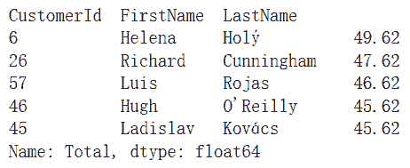

### 更多

```py
# sql语句查询方法read_sql_query
 In[116]: pd.read_sql_query('select * from tracks limit 5', engine)
Out[116]: 
```

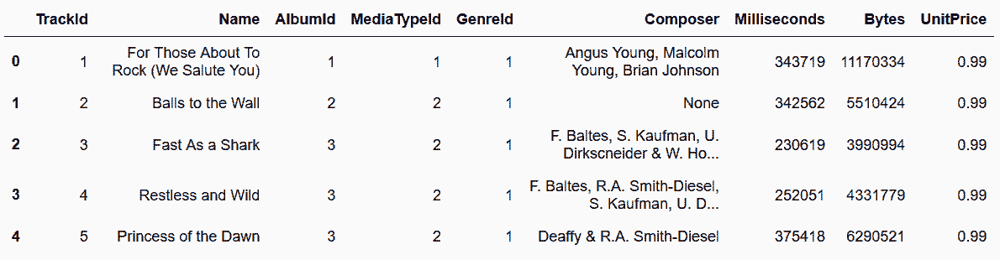

```py
# 可以将长字符串传给read_sql_query
 In[117]: sql_string1 = '''
          select 
              Name, 
              time(avg(Milliseconds) / 1000, 'unixepoch') as avg_time
          from (
                  select 
                      g.Name, 
                      t.Milliseconds
                  from 
                      genres as g 
                  join
                      tracks as t
                      on 
                          g.genreid == t.genreid
              )
          group by 
              Name
          order by 
              avg_time
          '''
          pd.read_sql_query(sql_string1, engine)
Out[117]: 
```

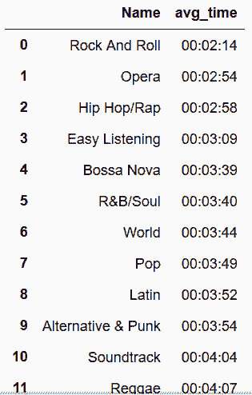

```py
 In[118]: sql_string2 = '''
          select 
                c.customerid, 
                c.FirstName, 
                c.LastName, 
                sum(ii.quantity *  ii.unitprice) as Total
          from
                customers as c
          join
                invoices as i
                     on c.customerid = i.customerid
          join
                invoice_items as ii
                     on i.invoiceid = ii.invoiceid
          group by
                c.customerid, c.FirstName, c.LastName
          order by
                Total desc
          '''
          pd.read_sql_query(sql_string2, engine)
Out[118]: 
```

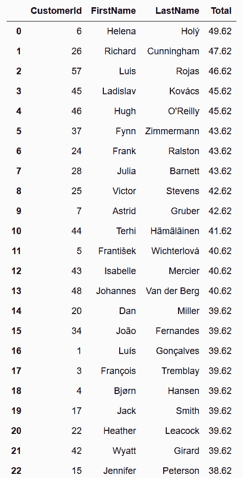

