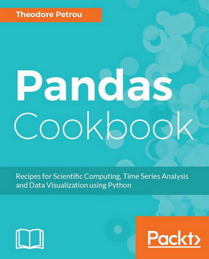

# Pandas Cookbook 带注释源码



> 贡献者：[SeanCheney](https://github.com/iamseancheney)
> 
> 欢迎任何人参与和完善：一个人可以走的很快，但是一群人却可以走的更远。

+   [ApacheCN 机器学习交流群 629470233](http://shang.qq.com/wpa/qunwpa?idkey=30e5f1123a79867570f665aa3a483ca404b1c3f77737bc01ec520ed5f078ddef)
+   [ApacheCN 学习资源](http://www.apachecn.org/)

&zwj;

+ [在线阅读](https://pdcb.apachecn.org)
+ [PDF格式](https://www.gitbook.com/download/pdf/book/wizardforcel/pandas-cookbook-code-notes)
+ [EPUB格式](https://www.gitbook.com/download/epub/book/wizardforcel/pandas-cookbook-code-notes)
+ [MOBI格式](https://www.gitbook.com/download/mobi/book/wizardforcel/pandas-cookbook-code-notes)
+ [代码仓库](https://github.com/apachecn/pandas-cookbook-code-notes)


## 下载

### NPM

```
npm install -g pandas-cookbook-code-notes
pandas-cookbook-code-notes <port>
# 访问 http://localhost:{port} 查看文档
```
